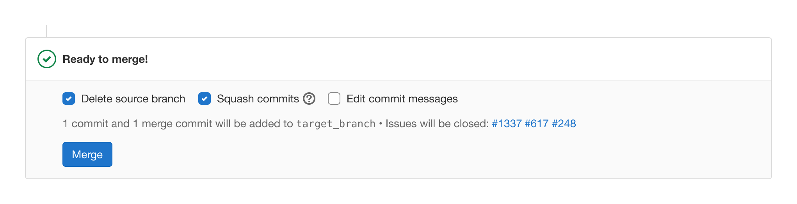
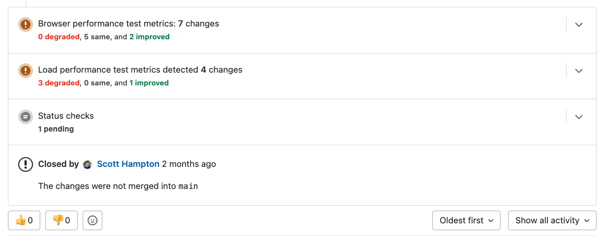

NOTE:
The documentation below is the single source of truth for the merge request terminology and functionality.

The merge request is made up of several different key components and ideas that encompass the overall merge request experience. These concepts sometimes have competing and confusing terminology or overlap with other concepts. This page covers the following concepts:

1. Merge widget
1. Report widgets
1. Merge checks
1. Approval rules

When developing new merge request widgets, read the
[merge request widget framework](../fe_guide/merge_request_widgets.md)
documentation. All new widgets should use this framework, and older widgets should
be ported to use it.

## Merge widget

The merge widget is the component of the merge request where the `merge` button exists:

This area of the merge request is where all of the options and commit messages are defined prior to merging. It also contains information about what is in the merge request, what issues are closed, and other information important to the merging process.

## Report widgets

Reports are widgets within the merge request that report information about changes within the merge request. These widgets provide information to better help the author understand the changes and further improvements to the proposed changes.

[Design Documentation](https://design.gitlab.com/patterns/merge-request-reports/)

## Merge checks

Merge checks are statuses that can either pass or fail and conditionally control the availability of the merge button being available within a merge request. The key distinguishing factor in a merge check is that users **do not** interact with the merge checks inside of the merge request, but are able to influence whether or not the check passes or fails. Results from the check are processed as true/false to determine whether or not a merge request can be merged.

Examples of merge checks include:

- Merge conflicts
- Pipeline success
- Threads resolution
- [External status checks](../../user/project/merge_requests/status_checks.md)
- Required approvals

A merge request can be merged only when all of the required merge checks are satisfied.

## Approvals

Approval rules specify users that are required to or can optionally approve a merge request based on some kind of organizational policy. When approvals are required, they effectively become a required merge check. The key differentiator between merge checks and approval rules is that users **do** interact with approval rules, by deciding to approve the merge request.

Additionally, approval settings provide configuration options to define how those approval rules are applied in a merge request. They can set limitations, add requirements, or modify approvals.

Examples of approval rules and settings include:

- [Merge request approval rules](../../user/project/merge_requests/approvals/rules.md)
- [Code owner approvals](../../user/project/codeowners/_index.md)
- [Security approvals](../../user/application_security/_index.md#security-approvals-in-merge-requests)
- [Prevent editing approval rules](../../user/project/merge_requests/approvals/settings.md#prevent-editing-approval-rules-in-merge-requests)
- [Remove all approvals when commits are added](../../user/project/merge_requests/approvals/settings.md#remove-all-approvals-when-commits-are-added-to-the-source-branch)
