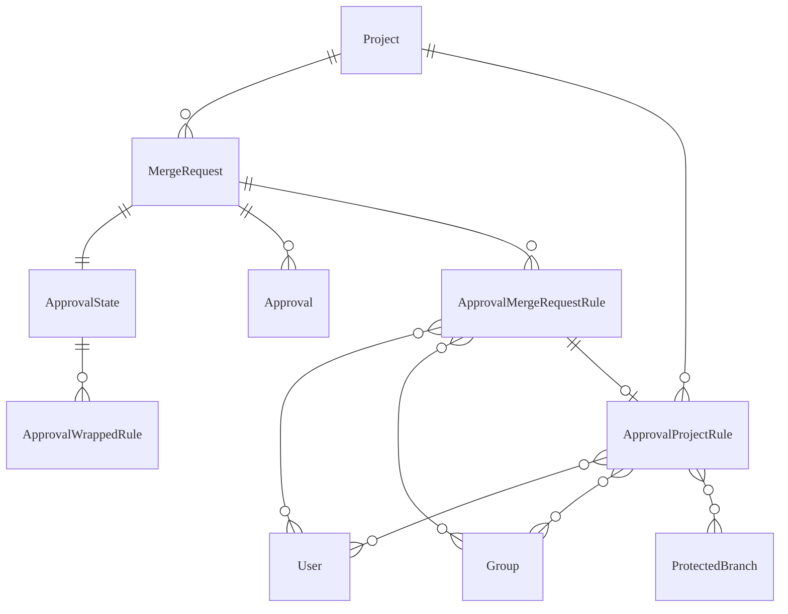
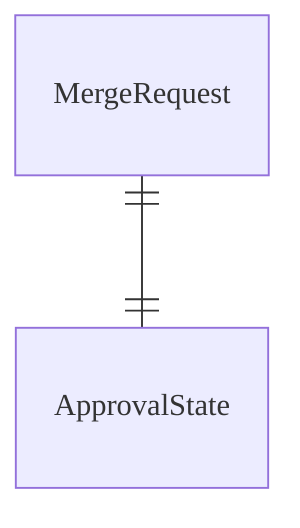
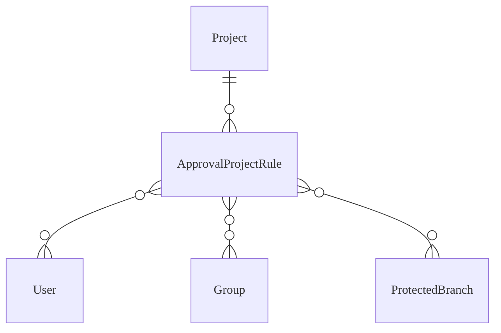
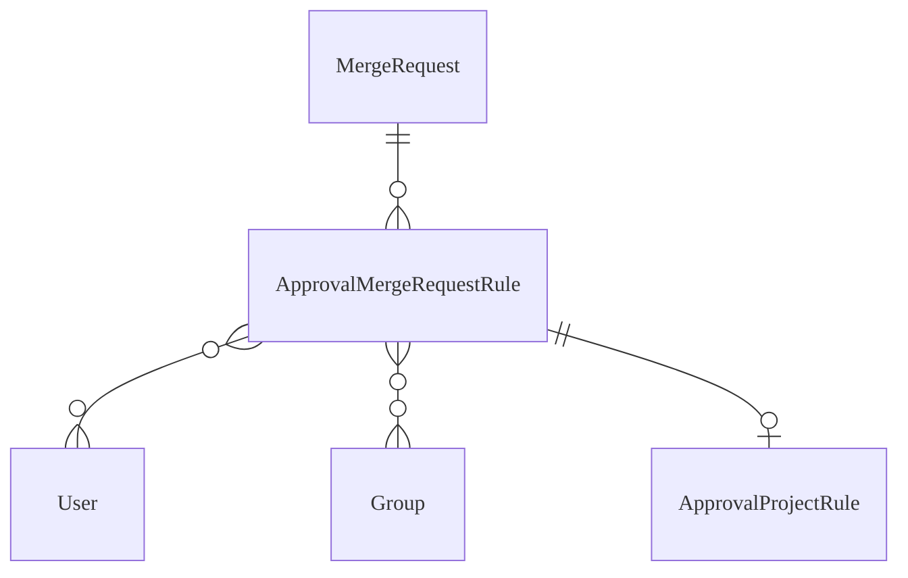
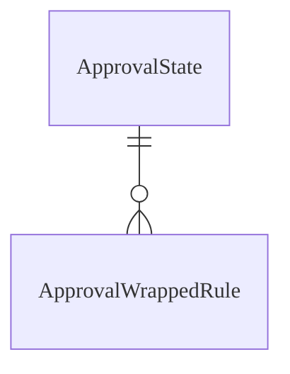
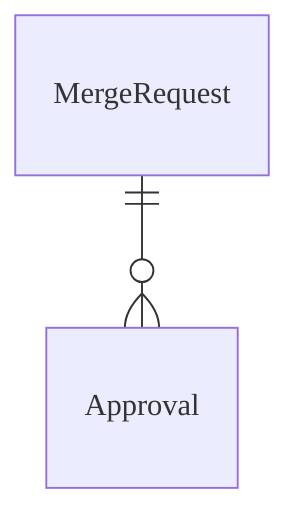
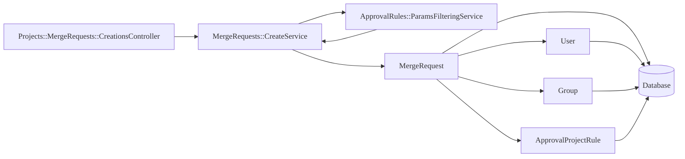
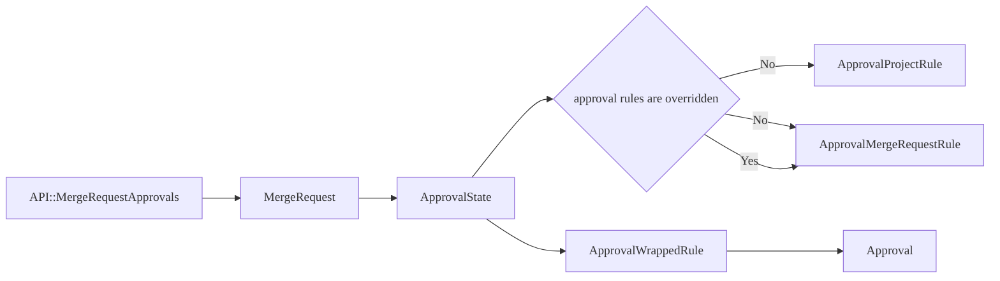
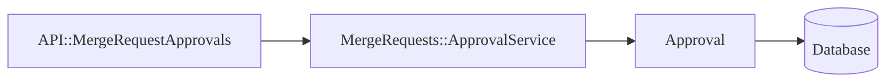

This document explains the backend design and flow of all related functionality
about [merge request approval rules](../../user/project/merge_requests/approvals/_index.md).

This should help contributors to understand the code design easier and to also
help see if there are parts to improve as the feature and its implementation
evolves.

It's intentional that it doesn't contain too much implementation detail as they
can change often. The code should explain those things better. The components
mentioned here are the major parts of the application for the approval rules
feature to work.

NOTE:
This is a living document and should be updated accordingly when parts
of the codebase touched in this document are changed or removed, or when new components
are added.

## Data Model

### `Project` and `MergeRequest`

`Project` and `MergeRequest` models are defined in `ee/app/models/ee/project.rb`
and `ee/app/models/ee/merge_request.rb`. They extend the non-EE versions, because
approval rules are an EE-only feature. Associations and other related stuff to
merge request approvals are defined here.

### `ApprovalState`

`ApprovalState` class is defined in `ee/app/models/approval_state.rb`. It's not
an actual `ActiveRecord` model. This class encapsulates all logic related to the
state of the approvals for a certain merge request like:

- Knowing the approval rules that are applicable to the merge request based on
  its target branch.
- Knowing the approval rules that are applicable to a certain target branch.
- Checking if all rules were approved.
- Checking if approval is required.
- Knowing how many approvals were given or still required.

It gets the approval rules data from the project (`ApprovalProjectRule`) or the
merge request (`ApprovalMergeRequestRule`) and wraps it as `ApprovalWrappedRule`.

### `ApprovalProjectRule`

`ApprovalProjectRule` model is defined in `ee/app/models/approval_project_rule.rb`.

A record is created/updated/deleted when an approval rule is added/edited/removed
via project settings or the [project level approvals API](../../api/merge_request_approvals.md#project-level-mr-approvals).
The `ApprovalState` model gets these records when approval rules are not
overwritten.

The `protected_branches` attribute is set and used when a rule is scoped to
protected branches. See [Approvals for protected branches](../../user/project/merge_requests/approvals/rules.md#approvals-for-protected-branches)
for more information about the feature.

### `ApprovalMergeRequestRule`

`ApprovalMergeRequestRule` model is defined in `ee/app/models/approval_merge_request_rule.rb`.

A record is created/updated/deleted when a rule is added/edited/removed via merge
request create/edit form or the [merge request level approvals API](../../api/merge_request_approvals.md#merge-request-level-mr-approvals).

The `approval_project_rule` is set when it is based from an existing `ApprovalProjectRule`.

An `ApprovalMergeRequestRule` doesn't have `protected_branches` as it inherits
them from the `approval_project_rule` if not overridden.

### `ApprovalWrappedRule`

`ApprovalWrappedRule` is defined in `ee/app/modes/approval_wrapped_rule.rb` and
is not an `ActiveRecord` model. It's used to wrap an `ApprovalProjectRule` or
`ApprovalMergeRequestRule` for common interface. It also has the following sub
types:

- `ApprovalWrappedAnyApprovalRule` - for wrapping an `any_approver` rule.
- `ApprovalWrappedCodeOwnerRule` - for wrapping a `code_owner` rule.

This class delegates most of the responsibilities to the approval rule it wraps
but it's also responsible for:

- Checking if the approval rule is approved.
- Knowing how many approvals were given or still required for the approval rule.

It gets this information from the approval rule and the `Approval` records from
the merge request.

### `Approval`

`Approval` model is defined in `ee/app/models/approval.rb`. This model is
responsible for storing information about an approval made on a merge request.
Whenever an approval is given/revoked, a record is created/deleted.

## Controllers and Services

The following controllers and services below are being used for the approval
rules feature to work.

### `API::ProjectApprovalSettings`

This private API is defined in `ee/lib/api/project_approval_settings.rb`.

This is used for the following:

- Listing the approval rules in project settings.
- Creating/updating/deleting rules in project settings.
- Listing the approval rules on create merge request form.

### `Projects::MergeRequests::CreationsController`

This controller is defined in `app/controllers/projects/merge_requests/creations_controller.rb`.

The `create` action of this controller is used when the create merge request form is
submitted. It accepts the `approval_rules_attributes` parameter for creating/updating/deleting
`ApprovalMergeRequestRule` records. It passes the parameter along when it executes
`MergeRequests::CreateService`.

### `Projects::MergeRequestsController`

This controller is defined in `app/controllers/projects/merge_requests_controller.rb`.

The `update` action of this controller is used when the edit merge request form is
submitted. It's like `Projects::MergeRequests::CreationsController` but it executes
`MergeRequests::UpdateService` instead.

### `API::MergeRequestApprovals`

This API is defined in `ee/lib/api/merge_request_approvals.rb`.

The [Approvals API endpoint](../../api/merge_request_approvals.md#merge-request-level-mr-approvals)
is requested when a merge request page loads.

The `/projects/:id/merge_requests/:merge_request_iid/approval_settings` is a
private API endpoint used for the following:

- Listing the approval rules on edit merge request form.
- Listing the approval rules on the merge request page.

When approving/unapproving an MR via UI and API, the [Approve Merge Request](../../api/merge_request_approvals.md#approve-merge-request)
API endpoint or the [Unapprove Merge Request](../../api/merge_request_approvals.md#unapprove-merge-request)
API endpoint are requested. They execute `MergeRequests::ApprovalService` and
`MergeRequests::RemoveApprovalService` accordingly.

### `API::ProjectApprovalRules` and `API::MergeRequestApprovalRules`

These APIs are defined in `ee/lib/api/project_approval_rules.rb` and
`ee/lib/api/merge_request_approval_rules.rb`.

Used to list/create/update/delete project and merge request level rules via
[Merge request approvals API](../../api/merge_request_approvals.md).

Executes `ApprovalRules::CreateService`, `ApprovalRules::UpdateService`,
`ApprovalRules::ProjectRuleDestroyService`, and `ApprovalRules::MergeRequestRuleDestroyService`
accordingly.

### `ApprovalRules::ParamsFilteringService`

This service is defined in `ee/app/services/approval_rules/params_filtering_service.rb`.

It is called only when `MergeRequests::CreateService` and
`MergeRequests::UpdateService` are executed.

It is responsible for parsing the `approval_rules_attributes` parameter to:

- Remove it when a user can't update approval rules.
- Filter the user IDs whether they are members of the project or not.
- Filter the group IDs whether they are visible to user.
- Identify the `any_approver` rule.
- Append hidden groups to it when specified.
- Append user defined inapplicable (rules that do not apply to the merge request's target
  branch) approval rules.

### `ApprovalRules::CreateService`

This service is defined in `ee/app/services/approval_rules/create_service.rb`.

It is responsible for creating approval rules at either the merge request or project level.

It is called when:

- Creating approval rules at the project level through the UI.
- Creating approval rules at the project level through the [API::ProjectApprovalRules](../../api/merge_request_approvals.md#create-merge-request-level-rule) `/projects/:id/approval_rules` endpoint.
- Creating merge request level rules through [API::MergeRequestApprovalRules](../../api/merge_request_approvals.md#create-project-level-rule) `/projects/:id/merge_requests/:merge_request_iid/approval_rules` endpoint.

Merge request level rules created through the UI do not use this service. See [Projects::MergeRequests::CreationsController](#projectsmergerequestscontroller)

## Flow

These flowcharts should help explain the flow from the controllers down to the
models for different functionalities.

Some CRUD API endpoints are intentionally skipped because they are pretty
straightforward.

### Creating a merge request with approval rules via web UI

When updating, the same flow is followed but it starts at `Projects::MergeRequestsController`
and executes `MergeRequests::UpdateService` instead.

### Viewing the merge request approval rules on an MR page

This flow gets initiated by the frontend component. The data returned is
used to display information on the MR widget.

### Approving a merge request

When unapproving, the same flow is followed but the `MergeRequests::RemoveApprovalService`
is executed instead.

## TODO

1. Add information related to other rule types, such as `code_owner` and `report_approver`.
1. Add information about side effects of approving/unapproving a merge request.
