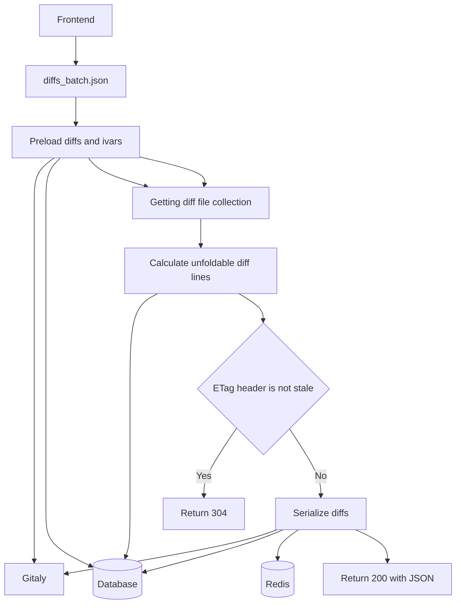
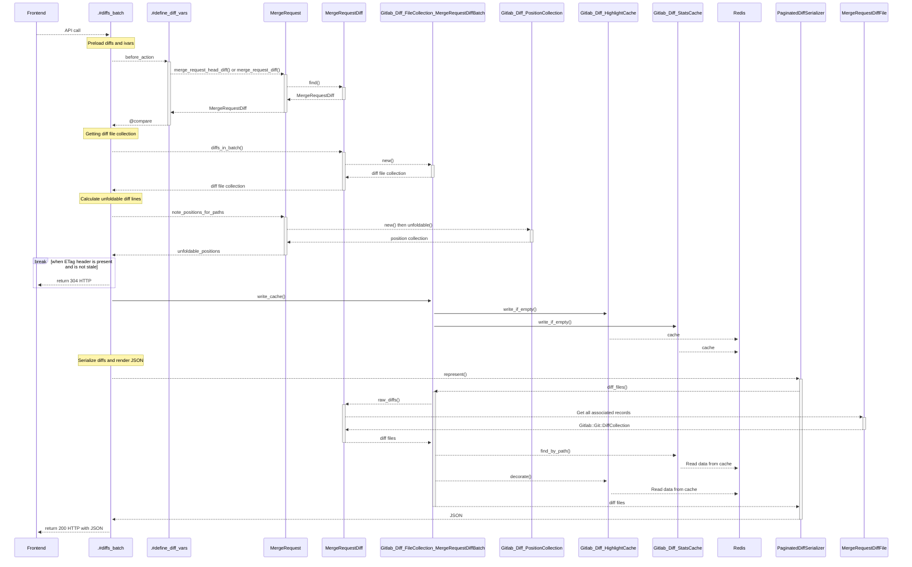
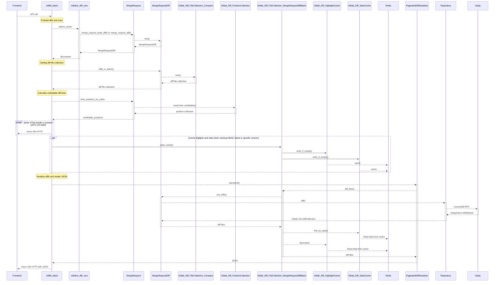
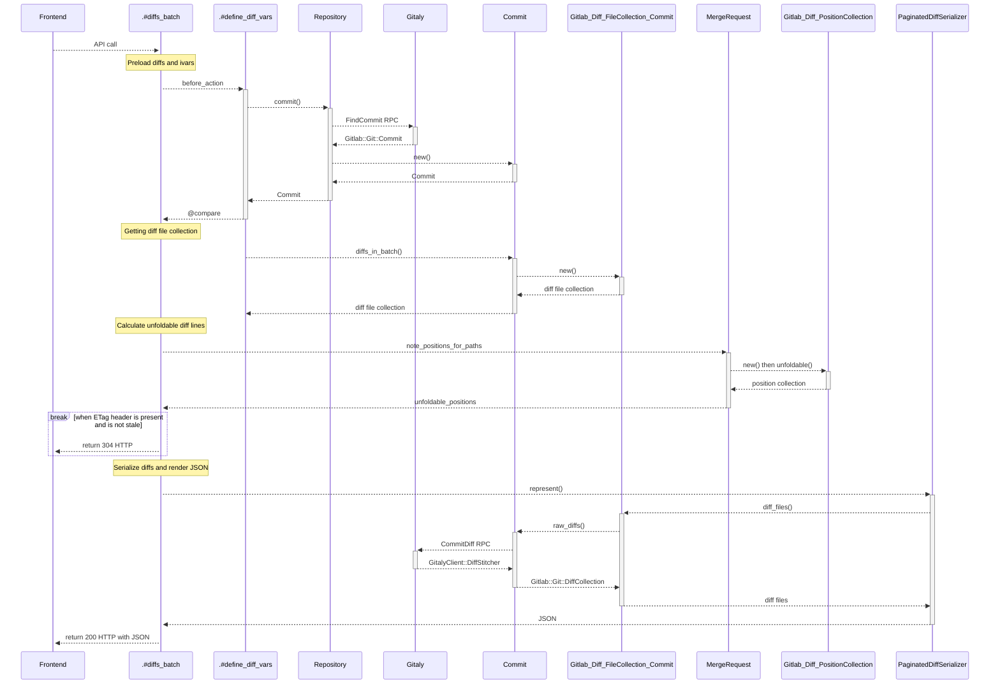

# Merge request diffs development guide

This document explains the backend design and flow of merge request diffs.
It should help contributors:

- Understand the code design.
- Identify areas for improvement through contribution.

It's intentional that it doesn't contain too many implementation details, as they
can change often. The code better explains these details. The components
mentioned here are the major parts of the application for how merge request diffs
are generated, stored, and returned to users.

NOTE:
This page is a living document. Update it accordingly when the parts
of the codebase touched in this document are changed or removed, or when new components
are added.

## Data model

Four main ActiveRecord models represent what we collectively refer to
as _diffs._ These database-backed records replicate data contained in the
project's Git repository, and are in part a cache against excessive access requests
to [Gitaly](../../gitaly.md). Additionally, they provide a logical place for:

- Calculated and retrieved metadata about the pieces of the diff.
- General class- and instance- based logic.


### `MergeRequestDiff`

`MergeRequestDiff` is defined in `app/models/merge_request_diff.rb`. This
class holds metadata and context related to the diff resulting from a set of
commits. It defines methods that are the primary means for interacting with diff
contents, individual commits, and the files containing changes.

```ruby
#<MergeRequestDiff:0x00007fd1ed63b4d0
 id: 28,
 state: "collected",
 merge_request_id: 28,
 created_at: Tue, 06 Sep 2022 18:56:02.509469000 UTC +00:00,
 updated_at: Tue, 06 Sep 2022 18:56:02.754201000 UTC +00:00,
 base_commit_sha: "ae73cb07c9eeaf35924a10f713b364d32b2dd34f",
 real_size: "9",
 head_commit_sha: "bb5206fee213d983da88c47f9cf4cc6caf9c66dc",
 start_commit_sha: "0b4bc9a49b562e85de7cc9e834518ea6828729b9",
 commits_count: 6,
 external_diff: "diff-28",
 external_diff_store: 1,
 stored_externally: nil,
 files_count: 9,
 patch_id_sha: "d504412d5b6e6739647e752aff8e468dde093f2f",
 sorted: true,
 diff_type: "regular",
 verification_checksum: nil>
```

Diff content is usually accessed through this class. Logic is often applied
to diff, file, and commit content before it is returned to a user.

#### `MergeRequestDiff#commits_count`

When `MergeRequestDiff` is saved, associated `MergeRequestDiffCommit` records are
counted and cached into the `commits_count` column. This number displays on the
merge request page as the counter for the **Commits** tab.

If `MergeRequestDiffCommit` records are deleted, the counter doesn't update.

### `MergeRequestDiffCommit`

`MergeRequestDiffCommit` is defined in `app/models/merge_request_diff_commit.rb`.
This class corresponds to a single commit contained in its corresponding `MergeRequestDiff`,
and holds header information about the commit.

```ruby
#<MergeRequestDiffCommit:0x00007fd1dfc6c4c0
  authored_date: Wed, 06 Aug 2022 06:35:52.000000000 UTC +00:00,
  committed_date: Wed, 06 Aug 2022 06:35:52.000000000 UTC +00:00,
  merge_request_diff_id: 28,
  relative_order: 0,
  sha: "bb5206fee213d983da88c47f9cf4cc6caf9c66dc",
  message: "Feature conflcit added\n\nSigned-off-by: Sample User <sample.user@example.com>\n",
  trailers: {},
  commit_author_id: 19,
  committer_id: 19>
```

Every `MergeRequestDiffCommit` has a corresponding `MergeRequest::DiffCommitUser`
record it `:belongs_to`, in ActiveRecord parlance. These records are `:commit_author`
and `:committer`, and could be distinct individuals.

### `MergeRequest::DiffCommitUser`

`MergeRequest::DiffCommitUser` is defined in `app/models/merge_request/diff_commit_user.rb`.
It captures the `name` and `email` of a given commit, but contains no connection
itself to any `User` records.

```ruby
#<MergeRequest::DiffCommitUser:0x00007fd1dff7c930
  id: 19,
  name: "Sample User",
  email: "sample.user@example.com">
```

### `MergeRequestDiffFile`

`MergeRequestDiffFile` is defined in `app/models/merge_request_diff_file.rb`.
This record of this class represents the diff of a single file contained in the
`MergeRequestDiff`. It holds both meta and specific information about the file's
relationship to the change, such as:

- Whether it is added or renamed.
- Its ordering in the diff.
- The raw diff output itself.

#### External diff storage

By default, diff data of a `MergeRequestDiffFile` is stored in `diff` column in
the `merge_request_diff_files` table. On some installations, the table can grow
too large, so they're configured to store diffs on external storage to save space.
To configure it, see [Merge request diffs storage](../../../administration/merge_request_diffs.md).

When configured to use external storage:

- The `diff` column in the database is left `NULL`.
- The associated `MergeRequestDiff` record sets the `stored_externally` attribute
  to `true` on creation of `MergeRequestDiff`.

A cron job named `ScheduleMigrateExternalDiffsWorker` is also scheduled at
minute 15 of every hour. This migrates `diff` that are still stored in the
database to external storage.

### `MergeRequestDiffDetail`

`MergeRequestDiffDetail` is defined in `app/models/merge_request_diff_detail.rb`.
This class provides verification information for Geo replication, but otherwise
is not used for user-facing diffs.

```ruby
#<MergeRequestDiffFile:0x00007fd1ef7c9048
  merge_request_diff_id: 28,
  relative_order: 0,
  new_file: true,
  renamed_file: false,
  deleted_file: false,
  too_large: false,
  a_mode: "0",
  b_mode: "100644",
  new_path: "files/ruby/feature.rb",
  old_path: "files/ruby/feature.rb",
  diff:
   "@@ -0,0 +1,4 @@\n+# This file was changed in feature branch\n+# We put different code here to make merge conflict\n+class Conflict\n+end\n",
  binary: false,
  external_diff_offset: nil,
  external_diff_size: nil>
```

## Flow

These flowcharts should help explain the flow from the controllers down to the
models for different features. This page is not intended to document the entirety
of options for access and working with diffs, focusing solely on the most common.

### `diffs_batch.json`

The most common avenue for viewing diffs is the **Changes**
tab at the top of merge request pages in the GitLab UI. When selected, the
diffs themselves are loaded via a paginated request to `/-/merge_requests/:id/diffs_batch.json`,
which is served by [`Projects::MergeRequests::DiffsController#diffs_batch`](https://gitlab.com/gitlab-org/gitlab/-/blob/master/app/controllers/projects/merge_requests/diffs_controller.rb).

This flowchart shows a basic explanation of how each component is used in a
`diffs_batch.json` request.



Different cases exist when viewing diffs, though, and the flow for each case differs.

#### Viewing HEAD, latest or specific diff version

The HEAD diff is viewed by default, if it is available. If not, it falls back to
latest diff version. It's also possible to view a specific diff version. These cases
have the same flow.



However, if **Show whitespace changes** is not selected when viewing diffs:

- Whitespace changes are ignored.
- The flow changes, and now involves Gitaly.



#### Compare between merge request diff versions

You can also compare different diff versions when viewing diffs. The flow is different
from the default flow, as it makes requests to Gitaly to generate a comparison between two
diff versions. It also doesn't use Redis for highlight and stats caches.


#### Viewing commit diff

Another feature to view merge request diffs is to view diffs of a specific commit. It
differs from the default flow, and requires Gitaly to get the diff of the specific commit. It
also doesn't use Redis for the highlight and stats caches.


