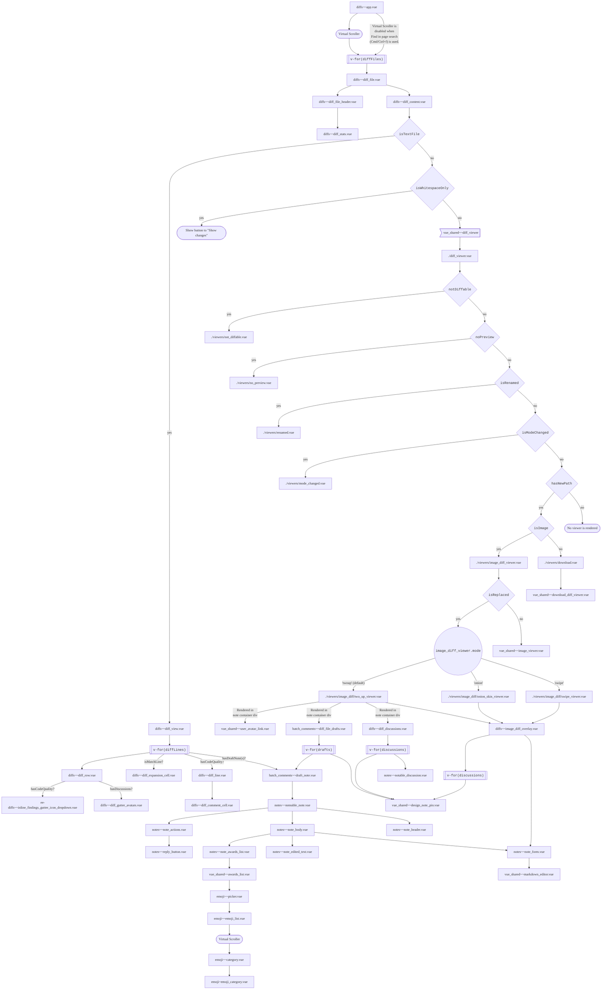
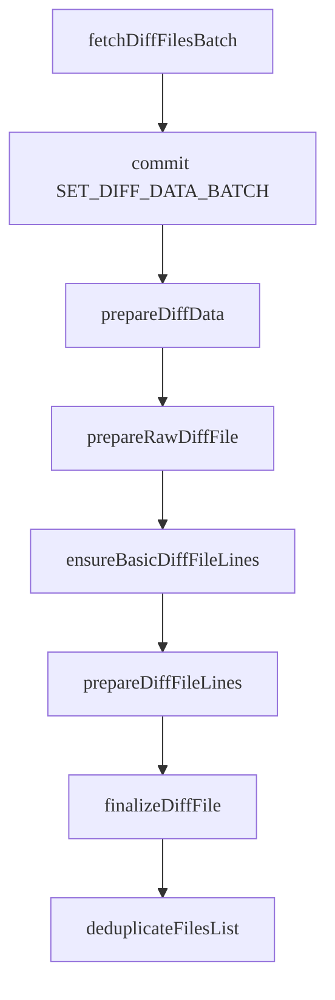
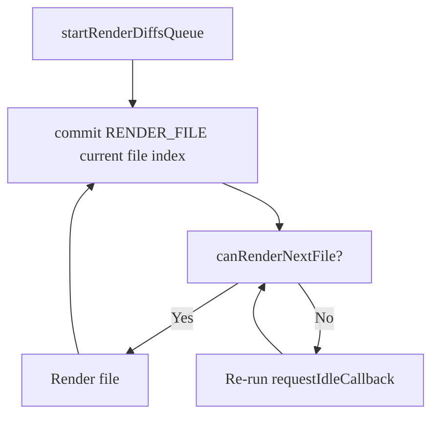

This document provides an overview on how the frontend diffs Vue application works, and
the various different parts that exist. It should help contributors:

- Understand how the diffs Vue app is set up.
- Identify any areas that need improvement.

This document is a living document. Update it whenever anything significant changes in
the diffs application.

## Diffs Vue app

### Components

The Vue app for rendering diffs uses many different Vue components, some of which get shared
with other areas of the GitLab app. The below chart shows the direction for which components
get rendered.

This chart contains several types of items:

| Legend item | Interpretation |
| ----------- | -------------- |
| `xxx~~`, `ee-xxx~~` | A shortened directory path name. Can be found in `[ee]/app/assets/javascripts`, and omits `0..n` nested folders. |
| Rectangular nodes | Files. |
| Oval nodes | Plain language describing a deeper concept. |
| Double-rectangular nodes | Simplified code branch. |
| Diamond and circle nodes | Branches that have 2 (diamond) or 3+ (circle) options. |
| Pendant / banner nodes (left notch, right square) | A parent directory to shorten nested paths. |
| `./` | A path relative to the closest parent directory pendant node. Non-relative paths nested under parent pendant nodes are not in that directory. |



Some of the components are rendered more than others, but the main component is `diff_row.vue`.
This component renders every diff line in a diff file. For performance reasons, this
component is a functional component. However, when we upgrade to Vue 3, this is no longer
required.

The main diff app component is the main entry point to the diffs app. One of the most important parts
of this component is to dispatch the action that assigns discussions to diff lines. This action
gets dispatched after the metadata request is completed, and after the batch diffs requests are
finished. There is also a watcher set up to watches for changes in both the diff files array and the notes
array. Whenever a change happens here, the set discussion action gets dispatched.

The DiffRow component is set up in a way that allows for us to store the diff line data in one format.
Previously, we had to request two different formats for inline and side-by-side. The DiffRow component
then uses this standard format to render the diff line data. With this standard format, the user
can then switch between inline and side-by-side without the need to re-fetch any data.

NOTE:
For this component, a lot of the data used and rendered gets memoized and cached, based on
various conditions. It is possible that data sometimes gets cached between each different
component render.

### Vuex store

The Vuex store for the diffs app consists of 3 different modules:

- Notes
- Diffs
- Batch comments

The notes module is responsible for the discussions, including diff discussions. In this module,
the discussions get fetched, and the polling for new discussions is setup. This module gets shared
with the issue app as well, so changes here need to be tested in both issues and merge requests.

The diffs module is responsible for the everything related to diffs. This includes, but is not limited
to, fetching diffs, assigning diff discussions to lines, and creating diff discussions.

Finally, the batch comments module is not complex, and is responsible only for the draft comments feature.
However, this module does dispatch actions in the notes and diff modules whenever draft comments
are published.

### API Requests

#### Metadata

The diffs metadata endpoint exists to fetch the base data the diffs app requires quickly, without
the need to fetch all the diff files. This includes, but is not limited to:

- Diff filenames, including some extra meta data for diff files
- Added and removed line numbers
- Branch names
- Diff versions

The most important part of the metadata response is the diff filenames. This data allows the diffs
app to render the file browser inside of the diffs app, without waiting for all batch diffs
requests to complete.

When the metadata response is received, the diff file data is processed into the correct structure
that the frontend requires to render the file browser in either tree view or list view.

The structure for this file object is:

```javascript
{
  "key": "",
  "path": "",
  "name": "",
  "type": "",
  "tree": [],
  "changed": true,
  "diffLoaded": false,
  "filePaths": {
    "old": file.old_path,
    "new": file.new_path
  },
  "tempFile": false,
  "deleted": false,
  "fileHash": "",
  "addedLines": 1,
  "removedLines": 1,
  "parentPath": "/",
  "submodule": false
}
```

#### Batch diffs

To reduce the response size for the diffs endpoint, we are splitting this response up into different
requests, to:

- Reduces the response size of each request.
- Allows the diffs app to start rendering diffs as quickly as the first request finishes.

To make the first request quicker, the request gets sent asking for a small amount of
diffs. The number of diffs requested then increases, until the maximum number of diffs per request is 30.

When the request finishes, the diffs app formats the data received into a format that makes
it easier for the diffs app to render the diffs lines.



After this has been completed, the diffs app can now begin to render the diff lines. However, before
anything can be rendered the diffs app does one more format. It takes the diff line data, and maps
the data into a format for easier switching between inline and side-by-side modes. This
formatting happens in a computed property inside the `diff_content.vue` component.

### Render queue

NOTE:
This _might_ not be required any more. Some investigation work is required to decide
the future of the render queue. The virtual scroll bar we created has probably removed
any performance benefit we got from this approach.

To render diffs quickly, we have a render queue that allows the diffs to render only if the
browser is idle. This saves the browser getting frozen when rendering a lot of large diffs at once,
and allows us to reduce the total blocking time.

This pipeline of rendering files happens only if all the below conditions are `true` for every
diff file. If any of these are `false`, then this render queue does not happen and the diffs get
rendered as expected.

- Are the diffs in this file already rendered?
- Does this diff have a viewer? (Meaning, is it not a download?)
- Is the diff expanded?

This chart gives a brief overview of the pipeline that happens:



The checks that happen:

- Is the idle time remaining less than 5 ms?
- Have we already tried to render this file 4 times?

After these checks happen, the file is marked in Vuex as `renderable`, which allows the diffs
app to start rendering the diff lines and discussions.
