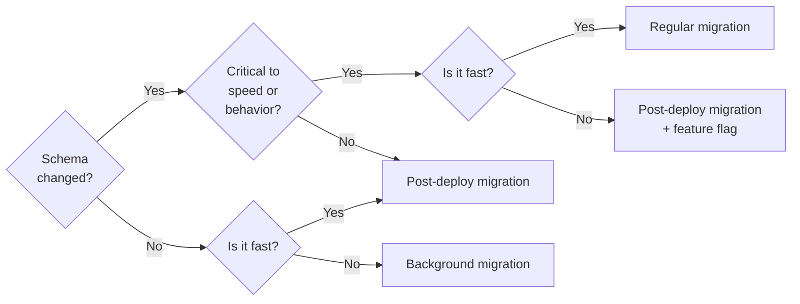

# Migration Style Guide

When writing migrations for GitLab, you have to take into account that
these are run by hundreds of thousands of organizations of all sizes, some with
many years of data in their database.

In addition, having to take a server offline for an upgrade small or big is a
big burden for most organizations. For this reason, it is important that your
migrations are written carefully, can be applied online, and adhere to the style
guide below.

Migrations are **not** allowed to require GitLab installations to be taken
offline ever. Migrations always must be written in such a way to avoid
downtime. In the past we had a process for defining migrations that allowed for
downtime by setting a `DOWNTIME` constant. You may see this when looking at
older migrations. This process was in place for 4 years without ever being
used and as such we've learned we can always figure out how to write a migration
differently to avoid downtime.

When writing your migrations, also consider that databases might have stale data
or inconsistencies and guard for that. Try to make as few assumptions as
possible about the state of the database.

Please don't depend on GitLab-specific code since it can change in future
versions. If needed copy-paste GitLab code into the migration to make it forward
compatible.

## Choose an appropriate migration type

The first step before adding a new migration should be to decide which type is most appropriate.

There are currently three kinds of migrations you can create, depending on the kind of
work it needs to perform and how long it takes to complete:

1. [**Regular schema migrations.**](#create-a-regular-schema-migration) These are traditional Rails migrations in `db/migrate` that run _before_ new application code is deployed
   (for GitLab.com before [Canary is deployed](https://gitlab.com/gitlab-com/gl-infra/readiness/-/tree/master/library/canary/#configuration-and-deployment)).
   This means that they should be relatively fast, no more than a few minutes, so as not to unnecessarily delay a deployment.

   One exception is a migration that takes longer but is absolutely critical for the application to operate correctly.
   For example, you might have indices that enforce unique tuples, or that are needed for query performance in critical parts of the application. In cases where the migration would be unacceptably slow, however, a better option might be to guard the feature with a [feature flag](feature_flags/index.md)
   and perform a post-deployment migration instead. The feature can then be turned on after the migration finishes.

   Migrations used to add new models are also part of these regular schema migrations. The only differences are the Rails command used to generate the migrations and the additional generated files, one for the model and one for the model's spec.
1. [**Post-deployment migrations.**](database/post_deployment_migrations.md) These are Rails migrations in `db/post_migrate` and
   are run independently from the GitLab.com deployments. Pending post migrations are executed on a daily basis at the discretion
   of release manager through the [post-deploy migration pipeline](https://gitlab.com/gitlab-org/release/docs/-/blob/master/general/post_deploy_migration/readme.md#how-to-determine-if-a-post-deploy-migration-has-been-executed-on-gitlabcom).
   These migrations can be used for schema changes that aren't critical for the application to operate, or data migrations that take at most a few minutes.
   Common examples for schema changes that should run post-deploy include:

     - Clean-ups, like removing unused columns.
     - Adding non-critical indices on high-traffic tables.
     - Adding non-critical indices that take a long time to create.

   These migrations should not be used for schema changes that are critical for the application to operate. Making such
   schema changes in a post-deployment migration have caused issues in the past, for example [this issue](https://gitlab.com/gitlab-org/gitlab/-/issues/378582).
   Changes that should always be a regular schema migration and not be executed in a post-deployment migration include:

     - Creating a new table, example: `create_table`.
     - Adding a new column to an existing table, example: `add_column`.

1. [**Batched background migrations.**](database/batched_background_migrations.md) These aren't regular Rails migrations, but application code that is
   executed via Sidekiq jobs, although a post-deployment migration is used to schedule them. Use them only for data migrations that
   exceed the timing guidelines for post-deploy migrations. Batched background migrations should _not_ change the schema.

Use the following diagram to guide your decision, but keep in mind that it is just a tool, and
the final outcome will always be dependent on the specific changes being made:



### How long a migration should take

In general, all migrations for a single deploy shouldn't take longer than
1 hour for GitLab.com. The following guidelines are not hard rules, they were
estimated to keep migration duration to a minimum.

NOTE:
Keep in mind that all durations should be measured against GitLab.com.

| Migration Type | Recommended Duration | Notes |
|----|----|---|
| Regular migrations | `<= 3 minutes` | A valid exception are changes without which application functionality or performance would be severely degraded and which cannot be delayed. |
| Post-deployment migrations | `<= 10 minutes` | A valid exception are schema changes, since they must not happen in background migrations. |
| Background migrations | `> 10 minutes` | Since these are suitable for larger tables, it's not possible to set a precise timing guideline, however, any single query must stay below [`1 second` execution time](database/query_performance.md#timing-guidelines-for-queries) with cold caches. |

## Decide which database to target

GitLab connects to two different Postgres databases: `main` and `ci`. This split can affect migrations
as they may run on either or both of these databases.

Read [Migrations for Multiple databases](database/migrations_for_multiple_databases.md) to understand if or how
a migration you add should account for this.

## Create a regular schema migration

To create a migration you can use the following Rails generator:

```shell
bundle exec rails g migration migration_name_here
```

This generates the migration file in `db/migrate`.

### Regular schema migrations to add new models

To create a new model you can use the following Rails generator:

```shell
bundle exec rails g model model_name_here
```

This will generate:

- the migration file in `db/migrate`
- the model file in `app/models`
- the spec file in `spec/models`

## Schema Changes

Changes to the schema should be committed to `db/structure.sql`. This
file is automatically generated by Rails when you run
`bundle exec rails db:migrate`, so you normally should not
edit this file by hand. If your migration is adding a column to a
table, that column is added at the bottom. Please do not reorder
columns manually for existing tables as this causes confusion to
other people using `db/structure.sql` generated by Rails.

NOTE:
[Creating an index asynchronously requires two merge requests.](database/adding_database_indexes.md#add-a-migration-to-create-the-index-synchronously)
When done, commit the schema change in the merge request
that adds the index with `add_concurrent_index`.

When your local database in your GDK is diverging from the schema from
`main` it might be hard to cleanly commit the schema changes to
Git. In that case you can use the `scripts/regenerate-schema` script to
regenerate a clean `db/structure.sql` for the migrations you're
adding. This script applies all migrations found in `db/migrate`
or `db/post_migrate`, so if there are any migrations you don't want to
commit to the schema, rename or remove them. If your branch is not
targeting the default Git branch, you can set the `TARGET` environment variable.

```shell
# Regenerate schema against `main`
scripts/regenerate-schema

# Regenerate schema against `12-9-stable-ee`
TARGET=12-9-stable-ee scripts/regenerate-schema
```

The `scripts/regenerate-schema` script can create additional differences.
If this happens, use a manual procedure where `<migration ID>` is the `DATETIME`
part of the migration file.

```shell
# Rebase against master
git rebase master

# Rollback changes
VERSION=<migration ID> bundle exec rails db:rollback:main

# Checkout db/structure.sql from master
git checkout origin/master db/structure.sql

# Migrate changes
VERSION=<migration ID> bundle exec rails db:migrate:main
```

### Adding new tables to the database dictionary

GitLab connects to two different Postgres databases: `main` and `ci`. New tables should be defined in [`db/docs/`](https://gitlab.com/gitlab-org/gitlab/-/tree/master/db/docs):

```yaml
table_name: table name exmaple
description: Description example
introduced_by_url: Merge request link
milestone: Milestone example
feature_categories:
- Feature category example
classes:
- Class example
gitlab_schema: gitlab_main
```

## Avoiding downtime

The document ["Avoiding downtime in migrations"](database/avoiding_downtime_in_migrations.md) specifies
various database operations, such as:

- [dropping and renaming columns](database/avoiding_downtime_in_migrations.md#dropping-columns)
- [changing column constraints and types](database/avoiding_downtime_in_migrations.md#changing-column-constraints)
- [adding and dropping indexes, tables, and foreign keys](database/avoiding_downtime_in_migrations.md#adding-indexes)
- [migrating `integer` primary keys to `bigint`](database/avoiding_downtime_in_migrations.md#migrating-integer-primary-keys-to-bigint)

and explains how to perform them without requiring downtime.

## Reversibility

Your migration **must be** reversible. This is very important, as it should
be possible to downgrade in case of a vulnerability or bugs.

In your migration, add a comment describing how the reversibility of the
migration was tested.

Some migrations cannot be reversed. For example, some data migrations can't be
reversed because we lose information about the state of the database before the migration.
You should still create a `down` method with a comment, explaining why
the changes performed by the `up` method can't be reversed, so that the
migration itself can be reversed, even if the changes performed during the migration
can't be reversed:

```ruby
def down
  # no-op

  # comment explaining why changes performed by `up` cannot be reversed.
end
```

Migrations like this are inherently risky and [additional actions](database_review.md#preparation-when-adding-data-migrations)
are required when preparing the migration for review.

## Atomicity

By default, migrations are single transaction. That is, a transaction is opened
at the beginning of the migration, and committed after all steps are processed.

Running migrations in a single transaction makes sure that if one of the steps fails,
none of the steps are executed, leaving the database in valid state.
Therefore, either:

- Put all migrations in one single-transaction migration.
- If necessary, put most actions in one migration and create a separate migration
  for the steps that cannot be done in a single transaction.

For example, if you create an empty table and need to build an index for it,
it is recommended to use a regular single-transaction migration and the default
rails schema statement: [`add_index`](https://api.rubyonrails.org/classes/ActiveRecord/ConnectionAdapters/SchemaStatements.html#method-i-add_index).
This is a blocking operation, but it doesn't cause problems because the table is not yet used,
and therefore it does not have any records yet.

## Naming conventions

Names for database objects (such as tables, indexes, and views) must be lowercase.
Lowercase names ensure that queries with unquoted names don't cause errors.

We keep column names consistent with [ActiveRecord's schema conventions](https://guides.rubyonrails.org/active_record_basics.html#schema-conventions).

Custom index and constraint names should follow the [constraint naming convention guidelines](database/constraint_naming_convention.md).

### Truncate long index names

PostgreSQL [limits the length of identifiers](https://www.postgresql.org/docs/current/limits.html),
like column or index names. Column names are not usually a problem, but index names tend
to be longer. Some methods for shortening a name that's too long:

- Prefix it with `i_` instead of `index_`.
- Skip redundant prefixes. For example,
  `index_vulnerability_findings_remediations_on_vulnerability_remediation_id` becomes
  `index_vulnerability_findings_remediations_on_remediation_id`.
- Instead of columns, specify the purpose of the index, such as `index_users_for_unconfirmation_notification`.

## Heavy operations in a single transaction

When using a single-transaction migration, a transaction holds a database connection
for the duration of the migration, so you must make sure the actions in the migration
do not take too much time: GitLab.com's production database has a `15s` timeout, so
in general, the cumulative execution time in a migration should aim to fit comfortably
in that limit. Singular query timings should fit within the [standard limit](database/query_performance.md#timing-guidelines-for-queries)

In case you need to insert, update, or delete a significant amount of data, you:

- Must disable the single transaction with `disable_ddl_transaction!`.
- Should consider doing it in a [batched background migration](database/batched_background_migrations.md).

## Migration helpers and versioning

> [Introduced](https://gitlab.com/gitlab-org/gitlab/-/issues/339115) in GitLab 14.3.

Various helper methods are available for many common patterns in database migrations. Those
helpers can be found in `Gitlab::Database::MigrationHelpers` and related modules.

In order to allow changing a helper's behavior over time, we implement a versioning scheme
for migration helpers. This allows us to maintain the behavior of a helper for already
existing migrations but change the behavior for any new migrations.

For that purpose, all database migrations should inherit from `Gitlab::Database::Migration`,
which is a "versioned" class. For new migrations, the latest version should be used (which
can be looked up in `Gitlab::Database::Migration::MIGRATION_CLASSES`) to use the latest version
of migration helpers.

In this example, we use version 2.1 of the migration class:

```ruby
class TestMigration < Gitlab::Database::Migration[2.1]
  def change
  end
end
```

Do not include `Gitlab::Database::MigrationHelpers` directly into a
migration. Instead, use the latest version of `Gitlab::Database::Migration`, which exposes the latest
version of migration helpers automatically.

Migration helpers and versioning were [introduced](https://gitlab.com/gitlab-org/gitlab/-/merge_requests/68986)
in GitLab 14.3.
For merge requests targeting previous stable branches, use the old format and still inherit from
`ActiveRecord::Migration[6.1]` instead of `Gitlab::Database::Migration[2.1]`.

## Retry mechanism when acquiring database locks

When changing the database schema, we use helper methods to invoke DDL (Data Definition
Language) statements. In some cases, these DDL statements require a specific database lock.

Example:

```ruby
def change
  remove_column :users, :full_name, :string
end
```

Executing this migration requires an exclusive lock on the `users` table. When the table
is concurrently accessed and modified by other processes, acquiring the lock may take
a while. The lock request is waiting in a queue and it may also block other queries
on the `users` table once it has been enqueued.

More information about PostgreSQL locks: [Explicit Locking](https://www.postgresql.org/docs/current/explicit-locking.html)

For stability reasons, GitLab.com has a short `statement_timeout`
set. When the migration is invoked, any database query has
a fixed time to execute. In a worst-case scenario, the request sits in the
lock queue, blocking other queries for the duration of the configured statement timeout,
then failing with `canceling statement due to statement timeout` error.

This problem could cause failed application upgrade processes and even application
stability issues, since the table may be inaccessible for a short period of time.

To increase the reliability and stability of database migrations, the GitLab codebase
offers a method to retry the operations with different `lock_timeout` settings
and wait time between the attempts. Multiple shorter attempts to acquire the necessary
lock allow the database to process other statements.

There are two distinct ways to use lock retries:

1. Inside a transactional migration: use `enable_lock_retries!`.
1. Inside a non-transactional migration: use `with_lock_retries`.

If possible, enable lock-retries for any migration that touches a [high-traffic table](#high-traffic-tables).

### Usage with transactional migrations

Regular migrations execute the full migration in a transaction. We can enable the
lock-retry methodology by calling `enable_lock_retries!` at the migration level.

This leads to the lock timeout being controlled for this migration. Also, it can lead to retrying the full
migration if the lock could not be granted within the timeout.

Note that, while this is currently an opt-in setting, we prefer to use lock-retries for all migrations and
plan to make this the default going forward.

Occasionally a migration may need to acquire multiple locks on different objects.
To prevent catalog bloat, ask for all those locks explicitly before performing any DDL.
A better strategy is to split the migration, so that we only need to acquire one lock at the time.

#### Removing a column

```ruby
enable_lock_retries!

def change
  remove_column :users, :full_name, :string
end
```

#### Multiple changes on the same table

With the lock-retry methodology enabled, all operations wrap into a single transaction. When you have the lock,
you should do as much as possible inside the transaction rather than trying to get another lock later.
Be careful about running long database statements within the block. The acquired locks are kept until the transaction (block) finishes and depending on the lock type, it might block other database operations.

```ruby
enable_lock_retries!

def up
  add_column :users, :full_name, :string
  add_column :users, :bio, :string
end

def down
  remove_column :users, :full_name
  remove_column :users, :bio
end
```

#### Removing a foreign key

```ruby
enable_lock_retries!

def up
  remove_foreign_key :issues, :projects
end

def down
  add_foreign_key :issues, :projects
end
```

#### Changing default value for a column

Note that changing column defaults can cause application downtime if a multi-release process is not followed.
See [avoiding downtime in migrations for changing column defaults](database/avoiding_downtime_in_migrations.md#changing-column-defaults) for details.

```ruby
enable_lock_retries!

def up
  change_column_default :merge_requests, :lock_version, from: nil, to: 0
end

def down
  change_column_default :merge_requests, :lock_version, from: 0, to: nil
end
```

#### Creating a new table with a foreign key

We can wrap the `create_table` method with `with_lock_retries`:

```ruby
enable_lock_retries!

def up
  create_table :issues do |t|
    t.references :project, index: true, null: false, foreign_key: { on_delete: :cascade }
    t.string :title, limit: 255
  end
end

def down
  drop_table :issues
end
```

#### Creating a new table when we have two foreign keys

Only one foreign key should be created per transaction. This is because [the addition of a foreign key constraint requires a `SHARE ROW EXCLUSIVE` lock on the referenced table](https://www.postgresql.org/docs/12/sql-createtable.html#:~:text=The%20addition%20of%20a%20foreign%20key%20constraint%20requires%20a%20SHARE%20ROW%20EXCLUSIVE%20lock%20on%20the%20referenced%20table), and locking multiple tables in the same transaction should be avoided.

For this, we need three migrations:

1. Creating the table without foreign keys (with the indices).
1. Add foreign key to the first table.
1. Add foreign key to the second table.

Creating the table:

```ruby
def up
  create_table :imports do |t|
    t.bigint :project_id, null: false
    t.bigint :user_id, null: false
    t.string :jid, limit: 255

    t.index :project_id
    t.index :user_id
  end
end

def down
  drop_table :imports
end
```

Adding foreign key to `projects`:

We can use the `add_concurrent_foreign_key` method in this case, as this helper method
has the lock retries built into it.

```ruby
disable_ddl_transaction!

def up
  add_concurrent_foreign_key :imports, :projects, column: :project_id, on_delete: :cascade
end

def down
  with_lock_retries do
    remove_foreign_key :imports, column: :project_id
  end
end
```

Adding foreign key to `users`:

```ruby
disable_ddl_transaction!

def up
  add_concurrent_foreign_key :imports, :users, column: :user_id, on_delete: :cascade
end

def down
  with_lock_retries do
    remove_foreign_key :imports, column: :user_id
  end
end
```

### Usage with non-transactional migrations (`disable_ddl_transaction!`)

Only when we disable transactional migrations using `disable_ddl_transaction!`, we can use
the `with_lock_retries` helper to guard an individual sequence of steps. It opens a transaction
to execute the given block.

A custom RuboCop rule ensures that only allowed methods can be placed within the lock retries block.

```ruby
disable_ddl_transaction!

def up
  with_lock_retries do
    add_column :users, :name, :text unless column_exists?(:users, :name)
  end

  add_text_limit :users, :name, 255 # Includes constraint validation (full table scan)
end
```

The RuboCop rule generally allows standard Rails migration methods, listed below. This example causes a RuboCop offense:

```ruby
disable_ddl_transaction!

def up
  with_lock_retries do
    add_concurrent_index :users, :name
  end
end
```

### When to use the helper method

You can **only** use the `with_lock_retries` helper method when the execution is not already inside
an open transaction (using PostgreSQL subtransactions is discouraged). It can be used with
standard Rails migration helper methods. Calling more than one migration
helper is not a problem if they're executed on the same table.

Using the `with_lock_retries` helper method is advised when a database
migration involves one of the [high-traffic tables](#high-traffic-tables).

Example changes:

- `add_foreign_key` / `remove_foreign_key`
- `add_column` / `remove_column`
- `change_column_default`
- `create_table` / `drop_table`

The `with_lock_retries` method **cannot** be used within the `change` method, you must manually define the `up` and `down` methods to make the migration reversible.

### How the helper method works

1. Iterate 50 times.
1. For each iteration, set a pre-configured `lock_timeout`.
1. Try to execute the given block. (`remove_column`).
1. If `LockWaitTimeout` error is raised, sleep for the pre-configured `sleep_time`
and retry the block.
1. If no error is raised, the current iteration has successfully executed the block.

For more information check the [`Gitlab::Database::WithLockRetries`](https://gitlab.com/gitlab-org/gitlab/-/blob/master/lib/gitlab/database/with_lock_retries.rb) class. The `with_lock_retries` helper method is implemented in the [`Gitlab::Database::MigrationHelpers`](https://gitlab.com/gitlab-org/gitlab/-/blob/master/lib/gitlab/database/migration_helpers.rb) module.

In a worst-case scenario, the method:

- Executes the block for a maximum of 50 times over 40 minutes.
  - Most of the time is spent in a pre-configured sleep period after each iteration.
- After the 50th retry, the block is executed without `lock_timeout`, just
like a standard migration invocation.
- If a lock cannot be acquired, the migration fails with `statement timeout` error.

The migration might fail if there is a very long running transaction (40+ minutes)
accessing the `users` table.

## Removing indexes

If the table is not empty when removing an index, make sure to use the method
`remove_concurrent_index` instead of the regular `remove_index` method.
The `remove_concurrent_index` method drops indexes concurrently, so no locking is required,
and there is no need for downtime. To use this method, you must disable single-transaction mode
by calling the method `disable_ddl_transaction!` in the body of your migration
class like so:

```ruby
class MyMigration < Gitlab::Database::Migration[2.1]
  disable_ddl_transaction!

  INDEX_NAME = 'index_name'

  def up
    remove_concurrent_index :table_name, :column_name, name: INDEX_NAME
  end
end
```

You can verify that the index is not being used with [Thanos](https://thanos-query.ops.gitlab.net/graph?g0.expr=sum%20by%20(type)(rate(pg_stat_user_indexes_idx_scan%7Benv%3D%22gprd%22%2C%20indexrelname%3D%22INSERT%20INDEX%20NAME%20HERE%22%7D%5B30d%5D))&g0.tab=1&g0.stacked=0&g0.range_input=1h&g0.max_source_resolution=0s&g0.deduplicate=1&g0.partial_response=0&g0.store_matches=%5B%5D):

```sql
sum by (type)(rate(pg_stat_user_indexes_idx_scan{env="gprd", indexrelname="INSERT INDEX NAME HERE"}[30d]))
```

Note that it is not necessary to check if the index exists prior to
removing it, however it is required to specify the name of the
index that is being removed. This can be done either by passing the name
as an option to the appropriate form of `remove_index` or `remove_concurrent_index`,
or by using the `remove_concurrent_index_by_name` method. Explicitly
specifying the name is important to ensure the correct index is removed.

For a small table (such as an empty one or one with less than `1,000` records),
it is recommended to use `remove_index` in a single-transaction migration,
combining it with other operations that don't require `disable_ddl_transaction!`.

### Disabling an index

There are certain situations in which you might want to disable an index before removing it.
See the [maintenance operations guide](database/maintenance_operations.md#disabling-an-index)
for more details.

## Adding indexes

Before adding an index, consider if one is necessary. The [Adding Database indexes](database/adding_database_indexes.md) guide contains more details to help you decide if an index is necessary and provides best practices for adding indexes.

## Testing for existence of indexes

If a migration requires conditional logic based on the absence or presence of an index, you must test for existence of that index using its name. This helps avoids problems with how Rails compares index definitions, which can lead to unexpected results.

For more details, review the [Adding Database Indexes](database/adding_database_indexes.md#testing-for-existence-of-indexes)
guide.

## Adding foreign-key constraints

When adding a foreign-key constraint to either an existing or a new column also
remember to add an index on the column.

This is **required** for all foreign-keys, for example, to support efficient cascading
deleting: when a lot of rows in a table get deleted, the referenced records need
to be deleted too. The database has to look for corresponding records in the
referenced table. Without an index, this results in a sequential scan on the
table, which can take a long time.

Here's an example where we add a new column with a foreign key
constraint. Note it includes `index: true` to create an index for it.

```ruby
class Migration < Gitlab::Database::Migration[2.1]

  def change
    add_reference :model, :other_model, index: true, foreign_key: { on_delete: :cascade }
  end
end
```

When adding a foreign-key constraint to an existing column in a non-empty table,
we have to employ `add_concurrent_foreign_key` and `add_concurrent_index`
instead of `add_reference`.

If you have a new or empty table that doesn't reference a
[high-traffic table](#high-traffic-tables),
we recommend that you use `add_reference` in a single-transaction migration. You can
combine it with other operations that don't require `disable_ddl_transaction!`.

You can read more about adding [foreign key constraints to an existing column](database/add_foreign_key_to_existing_column.md).

## `NOT NULL` constraints

> [Introduced](https://gitlab.com/gitlab-org/gitlab/-/issues/38358) in GitLab 13.0.

See the style guide on [`NOT NULL` constraints](database/not_null_constraints.md) for more information.

## Adding Columns With Default Values

With PostgreSQL 11 being the minimum version in GitLab 13.0 and later, adding columns with default values has become much easier and
the standard `add_column` helper should be used in all cases.

Before PostgreSQL 11, adding a column with a default was problematic as it would
have caused a full table rewrite.

## Removing the column default for non-nullable columns

If you have added a non-nullable column, and used the default value to populate
existing data, you need to keep that default value around until at least after
the application code is updated. You cannot remove the default value in the
same migration, as the migrations run before the model code is updated and
models will have an old schema cache, meaning they won't know about this column
and won't be able to set it. In this case it's recommended to:

1. Add the column with default value in a normal migration.
1. Remove the default in a post-deployment migration.

The post-deployment migration happens after the application restarts,
ensuring the new column has been discovered.

## Changing the column default

One might think that changing a default column with `change_column_default` is an
expensive and disruptive operation for larger tables, but in reality it's not.

Take the following migration as an example:

```ruby
class DefaultRequestAccessGroups < Gitlab::Database::Migration[2.1]
  def change
    change_column_default(:namespaces, :request_access_enabled, from: false, to: true)
  end
end
```

Migration above changes the default column value of one of our largest
tables: `namespaces`. This can be translated to:

```sql
ALTER TABLE namespaces
ALTER COLUMN request_access_enabled
SET DEFAULT false
```

In this particular case, the default value exists and we're just changing the metadata for
`request_access_enabled` column, which does not imply a rewrite of all the existing records
in the `namespaces` table. Only when creating a new column with a default, all the records are going be rewritten.

NOTE:
A faster [ALTER TABLE ADD COLUMN with a non-null default](https://www.depesz.com/2018/04/04/waiting-for-postgresql-11-fast-alter-table-add-column-with-a-non-null-default/)
was introduced on PostgreSQL 11.0, removing the need of rewriting the table when a new column with a default value is added.

For the reasons mentioned above, it's safe to use `change_column_default` in a single-transaction migration
without requiring `disable_ddl_transaction!`.

## Updating an existing column

To update an existing column to a particular value, you can use
`update_column_in_batches`. This splits the updates into batches, so we
don't update too many rows at in a single statement.

This updates the column `foo` in the `projects` table to 10, where `some_column`
is `'hello'`:

```ruby
update_column_in_batches(:projects, :foo, 10) do |table, query|
  query.where(table[:some_column].eq('hello'))
end
```

If a computed update is needed, the value can be wrapped in `Arel.sql`, so Arel
treats it as an SQL literal. It's also a required deprecation for [Rails 6](https://gitlab.com/gitlab-org/gitlab/-/issues/28497).

The below example is the same as the one above, but
the value is set to the product of the `bar` and `baz` columns:

```ruby
update_value = Arel.sql('bar * baz')

update_column_in_batches(:projects, :foo, update_value) do |table, query|
  query.where(table[:some_column].eq('hello'))
end
```

In the case of `update_column_in_batches`, it may be acceptable
to run on a large table, as long as it is only updating a small subset of the
rows in the table, but do not ignore that without validating on the GitLab.com
staging environment - or asking someone else to do so for you - beforehand.

## Removing a foreign key constraint

When removing a foreign key constraint, we need to acquire a lock on both tables
that are related to the foreign key. For tables with heavy write patterns, it's a good
idea to use `with_lock_retries`, otherwise you might fail to acquire a lock in time.
You might also run into deadlocks when acquiring a lock, because ordinarily
the application writes in `parent,child` order. However, removing a foreign
key acquires the lock in `child,parent` order. To resolve this, you can
explicitly acquire the lock in `parent,child`, for example:

```ruby
disable_ddl_transaction!

def up
  with_lock_retries do
    execute('lock table ci_pipelines, ci_builds in access exclusive mode')

    remove_foreign_key :ci_builds, to_table: :ci_pipelines, column: :pipeline_id, on_delete: :cascade, name: 'the_fk_name'
  end
end

def down
  add_concurrent_foreign_key :ci_builds, :ci_pipelines, column: :pipeline_id, on_delete: :cascade, name: 'the_fk_name'
end
```

## Dropping a database table

Dropping a database table is uncommon, and the `drop_table` method
provided by Rails is generally considered safe. Before dropping the table,
please consider the following:

If your table has foreign keys on a [high-traffic table](#high-traffic-tables) (like `projects`), then
the `DROP TABLE` statement is likely to stall concurrent traffic until it fails with **statement timeout** error.

Table **has no records** (feature was never in use) and **no foreign
keys**:

- Use the `drop_table` method in your migration.

```ruby
def change
  drop_table :my_table
end
```

Table **has records** but **no foreign keys**:

- Remove the application code related to the table, such as models,
  controllers and services.
- In a post-deployment migration, use `drop_table`.

This can all be in a single migration if you're sure the code is not used.
If you want to reduce risk slightly, consider putting the migrations into a
second merge request after the application changes are merged. This approach
provides an opportunity to roll back.

```ruby
def up
  drop_table :my_table
end

def down
  # create_table ...
end
```

Table **has foreign keys**:

- Remove the application code related to the table, such as models,
  controllers, and services.
- In a post-deployment migration, remove the foreign keys using the
  `with_lock_retries` helper method. In another subsequent post-deployment
  migration, use `drop_table`.

This can all be in a single migration if you're sure the code is not used.
If you want to reduce risk slightly, consider putting the migrations into a
second merge request after the application changes are merged. This approach
provides an opportunity to roll back.

Removing the foreign key on the `projects` table:

```ruby
# first migration file

def up
  with_lock_retries do
    remove_foreign_key :my_table, :projects
  end
end

def down
  with_lock_retries do
    add_foreign_key :my_table, :projects
  end
end
```

Dropping the table:

```ruby
# second migration file

def up
  drop_table :my_table
end

def down
  # create_table ...
end
```

## Dropping a sequence

> [Introduced](https://gitlab.com/gitlab-org/gitlab/-/merge_requests/88387) in GitLab 15.1.

Dropping a sequence is uncommon, but you can use the `drop_sequence` method provided by the database team.

Under the hood, it works like this:

Remove a sequence:

- Remove the default value if the sequence is actually used.
- Execute `DROP SEQUENCE`.

Re-add a sequence:

- Create the sequence, with the possibility of specifying the current value.
- Change the default value of the column.

A Rails migration example:

```ruby
class DropSequenceTest < Gitlab::Database::Migration[2.1]
  def up
    drop_sequence(:ci_pipelines_config, :pipeline_id, :ci_pipelines_config_pipeline_id_seq)
  end

  def down
    default_value = Ci::Pipeline.maximum(:id) + 10_000

    add_sequence(:ci_pipelines_config, :pipeline_id, :ci_pipelines_config_pipeline_id_seq, default_value)
  end
end
```

NOTE:
`add_sequence` should be avoided for columns with foreign keys.
Adding sequence to these columns is **only allowed** in the down method (restore previous schema state).

## Swapping primary key

> [Introduced](https://gitlab.com/gitlab-org/gitlab/-/merge_requests/98645) in GitLab 15.5.

Swapping the primary key is required to partition a table as the **partition key must be included in the primary key**.

You can use the `swap_primary_key` method provided by the database team.

Under the hood, it works like this:

- Drop the primary key constraint.
- Add the primary key using the index defined beforehand.

```ruby
class SwapPrimaryKey < Gitlab::Database::Migration[2.1]
  TABLE_NAME = :table_name
  PRIMARY_KEY = :table_name_pkey
  OLD_INDEX_NAME = :old_index_name
  NEW_INDEX_NAME = :new_index_name

  def up
    swap_primary_key(TABLE_NAME, PRIMARY_KEY, NEW_INDEX_NAME)
  end

  def down
    add_concurrent_index(TABLE_NAME, :id, unique: true, name: OLD_INDEX_NAME)
    add_concurrent_index(TABLE_NAME, [:id, :partition_id], unique: true, name: NEW_INDEX_NAME)

    unswap_primary_key(TABLE_NAME, PRIMARY_KEY, OLD_INDEX_NAME)
  end
end
```

NOTE:
Make sure to introduce the new index beforehand in a separate migration in order
to swap the primary key.

## Integer column type

By default, an integer column can hold up to a 4-byte (32-bit) number. That is
a max value of 2,147,483,647. Be aware of this when creating a column that
holds file sizes in byte units. If you are tracking file size in bytes, this
restricts the maximum file size to just over 2GB.

To allow an integer column to hold up to an 8-byte (64-bit) number, explicitly
set the limit to 8-bytes. This allows the column to hold a value up to
`9,223,372,036,854,775,807`.

Rails migration example:

```ruby
add_column(:projects, :foo, :integer, default: 10, limit: 8)
```

## Strings and the Text data type

> [Introduced](https://gitlab.com/gitlab-org/gitlab/-/issues/30453) in GitLab 13.0.

See the [text data type](database/strings_and_the_text_data_type.md) style guide for more information.

## Timestamp column type

By default, Rails uses the `timestamp` data type that stores timestamp data
without time zone information. The `timestamp` data type is used by calling
either the `add_timestamps` or the `timestamps` method.

Also, Rails converts the `:datetime` data type to the `timestamp` one.

Example:

```ruby
# timestamps
create_table :users do |t|
  t.timestamps
end

# add_timestamps
def up
  add_timestamps :users
end

# :datetime
def up
  add_column :users, :last_sign_in, :datetime
end
```

Instead of using these methods, one should use the following methods to store
timestamps with time zones:

- `add_timestamps_with_timezone`
- `timestamps_with_timezone`
- `datetime_with_timezone`

This ensures all timestamps have a time zone specified. This, in turn, means
existing timestamps don't suddenly use a different time zone when the system's
time zone changes. It also makes it very clear which time zone was used in the
first place.

## Storing JSON in database

The Rails 5 natively supports `JSONB` (binary JSON) column type.
Example migration adding this column:

```ruby
class AddOptionsToBuildMetadata < Gitlab::Database::Migration[2.1]
  def change
    add_column :ci_builds_metadata, :config_options, :jsonb
  end
end
```

By default hash keys will be strings. Optionally you can add a custom data type to provide different access to keys.

```ruby
class BuildMetadata
  attribute :config_options, :ind_jsonb # for indifferent accesss or :sym_jsonb if you need symbols only as keys.
end
```

When using a `JSONB` column, use the [JsonSchemaValidator](https://gitlab.com/gitlab-org/gitlab/-/blob/master/app/validators/json_schema_validator.rb) to keep control of the data being inserted over time.

```ruby
class BuildMetadata
  validates :config_options, json_schema: { filename: 'build_metadata_config_option' }
end
```

## Encrypted attributes

> [Introduced](https://gitlab.com/gitlab-org/gitlab/-/issues/227779) in GitLab 14.0.

Do not store `attr_encrypted` attributes as `:text` in the database; use
`:binary` instead. This uses the `bytea` type in PostgreSQL and makes storage more
efficient:

```ruby
class AddSecretToSomething < Gitlab::Database::Migration[2.1]
  def change
    add_column :something, :encrypted_secret, :binary
    add_column :something, :encrypted_secret_iv, :binary
  end
end
```

When storing encrypted attributes in a binary column, we need to provide the
`encode: false` and `encode_iv: false` options to `attr_encrypted`:

```ruby
class Something < ApplicationRecord
  attr_encrypted :secret,
    mode: :per_attribute_iv,
    key: Settings.attr_encrypted_db_key_base_32,
    algorithm: 'aes-256-gcm',
    encode: false,
    encode_iv: false
end
```

## Testing

See the [Testing Rails migrations](testing_guide/testing_migrations_guide.md) style guide.

## Data migration

Please prefer Arel and plain SQL over usual ActiveRecord syntax. In case of
using plain SQL, you need to quote all input manually with `quote_string` helper.

Example with Arel:

```ruby
users = Arel::Table.new(:users)
users.group(users[:user_id]).having(users[:id].count.gt(5))

#update other tables with these results
```

Example with plain SQL and `quote_string` helper:

```ruby
select_all("SELECT name, COUNT(id) as cnt FROM tags GROUP BY name HAVING COUNT(id) > 1").each do |tag|
  tag_name = quote_string(tag["name"])
  duplicate_ids = select_all("SELECT id FROM tags WHERE name = '#{tag_name}'").map{|tag| tag["id"]}
  origin_tag_id = duplicate_ids.first
  duplicate_ids.delete origin_tag_id

  execute("UPDATE taggings SET tag_id = #{origin_tag_id} WHERE tag_id IN(#{duplicate_ids.join(",")})")
  execute("DELETE FROM tags WHERE id IN(#{duplicate_ids.join(",")})")
end
```

If you need more complex logic, you can define and use models local to a
migration. For example:

```ruby
class MyMigration < Gitlab::Database::Migration[2.1]
  class Project < MigrationRecord
    self.table_name = 'projects'
  end

  def up
    # Reset the column information of all the models that update the database
    # to ensure the Active Record's knowledge of the table structure is current
    Project.reset_column_information

    # ... ...
  end
end
```

When doing so be sure to explicitly set the model's table name, so it's not
derived from the class name or namespace.

Be aware of the limitations [when using models in migrations](#using-models-in-migrations-discouraged).

### Modifying existing data

In most circumstances, prefer migrating data in **batches** when modifying data in the database.

We introduced a new helper [`each_batch_range`](https://gitlab.com/gitlab-org/gitlab/-/blob/cd3e0a5cddcb464cb9b8c6e3275839cf57dfa6e2/lib/gitlab/database/dynamic_model_helpers.rb#L28-32) which facilitates the process of iterating over a collection in a performant way. The default size of the batch is defined in the `BATCH_SIZE` constant.

See the following example to get an idea.

**Purging data in batch:**

```ruby
include ::Gitlab::Database::DynamicModelHelpers

disable_ddl_transaction!

def up
  each_batch_range('ci_pending_builds', scope: ->(table) { table.ref_protected }, of: BATCH_SIZE) do |min, max|
    execute <<~SQL
      DELETE FROM ci_pending_builds
        USING ci_builds
        WHERE ci_builds.id = ci_pending_builds.build_id
          AND ci_builds.status != 'pending'
          AND ci_builds.type = 'Ci::Build'
          AND ci_pending_builds.id BETWEEN #{min} AND #{max}
    SQL
  end
end
```

- The first argument is the table being modified: `'ci_pending_builds'`.
- The second argument calls a lambda which fetches the relevant dataset selected (the default is set to `.all`): `scope: ->(table) { table.ref_protected }`.
- The third argument is the batch size (the default is set in the `BATCH_SIZE` constant): `of: BATCH_SIZE`.

Here is an [example MR](https://gitlab.com/gitlab-org/gitlab/-/merge_requests/62195) illustrating how to use our new helper.

### Renaming reserved paths

When a new route for projects is introduced, it could conflict with any
existing records. The path for these records should be renamed, and the
related data should be moved on disk.

Since we had to do this a few times already, there are now some helpers to help
with this.

To use this you can include `Gitlab::Database::RenameReservedPathsMigration::V1`
in your migration. This provides 3 methods which you can pass one or more
paths that need to be rejected.

- **`rename_root_paths`**: Renames the path of all _namespaces_ with the
given name that don't have a `parent_id`.
- **`rename_child_paths`**: Renames the path of all _namespaces_ with the
given name that have a `parent_id`.
- **`rename_wildcard_paths`**: Renames the path of all _projects_, and all
_namespaces_ that have a `project_id`.

The `path` column for these rows are renamed to their previous value followed
by an integer. For example: `users` would turn into `users0`

## Using models in migrations (discouraged)

The use of models in migrations is generally discouraged. As such models are
[contraindicated for batched background migrations](database/batched_background_migrations.md#isolation),
the model needs to be declared in the migration.

If using a model in the migrations, you should first
[clear the column cache](https://api.rubyonrails.org/classes/ActiveRecord/ModelSchema/ClassMethods.html#method-i-reset_column_information)
using `reset_column_information`.

If using a model that leverages single table inheritance (STI), there are
[special considerations](database/single_table_inheritance.md#in-migrations).

This avoids problems where a column that you are using was altered and cached
in a previous migration.

### Example: Add a column `my_column` to the users table

It is important not to leave out the `User.reset_column_information` command, to ensure that the old schema is dropped from the cache and ActiveRecord loads the updated schema information.

```ruby
class AddAndSeedMyColumn < Gitlab::Database::Migration[2.1]
  class User < MigrationRecord
    self.table_name = 'users'
  end

  def up
    User.count # Any ActiveRecord calls on the model that caches the column information.

    add_column :users, :my_column, :integer, default: 1

    User.reset_column_information # The old schema is dropped from the cache.
    User.find_each do |user|
      user.my_column = 42 if some_condition # ActiveRecord sees the correct schema here.
      user.save!
    end
  end
end
```

The underlying table is modified and then accessed via ActiveRecord.

Note that this also needs to be used if the table is modified in a previous, different migration,
if both migrations are run in the same `db:migrate` process.

This results in the following. Note the inclusion of `my_column`:

```shell
== 20200705232821 AddAndSeedMyColumn: migrating ==============================
D, [2020-07-06T00:37:12.483876 #130101] DEBUG -- :    (0.2ms)  BEGIN
D, [2020-07-06T00:37:12.521660 #130101] DEBUG -- :    (0.4ms)  SELECT COUNT(*) FROM "user"
-- add_column(:users, :my_column, :integer, {:default=>1})
D, [2020-07-06T00:37:12.523309 #130101] DEBUG -- :    (0.8ms)  ALTER TABLE "users" ADD "my_column" integer DEFAULT 1
   -> 0.0016s
D, [2020-07-06T00:37:12.650641 #130101] DEBUG -- :   AddAndSeedMyColumn::User Load (0.7ms)  SELECT "users".* FROM "users" ORDER BY "users"."id" ASC LIMIT $1  [["LIMIT", 1000]]
D, [2020-07-18T00:41:26.851769 #459802] DEBUG -- :   AddAndSeedMyColumn::User Update (1.1ms)  UPDATE "users" SET "my_column" = $1, "updated_at" = $2 WHERE "users"."id" = $3  [["my_column", 42], ["updated_at", "2020-07-17 23:41:26.849044"], ["id", 1]]
D, [2020-07-06T00:37:12.653648 #130101] DEBUG -- :   ↳ config/initializers/config_initializers_active_record_locking.rb:13:in `_update_row'
== 20200705232821 AddAndSeedMyColumn: migrated (0.1706s) =====================
```

If you skip clearing the schema cache (`User.reset_column_information`), the column is not
used by ActiveRecord and the intended changes are not made, leading to the result below,
where `my_column` is missing from the query.

```shell
== 20200705232821 AddAndSeedMyColumn: migrating ==============================
D, [2020-07-06T00:37:12.483876 #130101] DEBUG -- :    (0.2ms)  BEGIN
D, [2020-07-06T00:37:12.521660 #130101] DEBUG -- :    (0.4ms)  SELECT COUNT(*) FROM "user"
-- add_column(:users, :my_column, :integer, {:default=>1})
D, [2020-07-06T00:37:12.523309 #130101] DEBUG -- :    (0.8ms)  ALTER TABLE "users" ADD "my_column" integer DEFAULT 1
   -> 0.0016s
D, [2020-07-06T00:37:12.650641 #130101] DEBUG -- :   AddAndSeedMyColumn::User Load (0.7ms)  SELECT "users".* FROM "users" ORDER BY "users"."id" ASC LIMIT $1  [["LIMIT", 1000]]
D, [2020-07-06T00:37:12.653459 #130101] DEBUG -- :   AddAndSeedMyColumn::User Update (0.5ms)  UPDATE "users" SET "updated_at" = $1 WHERE "users"."id" = $2  [["updated_at", "2020-07-05 23:37:12.652297"], ["id", 1]]
D, [2020-07-06T00:37:12.653648 #130101] DEBUG -- :   ↳ config/initializers/config_initializers_active_record_locking.rb:13:in `_update_row'
== 20200705232821 AddAndSeedMyColumn: migrated (0.1706s) =====================
```

## High traffic tables

Here's a list of current [high-traffic tables](https://gitlab.com/gitlab-org/gitlab/-/blob/master/rubocop/rubocop-migrations.yml).

Determining what tables are high-traffic can be difficult. Self-managed instances might use
different features of GitLab with different usage patterns, thus making assumptions based
on GitLab.com not enough.

To identify a high-traffic table for GitLab.com the following measures are considered.
Note that the metrics linked here are GitLab-internal only:

- [Read operations](https://thanos.gitlab.net/graph?g0.range_input=2h&g0.max_source_resolution=0s&g0.expr=topk(500%2C%20sum%20by%20(relname)%20(rate(pg_stat_user_tables_seq_tup_read%7Benvironment%3D%22gprd%22%7D%5B12h%5D)%20%2B%20rate(pg_stat_user_tables_idx_scan%7Benvironment%3D%22gprd%22%7D%5B12h%5D)%20%2B%20rate(pg_stat_user_tables_idx_tup_fetch%7Benvironment%3D%22gprd%22%7D%5B12h%5D)))&g0.tab=1)
- [Number of records](https://thanos.gitlab.net/graph?g0.range_input=2h&g0.max_source_resolution=0s&g0.expr=topk(500%2C%20max%20by%20(relname)%20(pg_stat_user_tables_n_live_tup%7Benvironment%3D%22gprd%22%7D))&g0.tab=1)
- [Size](https://thanos.gitlab.net/graph?g0.range_input=2h&g0.max_source_resolution=0s&g0.expr=topk(500%2C%20max%20by%20(relname)%20(pg_total_relation_size_bytes%7Benvironment%3D%22gprd%22%7D))&g0.tab=1) is greater than 10 GB

Any table which has some high read operation compared to current [high-traffic tables](https://gitlab.com/gitlab-org/gitlab/-/blob/master/rubocop/rubocop-migrations.yml#L4) might be a good candidate.

As a general rule, we discourage adding columns to high-traffic tables that are purely for
analytics or reporting of GitLab.com. This can have negative performance impacts for all
self-managed instances without providing direct feature value to them.
