# Compatibility with multiple versions of the application running at the same time

When adding or changing features, we must be aware that there may be multiple versions of the application running
at the same time and connected to the same PostgreSQL and Redis databases. This could happen during a rolling deploy
when the servers are updated one by one.

During a rolling deploy, post-deployment DB migrations are run after all the servers have been updated. This means the
servers could be in these intermediate states:

1. Old application code running with new DB migrations already executed
1. New application code running with new DB migrations but without new post-deployment DB migrations

We must make sure that the application works properly in these states.

For GitLab.com, we also run a set of canary servers which run a more recent version of the application. Users with
the canary cookie set would be handled by these servers. Some URL patterns may also be forced to the canary servers,
even without the cookie being set. This also means that some pages may match the pattern and get handled by canary servers,
but AJAX requests to URLs (like the GraphQL endpoint) won't match the pattern.

With this canary setup, we'd be in this mixed-versions state for an extended period of time until canary is promoted to
production and post-deployment migrations run.

Also be aware that during a deployment to production, Web, API, and
Sidekiq nodes are updated in parallel, but they may finish at
different times. That means there may be a window of time when the
application code is not in sync across the whole fleet. Changes that
cut across Sidekiq, Web, and/or the API may [introduce unexpected
errors until the deployment is complete](#builds-failing-due-to-varying-deployment-times-across-node-types).

One way to handle this is to use a feature flag that is disabled by
default. The feature flag can be enabled when the deployment is in a
consistent state. However, this method of synchronization doesn't
guarantee that customers with on-premise instances can [upgrade with
zero downtime](https://docs.gitlab.com/omnibus/update/#zero-downtime-updates)
since point releases bundle many changes together. Minimizing the time
between when versions are out of sync across the fleet may help mitigate
errors caused by upgrades.

## Requirements for zero downtime upgrades

One way to guarantee zero downtime upgrades for on-premise instances is following the
[expand and contract pattern](https://martinfowler.com/bliki/ParallelChange.html).

This means that every breaking change is broken down in three phases: expand, migrate, and contract.

1. **expand**: a breaking change is introduced keeping the software backward-compatible.
1. **migrate**: all consumers are updated to make use of the new implementation.
1. **contract**: backward compatibility is removed.

Those three phases **must be part of different milestones**, to allow zero downtime upgrades.

Depending on the support level for the feature, the contract phase could be delayed until the next major release.

## Expand and contract examples

Route changes, changing Sidekiq worker parameters, and database migrations are all perfect examples of a breaking change.
Let's see how we can handle them safely.

### Route changes

When changing routing we should pay attention to make sure a route generated from the new version can be served by the old one and vice versa.
As you can see in [an example later on this page](#some-links-to-issues-and-mrs-were-broken), not doing it can lead to an outage.
This type of change may look like an immediate switch between the two implementations. However,
especially with the canary stage, there is an extended period of time where both version of the code
coexists in production.

1. **expand**: a new route is added, pointing to the same controller as the old one. But nothing in the application will generate links for the new routes.
1. **migrate**: now that every machine in the fleet can understand the new route, we can generate links with the new routing.
1. **contract**: the old route can be safely removed. (If the old route was likely to be widely shared, like the link to a repository file, we might want to add redirects and keep the old route for a longer period.)

### Changing Sidekiq worker's parameters

This topic is explained in detail in [Sidekiq Compatibility across Updates](sidekiq_style_guide.md#sidekiq-compatibility-across-updates).

When we need to add a new parameter to a Sidekiq worker class, we can split this into the following steps:

1. **expand**: the worker class adds a new parameter with a default value.
1. **migrate**: we add the new parameter to all the invocations of the worker.
1. **contract**: we remove the default value.

At a first look, it may seem safe to bundle expand and migrate into a single milestone, but this will cause an outage if Puma restarts before Sidekiq.
Puma enqueues jobs with an extra parameter that the old Sidekiq cannot handle.

### Database migrations

The following graph is a simplified visual representation of a deployment, this will guide us in understanding how expand and contract is implemented in our migrations strategy.

There's a special consideration here. Using our post-deployment migrations framework allows us to bundle all three phases into one milestone.

```mermaid
gantt
  title Deployment
  dateFormat  HH:mm

  section Deploy box
  Run migrations           :done, migr, after schemaA, 2m
  Run post-deployment migrations     :postmigr, after mcvn  , 2m

  section Database
    Schema A      :done, schemaA, 00:00  , 1h
    Schema B      :crit, schemaB, after migr, 58m
    Schema C.     : schmeaC, after postmigr, 1h

  section Machine A
    Version N      :done, mavn, 00:00 , 75m
    Version N+1      : after mavn, 105m

  section Machine B
    Version N      :done, mbvn, 00:00 , 105m
    Version N+1      : mbdone, after mbvn, 75m

  section Machine C
    Version N      :done, mcvn, 00:00 , 2h
    Version N+1      : mbcdone, after mcvn, 1h
```

If we look at this schema from a database point of view, we can see two deployments feed into a single GitLab deployment:

1. from `Schema A` to `Schema B`
1. from `Schema B` to `Schema C`

And these deployments align perfectly with application changes.

1. At the beginning we have `Version N` on `Schema A`.
1. Then we have a _long_ transition period with both `Version N` and `Version N+1` on `Schema B`.
1. When we only have `Version N+1` on `Schema B` the schema changes again.
1. Finally we have  `Version N+1` on `Schema C`.

With all those details in mind, let's imagine we need to replace a query, and this query has an index to support it.

1. **expand**: this is the from `Schema A` to `Schema B` deployment. We add the new index, but the application will ignore it for now
1. **migrate**: this is the `Version N` to `Version N+1` application deployment. The new code is deployed, at this point in time only the new query will run.
1. **contract**: from `Schema B` to `Schema C` (post-deployment migration). Nothing uses the old index anymore, we can safely remove it.

This is only an example. More complex migrations, especially when background migrations are needed will
still require more than one milestone. For details please refer to our [migration style guide](migration_style_guide.md).

## Examples of previous incidents

### Some links to issues and MRs were broken

When we moved MR routes, users on the new servers were redirected to the new URLs. When these users shared these new URLs in
Markdown (or anywhere else), they were broken links for users on the old servers.

For more information, see [the relevant issue](https://gitlab.com/gitlab-org/gitlab/-/issues/118840).

### Stale cache in issue or merge request descriptions and comments

We bumped the Markdown cache version and found a bug when a user edited a description or comment which was generated from a different Markdown
cache version. The cached HTML wasn't generated properly after saving. In most cases, this wouldn't have happened because users would have
viewed the Markdown before clicking **Edit** and that would mean the Markdown cache is refreshed. But because we run mixed versions, this is
more likely to happen. Another user on a different version could view the same page and refresh the cache to the other version behind the scenes.

For more information, see [the relevant issue](https://gitlab.com/gitlab-org/gitlab/-/issues/208255).

### Project service templates incorrectly copied

We changed the column which indicates whether a service is a template. When we create services, we copy attributes from the template
and set this column to `false`. The old servers were still updating the old column, but that was fine because we had a DB trigger
that updated the new column from the old one. For the new servers though, they were only updating the new column and that same trigger
was now working against us and setting it back to the wrong value.

For more information, see [the relevant issue](https://gitlab.com/gitlab-com/gl-infra/infrastructure/-/issues/9176).

### Sidebar wasn't loading for some users

We changed the data type of one GraphQL field. When a user opened an issue page from the new servers and the GraphQL AJAX request went
to the old servers, a type mismatch happened, which resulted in a JavaScript error that prevented the sidebar from loading.

For more information, see [the relevant issue](https://gitlab.com/gitlab-com/gl-infra/production/-/issues/1772).

### CI artifact uploads were failing

We added a `NOT NULL` constraint to a column and marked it as a `NOT VALID` constraint so that it is not enforced on existing rows.
But even with that, this was still a problem because the old servers were still inserting new rows with null values.

For more information, see [the relevant issue](https://gitlab.com/gitlab-com/gl-infra/production/-/issues/1944).

### Downtime on release features between canary and production deployment

To address the issue, we added a new column to an existing table with a `NOT NULL` constraint without
specifying a default value. In other words, this requires the application to set a value to the column.

The older version of the application didn't set the `NOT NULL` constraint since the entity/concept didn't
exist before.

The problem starts right after the canary deployment is complete. At that moment,
the database migration (to add the column) has successfully run and canary instance starts using
the new application code, hence QA was successful. Unfortunately, the production
instance still uses the older code, so it started failing to insert a new release entry.

For more information, see [this issue related to the Releases API](https://gitlab.com/gitlab-org/gitlab-foss/-/issues/64151).

### Builds failing due to varying deployment times across node types

In [one production issue](https://gitlab.com/gitlab-com/gl-infra/production/-/issues/2442),
CI builds that used the `parallel` keyword and depending on the
variable `CI_NODE_TOTAL` being an integer failed. This was caused because after a user pushed a commit:

1. New code: Sidekiq created a new pipeline and new build. `build.options[:parallel]` is a `Hash`.
1. Old code: Runners requested a job from an API node that is running the previous version.
1. As a result, the [new code](https://gitlab.com/gitlab-org/gitlab/blob/42b82a9a3ac5a96f9152aad6cbc583c42b9fb082/app/models/concerns/ci/contextable.rb#L104)
was not run on the API server. The runner's request failed because the
older API server tried return the `CI_NODE_TOTAL` CI variable, but
instead of sending an integer value (e.g. 9), it sent a serialized
`Hash` value (`{:number=>9, :total=>9}`).

If you look at the [deployment pipeline](https://ops.gitlab.net/gitlab-com/gl-infra/deployer/-/pipelines/202212),
you see all nodes were updated in parallel:

However, even though the updated started around the same time, the completion time varied significantly:

|Node type|Duration (min)|
|---------|--------------|
|API      |54            |
|Sidekiq  |21            |
|K8S      |8             |

Builds that used the `parallel` keyword and depended on `CI_NODE_TOTAL`
and `CI_NODE_INDEX` would fail during the time after Sidekiq was
updated. Since Kubernetes (K8S) also runs Sidekiq pods, the window could
have been as long as 46 minutes or as short as 33 minutes. Either way,
having a feature flag to turn on after the deployment finished would
prevent this from happening.
