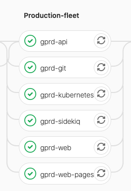

# Backwards compatibility across updates

GitLab deployments can be broken down into many components. Updating GitLab is not atomic. Therefore, **many components must be backwards-compatible**.

## Common gotchas

In a sense, these scenarios are all transient states. But they can often persist for several hours in a live, production environment. Therefore we must treat them with the same care as permanent states.

### When modifying a Sidekiq worker

For example when [changing arguments](sidekiq_style_guide.md#changing-the-arguments-for-a-worker):

- Is it ok if jobs are being enqueued with the old signature but executed by the new monthly release?
- Is it ok if jobs are being enqueued with the new signature but executed by the previous monthly release?

### When adding a new Sidekiq worker

Is it ok if these jobs don't get executed for several hours because [Sidekiq nodes are not yet updated](sidekiq_style_guide.md#adding-new-workers)?

### When modifying JavaScript

Is it ok when a browser has the new JavaScript code, but the Rails code is running the previous monthly release on:

- the REST API?
- the GraphQL API?
- internal APIs in controllers?

### When adding a pre-deployment migration

Is it ok if the pre-deployment migration has executed, but the web, Sidekiq, and API nodes are running the previous release?

### When adding a post-deployment migration

Is it ok if all GitLab nodes have been updated, but the post-deployment migrations don't get executed until a couple days later?

### When adding a background migration

Is it ok if all nodes have been updated, and then the post-deployment migrations get executed a couple days later, and then the background migrations take a week to finish?

### When upgrading a dependency like Rails

Is it ok that some nodes have the new Rails version, but some nodes have the old Rails version?

## A walkthrough of an update

Backwards compatibility problems during updates are often very subtle. This is why it is worth familiarizing yourself with [update instructions](../update/index.md), [reference architectures](../administration/reference_architectures/index.md), and [GitLab.com's architecture](https://about.gitlab.com/handbook/engineering/infrastructure/production/architecture/). But to illustrate how these problems arise, take a look at this example of a simple update.

- 🚢 New version
- 🙂 Old version

In this example, you can imagine that we are updating by one monthly release. But refer to [How long must code be backwards-compatible?](#how-long-must-code-be-backwards-compatible).

| Update step | Postgres DB | Web nodes | API nodes | Sidekiq nodes | Compatibility concerns |
| --- | --- | --- | --- | --- | --- |
| Initial state | 🙂 | 🙂 | 🙂 | 🙂 | |
| Ran pre-deployment migrations | 🚢 except post-deploy migrations | 🙂 | 🙂 | 🙂 | Rails code in 🙂 is making DB calls to 🚢 |
| Update web nodes | 🚢 except post-deploy migrations | 🚢 | 🙂 | 🙂 | JavaScript in 🚢 is making API calls to 🙂. Rails code in 🚢 is enqueuing jobs that are getting run by Sidekiq nodes in 🙂 |
| Update API and Sidekiq nodes | 🚢 except post-deploy migrations | 🚢 | 🚢 | 🚢 | Rails code in 🚢 is making DB calls without post-deployment migrations or background migrations |
| Run post-deployment migrations | 🚢 | 🚢 | 🚢 | 🚢 | Rails code in 🚢 is making DB calls without background migrations |
| Background migrations finish | 🚢 | 🚢 | 🚢 | 🚢 | |

This example is not exhaustive. GitLab can be deployed in many different ways. Even each update step is not atomic. For example, with rolling deploys, nodes within a group are temporarily on different versions. You should assume that a lot of time passes between update steps. This is often true on GitLab.com.

## How long must code be backwards-compatible?

For users following [zero-downtime update instructions](../update/index.md#upgrading-without-downtime), the answer is one monthly release. For example:

- 13.11 => 13.12
- 13.12 => 14.0
- 14.0 => 14.1

For GitLab.com, there can be multiple tiny version updates per day, so GitLab.com doesn't constrain how far changes must be backwards-compatible.

Many users [skip some monthly releases](../update/index.md#upgrading-to-a-new-major-version), for example:

- 13.0 => 13.12

These users accept some downtime during the update. Unfortunately we can't ignore this case completely. For example, 13.12 may execute Sidekiq jobs from 13.0, which illustrates why [we avoid removing arguments from jobs until a major release](sidekiq_style_guide.md#deprecate-and-remove-an-argument). The main question is: Will the deployment get to a good state after the update is complete?

## What kind of components can GitLab be broken down into?

The [50,000 reference architecture](../administration/reference_architectures/50k_users.md) runs GitLab on 48+ nodes. GitLab.com is [bigger than that](https://about.gitlab.com/handbook/engineering/infrastructure/production/architecture/), plus a portion of the [infrastructure runs on Kubernetes](https://about.gitlab.com/handbook/engineering/infrastructure/production/kubernetes/gitlab-com/), plus there is a ["canary" stage which receives updates first](https://about.gitlab.com/handbook/engineering/#sts=Canary%20Testing).

But the problem isn't just that there are many nodes. The bigger problem is that a deployment can be divided into different contexts. And GitLab.com is not the only one that does this. Some possible divisions:

- "Canary web app nodes": Handle non-API requests from a subset of users
- "Git app nodes": Handle Git requests
- "Web app nodes": Handle web requests
- "API app nodes": Handle API requests
- "Sidekiq app nodes": Handle Sidekiq jobs
- "Postgres database": Handle internal Postgres calls
- "Redis database": Handle internal Redis calls
- "Gitaly nodes": Handle internal Gitaly calls

During an update, there will be [two different versions of GitLab running in different contexts](#a-walkthrough-of-an-update). For example, [a web node may enqueue jobs which get run on an old Sidekiq node](#when-modifying-a-sidekiq-worker).

## Doesn't the order of update steps matter?

Yes! We have specific instructions for [zero-downtime updates](../update/index.md#upgrading-without-downtime) because it allows us to ignore some permutations of compatibility. This is why we don't worry about Rails code making DB calls to an old Postgres database schema.

## I've identified a potential backwards compatibility problem, what can I do about it?

### Coordinate

For major or minor version updates of Rails or Puma:

- Engage the Quality team to thoroughly test the MR.
- Notify the `@gitlab-org/release/managers` on the MR prior to merging.

### Feature flags

[Feature flags](feature_flags/index.md) are a tool, not a strategy, for handling backward compatibility problems.

For example, it is safe to add a new feature with frontend and API changes, if both
frontend and API changes are disabled by default. This can be done with multiple
merge requests, merged in any order. After all the changes are deployed to
GitLab.com, the feature can be enabled in ChatOps and validated on GitLab.com.

**However, it is not necessarily safe to enable the feature by default.** If the
feature flag is removed, or the default is flipped to enabled, in the same release
where the code was merged, then customers performing [zero-downtime updates](https://docs.gitlab.com/omnibus/update/#zero-downtime-updates)
will end up running the new frontend code against the previous release's API.

If you're not sure whether it's safe to enable all the changes at once, then one
option is to enable the API in the **current** release and enable the frontend
change in the **next** release. This is an example of the [Expand and contract pattern](#expand-and-contract-pattern).

Or you may be able to avoid delaying by a release by modifying the frontend to
[degrade gracefully](#graceful-degradation) against the previous release's API.

### Graceful degradation

As an example, when adding a new feature with frontend and API changes, it may be possible to write the frontend such that the new feature degrades gracefully against old API responses. This may help avoid needing to spread a change over 3 releases.

### Expand and contract pattern

One way to guarantee zero downtime updates for on-premise instances is following the
[expand and contract pattern](https://martinfowler.com/bliki/ParallelChange.html).

This means that every breaking change is broken down in three phases: expand, migrate, and contract.

1. **expand**: a breaking change is introduced keeping the software backward-compatible.
1. **migrate**: all consumers are updated to make use of the new implementation.
1. **contract**: backward compatibility is removed.

Those three phases **must be part of different milestones**, to allow zero downtime updates.

Depending on the support level for the feature, the contract phase could be delayed until the next major release.

## Expand and contract examples

Route changes, changing Sidekiq worker parameters, and database migrations are all perfect examples of a breaking change.
Let's see how we can handle them safely.

### Route changes

When changing routing we should pay attention to make sure a route generated from the new version can be served by the old one and vice versa.
[As you can see](#some-links-to-issues-and-mrs-were-broken), not doing it can lead to an outage.
This type of change may look like an immediate switch between the two implementations. However,
especially with the canary stage, there is an extended period of time where both version of the code
coexists in production.

1. **expand**: a new route is added, pointing to the same controller as the old one. But nothing in the application generates links for the new routes.
1. **migrate**: now that every machine in the fleet can understand the new route, we can generate links with the new routing.
1. **contract**: the old route can be safely removed. (If the old route was likely to be widely shared, like the link to a repository file, we might want to add redirects and keep the old route for a longer period.)

### Changing Sidekiq worker's parameters

This topic is explained in detail in [Sidekiq Compatibility across Updates](sidekiq_style_guide.md#sidekiq-compatibility-across-updates).

When we need to add a new parameter to a Sidekiq worker class, we can split this into the following steps:

1. **expand**: the worker class adds a new parameter with a default value.
1. **migrate**: we add the new parameter to all the invocations of the worker.
1. **contract**: we remove the default value.

At a first look, it may seem safe to bundle expand and migrate into a single milestone, but this causes an outage if Puma restarts before Sidekiq.
Puma enqueues jobs with an extra parameter that the old Sidekiq cannot handle.

### Database migrations

The following graph is a simplified visual representation of a deployment, this guides us in understanding how expand and contract is implemented in our migrations strategy.

There's a special consideration here. Using our post-deployment migrations framework allows us to bundle all three phases into one milestone.

```mermaid
gantt
  title Deployment
  dateFormat  HH:mm

  section Deploy box
  Run migrations           :done, migr, after schemaA, 2m
  Run post-deployment migrations     :postmigr, after mcvn  , 2m

  section Database
    Schema A      :done, schemaA, 00:00  , 1h
    Schema B      :crit, schemaB, after migr, 58m
    Schema C.     : schmeaC, after postmigr, 1h

  section Machine A
    Version N      :done, mavn, 00:00 , 75m
    Version N+1      : after mavn, 105m

  section Machine B
    Version N      :done, mbvn, 00:00 , 105m
    Version N+1      : mbdone, after mbvn, 75m

  section Machine C
    Version N      :done, mcvn, 00:00 , 2h
    Version N+1      : mbcdone, after mcvn, 1h
```

If we look at this schema from a database point of view, we can see two deployments feed into a single GitLab deployment:

1. from `Schema A` to `Schema B`
1. from `Schema B` to `Schema C`

And these deployments align perfectly with application changes.

1. At the beginning we have `Version N` on `Schema A`.
1. Then we have a _long_ transition period with both `Version N` and `Version N+1` on `Schema B`.
1. When we only have `Version N+1` on `Schema B` the schema changes again.
1. Finally we have  `Version N+1` on `Schema C`.

With all those details in mind, let's imagine we need to replace a query, and this query has an index to support it.

1. **expand**: this is the from `Schema A` to `Schema B` deployment. We add the new index, but the application ignores it for now.
1. **migrate**: this is the `Version N` to `Version N+1` application deployment. The new code is deployed, at this point in time only the new query runs.
1. **contract**: from `Schema B` to `Schema C` (post-deployment migration). Nothing uses the old index anymore, we can safely remove it.

This is only an example. More complex migrations, especially when background migrations are needed may
require more than one milestone. For details please refer to our [migration style guide](migration_style_guide.md).

## Examples of previous incidents

### Some links to issues and MRs were broken

When we moved MR routes, users on the new servers were redirected to the new URLs. When these users shared these new URLs in
Markdown (or anywhere else), they were broken links for users on the old servers.

For more information, see [the relevant issue](https://gitlab.com/gitlab-org/gitlab/-/issues/118840).

### Stale cache in issue or merge request descriptions and comments

We bumped the Markdown cache version and found a bug when a user edited a description or comment which was generated from a different Markdown
cache version. The cached HTML wasn't generated properly after saving. In most cases, this wouldn't have happened because users would have
viewed the Markdown before clicking **Edit** and that would mean the Markdown cache is refreshed. But because we run mixed versions, this is
more likely to happen. Another user on a different version could view the same page and refresh the cache to the other version behind the scenes.

For more information, see [the relevant issue](https://gitlab.com/gitlab-org/gitlab/-/issues/208255).

### Project service templates incorrectly copied

We changed the column which indicates whether a service is a template. When we create services, we copy attributes from the template
and set this column to `false`. The old servers were still updating the old column, but that was fine because we had a DB trigger
that updated the new column from the old one. For the new servers though, they were only updating the new column and that same trigger
was now working against us and setting it back to the wrong value.

For more information, see [the relevant issue](https://gitlab.com/gitlab-com/gl-infra/infrastructure/-/issues/9176).

### Sidebar wasn't loading for some users

We changed the data type of one GraphQL field. When a user opened an issue page from the new servers and the GraphQL AJAX request went
to the old servers, a type mismatch happened, which resulted in a JavaScript error that prevented the sidebar from loading.

For more information, see [the relevant issue](https://gitlab.com/gitlab-com/gl-infra/production/-/issues/1772).

### CI artifact uploads were failing

We added a `NOT NULL` constraint to a column and marked it as a `NOT VALID` constraint so that it is not enforced on existing rows.
But even with that, this was still a problem because the old servers were still inserting new rows with null values.

For more information, see [the relevant issue](https://gitlab.com/gitlab-com/gl-infra/production/-/issues/1944).

### Downtime on release features between canary and production deployment

To address the issue, we added a new column to an existing table with a `NOT NULL` constraint without
specifying a default value. In other words, this requires the application to set a value to the column.

The older version of the application didn't set the `NOT NULL` constraint since the entity/concept didn't
exist before.

The problem starts right after the canary deployment is complete. At that moment,
the database migration (to add the column) has successfully run and canary instance starts using
the new application code, hence QA was successful. Unfortunately, the production
instance still uses the older code, so it started failing to insert a new release entry.

For more information, see [this issue related to the Releases API](https://gitlab.com/gitlab-org/gitlab-foss/-/issues/64151).

### Builds failing due to varying deployment times across node types

In [one production issue](https://gitlab.com/gitlab-com/gl-infra/production/-/issues/2442),
CI builds that used the `parallel` keyword and depending on the
variable `CI_NODE_TOTAL` being an integer failed. This was caused because after a user pushed a commit:

1. New code: Sidekiq created a new pipeline and new build. `build.options[:parallel]` is a `Hash`.
1. Old code: Runners requested a job from an API node that is running the previous version.
1. As a result, the [new code](https://gitlab.com/gitlab-org/gitlab/-/blob/42b82a9a3ac5a96f9152aad6cbc583c42b9fb082/app/models/concerns/ci/contextable.rb#L104)
was not run on the API server. The runner's request failed because the
older API server tried return the `CI_NODE_TOTAL` CI/CD variable, but
instead of sending an integer value (for example, 9), it sent a serialized
`Hash` value (`{:number=>9, :total=>9}`).

If you look at the [deployment pipeline](https://ops.gitlab.net/gitlab-com/gl-infra/deployer/-/pipelines/202212),
you see all nodes were updated in parallel:

However, even though the updated started around the same time, the completion time varied significantly:

|Node type|Duration (min)|
|---------|--------------|
|API      |54            |
|Sidekiq  |21            |
|K8S      |8             |

Builds that used the `parallel` keyword and depended on `CI_NODE_TOTAL`
and `CI_NODE_INDEX` would fail during the time after Sidekiq was
updated. Since Kubernetes (K8S) also runs Sidekiq pods, the window could
have been as long as 46 minutes or as short as 33 minutes. Either way,
having a feature flag to turn on after the deployment finished would
prevent this from happening.
