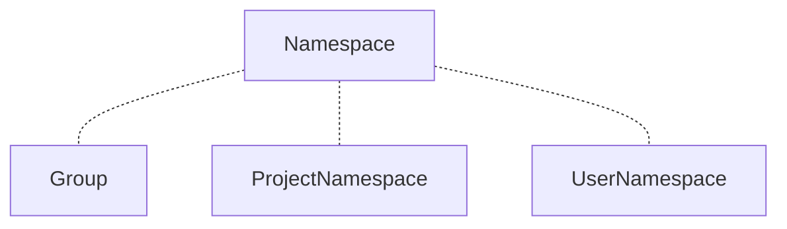
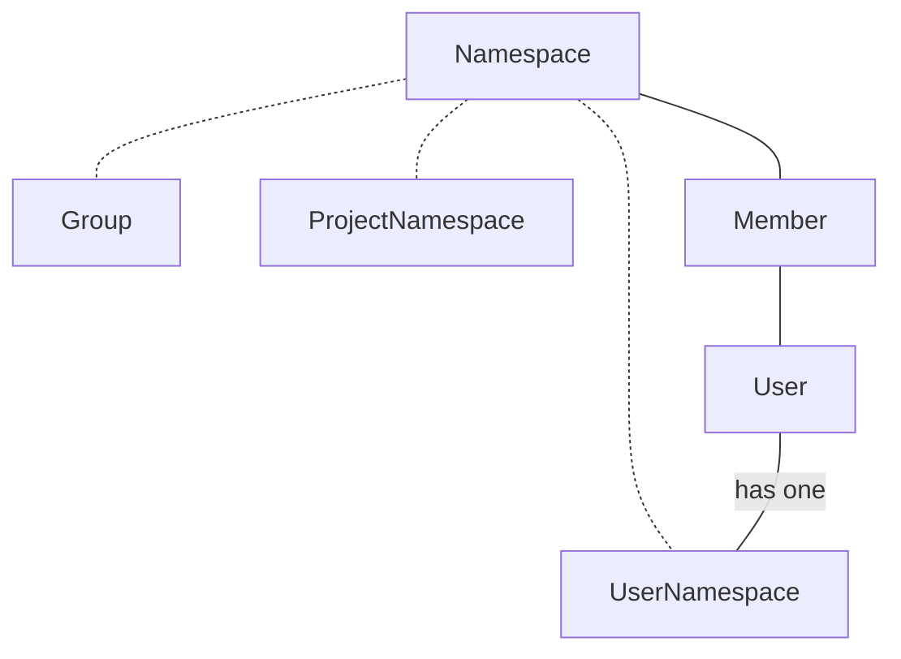
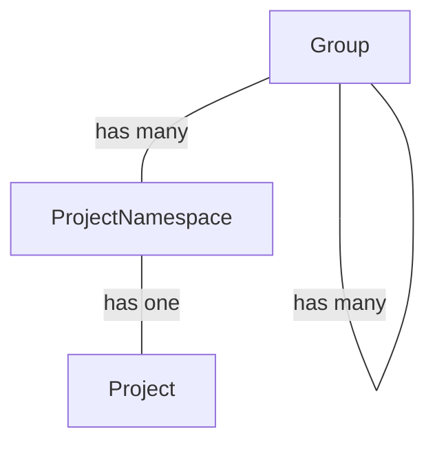
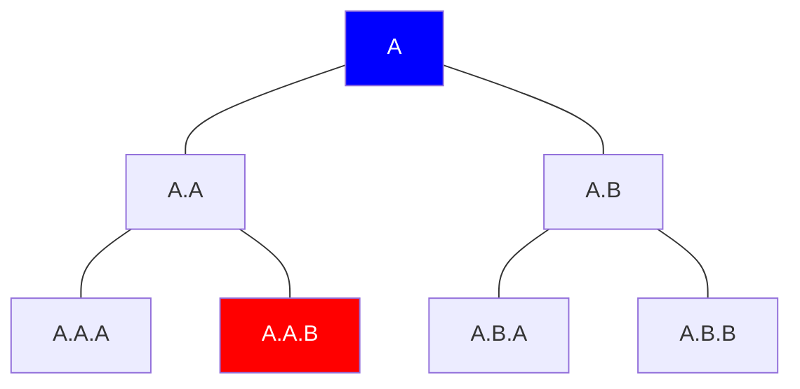
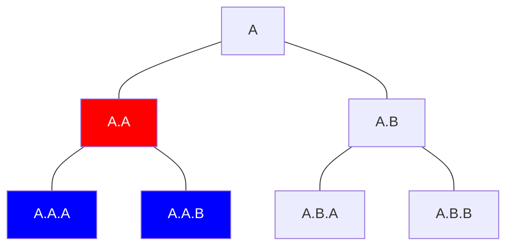
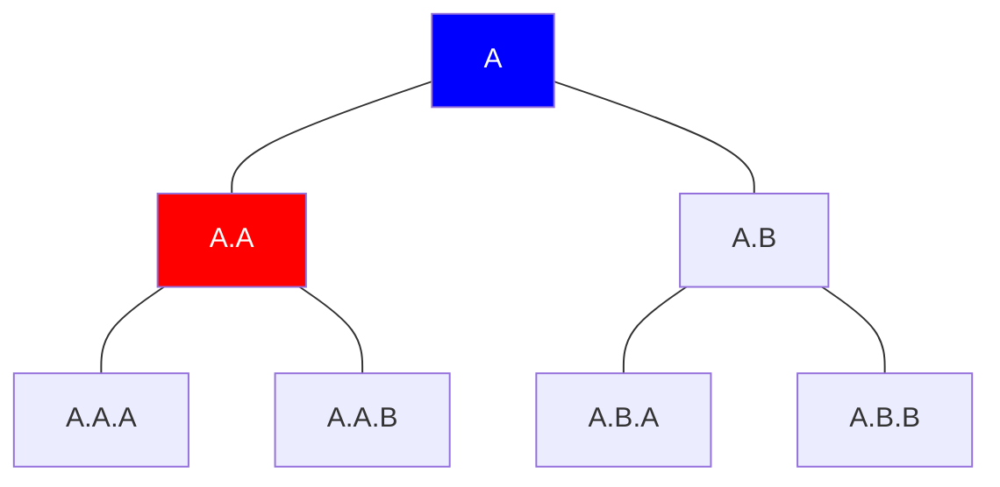
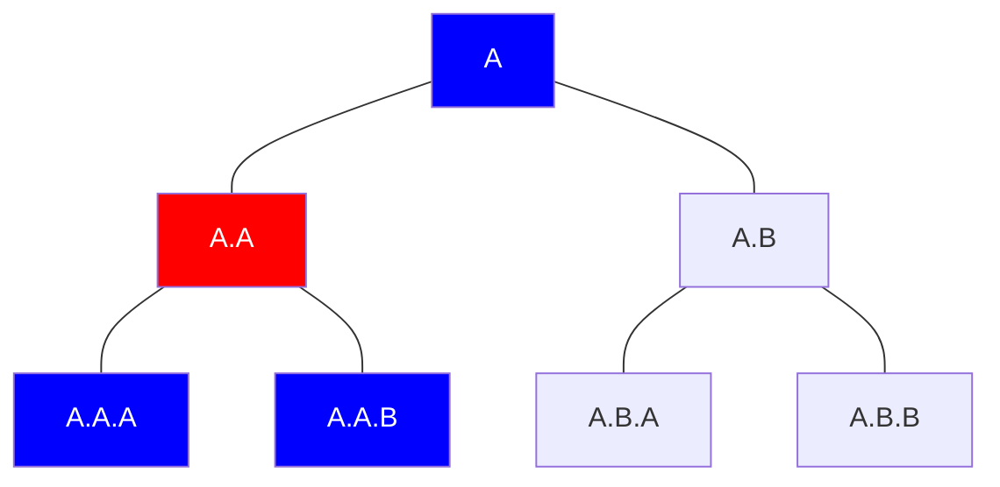
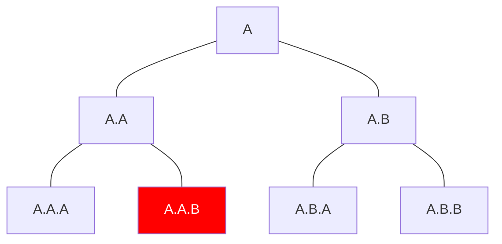
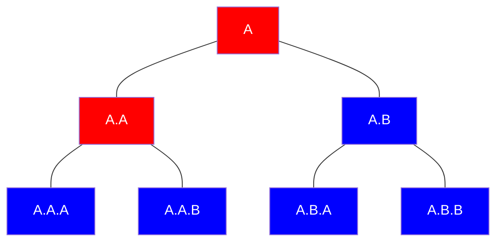

Namespaces are containers for projects and associated resources. A `Namespace` is instantiated through its subclasses of `Group`, `ProjectNamespace`, and `UserNamespace`.



A `User` has one `UserNamespace`, and can be a member of many `Namespaces`.



`Group` exists in a recursive hierarchical relationship. `Groups` have many `ProjectNamespaces` which parent one `Project`.



## Querying namespaces

There is a set of methods provided to query the namespace hierarchy. The methods produce standard Rails `ActiveRecord::Relation` objects.
The methods can be split into two similar halves. One set of methods operate on a Namespace object, while the other set operate as composable Namespace scopes.

By their nature, the object methods will operate within a single `Namespace` hierarchy, while the scopes can span hierarchies.

The following is a non-exhaustive list of methods to query `Namespace` hierarchies.

### Root namespaces

The root is the top most `Namespace` in the hierarchy. A root has a `nil` `parent_id`.



```ruby
Namespace.where(...).roots

namespace_object.root_ancestor
```

### Descendant namespaces

The descendants of a namespace are its children, their children, and so on.



We can return ourself and our descendants through `self_and_descendants`.

```ruby
Namespace.where(...).self_and_descendants

namespace_object.self_and_descendants
```

We can return only our descendants excluding ourselves:

```ruby
Namespace.where(...).self_and_descendants(include_self: false)

namespace_object.descendants
```

We could not name the scope method `.descendants` because we would override the `Object` method of the same name.

It can be more efficient to return the descendant IDs instead of the whole record:

```ruby
Namespace.where(...).self_and_descendant_ids
Namespace.where(...).self_and_descendant_ids(include_self: false)

namespace_object.self_and_descendant_ids
namespace_object.descendant_ids
```

### Ancestor namespaces

The ancestors of a namespace are its parent, its parent's parent, and so on.



We can return ourself and our ancestors through `self_and_ancestors`.

```ruby
Namespace.where(...).self_and_ancestors

namespace_object.self_and_ancestors
```

We can return only our ancestors excluding ourselves:

```ruby
Namespace.where(...).self_and_ancestors(include_self: false)

namespace_object.ancestors
```

We could not name the scope method `.ancestors` because we would override the `Module` method of the same name.

It can be more efficient to return the ancestor ids instead of the whole record:

```ruby
Namespace.where(...).self_and_ancstor_ids
Namespace.where(...).self_and_ancestor_ids(include_self: false)

namespace_object.self_and_ancestor_ids
namespace_object.ancestor_ids
```

### Hierarchies

A Namespace hierarchy is a `Namespace`, its ancestors, and its descendants.



We can query a namespace hierarchy:

```ruby
Namespace.where(...).self_and_hierarchy

namespace_object.self_and_hierarchy
```

### Recursive queries

The queries above are known as the linear queries because they use the `namespaces.traversal_ids` column to perform standard SQL queries instead of recursive CTE queries.

A set of legacy recursive queries are also accessible if needed:

```ruby
Namespace.where(...).recursive_self_and_descendants
Namespace.where(...).recursive_self_and_descendants(include_self: false)
Namespace.where(...).recursive_self_and_descendant_ids
Namespace.where(...).recursive_self_and_descendant_ids(include_self: false)
Namespace.where(...).recursive_self_and_ancestors
Namespace.where(...).recursive_self_and_ancestors(include_self: false)
Namespace.where(...).recursive_self_and_ancstor_ids
Namespace.where(...).recursive_self_and_ancestor_ids(include_self: false)
Namespace.where(...).recursive_self_and_hierarchy

namespace_object.recursive_root_ancestor
namespace_object.recursive_self_and_descendants
namespace_object.recursive_descendants
namespace_object.recursive_self_and_descendant_ids
namespace_object.recursive_descendant_ids
namespace_object.recursive_self_and_ancestors
namespace_object.recursive_ancestors
namespace_object.recursive_self_and_ancestor_ids
namespace_object.recursive_ancestor_ids
namespace_object.recursive_self_and_hierarchy
```

### Search using trie data structure

`Namespaces::Traversal::TrieNode` implements a trie data structure to efficiently search within
`namespaces.traveral_ids` hierarchy for a set of Namespaces.

```ruby
traversal_ids = Namespace.where(...).map(&:traversal_ids)

# contains [9970, 123] and [9970, 456]
trie = Namespaces::Traversal::TrieNode.build(traversal_ids)

trie.prefix_search([9970]) # returns [[9970, 123], [9970, 456]] 

trie.covered?([9970]) # returns false
trie.covered?([9970, 123]) # returns true
trie.covered?([9970, 123, 789]) # returns true
```

## Namespace query implementation

The linear queries are executed using the `namespaces.traversal_ids` array column. Each array represents an ordered set of `Namespace` IDs from the root `Namespace` to the current `Namespace`.

Given the scenario:



The `traversal_ids` for `Namespace` `A.A.B` would be `[A, A.A, A.A.B]`.

The `traversal_ids` have some useful properties to keep in mind if working in this area:

- The root of every `Namespace` is provided by `traversal_ids[1]`. Note that PostgreSQL array indexes begin at `1`.
- The ID of the current `Namespace` is provided by `traversal_ids[array_length(traversal_ids, 1)]`.
- The `Namespace` ancestors are represented by the `traversal_ids`.
- A `Namespace`'s `traversal_ids` are a subset of their descendants `traversal_ids`. A `Namespace` with `traversal_ids = [1,2,3]` will have descendants that all start with `[1,2,3,...]`.
- PostgreSQL arrays are ordered such that `[1] < [1,1] < [2]`.

Using these properties we find the `root` and `ancestors` are already provided for by `traversal_ids`.

With the object descendant queries we lean on the `@>` array operator which will test inclusion of an array inside another array.
The `@>` operator has been found to be quite slow as the search space grows. Another method is used for scope queries which tend to have larger search spaces.
With scope queries we combine comparison operators with the array ordering property.

All descendants of a `Namespace` with `traversal_ids = [1,2,3]` have `traversal_ids` that are greater than `[1,2,3]` but less than `[1,2,4]`.
In this example `[1,2,3]` and `[1,2,4]` are siblings, and `[1,2,4]` is the next sibling after `[1,2,3]`. A SQL function is provided to find the next sibling of a `traversal_ids` called `next_traversal_ids_sibling`.

```sql
gitlabhq_development=# select next_traversal_ids_sibling(ARRAY[1,2,3]);
 next_traversal_ids_sibling
----------------------------
 {1,2,4}
(1 row)
```

We then build descendant linear query scopes using comparison operators:

```sql
WHERE namespaces.traversal_ids > ARRAY[1,2,3]
  AND namespaces.traversal_ids < next_traversal_ids_sibling(ARRAY[1,2,3])
```

### Superset

`Namespace` queries are prone to returning duplicate results. For example, consider a query to find descendants of `A` and `A.A`:



```ruby
namespaces = Namespace.where(name: ['A', 'A.A'])

namespaces.self_and_descendants

=> A.A, A.A.A, A.A.B, A.B, A.B.A, A.B.B
```

Searching for the descendants of both `A` and `A.A` is unnecessary because `A.A` is already a descendant of `A`.
In extreme cases this can create excessive I/O leading to poor performance.

Redundant `Namespaces` are eliminated from a query if a `Namespace` `ID` in the `traversal_ids` attribute matches an `ID` belonging to another `Namespace` in the set of `Namespaces` being queried.
A match of this condition signifies that an ancestor exists in the set of `Namespaces` being queried, and the current `Namespace` is therefore redundant.
This optimization will result in much better performance of edge cases that would otherwise be very slow.
