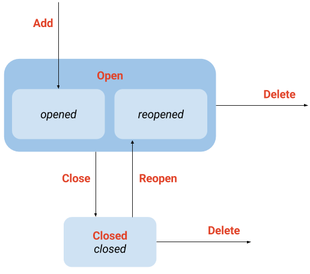
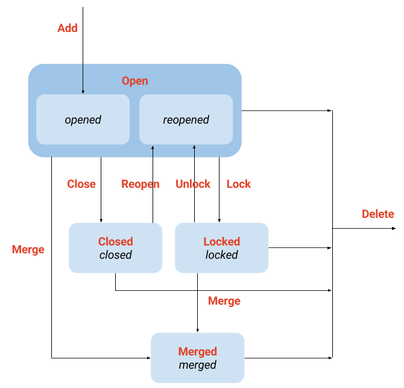

# Object state models

## Contents

* [Diagrams](#diagrams)
* [Legend](#legend)
* [Issue](#issue)
* [Merge request](#merge-request)

## Diagrams

[GitLab object state models](https://drive.google.com/drive/u/3/folders/0B5tDlHAM4iZINmpvYlJXcDVqMGc)

---

## Legend

--- 

## Issue

[`app/models/issue.rb`](https://gitlab.com/gitlab-org/gitlab-ce/blob/master/app/models/issue.rb)

--- 

## Merge request

[`app/models/merge_request.rb`](https://gitlab.com/gitlab-org/gitlab-ce/blob/master/app/models/merge_request.rb)
