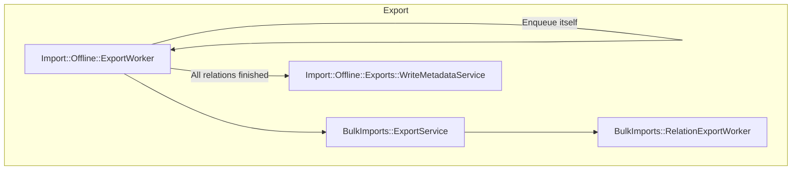
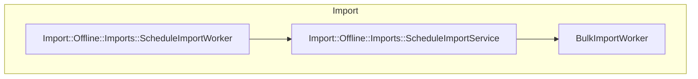

> [!warning]
> Offline transfer is a work in progress. It's gated behind the `offline_transfer_exports`, `offline_transfer_imports`,
> and `offline_transfer_ui` feature flags, all disabled by default.

Offline transfer lets a group or project be exported to an object storage bucket and imported from that bucket later,
without the source and destination GitLab instances ever talking to each other directly. This is useful when the two
instances can't reach each other over the network, or when export and import need to happen at different times.

Offline transfer reuses the [Direct transfer](bulk_import.md) architecture: the same `BulkImport`, `BulkImports::Entity`,
and `BulkImports::Tracker` records, the same ETL (extract, transform, load) pipeline concern, and the same NDJSON (newline-delimited JSON) relation format. This page only
describes what's unique to offline transfer. Read [Direct transfer](bulk_import.md) first for the shared concepts
(terminology, pipeline design, NDJSON pipeline, idempotency, and exception handling), all of which apply here unchanged.

## How it differs from direct transfer

Direct transfer's destination instance drives the whole migration: it asks the source instance's API to export a
relation, polls until it's ready, then downloads it over HTTP. Offline transfer has no source instance to ask, because
export and import can happen at different times, from different networks, with nothing guaranteeing the source
instance is even reachable when the import runs. Instead, export and import each run independently against object storage:

- Export writes every relation file directly to a bucket the user configures, then writes a `metadata.json.gz`
  manifest once every relation has finished.
- Import later reads that manifest back out of the same bucket to discover which entities were exported and how they
  map to object keys, then imports them using the same pipelines Direct transfer uses.

Because there's no source API to call, some direct-transfer-only steps are skipped for an offline `BulkImport`
(`bulk_import.offline_export?` is true):

- [`BulkImports::ProcessService#import_entity`](https://gitlab.com/gitlab-org/gitlab/-/blob/master/app/services/bulk_imports/process_service.rb)
  enqueues [`BulkImports::EntityWorker`](https://gitlab.com/gitlab-org/gitlab/-/blob/master/app/workers/bulk_imports/entity_worker.rb)
  directly instead of [`BulkImports::ExportRequestWorker`](https://gitlab.com/gitlab-org/gitlab/-/blob/master/app/workers/bulk_imports/export_request_worker.rb),
  since there's no source instance to ask to start an export.
- `ProcessService` skips caching a source ghost user ID, for the same reason.
- [`BulkImports::Entity#pipelines`](https://gitlab.com/gitlab-org/gitlab/-/blob/master/app/models/bulk_imports/entity.rb)
  uses a different stage list:
  [`Import::Offline::Imports::Groups::Stage`](https://gitlab.com/gitlab-org/gitlab/-/blob/master/lib/import/offline/imports/groups/stage.rb)
  or `Import::Offline::Imports::Projects::Stage`, instead of `BulkImports::Groups::Stage` or `BulkImports::Projects::Stage`.
  Most pipelines are reused unmodified from direct transfer (for example `LabelsPipeline`, `MilestonesPipeline`,
  `BoardsPipeline`, `UploadsPipeline`), but a few are offline-transfer-specific, under the `Import::Offline::Groups::Pipelines`,
  `Import::Offline::Projects::Pipelines`, and `Import::Offline::Common::Pipelines` namespaces, for example
  `Import::Offline::Groups::Pipelines::GroupPipeline` and `Import::Offline::Common::Pipelines::UserContributionsPipeline`.
- Relation files are downloaded from object storage instead of over HTTP. See [Fog adapters and object storage](#fog-adapters-and-object-storage).

## Key models

- [`BulkImport#source_type`](https://gitlab.com/gitlab-org/gitlab/-/blob/master/app/models/bulk_import.rb) is an enum
  (`gitlab` or `offline_export`) that marks a `BulkImport` as an offline transfer. `BulkImport#offline?` is an alias
  for `offline_export?`.
- [`Import::Offline::Export`](https://gitlab.com/gitlab-org/gitlab/-/blob/master/app/models/import/offline/export.rb)
  tracks one export request, with its own state machine (`created`/`started`/`finished`/`failed`) and completion
  emails. [`BulkImports::Export`](https://gitlab.com/gitlab-org/gitlab/-/blob/master/app/models/bulk_imports/export.rb),
  the same per-relation export record direct transfer uses, gets a `belongs_to :offline_export` so relation exports
  can be grouped under one `Import::Offline::Export`.
- [`Import::Offline::Configuration`](https://gitlab.com/gitlab-org/gitlab/-/blob/master/app/models/import/offline/configuration.rb)
  stores the object storage `provider`, `bucket`, encrypted credentials, the `export_prefix` for this export, and
  `entity_prefix_mapping` (source full path to storage entity prefix). It's polymorphic: one row is created when an
  export starts, another when an import starts, each pointing at its own bucket and credentials.

## Sidekiq jobs execution hierarchy

### Export



[`Import::Offline::Exports::CreateService`](https://gitlab.com/gitlab-org/gitlab/-/blob/master/app/services/import/offline/exports/create_service.rb)
enqueues [`Import::Offline::ExportWorker`](https://gitlab.com/gitlab-org/gitlab/-/blob/master/app/workers/import/offline/export_worker.rb),
which drives [`Import::Offline::Exports::ProcessService`](https://gitlab.com/gitlab-org/gitlab/-/blob/master/app/services/import/offline/exports/process_service.rb):

1. On the first run, it creates a `self`-relation `BulkImports::Export` for every descendant group or project of the
   entities being exported.
1. For each pending relation export, it calls the same
   [`BulkImports::ExportService`](https://gitlab.com/gitlab-org/gitlab/-/blob/master/app/services/bulk_imports/export_service.rb)
   direct transfer's source instance uses, passing `offline_export_id`. This enqueues
   `BulkImports::RelationExportWorker` and, from there, the same `RelationBatchExportWorker` /
   `FinishBatchedRelationExportWorker` / `UserContributionsExportWorker` chain documented in
   [Direct transfer's Sidekiq jobs execution hierarchy](bulk_import.md#sidekiq-jobs-execution-hierarchy).
1. At most [`BulkImports::Export::MAX_CONCURRENT_RELATION_EXPORTS`](https://gitlab.com/gitlab-org/gitlab/-/blob/master/app/models/bulk_imports/export.rb)
   (5) relation exports run at a time.
1. Once every relation export finishes, `Import::Offline::Exports::WriteMetadataService` writes and uploads
   `metadata.json.gz` and marks the `Import::Offline::Export` finished. Otherwise, `Import::Offline::ExportWorker`
   re-enqueues itself after 5 seconds.

### Import



[`Import::Offline::Imports::CreateService`](https://gitlab.com/gitlab-org/gitlab/-/blob/master/app/services/import/offline/imports/create_service.rb)
enqueues [`Import::Offline::Imports::ScheduleImportWorker`](https://gitlab.com/gitlab-org/gitlab/-/blob/master/app/workers/import/offline/imports/schedule_import_worker.rb),
which drives [`Import::Offline::Imports::ScheduleImportService`](https://gitlab.com/gitlab-org/gitlab/-/blob/master/app/services/import/offline/imports/schedule_import_service.rb):

1. Downloads and reads `metadata.json.gz` from the bucket, through
   [`Import::Offline::Imports::MetadataFileReader`](https://gitlab.com/gitlab-org/gitlab/-/blob/master/lib/import/offline/imports/metadata_file_reader.rb).
1. Validates every requested entity's source full path exists in the metadata's entity mapping, failing fast if an
   entity wasn't actually exported.
1. Creates `BulkImports::Entity` records for the requested entities and enqueues `BulkImportWorker`.

From here, the migration rejoins the common flow described in
[Direct transfer's Sidekiq jobs execution hierarchy](bulk_import.md#sidekiq-jobs-execution-hierarchy): `BulkImportWorker`,
`BulkImports::ProcessService`, `BulkImports::EntityWorker`, and `BulkImports::PipelineWorker`, except pipelines download
relation files from object storage instead of over HTTP (see [Fog adapters and object storage](#fog-adapters-and-object-storage)),
and use the offline-specific stage lists described in [How it differs from direct transfer](#how-it-differs-from-direct-transfer).

## Endpoints

Offline transfer has no GraphQL API and doesn't call the source instance's API at all. It's driven entirely through
[`API::OfflineTransfers`](https://gitlab.com/gitlab-org/gitlab/-/blob/master/lib/api/offline_transfers.rb), documented
in the [generated REST API reference](https://api.gitlab.com/rest/#tag/offline-transfers):

| Endpoint | Purpose |
|----------|---------|
| `POST /offline_exports` | Starts an export. Takes the object storage configuration (provider, bucket, credentials) and a list of entities to export. Gated by the `offline_transfer_exports` feature flag and rate-limited. Delegates to `Import::Offline::Exports::CreateService`. |
| `GET /offline_exports` and `GET /offline_exports/:id` | Lists or shows a user's exports, through `Import::Offline::ExportsFinder`. |
| `POST /offline_imports` | Starts an import from an export already sitting in object storage. Takes the object storage configuration, the export's `export_prefix`, and a list of entities to import, each with a destination namespace. Gated by the `offline_transfer_imports` feature flag and rate-limited. Delegates to `Import::Offline::Imports::CreateService`. |

## Fog adapters and object storage

Direct transfer downloads relation files over HTTP from the source instance, and uploads exports through a CarrierWave
`ExportUpload` record. Offline transfer instead reads and writes the bucket the user configured directly, through a
small Fog wrapper built for this feature:

- [`Import::Clients::ObjectStorage`](https://gitlab.com/gitlab-org/gitlab/-/blob/master/lib/import/clients/object_storage.rb)
  is a provider-agnostic facade. It picks a provider-specific adapter based on `Import::Offline::Configuration#provider`:
  `aws` or `s3_compatible` uses `Adapters::Aws`, `gcs` or `gcs_application_default` uses `Adapters::Gcs`, and `gcs_hmac`
  uses `Adapters::GcsHmac`. All three wrap a plain `Fog::Storage.new(provider: ..., **credentials)` client.
  - `s3_compatible` (for example MinIO) is only offered when the `allow_s3_compatible_storage_for_offline_transfer`
    application setting is enabled.
  - `gcs_application_default` (GCS Application Default Credentials) resolves to the service account of the instance
    running GitLab, so it's never offered on GitLab.com and only offered on self-managed when an administrator has
    enabled the `allow_application_default_credentials_for_offline_transfer` application setting.
- Uploading calls `directory.files.create`, using multipart upload above a 100 MB threshold. Downloading streams the
  file in chunks through `directory.files.get`.
- [`Import::Offline::ObjectKeyBuilder`](https://gitlab.com/gitlab-org/gitlab/-/blob/master/lib/import/offline/object_key_builder.rb)
  is the single source of truth for where a file lives in the bucket:

  ```plaintext
  <export_prefix>/<entity_prefix>/<relation>.<extension>                # unbatched
  <export_prefix>/<entity_prefix>/<relation>/batch_<n>.<extension>      # batched
  <export_prefix>/metadata.json.gz                                      # metadata
  ```

  For example: `2026-04-16_19-39-00_export_dJtnb3CV/project_1/repository.tar.gz`. On export, `entity_prefix` is derived
  directly from the portable being exported (`project_1`, `group_5`). On import, it's looked up from
  `Import::Offline::Configuration#entity_prefix_mapping`, which is populated from the entity mapping written into
  `metadata.json.gz` during export.
- Uploading and downloading each have a dedicated strategy class, parallel to the ones direct transfer uses for HTTP:
  - [`Import::Offline::ExportUploadable`](https://gitlab.com/gitlab-org/gitlab/-/blob/master/app/services/concerns/import/offline/export_uploadable.rb)
    is mixed into the export services that need it (for example `FileExportService`, `UploadsExportService`). When
    `offline_export_id` is present, it skips creating a CarrierWave `ExportUpload` and uploads the file straight to
    object storage instead.
  - [`BulkImports::FileDownloadService.for_context`](https://gitlab.com/gitlab-org/gitlab/-/blob/master/app/services/bulk_imports/file_download_service.rb)
    is the single branch point on the import side: for an offline pipeline context, it builds
    `Import::Offline::Imports::ObjectStorageFileDownloadStrategy`; otherwise it builds `Import::BulkImports::HttpFileDownloadStrategy`,
    direct transfer's HTTP strategy. `ObjectStorageFileDownloadStrategy` streams the file from object storage,
    validates its Gzip header, and enforces the `bulk_import_max_download_file_size` application setting the same
    way the HTTP strategy does.
