The sharding initiative is a long-running project to ensure that most GitLab database tables can be related to an `Organization`, either directly or indirectly. This involves adding an `organization_id`, `namespace_id` or `project_id` column to tables, and backfilling their `NOT NULL` fallback data. This work is important for the delivery of Cells and Organizations. For more information, see the [design goals of Organizations](https://handbook.gitlab.com/handbook/engineering/architecture/design-documents/organization/#organization-sharding).

## Sharding principles

All tables with the following [`gitlab_schema`](../../cells/_index.md#available-cells--organization-schemas) are considered organization level:

- `gitlab_main_org`
- `gitlab_ci`
- `gitlab_sec`
- `gitlab_main_user`

All newly created organization-level tables are required to have a `sharding_key`
defined in the corresponding `db/docs/` file for that table.

The purpose of the sharding key is documented in the
[Organization isolation blueprint](https://handbook.gitlab.com/handbook/engineering/architecture/design-documents/organization/isolation/),
but in short this column is used to provide a standard way of determining which
Organization owns a particular row in the database.

The actual name of the foreign key can be anything but it must reference a row
in `projects` or `namespaces`. The chosen `sharding_key` column must be non-nullable.

The reasoning for adding sharding keys, and which keys to add to a table/row, goes like this:

- In order to move organizations across cells, we want `organization_id` on all rows of all tables.
- But `organization_id` on rows that are actually owned by a top-level group (or its subgroups or projects) makes
  top-level group transfer inefficient (due to `organization_id` rewrites) to the point of being impractical.
- Compromise: Add `organization_id` or `namespace_id` to all rows of all tables.
- But `namespace_id` on rows of tables that are actually owned by projects makes project transfer (and certain subgroup
  transfers) inefficient (due to `namespace_id` rewrites) to the point of being impractical.
- Compromise: Add `organization_id`, `namespace_id`, or `project_id` to all rows of all tables (whichever is most specific).

### Choosing the right sharding key

Every row must have exactly 1 sharding key, and it should be as specific as possible. Exceptions cannot be made on large
tables.

In rare cases where a table can belong to multiple different parent entities (for example, both a project and a namespace),
you may define the `sharding_key` with multiple columns.
This is only allowed if the table has a check constraint that correctly ensures exactly one of the sharding key columns must be non-nullable for a row in the table.
See [`NOT NULL` constraints for multiple columns](../../database/not_null_constraints.md#not-null-constraints-for-multiple-columns)
for instructions on creating these constraints.

> [!warning]
> Tables with multiple-column sharding key may be required to be split into separate tables in the future to support efficient data migration and isolation across cells.
> Avoid designing new tables with multiple-column sharding keys unless absolutely necessary.

The following are examples of valid sharding keys:

- The table entries belong only to a project:

  ```yaml
  sharding_key:
    project_id: projects
  ```

- The table entries belong to a project and the foreign key is `target_project_id`:

  ```yaml
  sharding_key:
    target_project_id: projects
  ```

- The table entries belong only to a namespace/group:

  ```yaml
  sharding_key:
    namespace_id: namespaces
  ```

- The table entries belong only to a namespace/group and the foreign key is `group_id`:

  ```yaml
  sharding_key:
    group_id: namespaces
  ```

- The table entries belong to a namespace or a project:

  ```yaml
  sharding_key:
    project_id: projects
    namespace_id: namespaces
  ```

- (Only for `gitlab_main_user`) The table entries belong only to a user:

  ```yaml
  sharding_key:
    user_id: users
  ```

#### The sharding key must be immutable

The choice of a `sharding_key` should always be immutable. This is because the
sharding key column is used as an index for the planned
[Org Mover](https://handbook.gitlab.com/handbook/engineering/architecture/design-documents/cells/migration/),
and also the
[enforcement of isolation](https://handbook.gitlab.com/handbook/engineering/architecture/design-documents/organization/isolation/)
of organization data.
Any mutation of the `sharding_key` could result in inconsistent data being read.

Therefore, if your feature requires a user experience which allows data to be
moved between projects or groups/namespaces, then you might need to redesign the
move feature to create new rows.
An example of this can be seen in the
[move an issue feature](../../../user/project/issues/managing_issues.md#move-an-issue).
This feature does not actually change the `project_id` column for an existing
`issues` row but instead creates a new `issues` row and creates a link in the
database from the original `issues` row.
If there is a particularly challenging
existing feature that needs to allow moving data you will need to reach out to
the Tenant Scale team early on to discuss options for how to manage the
sharding key.

#### Using `namespace_id` as sharding key

The `namespaces` table has rows that can refer to a `Group`, a `ProjectNamespace`,
or a `UserNamespace`. The `UserNamespace` type is also known as a personal namespace.

Using a `namespace_id` as a sharding key is a good option, except when `namespace_id`
refers to a `UserNamespace`. Because a user does not necessarily have a related
`namespace` record, this sharding key can be `NULL`. A sharding key should not
have `NULL` values.

#### Using the same sharding key for projects and namespaces

Developers may also choose to use `namespace_id` only for tables that can
belong to a project where the feature used by the table is being developed
following the
[Consolidating Groups and Projects blueprint](https://handbook.gitlab.com/handbook/engineering/architecture/design-documents/consolidating_groups_and_projects/).
In that case the `namespace_id` would need to be the ID of the
`ProjectNamespace` and not the group that the namespace belongs to.

#### Using `organization_id` as sharding key

Usually, `project_id` or `namespace_id` are the most common sharding keys.
However, there are cases where a table does not belong to a project or a namespace.

In such cases, `organization_id` is an option for the sharding key, provided the below guidelines are followed:

- The `sharding_key` column still needs to be [immutable](#the-sharding-key-must-be-immutable).
- Only add `organization_id` for root level models (for example, `namespaces`), and not leaf-level models (for example,
  `issues`).
- Ensure such tables do not contain data related to groups or projects (or records that belong to groups or projects).
  Instead, use `project_id`, or `namespace_id`.
- Tables with lots of rows are not good candidates because we would need to re-write every row if we move the entity to
  a different organization which can be expensive.
- When there are other tables referencing this table, the application should continue to work if the referencing table
  records are moved to a different organization.

If you believe that the `organization_id` is the best option for the sharding key, seek approval from the Tenant Scale
group.
This is crucial because it has implications for data migration and may require reconsideration of the choice of sharding
key.

As an example, see [this issue](https://gitlab.com/gitlab-org/gitlab/-/issues/462758), which added `organization_id` as
a sharding key to an existing table.

## Sharding tables by `organization_id`

When you add a new table or modify an existing table to be sharded by `organization_id`, you must:

1. **Add transfer service support**: Update records' `organization_id` when a group or users transfer to a new organization.
1. **Use common organization in factories**: Ensure RSpec factories automatically associate with the common organization. See the after build block in the Namespaces factory.

### Implementing sharding keys

To add a sharding key to a table, follow these steps. We need to backfill a `sharding_key` to hundreds of tables that do
not have one. To minimize repetitive effort, we've introduced a declarative way to describe how to backfill the
`sharding_key` using [`gitlab-housekeeper`](https://gitlab.com/gitlab-org/gitlab/-/tree/master/gems/gitlab-housekeeper),
which can create the MRs with the desired changes rather than manually doing it.

#### Ensure sharding key presence on application level

When you define your sharding key you must make sure it's filled on application level.
Every `ApplicationRecord` model includes a helper `populate_sharding_key`, which
provides a convenient way of defining sharding key logic,
and also a corresponding matcher to test your sharding key logic. For example:

```ruby
# in model.rb
populate_sharding_key :project_id, source: :merge_request, field: :target_project_id

# in model_spec.rb
it { is_expected.to populate_sharding_key(:project_id).from(:merge_request, :target_project_id) }
```

See
more [helper examples](https://gitlab.com/gitlab-org/gitlab/-/blob/master/app/models/concerns/populates_sharding_key.rb)
and [RSpec matcher examples](https://gitlab.com/gitlab-org/gitlab/-/blob/master/spec/support/matchers/populate_sharding_key_matcher.rb).

#### Define a `desired_sharding_key` configuration

Define a `desired_sharding_key` in your table's YAML configuration to automate the backfill process. An example was
added in
[this MR](https://gitlab.com/gitlab-org/gitlab/-/merge_requests/139336):

```yaml
--- # db/docs/security_findings.yml
table_name: security_findings
classes:
- Security::Finding

# ...

desired_sharding_key:
  project_id:
    references: projects
    backfill_via:
      parent:
        foreign_key: scanner_id
        table: vulnerability_scanners
        table_primary_key: id # Optional. Defaults to 'id'
        sharding_key: project_id
        belongs_to: scanner
```

The YAML specifies the parent table and its `sharding_key` to backfill from in the batched background migration. It also
specifies a `belongs_to` relation which will be added to the model to populate the `sharding_key` in the `before_save`.

**When the parent table also has a `desired_sharding_key`**

If the parent table also has a `desired_sharding_key` configuration and is itself waiting to be backfilled, include the
`awaiting_backfill_on_parent` field:

```yaml
desired_sharding_key:
  project_id:
    references: projects
    backfill_via:
      parent:
        foreign_key: package_file_id
        table: packages_package_files
        table_primary_key: id # Optional. Defaults to 'id'
        sharding_key: project_id
        belongs_to: package_file
    awaiting_backfill_on_parent: true
```

There are edge cases where this `desired_sharding_key` structure is not suitable for backfilling a `sharding_key`. In
such cases, the team owning the table will need to create the necessary merge requests manually.

#### Add column, triggers, indexes, and foreign keys

This is the step where we add the sharding key column, indexes, foreign keys and necessary triggers.

**1. Steps to set up:**

1. Set up the keys required by Housekeeper: `export HOUSEKEEPER_TARGET_PROJECT_ID=278964` (project ID of GitLab project).
1. Create a new PAT for yourself: `export HOUSEKEEPER_GITLAB_API_TOKEN=<your-pat>`.
1. Update the local master branch: `git checkout master && git pull origin master --rebase`.
1. Switch to the `sharding-key-backfill-keeps` branch with the following command:

   ```shell
   git checkout sharding-key-backfill-keeps
   ```

    > You can also find the branch in the [MR](https://gitlab.com/gitlab-org/gitlab/-/merge_requests/143774).

1. Rebase this branch on top of master and push the changes back to origin. This makes sure that this branch is aware of changes in master:

   ```shell
   git pull origin master --rebase
   ```

1. Run the following command to push back rebased changes to the branch, and omit `LEFTHOOK=0` (otherwise, RuboCop fails):

   ```shell
   LEFTHOOK=0 git push --force-with-lease -o ci.skip
   ```

- Run `bundle install` and migrations.

> Do not push any changes to this branch, just keep rebasing.

**2. Steps to create automated MR:**

We store sharding key keeps for the small table and large table inside the [keeps directory](https://gitlab.com/gitlab-org/gitlab/-/tree/sharding-key-backfill-keeps/keeps). The file name starts with `backfill_desired_sharding_key_*.rb`.

Let's understand the [small table keep](https://gitlab.com/gitlab-org/gitlab/-/blob/6c0f8751b033864590bee121a5ae846a66457dfd/keeps/backfill_desired_sharding_key_small_table.rb):

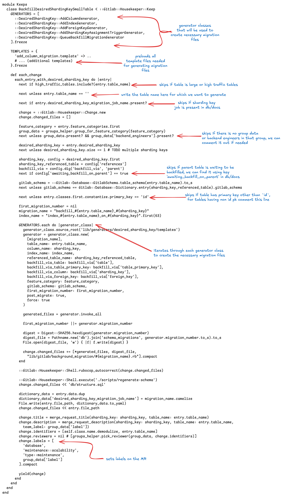

The keep file contains code that:

- Defines a `Housekeeper::Keep` class for backfilling desired sharding keys on small tables
- Sets change types to include `::Keeps::DesiredShardingKey::CHANGE_TYPES`
- Iterates through entries in `database_yaml_entries`
- For each entry, adds the sharding key column if needed, including indexes, triggers, and foreign keys

1. Open the keep file and add `next unless entry.table_name == 'table name'`. Here, the table name will be the name of the table we want to create migrations for.

1. Perform a quick check based on the `desired_sharding_key` configuration of the table. Is the configuration correct? Does the sharding key of the parent table include a `NOT NULL` constraint as expected? If not, skip that table and go for another one. If the table is OK, we can proceed.

1. Let's check the table's primary key. Run the following commands in your terminal:

   - `gdk psql`
   - `\d <table_name>`

1. Running the above command will give you useful information about the tables, such as indexes, pk, etc. For example, the `security_scans` table looks like:

   

   The output shows:
   - Table: `public.security_scans`
   - Columns: `id` (bigint, not null), `created_at` (timestamp), `updated_at` (timestamp), `build_id` (bigint, not null), `scan_type` (smallint, not null), and other fields
   - Primary key: `security_scans_pkey` (btree on `id`)
   - Indexes: Including `index_security_scans_on_build_id` and `index_security_scans_on_project_id`
   - Foreign keys: Including references to `ci_builds` and `projects`

1. This is important because we have many cases where the primary key is composite, non unique, etc., and requires some manual changes in the keep.

1. Do a dry run of the execution as it will show you the generated changes and won't commit anything:

   - `bundle exec gitlab-housekeeper -k Keeps::BackfillDesiredShardingKeySmallTable -d`

1. If dry run looks good then run the same command without -d flag:

   - `bundle exec gitlab-housekeeper -k Keeps::BackfillDesiredShardingKeySmallTable`

   - Running the above command will create a MR with the changes 🎉

> Follow the same methods for large tables and use the large table keep. The only difference is that the table won't have a FK for performance reasons.

**Some useful hacks:**

**1. Tables containing non :id primary key**

1. Replace :id with non-ID primary key [in the first diff](https://gitlab.com/gitlab-org/gitlab/-/merge_requests/143774/diffs#0d5f33d9793cf940dfdaca2d13dc36ffba642547_0_16), [in the second diff](https://gitlab.com/gitlab-org/gitlab/-/merge_requests/143774/diffs#0d5f33d9793cf940dfdaca2d13dc36ffba642547_0_31) and [in the third diff](https://gitlab.com/gitlab-org/gitlab/-/merge_requests/143774/diffs#a43ac76c906b5de1a49f01a1b9d3df52db53d824_0_18).
1. Comment this line [in this diff](https://gitlab.com/gitlab-org/gitlab/-/merge_requests/143774/diffs#9e60f08042851b8f971e69edf1b7ecf0c3650bad_0_121).
1. Add a line in [this file](https://gitlab.com/gitlab-org/gitlab/-/blob/sharding-key-backfill-keeps/lib/generators/desired_sharding_key/templates/batched_background_migration_job_spec.template?ref_type=heads#L10) `let(:batch_column) { :non-id-pk }` like we did [in this example](https://gitlab.com/gitlab-org/gitlab/-/merge_requests/165940/diffs#13b28b3d4235b2108dee9bad7345da521f72fb09_0_12).

   Example MR: [!165940 (merged)](https://gitlab.com/gitlab-org/gitlab/-/merge_requests/165940) if the table uses `gitlab_ci` db then we need to specify `migration: :gitlab_ci` in migration files.

**2. Tables containing composite primary keys (more than one)**

1. Get the table information and check if either of the primary key columns has UNIQUE indexes defined, if YES then use that as primary key and batch column like we did above.
1. If none of the columns are unique, then we need to manually add changes.
1. Let's take an example of the `deployment_merge_requests` table. This is a table with non-unique composite primary keys `"deployment_merge_requests_pkey" PRIMARY KEY, btree (deployment_id, merge_request_id)`.
1. We have used [cursor based batching](https://gitlab.com/gitlab-org/gitlab/-/merge_requests/169557).
1. First, generate the changes using keep, then edit the changes.
1. Open the queue backfill post migrate file and remove all the changes and add new. For example:

    

    Example MR: [!183738 (merged)](https://gitlab.com/gitlab-org/gitlab/-/merge_requests/183738)

1. The above changes style can be used for other tables with such specifications too.
1. Open the `lib/gitlab/background_migration/backfill_*.rb` and remove all the changes generated by keep and add:

    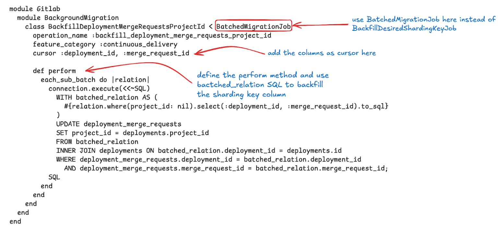

    See [!183738](https://gitlab.com/gitlab-org/gitlab/-/merge_requests/183738/diffs#diff-content-c2163b12dc5e47a609975eef6d8ee2674c6e1846).

1. If the table is large, add the sharding key to ignored FK list `:ignored_fk_columns_map` in [schema_spec.rb](https://gitlab.com/gitlab-org/gitlab/-/blob/master/spec/db/schema_spec.rb?ref_type=heads#L30).
1. Make sure to also update the [specs](https://gitlab.com/gitlab-org/gitlab/-/merge_requests/183738/diffs#diff-content-82b15af453642aa441801a31b12e5b3c22b009b7).

   More examples: [!183047 (merged)](https://gitlab.com/gitlab-org/gitlab/-/merge_requests/183047), [!176714 (merged)](https://gitlab.com/gitlab-org/gitlab/-/merge_requests/176714).

**3. Tables in different database**

- It might be the case that the table is in `ci` db and the sharding key is in `main` db.
- For example, `dast_site_profiles_builds` is in `sec` db and the sharding key table `projects` is in main db.
- For this you may need to add a LFK - loose foreign key, example: [MR created by housekeep](https://gitlab.com/gitlab-org/gitlab/-/merge_requests/167768) and later we added [LFK](https://gitlab.com/gitlab-org/gitlab/-/blob/master/config/gitlab_loose_foreign_keys.yml?ref_type=heads#L286).
- Make sure to add `migration: :gitlab_sec` in the [backfill spec](https://gitlab.com/gitlab-org/gitlab/-/merge_requests/167768/diffs#04d2561fe8663e64037400b6c44818d373a32b13_0_8) and [queue spec](https://gitlab.com/gitlab-org/gitlab/-/merge_requests/167768/diffs#5c58df6768de80184fd5871af10b1ddb7f52ba82_0_6).
- Normal FK won't work as they are in different db.
- For the parent table `dast_site_profiles` we have [LFK to projects](https://gitlab.com/gitlab-org/gitlab/-/blob/master/config/gitlab_loose_foreign_keys.yml?ref_type=heads#L278).
- If table `dast_site_profiles_builds` has FK relation to its parent table `dast_site_profiles` with CASCADE delete then records will get deleted when the associated `dast_site_profiles` records are deleted.
- But it's also good to add a LFK entry for `dast_site_profiles_builds`.

  ```yaml
   dast_site_profiles_builds:
     - table: projects
       column: project_id
       on_delete: async_delete
   ```

#### Finalization Migration

Once the column has been added and the backfill is finished we need to finalize the migration. We can check the status of queued migration in `#chat-ops-test` Slack channel.

- `/chatops run batched_background_migrations list --job-class-name=<desired_sharding_key_migration_job_name>` to check the status of a particular job

- Output will look something like:

  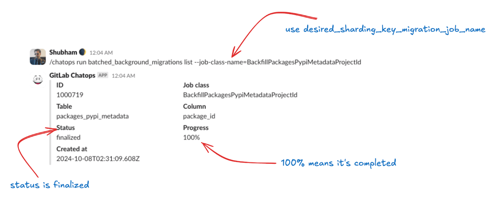

  The ChatOps output displays:
  - Job class name
  - Table name
  - Status (e.g., `finished`, `active`, `paused`)
  - Progress percentage

1. Once it's 100% create a new branch from master and run: `bundle exec rails g post_deployment_migration finalize_<table><sharding_key>`

   This will create a post deployment migration file, edit it. For example, table `subscription_user_add_on_assignments` it will look like:

   ```ruby
   class FinalizeBackfillSubscriptionUserAddOnAssignmentsOrganizationId < Gitlab::Database::Migration[2.2]
     milestone '17.6'
     disable_ddl_transaction!

     restrict_gitlab_migration gitlab_schema: :gitlab_main_cell

     def up
       ensure_batched_background_migration_is_finished(
         job_class_name: 'BackfillSubscriptionUserAddOnAssignmentsOrganizationId',
         table_name: :subscription_user_add_on_assignments,
         column_name: :id,
         job_arguments: [:organization_id, :subscription_add_on_purchases, :organization_id, :add_on_purchase_id],
         finalize: true
       )
     end

     def down; end
   end
   ```

1. It will be similar for every other table except the `job_class_name`, `table_name`, `column_name`, and `job_arguments`. Make sure the job arguments are correct. You can check the add sharding key & backfill MR to match the job arguments.
1. Once it's done, run `bin/rails db:migrate` and update key `finalized_by` in db/docs. Example MR: [!169834](https://gitlab.com/gitlab-org/gitlab/-/merge_requests/169834).

- You are all set. Git commit and create MR 🎉

#### Add a NOT NULL constraint

The last step is to make sure the sharding key has a `NOT NULL` constraint.

**Small tables**

1. Create a post deployment migration using `bundle exec rails g post_deployment_migration <table_name>_not_null`

   For example, table `subscription_user_add_on_assignments`:

   ```ruby
   class AddSubscriptionUserAddOnAssignmentsOrganizationIdNotNull < Gitlab::Database::Migration[2.2]
     milestone '17.6'
     disable_ddl_transaction!

     def up
       add_not_null_constraint :subscription_user_add_on_assignments, :organization_id
       end

     def down
       remove_not_null_constraint :subscription_user_add_on_assignments, :organization_id
     end
   end
   ```

1. Run `bin/rails db:migrate`.
1. Open the corresponding `db/docs.*.yml` file, in this case `db/docs/subscription_user_add_on_assignments.yml` and remove `desired_sharding_key` and `desired_sharding_key_migration_job_name` configuration and add the `sharding_key`.

   ```yaml
   sharding_key:
     organization_id: organizations
   ```

**Large tables or tables that exceed runtime**

In this case we have to add async validation before we can add the sharding key. It will be a 2 MR process. Let's take an example of table `packages_package_files`.

*Step 1 (MR 1): [Add NOT NULL for sharding key on `packages_package_files`](https://gitlab.com/gitlab-org/gitlab/-/merge_requests/184630/diffs)*

1. Create a [post deployment migration](https://gitlab.com/gitlab-org/gitlab/-/merge_requests/184630/diffs#cf4ce3e2d6f2d05856d6d51ccd69955154aab90e_0_8) to add not null constraint with `validate: false`.

    

    ```ruby
    class AddPackagesPackageFilesProjectIdNotNull < Gitlab::Database::Migration[2.2]
      milestone '17.11'
      disable_ddl_transaction!

      def up
        add_not_null_constraint :packages_package_files, :project_id, validate: false
      end

      def down
        remove_not_null_constraint :packages_package_files, :project_id
      end
    end
    ```

1. Create another post deployment migration to [prepare async constraint validation](https://gitlab.com/gitlab-org/gitlab/-/merge_requests/184630/diffs#5e57a29e756749835c6a45c151ad673a54230058_0_10).

   ```ruby
   class PreparePackagesPackageFilesProjectIdNotNullValidation < Gitlab::Database::Migration[2.2]
     disable_ddl_transaction!
     milestone '17.11'

     CONSTRAINT_NAME = :check_43773f06dc

     def up
       prepare_async_check_constraint_validation :packages_package_files, name: CONSTRAINT_NAME
     end

     def down
       unprepare_async_check_constraint_validation :packages_package_files, name: CONSTRAINT_NAME
     end
   end
   ```

- Run `bin/rails db:migrate` and create the MR with changes.

*Step 2 (MR 2): [Validate `project_id` NOT NULL on `packages_package_files`](https://gitlab.com/gitlab-org/gitlab/-/merge_requests/185064/diffs)*

1. Once the MR in Step 1 is merged, wait for a couple of days to prepare, you can check the status on <https://console.postgres.ai/>, just ask the joe instance bot for the table information. Look for `Check constraints`.

   - Sharding key `project_id` will appear NOT VALID.

   ```shell
   Check constraints:
     "check_43773f06dc" CHECK (project_id IS NOT NULL) NOT VALID
   ```

1. Once it's there we can create a new post deployment migration to [validate the not null constraint](https://gitlab.com/gitlab-org/gitlab/-/merge_requests/185064/diffs#6bc3faf674b76d8c4c2766b7e174e99e54bf185e_0_7). It will be a no-op down migration.
1. Run `bin/rails db:migrate` and remove the following add constraint from `structure.sql` and add it to table definition:

   - Remove:

   ```sql
   ALTER TABLE packages_package_files
        ADD CONSTRAINT check_43773f06dc CHECK ((project_id IS NOT NULL)) NOT VALID;
   ```

   - Add:

   ```sql
   CREATE TABLE packages_package_files (
       .
       .
       CONSTRAINT check_43773f06dc CHECK ((project_id IS NOT NULL)),
   );
   ```

1. Open the corresponding `db/docs.*.yml` file, in this case `db/docs/packages_package_files.yml`, and remove `desired_sharding_key` and `desired_sharding_key_migration_job_name` configuration and add the `sharding_key`.

1. Create the MR with label `pipeline:skip-check-migrations` as reverting this migration is intended to be `#no-op`.

> [!note]
> Pipelines might complain about a missing FK. You must add the FK to `allowed_to_be_missing_foreign_key` in [sharding_key_spec.rb](https://gitlab.com/gitlab-org/gitlab/-/blob/master/spec/lib/gitlab/organizations/sharding_key_spec.rb?ref_type=heads#L81).

#### Add transfer service support

1. When a table is sharded by `organization_id`, you must also add `organization_transfer_support` to track whether the table is handled during organization transfers (when users or groups move between organizations).
   - Set to `supported` if you've implemented the transfer logic in one of the transfer services:
     - `app/services/organizations/groups/transfer_service.rb`
     - `app/services/organizations/users/transfer_service.rb`
     - `ee/app/services/ee/organizations/groups/transfer_service.rb`
     - `ee/app/services/ee/organizations/users/transfer_service.rb`
   - Set to `todo` if the table needs transfer support but doesn't have it yet (only for existing tables - new tables must be `supported`)

   ```yaml
     sharding_key:
       organization_id: organizations
     organization_transfer_support: supported
   ```

1. Add your table to the appropriate transfer service using the `update_organization_id_for` helper:

   ```ruby
   # app/services/organizations/users/transfer_service.rb
   def update_associated_organization_ids(user_ids)
     update_organization_id_for(PersonalAccessToken) { |relation| relation.for_users(user_ids) }
     update_organization_id_for(YourModel) { |relation| relation.where(user_id: user_ids) }
   end
   ```

#### Use common organization in factories

RSpec factories for models sharded by `organization_id` must automatically associate with the common organization.
This ensures tests work correctly without requiring explicit organization setup.

```ruby
# spec/factories/your_models.rb
factory :your_model do
  organization { association(:common_organization) }
  # or derive from a related model
  organization { user&.organization || association(:common_organization) }
end
```

#### Debug Failures

**Using Kibana**

There will be certain cases where you can get failure notification after queuing the backfill job. One way is to use the [Kibana logs](https://log.gprd.gitlab.net/).

> Note: We only store Kibana logs for 7 days

Let's take the recent `BackfillPushEventPayloadsProjectId` BBM failure as an example.

- Failures are also reported as a comment on backfilled original MR. Example: MR [!183123](https://gitlab.com/gitlab-org/gitlab/-/merge_requests/183123#note_2482744925)

  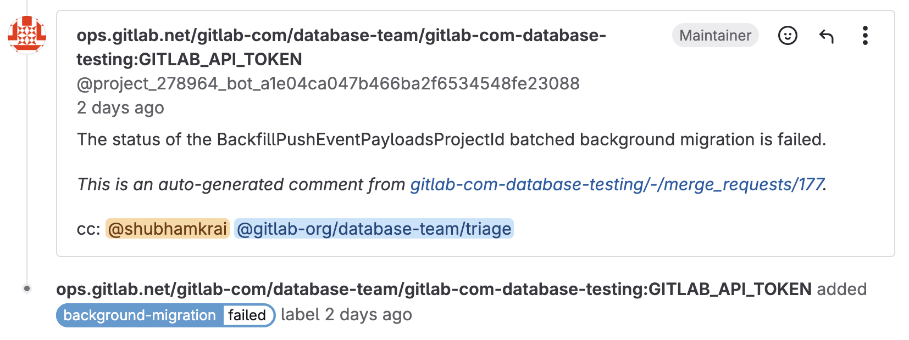

- We can also check the status of the job in `#chat-ops-test` Slack channel, using `/chatops run batched_background_migrations list --job-class-name=<desired_sharding_key_migration_job_name>`.

  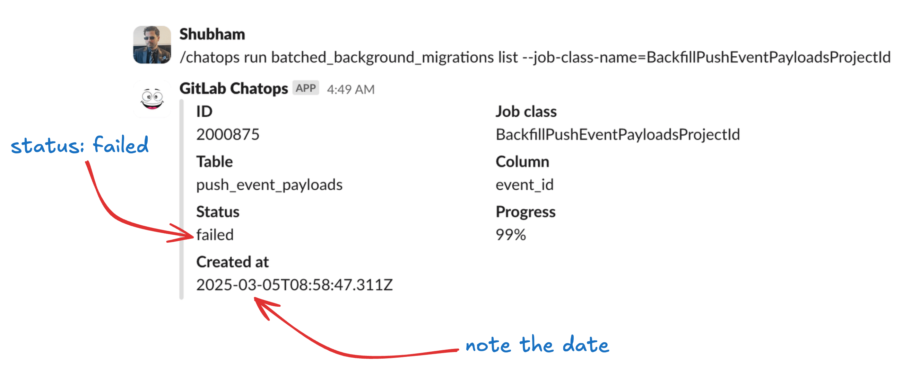

- Let's figure out the reason for failure using [Kibana dashboard](https://log.gprd.gitlab.net/app/discover).

1. Make sure the data view is set to `pubsub-sidekiq-inf-gprd*`.

    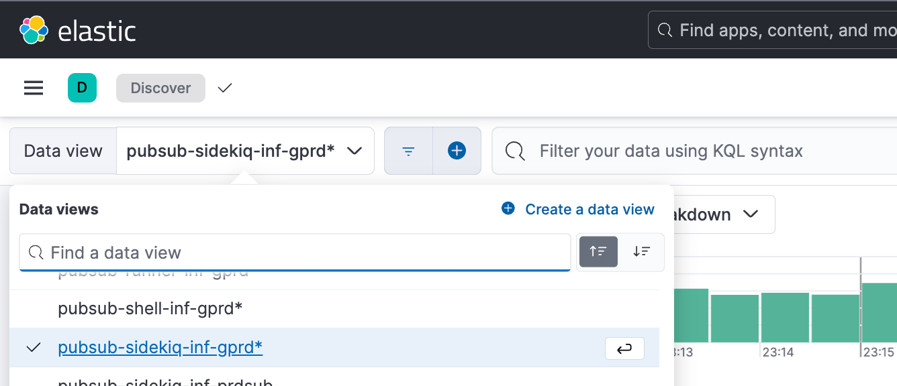

1. On the left side, you can see all the available fields. We only need `json.job_class_name` i.e. desired sharding key migration job name and the `json.new_state: failed`.

    

1. Let's add those filters to get the desired logs.

    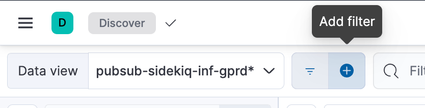

1. Set `json.job_class_name` to `BackfillPushEventPayloadsProjectId` in this case and `json.new_state` to `failed` and apply the filter.

    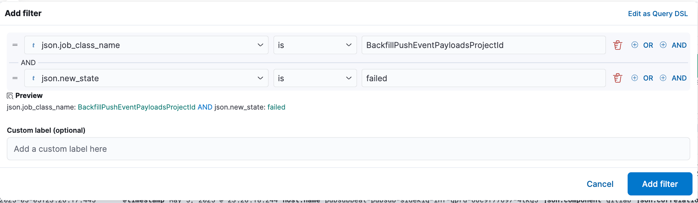

1. Make sure to select the right timeline, since this migration was reported as a failure a few days ago I will filter it to show only the last 7 days.

    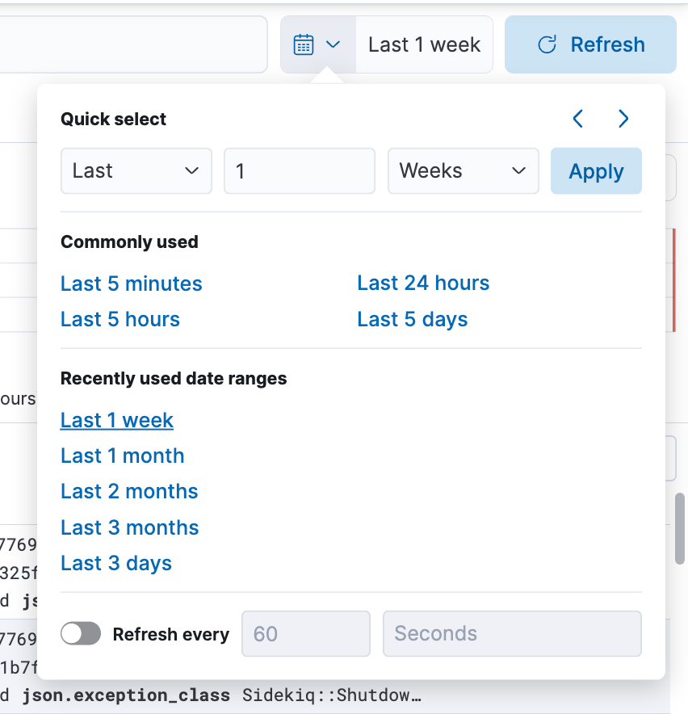

1. After that you will see the desired logs with added filters.

    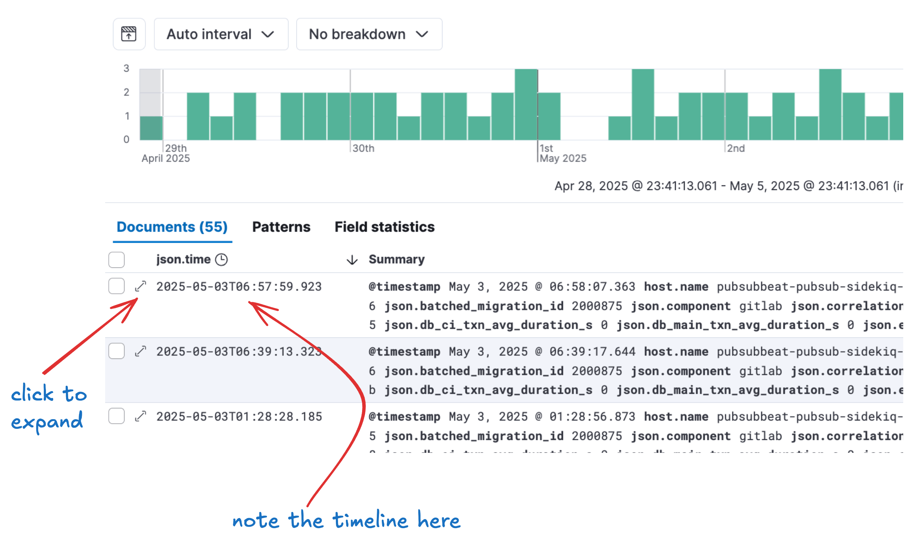

1. Let's expand the logs and find `json.exception_message`.

    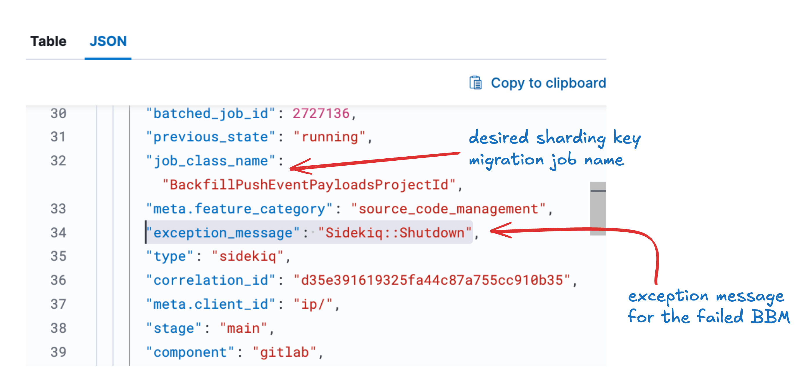

- As you can see this BBM was failed due to `Sidekiq::Shutdown` 😡.

- To fix it, just requeue the migration.

**Using Grafana**

Sometimes you won't find anything on Kibana since we only store logs up to 7 days. For this, we can use the [Grafana dashboard](https://dashboards.gitlab.net/).

Let's take the recent `BackfillApprovalMergeRequestRulesUsersProjectId` BBM failure as an example.

- You'll be tagged on the original MR.

  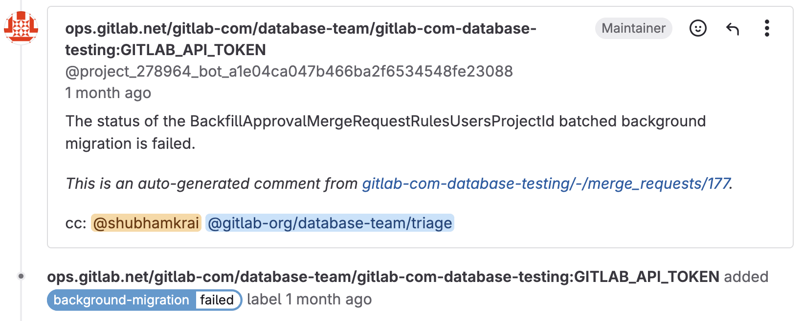

1. We can also check the status of the job in `#chat-ops-test` Slack channel, using `/chatops run batched_background_migrations list --job-class-name=<desired_sharding_key_migration_job_name>`.

    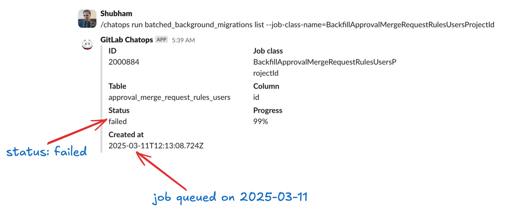

1. Let's check the Kibana dashboard. There are [no logs](https://log.gprd.gitlab.net/app/discover#/view/07cd7a8b-10bb-457c-8d25-3c6d6269e614?_g=h@9751b81&_a=h@ff28b71) for this job.
1. Let's go to the [Grafana dashboard](https://dashboards.gitlab.net/explore).

    

1. Click on `Explore` and add a new query.

    

1. The easiest way to debug sharding key failures is to check the table size anomaly.

    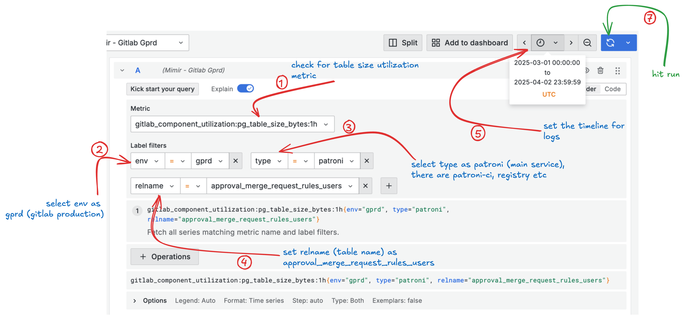

- Metric: `gitlab_component_utilization:pg_table_size_bytes:1h`.
- Label filters:
  - `env: gprd`.
  - `type: patroni`.
  - `relname: approval_merge_request_rules_users`.

1. Timeline: select at least a few days prior to the date of job creation. You can see in the MR that failure was reported on [2025-03-31](https://gitlab.com/gitlab-org/gitlab/-/merge_requests/183354#note_2425371444) and the job was created on **2025-03-11**. I have selected the time range from **2025-03-01** to **2025-04-02**. You can adjust it accordingly.
1. After running the query a graph will be generated within the selected time frame.

    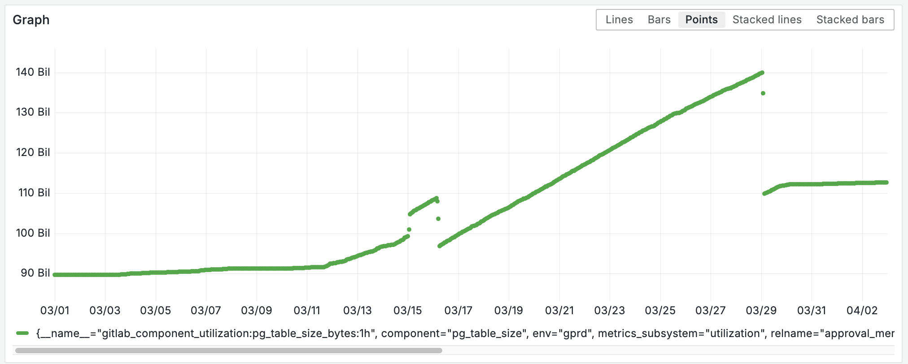

1. Let's make sense of this graph. Backfill job started on **2025-03-11**, you can see a slight increase in table size starting at this date.

    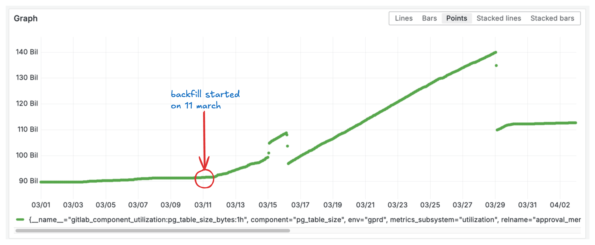

    > This is very normal

1. Let's see the changes we have added in the [post migration](https://gitlab.com/gitlab-org/gitlab/-/merge_requests/183354/diffs#396732f8126545e4961d048dbb6e81c4746b5557_0_11). First we added the `prepare_async` index. Let's check the size on [postgres.ai](https://console.postgres.ai/gitlab/gitlab-production-main/sessions/39129/commands/120292) it's size is 10 GB. It was created on **2025-03-15** at 00:00, as we can see in the spike in the graph.

    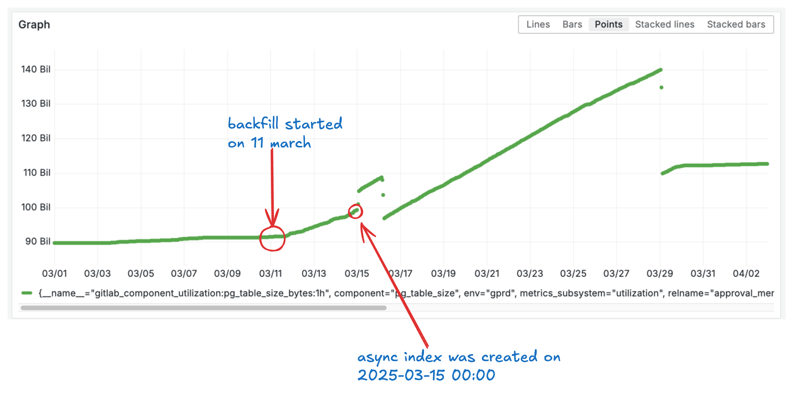

1. Once the index is created, backfill starts.

    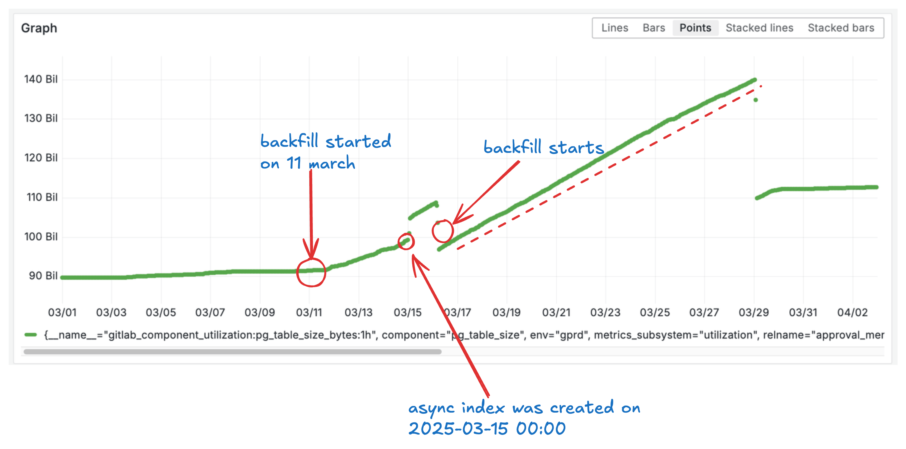

1. The BBM fails on **2025-03-29**, you can see in the graph that at this point, table size dropped.

    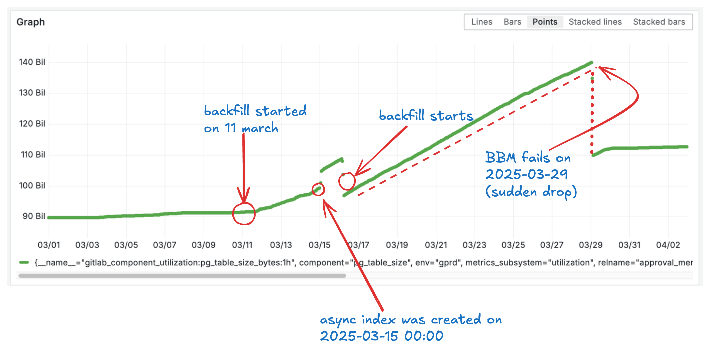

- The index + the column backfill increased the table size to approx ~20 GB compared to before the backfill, an increase of ~22% in table size, from ~90 GB to ~110 GB 🫨.

- We have a goal to keep all tables [under 100 GB](../../database/large_tables_limitations.md).

## Update unresolved, closed issues

Some of the issues linked in the database YAML docs have been closed, sometimes in favor of new issues, but the YAML files still point to the original URL.
You should update these to point to the correct items to ensure we're accurately measuring progress.

## Add more information to sharding issue

Every sharding issue should have an assignee, an associated milestone, and should link to blockers, if applicable.
This helps us plan the work and estimate completion dates. It also ensures each issue names someone to contact in the case of problems or concerns. It also helps us to visualize the project work by highlighting blocker issues so we can help resolve them.

Note that a blocker can be a dependency. For example, the `notes` table needs to be fully migrated before other tables can proceed. Any downstream issues should mark the related item as a blocker to help us understand these relationships.
