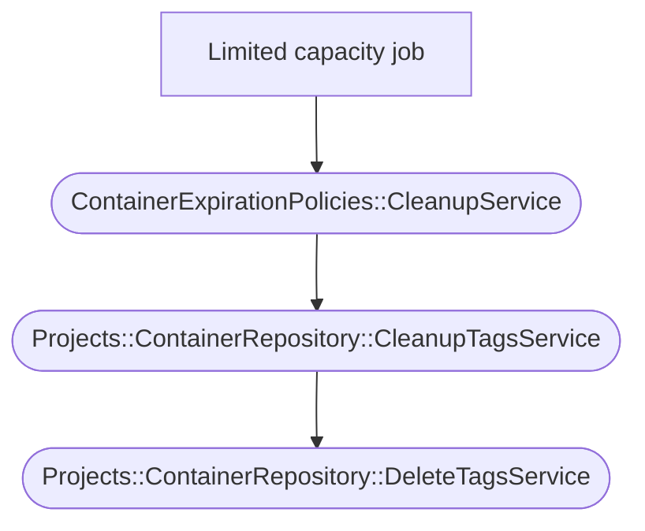

Cleanup policies are recurrent background processes that automatically remove
objects according to some parameters set by users.

## Container registry

Cleanup policies for the container registry work on all the container repositories
hosted in a single project. All tags that match the cleanup parameters are removed.

### Parameters

The [ContainerExpirationPolicy](https://gitlab.com/gitlab-org/gitlab/-/blob/37a76cbfb54a9a3f0dba3c3748eaaac82fb8bf4b/app/models/container_expiration_policy.rb)
holds all parameters for the container registry cleanup policies.

The parameters are split into two groups:

- The parameters that define tags to keep:
  - `keep_n`. Keep the `n` most recent tags.
  - `name_regex_keep`. Keep tags matching this regular expression.
- The parameters that define tags to destroy:
  - `older_than`. Destroy tags older than this timestamp.
  - `name_regex`. Destroy tags matching this regular expression.

The remaining parameters impact when the policy is executed:

- `enabled`. Defines if the policy is enabled or not.
- `cadence`. Defines the execution cadence of the policy.
- `next_run_at`. Defines when the next execution should happen.

### Execution

Due to the large number of policies we need to process on GitLab.com, the execution
follows this design.

- Policy executions are limited in time.
- Policy executions are either complete or partial.
- The background jobs will consider the next job to be executed based on two priorities:
  - Policy with a `next_run_at` in the past.
  - Partially executed policies.

To track the cleanup policy status on a container repository,
we have an `expiration_policy_cleanup_status` on the `ContainerRepository`
model.

Background jobs for this execution are organized on:

- A cron background job that runs every hour.
- A set of background jobs that will loop on container repositories that need
  a policy execution.

#### The cron background job

The [cron background job](https://gitlab.com/gitlab-org/gitlab/-/blob/36454d77a8de76a25896efd7c051d6796985f579/app/workers/container_expiration_policy_worker.rb)
is quite simple.
Its main tasks are:

1. Check if there are any container repositories in need of a cleanup. If any,
   enqueue as many limited capacity jobs as necessary, up to a limit.
1. Compute metrics for cleanup policies and log them.

#### The limited capacity job

This [job](https://gitlab.com/gitlab-org/gitlab/-/blob/36454d77a8de76a25896efd7c051d6796985f579/app/workers/container_expiration_policies/cleanup_container_repository_worker.rb)
is based on the [limited capacity concern](../sidekiq/limited_capacity_worker.md).

This job will run in parallel up to [a specific capacity](settings.md#container-registry).

The primary responsibility of this job is to select the next container
repository that requires cleaning and call the related service on it.

This is where the two priorities are evaluated in order. If a container repository
is found, the cleanup service is called on it.

To ensure that only one cleaning is executed on a given container repository
at any time, we use a database lock along with the
`expiration_policy_cleanup_status` column.

This job will re-enqueue itself until no more container repositories require cleanup.

#### Services

Here is the services call that will happen from the limited capacity job:

- [`ContainerExpirationPolicies::CleanupService`](https://gitlab.com/gitlab-org/gitlab/-/blob/6546ffc6fe4e9b447a1b7f050edddb8926fe4a3d/app/services/container_expiration_policies/cleanup_service.rb).
  This service mainly deals with container repository `expiration_policy_cleanup_status`
  updates and will call the cleanup tags service.
- [`Projects::ContainerRepository::CleanupTagsService`](https://gitlab.com/gitlab-org/gitlab/-/blob/f23d70b7d638c38d71af102cfd32a3f6751596f9/app/services/projects/container_repository/cleanup_tags_service.rb).
  This service receives the policy parameters and builds the list of tags to
  destroy on the container registry.
- [`Projects::ContainerRepository::DeleteTagsService`](https://gitlab.com/gitlab-org/gitlab/-/blob/f23d70b7d638c38d71af102cfd32a3f6751596f9/app/services/projects/container_repository/delete_tags_service.rb).
  This service receives a list of tags and loops on that list. For each tag,
  the service will call the container registry API endpoint to destroy the target tag.

The cleanup tags service uses a very specific [execution order](../../user/packages/container_registry/reduce_container_registry_storage.md#how-the-cleanup-policy-works)
to build the list of tags to destroy.

Lastly, the cleanup tags service and delete tags service work using facades.
The actual implementation depends on the type of container registry connected.
If the GitLab container registry is connected, several improvements are available
and used during cleanup policies execution, such as [better use of the container registry API](https://gitlab.com/groups/gitlab-org/-/epics/8379).

### Historic reference links

- [First iteration](https://gitlab.com/gitlab-org/gitlab/-/issues/15398)
- [Throttling policy executions](https://gitlab.com/gitlab-org/gitlab/-/issues/208193)
- [Adding caching](https://gitlab.com/gitlab-org/gitlab/-/issues/339129)
- [Further improvements](https://gitlab.com/groups/gitlab-org/-/epics/8379)
