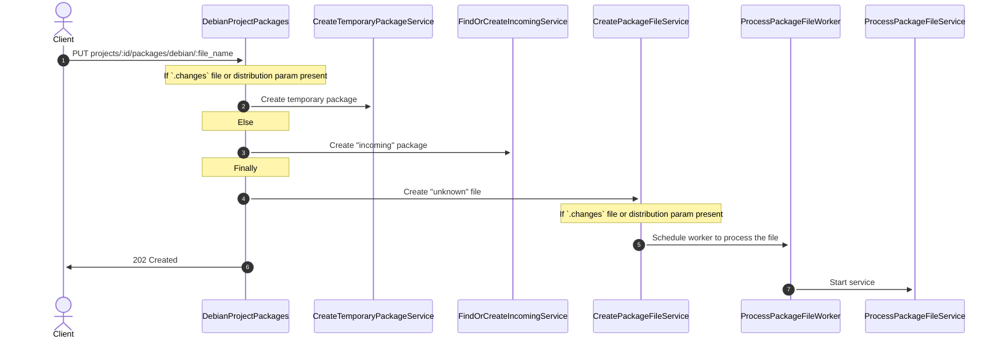
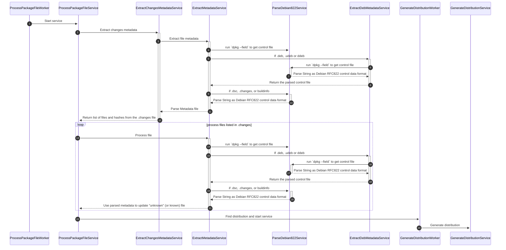
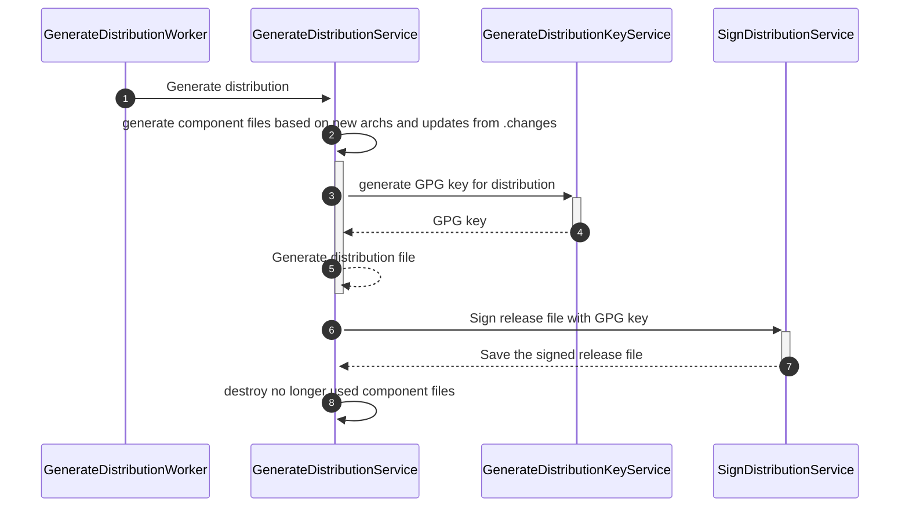

This guide explains:

1. A basic overview of how Debian packages are structured
1. What package managers, clients, and tools are used to manage Debian packages
1. How the GitLab Debian repository functions

## Debian package basics

There are two types of [Debian packages](https://www.debian.org/doc/manuals/debian-faq/pkg-basics.en.html): binary and source.

- **Binary** - These are usually `.deb` files and contain executables, config files, and other data. A binary package must match your OS or architecture since it is already compiled. These are usually installed using `dpkg`. Dependencies must already exist on the system when installing a binary package.
- **Source** - These are usually made up of `.dsc` files and compressed `.tar` files. A source package may be compiled on your system.

Packages are fetched with [`apt`](https://manpages.debian.org/bullseye/apt/apt.8.en.html) and installed with `dpkg`. When you use `apt`, it also fetches and installs any dependencies.

The `.deb` file follows the naming convention `<PackageName>_<VersionNumber>-<DebianRevisionNumber>_<DebianArchitecture>.deb`.

It includes a `control file` that contains metadata about the package. You can view the control file by using `dpkg --info <deb_file>`.

The [`.changes` file](https://www.debian.org/doc/debian-policy/ch-controlfields.html#debian-changes-files-changes) is used to tell the Debian repository how to process updates to packages. It contains a variety of metadata for the package, including architecture, distribution, and version. In addition to the metadata, they contain three lists of checksums: `sha1`, `sha256`, and `md5` in the `Files` section. Refer to [sample_1.2.3~alpha2_amd64.changes](https://gitlab.com/gitlab-org/gitlab/-/blob/dd1e70d3676891025534dc4a1e89ca9383178fe7/spec/fixtures/packages/debian/sample_1.2.3~alpha2_amd64.changes) for an example of how these files are structured.

## How do people get Debian packages?

While you can download a single `.deb` file and install it with [`dpkg`](https://manpages.debian.org/bullseye/dpkg/dpkg.1.en.html), most users consume Debian packages with [`apt`](https://manpages.debian.org/bullseye/apt/apt.8.en.html) using `apt-get`. `apt` wraps `dpkg`, adding dependency management and compilation.

## How do people publish Debian packages?

It is not uncommon to use `curl` to publish packages depending on the type of Debian repository you are working with. However, `dput-ng` is the best tool to use as it will upload the relevant files based on the `.changes` file.

## What is all this distribution business?

When it comes to Debian, packages don't exist on their own. They belong to a _distribution_. This can mean many things, but the main thing to note is users are used to having to specify the distribution.

## What does a Debian Repository look like?

- A [Debian repository](https://wiki.debian.org/DebianRepository) is made up of many releases.
- Each release is given a stable **codename**. For the public Debian repository, these are names like "bullseye" and "jessie".
  - There is also the concept of **suites** which are essentially aliases of codenames synonymous with release channels like "stable" and "edge". Over time they change and point to different _codenames_.
- Each release has many **components**. In the public repository, these are "main", "contrib", and "non-free".
- Each release has many **architectures** such as "amd64", "arm64", or "i386".
- Each release has a signed **Release** file (see below about [GPG signing](#what-are-gpg-keys-and-what-are-signed-releases))

A standard directory-based Debian repository would be organized as:

```plaintext
dists\
      |--jessie/
      |--bullseye\
                  |Changelog
                  |Release
                  |InRelease
                  |Release.gpg
                  |--main\
                          |--amd64\
                          |--arm64\
                  |--contrib\
                  |--non-free\
pool\
     |--this is where the .deb files for all releases live
```

You can explore a mirror of the public Debian repository here: <http://ftp.us.debian.org/debian/>

In the public Debian repository, the entire directory structure, release files, GPG keys, and other files are all generated by a series of scripts called the [Debian Archive Kit, or dak](https://salsa.debian.org/ftp-team/dak).

In the GitLab Debian repository, we don't deal with specific file directories. Instead, we use code and an underlying [PostgreSQL database to organize the relationships](structure.md#debian-packages) between these different pieces.

## What does a Debian Repository do?

The Debian community created many package repository systems before things like object storage existed, and they used FTP to upload artifacts to a remote server. Most current package repositories and registries are just directories on a server somewhere. Packages added to the [official Debian distribution](https://www.debian.org/distrib/packages) exist in a central public repository that a group of open source maintainers curates. The package maintainers use the [Debian Archive Kit, or dak](https://salsa.debian.org/ftp-team/dak) scripts to generate release files and do other maintenance tasks. So, in addition to storing and serving files, a complete Debian repository needs to accomplish the same behavior that dak provides. This behavior is what the GitLab Debian registry aims to do.

## What are GPG keys, and what are signed releases

A [GPG key](https://www.gnupg.org/) is a public/private key pair for secure data transmission. Similar to an SSH key, there is a private and public key. Whoever has the _public key can encrypt data_, and whoever has the _private key can decrypt data_ that was encrypted using the public key. You can also use GPG keys to sign data. Whoever has the private key can sign data or a file, and whoever has the public key can then check the signature and trust it came from the person with the matching private key.

We use GPG to sign the release file for the Debian packages. The release file is an index of all packages within a given distribution and their respective digests.

In the GitLab Debian registry, a background process generates a new release file whenever a user publishes a new package to their Debian repository. A GPG key is created for each distribution. If a user requests a release for that distribution, they can request the signed version and the public GPG key to verify the authenticity of that release file.

## GitLab repository internals

When a [file upload](../../api/packages/debian.md#upload-a-package-file) occurs:

1. A new "incoming" package record is found or created. All new files are assigned to the "incoming" package. It is a holding area used until we know what package the file is actually associated with.
1. A new "unknown" file is stored. It is unknown because we do not yet know if this file belongs to an existing package or not.

Once we know which package the file belongs to, it is associated with that package, and the "incoming" package is removed if no more files remain. The "unknown" status of the file is updated to the correct file type.

Next, if the file is a `.changes` format:

1. The `.changes` file is parsed and any files listed within it are updated. All uploaded non-`.changes` files are correctly associated with various distributions and packages.
1. The `::Packages::Debian::GenerateDistributionWorker` and thus `::Packages::Debian::GenerateDistributionService` are run.
   1. Component files are created or updated. Since we just updated package files that were listed in the `.changes` file, we now check the component/architecture files based on the changed checksum values.
   1. A new release is generated:
      1. A new GPG key is generated if one does not already exist for the distribution
      1. A [Release file](https://wiki.debian.org/DebianRepository/Format#A.22Release.22_files) is written, signed by the GPG key, and then stored.
   1. Old component files are destroyed.

The three following diagrams show the path taken after a file is uploaded to the Debian API:



`ProcessPackageFileWorker` background job:



`GenerateDistributionWorker` background job:



### Distributions

You must create a distribution before publishing a package to it. When you create or update a distribution using the project or group distribution API, in addition to creating the initial backing records in the database, the `GenerateDistributionService` run as shown in the above sequence diagram.
