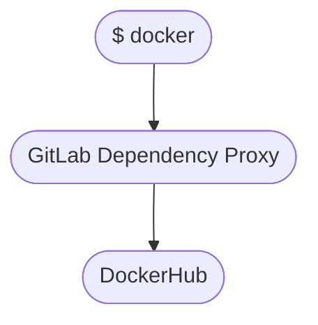
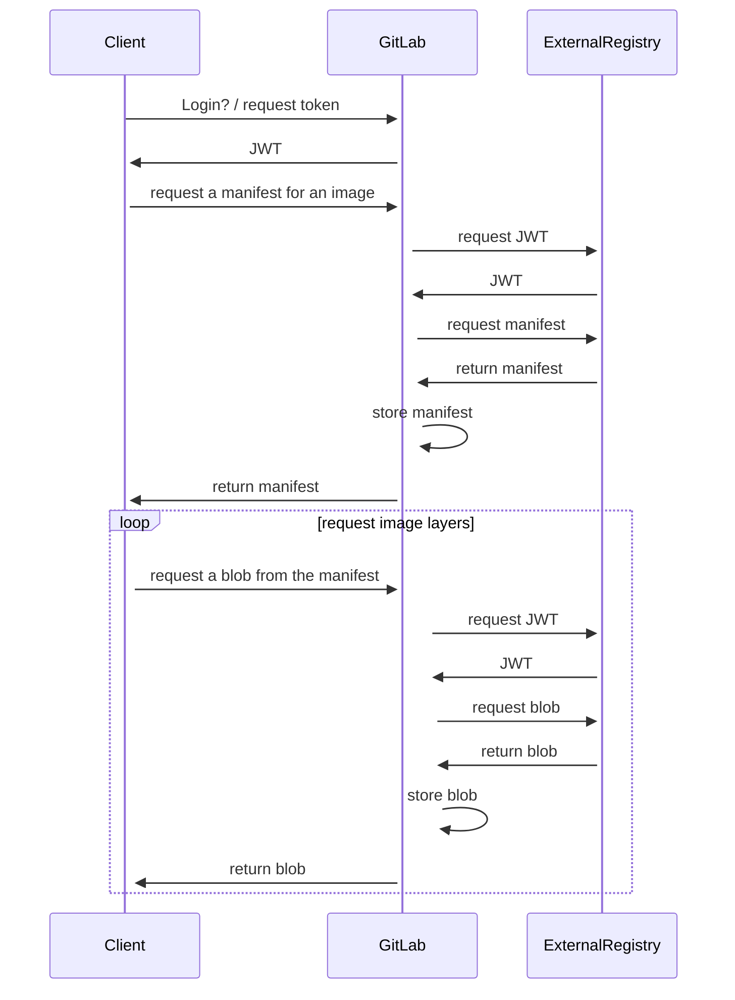
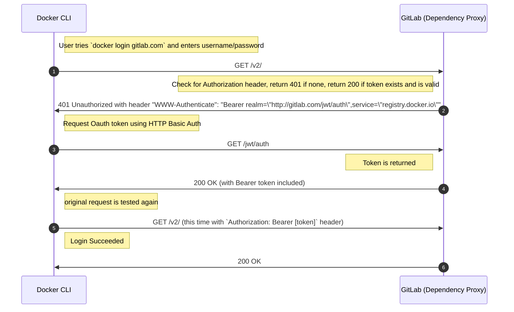
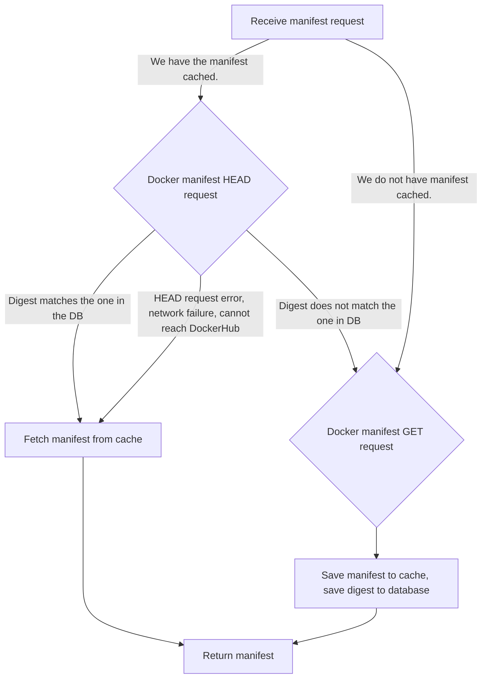
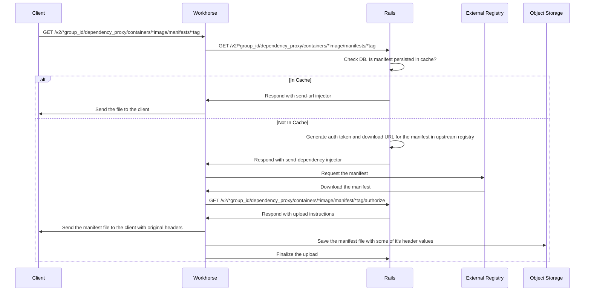

The Dependency Proxy is a pull-through-cache for public registry images from DockerHub. This document describes how this
feature is constructed in GitLab.

NOTE:
Support for private registry images is proposed in [issue 331741](https://gitlab.com/gitlab-org/gitlab/-/issues/331741).

## Container registry

The Dependency Proxy for the container registry acts a stand-in for a remote container registry. In our case,
the remote registry is the public DockerHub registry.

From the user's perspective, the GitLab instance is just a container registry that they are interacting with to
pull images by using `docker login gitlab.com`

When you use `docker login gitlab.com`, the Docker client uses the [v2 API](https://distribution.github.io/distribution/spec/api/)
to make requests.

To support authentication, we must include one route:

- [API Version Check](https://distribution.github.io/distribution/spec/api/#api-version-check)

To support `docker pull` requests, we must include two additional routes:

- [Pulling an image manifest](https://distribution.github.io/distribution/spec/api/#pulling-an-image-manifest)
- [Pulling an image layer (blob)](https://distribution.github.io/distribution/spec/api/#pulling-a-layer)

These routes are defined in [`gitlab-org/gitlab/config/routes/group.rb`](https://gitlab.com/gitlab-org/gitlab/-/blob/3f76455ac9cf90a927767e55c837d6b07af818df/config/routes/group.rb#L164-175).

In its simplest form, the Dependency Proxy manages three requests:

- Logging in / returning a JWT
- Fetching a manifest
- Fetching a blob

Here is what the general request sequence looks like for the Dependency Proxy:

### Authentication and authorization

When a Docker client authenticates with a registry, the registry tells the client where to get a JSON Web Token
(JWT) and to use it for all subsequent requests. This allows the authentication service to live in a separate
application from the registry. For example, the GitLab container registry directs Docker clients to get a token
from `https://gitlab.com/jwt/auth`. This endpoint is part of the `gitlab-org/gitlab` project, also known as the
rails project or web service.

When a user tries to sign in to the dependency proxy with a Docker client, we must tell it where to get a JWT. We
can use the same endpoint we use with the container registry: `https://gitlab.com/jwt/auth`. But in our case,
we tell the Docker client to specify `service=dependency_proxy` in the parameters so can use a separate underlying
service to generate the token.

This sequence diagram shows the request flow for logging into the Dependency Proxy.

The dependency proxy uses its own authentication service, separate from the authentication managed by the UI
(`ApplicationController`) and API (`ApiGuard`). Once the service has created a JWT, the `DependencyProxy::ApplicationController`
manages authentication and authorization for the rest of the requests. It manages the user by using `GitLab::Auth::Result` and
is similar to the authentication implemented by the Git client requests in `GitHttpClientController`.

### Caching

Blobs are cached artifacts with no logic around them. We cache them by digest. When we receive a request for a new blob,
we check to see if we have a blob with the requested digest, and return it. Otherwise we fetch it from the external
registry and cache it.

Manifests are more complicated, partially due to [rate limiting on DockerHub](https://www.docker.com/increase-rate-limits/).
A manifest is essentially a recipe for creating an image. It has a list of blobs to create a certain image. So
`alpine:latest` has a manifest associated with it that specifies the blobs needed to create the `alpine:latest`
image. The interesting part is that `alpine:latest` can change over time, so we can't just cache the manifest and
assume it is OK to use forever. Instead, we must check the digest of the manifest, which is an ETag. This gets
interesting because the requests for manifests often don't include the digest. So how do we know if the manifest
we have cached is still the most up-to-date `alpine:latest`? DockerHub allows free HEAD requests that don't count
toward their rate limit. The HEAD request returns the manifest digest so we can tell whether or not the one we
have is stale.

With this knowledge, we have built the following logic to manage manifest requests:

### Workhorse for file handling

Management of file uploads and caching happens in [Workhorse](../workhorse/_index.md). This explains the additional
[`POST` routes](https://gitlab.com/gitlab-org/gitlab/-/blob/3f76455ac9cf90a927767e55c837d6b07af818df/config/routes/group.rb#L170-173)
that we have for the Dependency Proxy.

The [`send_dependency`](https://gitlab.com/gitlab-org/gitlab/-/blob/7359d23f4e078479969c872924150219c6f1665f/app/helpers/workhorse_helper.rb#L46-53)
method makes a request to Workhorse including the previously fetched JWT from the external registry. Workhorse then
can use that token to request the manifest or blob the user originally requested. The Workhorse code lives in
[`workhorse/internal/dependencyproxy/dependencyproxy.go`](https://gitlab.com/gitlab-org/gitlab/-/blob/b8f44a8f3c26efe9932c2ada2df75ef7acb8417b/workhorse/internal/dependencyproxy/dependencyproxy.go#L4).

Once we put it all together, the sequence for requesting an image file looks like this:

### Cleanup policies

The cleanup policies for the Dependency Proxy work as time-to-live policies. They allow users to set the number
of days a file is allowed to remain cached if it has been unread. Since there is no way to associate the blobs
with the images they belong to (to do this, we would need to build the metadata database that the container registry
folks built), we can set up rules like "if this blob has not been pulled in 90 days, delete it". This means that
any files that are continuously getting pulled will not be removed from the cache, but if, for example,
`alpine:latest` changes and one of the underlying blobs is no longer used, it will eventually get cleaned up
because it has stopped getting pulled. We use the `read_at` attribute to track the last time a given
`dependency_proxy_blob` or `dependency_proxy_manifest` was pulled.

These work using a cron worker, [DependencyProxy::CleanupDependencyProxyWorker](https://gitlab.com/gitlab-org/gitlab/-/blob/7359d23f4e078479969c872924150219c6f1665f/app/workers/dependency_proxy/cleanup_dependency_proxy_worker.rb#L4),
that will kick off two [limited capacity](../sidekiq/limited_capacity_worker.md) workers: one to delete blobs,
and one to delete manifests. The capacity is set in an [application setting](settings.md#container-registry).

### Historic reference links

- [Dependency proxy for private groups](https://gitlab.com/gitlab-org/gitlab/-/merge_requests/46042) - initial authentication implementation
- [Manifest caching](https://gitlab.com/gitlab-org/gitlab/-/issues/241639) - initial manifest caching implementation
- [Workhorse for blobs](https://gitlab.com/gitlab-org/gitlab/-/merge_requests/71890) - initial workhorse implementation
- [Workhorse for manifest](https://gitlab.com/gitlab-org/gitlab/-/merge_requests/73033) - moving manifest cache logic to Workhorse
- [Deploy token support](https://gitlab.com/gitlab-org/gitlab/-/merge_requests/64363) - authorization largely updated
- [SSO support](https://gitlab.com/gitlab-org/gitlab/-/merge_requests/67373) - changes how policies are checked
