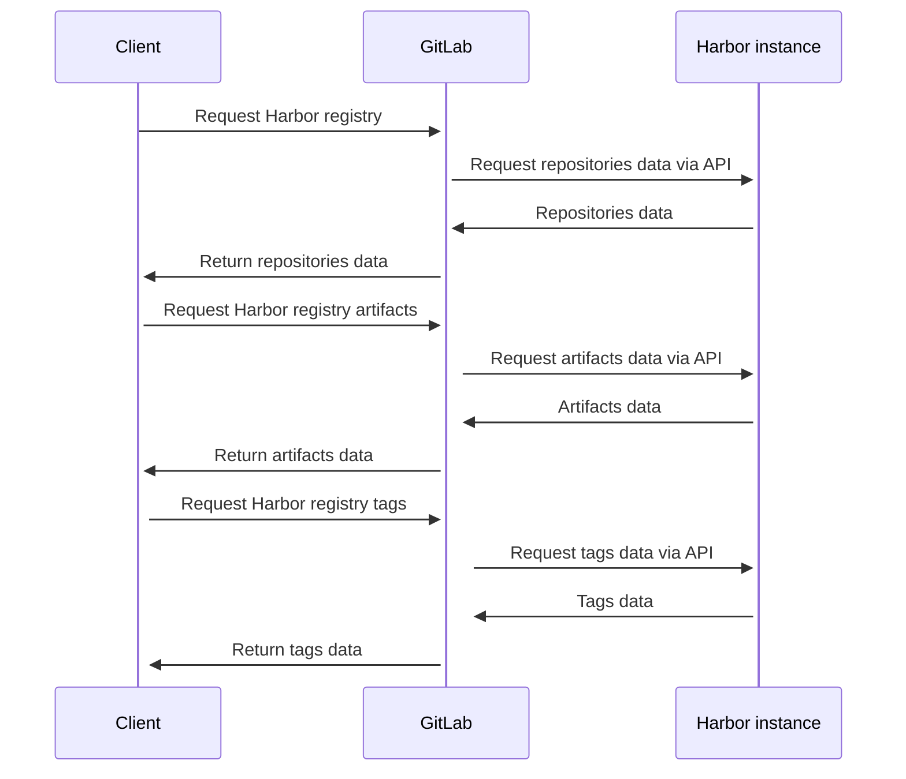

## Enable Harbor registry

To enable the Harbor registry, you must configure the Harbor integration for your group or project.
The Harbor configuration requires four fields: `url`, `project_name`, `username` and `password`.

| Field | Description |
| --- | --- |
| `url` | The URL of the Harbor instance. |
| `project_name` | The project name of the Harbor instance. |
| `username` | The username used to sign in to the Harbor instance. |
| `password` | The password used to sign in to the Harbor instance. |

You can use [GitLab CI/CD predefined variables](../../ci/variables/_index.md) along with the following Harbor registry variables to request data from the Harbor instance.

| Variable | Description |
| --- | --- |
| `HARBOR_URL` | The URL of the Harbor instance. |
| `HARBOR_HOST` | The host of the Harbor instance URL. |
| `HARBOR_OCI` | The OCI URL of the Harbor instance URL. |
| `HARBOR_PROJECT` | The project name of the Harbor instance. |
| `HARBOR_USERNAME` | The username used to sign in to the Harbor instance. |
| `HARBOR_PASSWORD` | The password used to sign in to the Harbor instance. |

### Test settings

When testing the settings, a request is sent to `/api/v2.0/ping` of the Harbor instance. A successful test returns status code `200`. This test is primarily to verify that the Harbor instance is configured correctly. It doesn't verify that the `username` and `password` are correct.

## Code structure

```shell
app/controllers/concerns/harbor
├── access.rb
├── artifact.rb
├── repository.rb
└── tag.rb

app/controllers/projects/harbor
├── application_controller.rb
├── artifacts_controller.rb
├── repositories_controller.rb
└── tags_controller.rb

app/controllers/groups/harbor
├── application_controller.rb
├── artifacts_controller.rb
├── repositories_controller.rb
└── tags_controller.rb

app/models/integrations/harbor.rb

app/serializers/integrations/harbor_serializers
├── artifact_entity.rb
├── artifact_serializer.rb
├── repository_entity.rb
├── repository_serializer.rb
├── tag_entity.rb
└── tag_serializer.rb

lib/gitlab/harbor
├── client.rb
└── query.rb
```

The controllers under `app/controllers/projects/harbor` and `app/controllers/groups/harbor` provide the API interface for front-end calls.

The modules under `app/controllers/concerns/harbor` provide some common methods used by controllers.

The Harbor integration model is under `app/models/integrations`, and it contains some configuration information for Harbor integration.

The serializers under `app/serializers/integrations/harbor_serializers` are used by the controllers under `app/controllers/projects/harbor` and `app/controllers/groups/harbor`, and they help controllers to serialize the JSON data in the response.

The `lib/gitlab/harbor` directory contains the Harbor client, which sends API requests to the Harbor instances to retrieve data.

## Sequence diagram



## Policy

The`read_harbor_registry` policy for groups and projects is used to control whether users have access to Harbor registry.
This policy is enabled for every user with at least the Reporter role.

## Frontend Development

The relevant front-end code is located in the `app/assets/javascripts/packages_and_registries/harbor_registry/` directory. The file structure is as follows:

```shell
├── components
│   ├── details
│   │   ├── artifacts_list_row.vue
│   │   ├── artifacts_list.vue
│   │   └── details_header.vue
│   ├── list
│   │   ├── harbor_list_header.vue
│   │   ├── harbor_list_row.vue
│   │   └── harbor_list.vue
│   ├── tags
│   │   ├── tags_header.vue
│   │   ├── tags_list_row.vue
│   │   └── tags_list.vue
│   └── harbor_registry_breadcrumb.vue
├── constants
│   ├── common.js
│   ├── details.js
│   ├── index.js
│   └── list.js
├── pages
│   ├── details.vue
│   ├── harbor_tags.vue
│   ├── index.vue
│   └── list.vue
├── index.js
├── router.js
└── utils.js
```

NOTE:
You can check out this [discussion](https://gitlab.com/gitlab-org/gitlab/-/merge_requests/82777#note_1017875324) to see why we use the REST API instead of GraphQL.

The file `harbor_registry/pages/index.vue` only contains a single Vue router-view component, which goes to the `images list`, `image detail`, and `tags list` pages via `router.js`.

Because `registry_breadcrumb.vue` component does not support multi-level paths, we have reimplemented the `harbor_registry/components/harbor_registry_breadcrumb.vue` component.

A multi-level breadcrumb component can be generated by passing a path array to `harbor_registry_breadcrumb.vue`.

```javascript
const routeNameList = [];
const hrefList = [];

this.breadCrumbState.updateName(nameList);
this.breadCrumbState.updateHref(hrefList);
```
