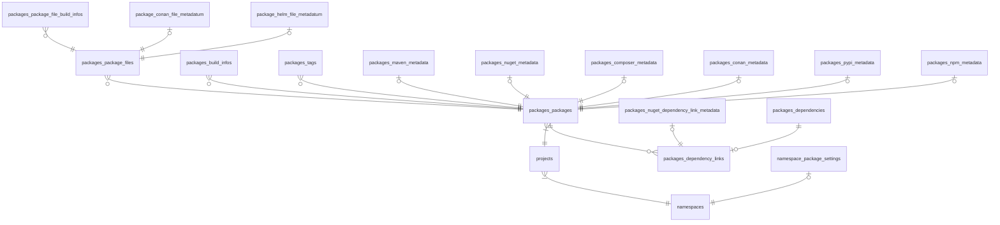
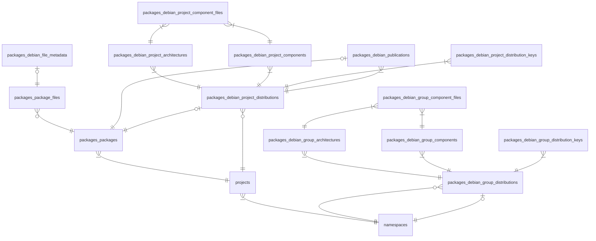
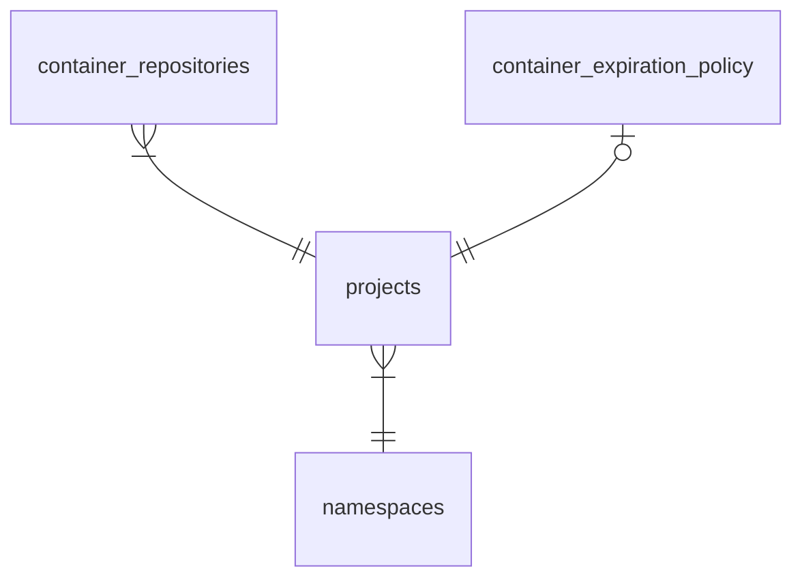
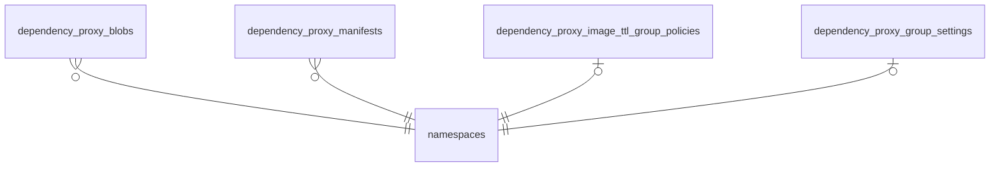

## Package registry

```mermaid
erDiagram
        projects }|--|| namespaces : ""
        packages_package_files }o--|| packages_packages : ""
        packages_package_file_build_infos }o--|| packages_package_files : ""
        packages_build_infos }o--|| packages_packages : ""
        packages_tags }o--|| packages_packages : ""
        packages_packages }|--|| projects : ""
        packages_maven_metadata |o--|| packages_packages : ""
        packages_nuget_metadata |o--|| packages_packages : ""
        packages_composer_metadata |o--|| packages_packages : ""
        packages_conan_metadata |o--|| packages_packages : ""
        packages_pypi_metadata |o--|| packages_packages : ""
        packages_npm_metadata |o--|| packages_packages : ""
        package_conan_file_metadatum |o--|| packages_package_files : ""
        package_helm_file_metadatum |o--|| packages_package_files : ""
        packages_nuget_dependency_link_metadata |o--|| packages_dependency_links: ""
        packages_dependencies ||--o| packages_dependency_links: ""
        packages_packages ||--o{ packages_dependency_links: ""
        namespace_package_settings |o--|| namespaces: ""
```

### Debian packages

Debian contains a higher number of dedicated tables, so it is displayed here separately:

```mermaid
erDiagram
        projects }|--|| namespaces : ""
        packages_packages }|--|| projects : ""
        packages_package_files }o--|| packages_packages : ""
        packages_debian_group_architectures }|--|| packages_debian_group_distributions : ""
        packages_debian_group_component_files }|--|| packages_debian_group_components : ""
        packages_debian_group_component_files }|--|| packages_debian_group_architectures : ""
        packages_debian_group_components }|--|| packages_debian_group_distributions : ""
        packages_debian_group_distribution_keys }|--|| packages_debian_group_distributions : ""
        packages_debian_group_distributions }o--|| namespaces : ""
        packages_debian_project_architectures }|--|| packages_debian_project_distributions : ""
        packages_debian_project_component_files }|--|| packages_debian_project_components : ""
        packages_debian_project_component_files }|--|| packages_debian_project_architectures : ""
        packages_debian_project_components }|--|| packages_debian_project_distributions : ""
        packages_debian_project_distribution_keys }|--|| packages_debian_project_distributions : ""
        packages_debian_project_distributions }o--|| projects : ""
        packages_debian_publications }|--|| packages_debian_project_distributions : ""
        packages_debian_publications |o--|| packages_packages : ""
        packages_debian_project_distributions |o--|| packages_packages : ""
        packages_debian_group_distributions |o--|| namespaces : ""
        packages_debian_file_metadata |o--|| packages_package_files : ""
```

## Container registry

```mermaid
erDiagram
        projects }|--|| namespaces : ""
        container_repositories }|--|| projects : ""
        container_expiration_policy |o--|| projects : ""
```

## Dependency Proxy

```mermaid
erDiagram
        dependency_proxy_blobs }o--|| namespaces : ""
        dependency_proxy_manifests }o--|| namespaces : ""
        dependency_proxy_image_ttl_group_policies |o--|| namespaces : ""
        dependency_proxy_group_settings |o--|| namespaces : ""
```
