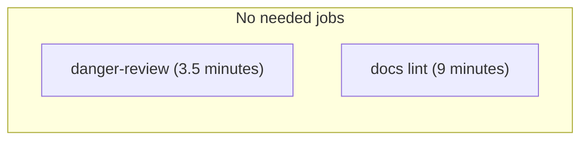
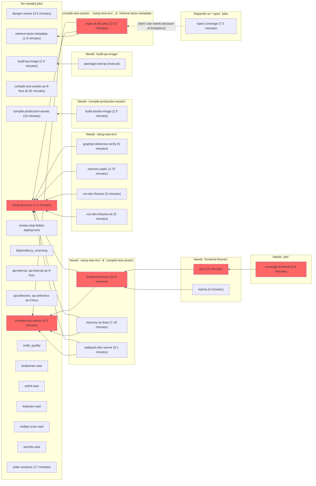
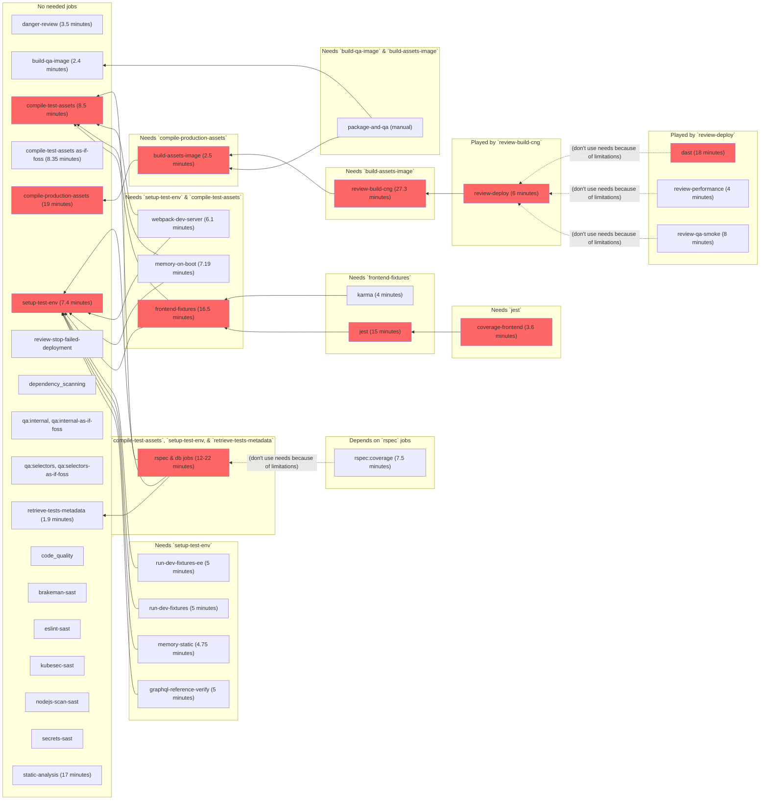
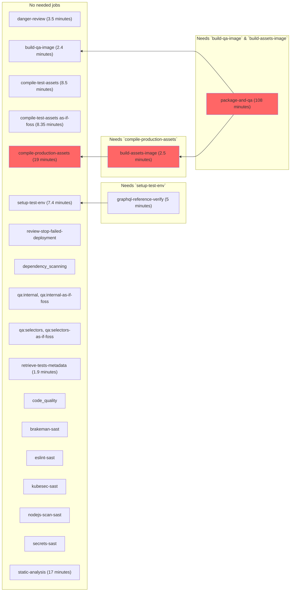
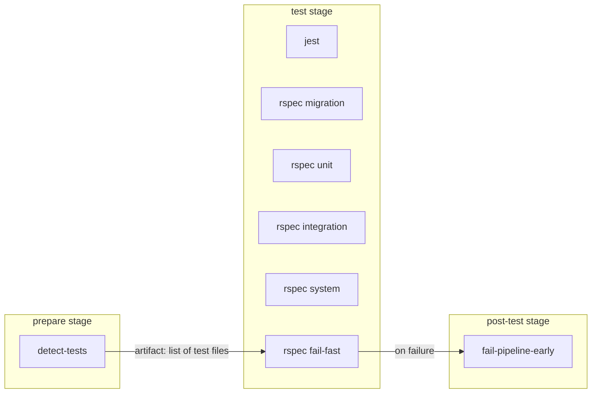

# Pipelines for the GitLab project

Pipelines for <https://gitlab.com/gitlab-org/gitlab> and <https://gitlab.com/gitlab-org/gitlab-foss> (as well as the
`dev` instance's mirrors) are configured in the usual
[`.gitlab-ci.yml`](https://gitlab.com/gitlab-org/gitlab/blob/master/.gitlab-ci.yml)
which itself includes files under
[`.gitlab/ci/`](https://gitlab.com/gitlab-org/gitlab/tree/master/.gitlab/ci)
for easier maintenance.

We're striving to [dogfood](https://about.gitlab.com/handbook/engineering/#dogfooding)
GitLab [CI/CD features and best-practices](../ci/yaml/README.md)
as much as possible.

## Overview

Pipelines for the GitLab project are created using the [`workflow:rules` keyword](../ci/yaml/README.md#workflowrules)
feature of the GitLab CI/CD.

Pipelines are always created for the following scenarios:

- `master` branch, including on schedules, pushes, merges, and so on.
- Merge requests.
- Tags.
- Stable, `auto-deploy`, and security branches.

Pipeline creation is also affected by the following CI variables:

- If `$FORCE_GITLAB_CI` is set, pipelines are created.
- If `$GITLAB_INTERNAL` is not set, pipelines are not created.

No pipeline is created in any other cases (for example, when pushing a branch with no
MR for it).

The source of truth for these workflow rules is defined in <https://gitlab.com/gitlab-org/gitlab/blob/master/.gitlab-ci.yml>.

### Pipelines for Merge Requests

In general, pipelines for an MR fall into one or more of the following types,
depending on the changes made in the MR:

- [Docs-only MR pipeline](#docs-only-mr-pipeline): This is typically created for an MR that only changes documentation.
- [Code-only MR pipeline](#code-only-mr-pipeline): This is typically created for an MR that only changes code, either backend or frontend.
- [Frontend-only MR pipeline](#frontend-only-mr-pipeline): This is typically created for an MR that only changes frontend code.
- [QA-only MR pipeline](#qa-only-mr-pipeline): This is typically created for an MR that only changes end to end tests related code.

We use the [`rules:`](../ci/yaml/README.md#rules) and [`needs:`](../ci/yaml/README.md#needs) keywords extensively
to determine the jobs that need to be run in a pipeline. Note that an MR that includes multiple types of changes would
have a pipelines that include jobs from multiple types (e.g. a combination of docs-only and code-only pipelines).

#### Docs-only MR pipeline

Reference pipeline: <https://gitlab.com/gitlab-org/gitlab/pipelines/135236627>



#### Code-only MR pipeline

Reference pipeline: <https://gitlab.com/gitlab-org/gitlab/pipelines/136295694>



#### Frontend-only MR pipeline

Reference pipeline: <https://gitlab.com/gitlab-org/gitlab/pipelines/134661039>



#### QA-only MR pipeline

Reference pipeline: <https://gitlab.com/gitlab-org/gitlab/pipelines/134645109>



### Fail-fast pipeline in Merge Requests

To provide faster feedback when a Merge Request breaks existing tests, we are experimenting with a
fail-fast mechanism.

An `rspec fail-fast` job is added in parallel to all other `rspec` jobs in a Merge
Request pipeline. This job runs the tests that are directly related to the changes
in the Merge Request.

If any of these tests fail, the `rspec fail-fast` job fails, triggering a
`fail-pipeline-early` job to run. The `fail-pipeline-early` job:

- Cancels the currently running pipeline and all in-progress jobs.
- Sets pipeline to have status `failed`.

For example:



A Merge Request author may choose to opt-out of the fail fast mechanism by doing one of the following:

- Including `[SKIP RSPEC FAIL-FAST]` in the Merge Request title.
- Starting the `dont-interrupt-me` job found in the `sync` stage of a Merge Request pipeline.

The `rspec fail-fast` is a no-op if there are more than 10 test files related to the
Merge Request. This prevents `rspec fail-fast` duration from exceeding the average
`rspec` job duration and defeating its purpose.

This number can be overridden by setting a CI variable named `RSPEC_FAIL_FAST_TEST_FILE_COUNT_THRESHOLD`.

NOTE: **Note:**
This experiment is only enabled when the CI variable `RSPEC_FAIL_FAST_ENABLED=true` is set.

#### Determining related test files in a Merge Request

The test files related to the Merge Request are determined using the [`test_file_finder`](https://gitlab.com/gitlab-org/ci-cd/test_file_finder) gem.
We are using a custom mapping between source file to test files, maintained in the `tests.yml` file.

### PostgreSQL versions testing

#### Current versions testing

| Where? | PostgreSQL version |
| ------ | ------ |
| MRs | 11 |
| `master` (non-scheduled pipelines) | 11 |
| 2-hourly scheduled pipelines | 11 |
| `nightly` scheduled pipelines | 11, 12 |

#### Long-term plan

We follow the [PostgreSQL versions shipped with Omnibus GitLab](https://docs.gitlab.com/omnibus/package-information/postgresql_versions.html):

| PostgreSQL version | 13.0 (May 2020) | 13.1 (June 2020) | 13.2 (July 2020) | 13.3 (August 2020) | 13.4, 13.5   | [13.7 (December 2020)](https://gitlab.com/gitlab-org/omnibus-gitlab/-/issues/5722) | 14.0 (May 2021?) |
| ------ | --------------- | ---------------- | ---------------- | ------------------ | ------------ | -------------------- | ---------------- |
| PG11   | MRs/`master`/`2-hour`/`nightly` | MRs/`master`/`2-hour`/`nightly` | MRs/`master`/`2-hour`/`nightly` | MRs/`master`/`2-hour`/`nightly` | MRs/`master`/`2-hour`/`nightly` | `nightly` | - |
| PG12   | - | - | `nightly` | `2-hour`/`nightly` | `2-hour`/`nightly` | MRs/`2-hour`/`nightly` | `2-hour`/`nightly`     |
| PG13   | - | - | -         | -                  | -                  | -                      | MRs/`2-hour`/`nightly` |

### Test jobs

Consult [GitLab tests in the Continuous Integration (CI) context](testing_guide/ci.md)
for more information.

We have dedicated jobs for each [testing level](testing_guide/testing_levels.md) and each job runs depending on the
changes made in your merge request.
If you want to force all the RSpec jobs to run regardless of your changes, you can include `RUN ALL RSPEC` in your merge
request title.

### Review app jobs

Consult the [Review Apps](testing_guide/review_apps.md) dedicated page for more information.

### As-if-FOSS jobs

The `* as-if-foss` jobs allows to run GitLab's test suite "as-if-FOSS", meaning as if the jobs would run in the context
of the `gitlab-org/gitlab-foss` project. These jobs are only created in the following cases:

- `gitlab-org/security/gitlab` merge requests.
- Merge requests which include `RUN AS-IF-FOSS` in their title.
- Merge requests that changes the CI configuration.

The `* as-if-foss` jobs are run in addition to the regular EE-context jobs. They have the `FOSS_ONLY='1'` variable
set and get their EE-specific folders removed before the tests start running.

The intent is to ensure that a change doesn't introduce a failure after the `gitlab-org/gitlab` project is synced to
the `gitlab-org/gitlab-foss` project.

## Performance

### Interruptible pipelines

By default, all jobs are [interruptible](../ci/yaml/README.md#interruptible), except the
`dont-interrupt-me` job which runs automatically on `master`, and is `manual`
otherwise.

If you want a running pipeline to finish even if you push new commits to a merge
request, be sure to start the `dont-interrupt-me` job before pushing.

### Caching strategy

1. All jobs must only pull caches by default.
1. All jobs must be able to pass with an empty cache. In other words, caches are only there to speed up jobs.
1. We currently have several different caches defined in
   [`.gitlab/ci/global.gitlab-ci.yml`](https://gitlab.com/gitlab-org/gitlab/blob/master/.gitlab/ci/global.gitlab-ci.yml),
   with fixed keys:
   - `.rails-cache`.
   - `.static-analysis-cache`.
   - `.coverage-cache`
   - `.qa-cache`
   - `.yarn-cache`.
   - `.assets-compile-cache` (the key includes `${NODE_ENV}` so it's actually two different caches).
1. Only 6 specific jobs, running in 2-hourly scheduled pipelines, are pushing (i.e. updating) to the caches:
   - `update-rails-cache`, defined in [`.gitlab/ci/rails.gitlab-ci.yml`](https://gitlab.com/gitlab-org/gitlab/blob/master/.gitlab/ci/rails.gitlab-ci.yml).
   - `update-static-analysis-cache`, defined in [`.gitlab/ci/rails.gitlab-ci.yml`](https://gitlab.com/gitlab-org/gitlab/blob/master/.gitlab/ci/rails.gitlab-ci.yml).
   - `update-coverage-cache`, defined in [`.gitlab/ci/rails.gitlab-ci.yml`](https://gitlab.com/gitlab-org/gitlab/blob/master/.gitlab/ci/rails.gitlab-ci.yml).
   - `update-qa-cache`, defined in [`.gitlab/ci/qa.gitlab-ci.yml`](https://gitlab.com/gitlab-org/gitlab/blob/master/.gitlab/ci/qa.gitlab-ci.yml).
   - `update-assets-compile-production-cache`, defined in [`.gitlab/ci/frontend.gitlab-ci.yml`](https://gitlab.com/gitlab-org/gitlab/blob/master/.gitlab/ci/frontend.gitlab-ci.yml).
   - `update-assets-compile-test-cache`, defined in [`.gitlab/ci/frontend.gitlab-ci.yml`](https://gitlab.com/gitlab-org/gitlab/blob/master/.gitlab/ci/frontend.gitlab-ci.yml).
   - `update-yarn-cache`, defined in [`.gitlab/ci/frontend.gitlab-ci.yml`](https://gitlab.com/gitlab-org/gitlab/blob/master/.gitlab/ci/frontend.gitlab-ci.yml).
1. These jobs run in merge requests whose title include `UPDATE CACHE`.

### Pre-clone step

The `gitlab-org/gitlab` project on GitLab.com uses a [pre-clone step](https://gitlab.com/gitlab-org/gitlab/-/issues/39134)
to seed the project with a recent archive of the repository. This is done for
several reasons:

- It speeds up builds because a 800 MB download only takes seconds, as opposed to a full Git clone.
- It significantly reduces load on the file server, as smaller deltas mean less time spent in `git pack-objects`.

The pre-clone step works by using the `CI_PRE_CLONE_SCRIPT` variable
[defined by GitLab.com shared runners](../user/gitlab_com/index.md#pre-clone-script).

The `CI_PRE_CLONE_SCRIPT` is currently defined as a project CI/CD
variable:

```shell
echo "Downloading archived master..."
wget -O /tmp/gitlab.tar.gz https://storage.googleapis.com/gitlab-ci-git-repo-cache/project-278964/gitlab-master-shallow.tar.gz

if [ ! -f /tmp/gitlab.tar.gz ]; then
    echo "Repository cache not available, cloning a new directory..."
    exit
fi

rm -rf $CI_PROJECT_DIR
echo "Extracting tarball into $CI_PROJECT_DIR..."
mkdir -p $CI_PROJECT_DIR
cd $CI_PROJECT_DIR
tar xzf /tmp/gitlab.tar.gz
rm -f /tmp/gitlab.tar.gz
chmod a+w $CI_PROJECT_DIR
```

The first step of the script downloads `gitlab-master.tar.gz` from
Google Cloud Storage. There is a [GitLab CI job named `cache-repo`](https://gitlab.com/gitlab-org/gitlab/blob/master/.gitlab/ci/cache-repo.gitlab-ci.yml#L5)
that is responsible for keeping that archive up-to-date. Every two hours
on a scheduled pipeline, it does the following:

1. Creates a fresh clone of the `gitlab-org/gitlab` repository on GitLab.com.
1. Saves the data as a `.tar.gz`.
1. Uploads it into the Google Cloud Storage bucket.

When a CI job runs with this configuration, the output looks something like this:

```shell
$ eval "$CI_PRE_CLONE_SCRIPT"
Downloading archived master...
Extracting tarball into /builds/group/project...
Fetching changes...
Reinitialized existing Git repository in /builds/group/project/.git/
```

Note that the `Reinitialized existing Git repository` message shows that
the pre-clone step worked. The runner runs `git init`, which
overwrites the Git configuration with the appropriate settings to fetch
from the GitLab repository.

`CI_REPO_CACHE_CREDENTIALS` contains the Google Cloud service account
JSON for uploading to the `gitlab-ci-git-repo-cache` bucket. (If you’re a
GitLab Team Member, find credentials in the
[GitLab shared 1Password account](https://about.gitlab.com/handbook/security/#1password-for-teams).

Note that this bucket should be located in the same continent as the
runner, or [you can incur network egress charges](https://cloud.google.com/storage/pricing).

## CI configuration internals

### Stages

The current stages are:

- `sync`: This stage is used to synchronize changes from <https://gitlab.com/gitlab-org/gitlab> to
  <https://gitlab.com/gitlab-org/gitlab-foss>.
- `prepare`: This stage includes jobs that prepare artifacts that are needed by
  jobs in subsequent stages.
- `build-images`: This stage includes jobs that prepare Docker images
  that are needed by jobs in subsequent stages or downstream pipelines.
- `fixtures`: This stage includes jobs that prepare fixtures needed by frontend tests.
- `test`: This stage includes most of the tests, DB/migration jobs, and static analysis jobs.
- `post-test`: This stage includes jobs that build reports or gather data from
  the `test` stage's jobs (e.g. coverage, Knapsack metadata etc.).
- `review-prepare`: This stage includes a job that build the CNG images that are
  later used by the (Helm) Review App deployment (see
  [Review Apps](testing_guide/review_apps.md) for details).
- `review`: This stage includes jobs that deploy the GitLab and Docs Review Apps.
- `dast`: This stage includes jobs that run a DAST full scan against the Review App
that is deployed in stage `review`.
- `qa`: This stage includes jobs that perform QA tasks against the Review App
  that is deployed in stage `review`.
- `post-qa`: This stage includes jobs that build reports or gather data from
  the `qa` stage's jobs (e.g. Review App performance report).
- `pages`: This stage includes a job that deploys the various reports as
  GitLab Pages (e.g. [`coverage-ruby`](https://gitlab-org.gitlab.io/gitlab/coverage-ruby/),
  [`coverage-javascript`](https://gitlab-org.gitlab.io/gitlab/coverage-javascript/),
  and `webpack-report` (found at `https://gitlab-org.gitlab.io/gitlab/webpack-report/`, but there is
  [an issue with the deployment](https://gitlab.com/gitlab-org/gitlab/-/issues/233458)).

### Default image

The default image is defined in [`.gitlab-ci.yml`](https://gitlab.com/gitlab-org/gitlab/blob/master/.gitlab-ci.yml).

It includes Ruby, Go, Git, Git LFS, Chrome, Node, Yarn, PostgreSQL, and Graphics Magick.

The images used in our pipelines are configured in the
[`gitlab-org/gitlab-build-images`](https://gitlab.com/gitlab-org/gitlab-build-images)
project, which is push-mirrored to [`gitlab/gitlab-build-images`](https://dev.gitlab.org/gitlab/gitlab-build-images)
for redundancy.

The current version of the build images can be found in the
["Used by GitLab section"](https://gitlab.com/gitlab-org/gitlab-build-images/blob/master/.gitlab-ci.yml).

### Default variables

In addition to the [predefined variables](../ci/variables/predefined_variables.md),
each pipeline includes default variables defined in
<https://gitlab.com/gitlab-org/gitlab/blob/master/.gitlab-ci.yml>.

### Common job definitions

Most of the jobs [extend from a few CI definitions](../ci/yaml/README.md#extends)
defined in [`.gitlab/ci/global.gitlab-ci.yml`](https://gitlab.com/gitlab-org/gitlab/blob/master/.gitlab/ci/global.gitlab-ci.yml)
that are scoped to a single [configuration keyword](../ci/yaml/README.md#job-keywords).

| Job definitions  | Description |
|------------------|-------------|
| `.default-tags` | Ensures a job has the `gitlab-org` tag to ensure it's using our dedicated runners. |
| `.default-retry` | Allows a job to [retry](../ci/yaml/README.md#retry) upon `unknown_failure`, `api_failure`, `runner_system_failure`, `job_execution_timeout`, or `stuck_or_timeout_failure`. |
| `.default-before_script` | Allows a job to use a default `before_script` definition suitable for Ruby/Rails tasks that may need a database running (e.g. tests). |
| `.rails-cache` | Allows a job to use a default `cache` definition suitable for Ruby/Rails tasks. |
| `.static-analysis-cache` | Allows a job to use a default `cache` definition suitable for static analysis tasks. |
| `.yarn-cache` | Allows a job to use a default `cache` definition suitable for frontend jobs that do a `yarn install`. |
| `.assets-compile-cache` | Allows a job to use a default `cache` definition suitable for frontend jobs that compile assets. |
| `.use-pg11` | Allows a job to use the `postgres:11.6` and `redis:4.0-alpine` services. |
| `.use-pg11-ee` | Same as `.use-pg11` but also use the `docker.elastic.co/elasticsearch/elasticsearch:6.4.2` services. |
| `.use-kaniko` | Allows a job to use the `kaniko` tool to build Docker images. |
| `.as-if-foss` | Simulate the FOSS project by setting the `FOSS_ONLY='1'` environment variable. |

### `rules`, `if:` conditions and `changes:` patterns

We're using the [`rules` keyword](../ci/yaml/README.md#rules) extensively.

All `rules` definitions are defined in
<https://gitlab.com/gitlab-org/gitlab/-/blob/master/.gitlab/ci/rules.gitlab-ci.yml>,
then included in individual jobs via [`extends`](../ci/yaml/README.md#extends).

The `rules` definitions are composed of `if:` conditions and `changes:` patterns,
which are also defined in
[`rules.gitlab-ci.yml`](https://gitlab.com/gitlab-org/gitlab/-/blob/master/.gitlab/ci/rules.gitlab-ci.yml)
and included in `rules` definitions via [YAML anchors](../ci/yaml/README.md#anchors)

#### `if:` conditions

| `if:` conditions | Description | Notes |
|------------------|-------------|-------|
| `if-not-canonical-namespace`                                 | Matches if the project isn't in the canonical (`gitlab-org/`) or security (`gitlab-org/security`) namespace. | Use to create a job for forks (by using `when: on_success\|manual`), or **not** create a job for forks (by using `when: never`). |
| `if-not-ee`                                                  | Matches if the project isn't EE (i.e. project name isn't `gitlab` or `gitlab-ee`). | Use to create a job only in the FOSS project (by using `when: on_success|manual`), or **not** create a job if the project is EE (by using `when: never`). |
| `if-not-foss`                                                | Matches if the project isn't FOSS (i.e. project name isn't `gitlab-foss`, `gitlab-ce`, or `gitlabhq`). | Use to create a job only in the EE project (by using `when: on_success|manual`), or **not** create a job if the project is FOSS (by using `when: never`). |
| `if-default-refs`                                            | Matches if the pipeline is for `master`, `/^[\d-]+-stable(-ee)?$/` (stable branches), `/^\d+-\d+-auto-deploy-\d+$/` (auto-deploy branches), `/^security\//` (security branches), merge requests, and tags. | Note that jobs aren't created for branches with this default configuration. |
| `if-master-refs`                                             | Matches if the current branch is `master`. | |
| `if-master-or-tag`                                           | Matches if the pipeline is for the `master` branch or for a tag. | |
| `if-merge-request`                                           | Matches if the pipeline is for a merge request. | |
| `if-nightly-master-schedule`                                 | Matches if the pipeline is for a `master` scheduled pipeline with `$NIGHTLY` set. | |
| `if-dot-com-gitlab-org-schedule`                             | Limits jobs creation to scheduled pipelines for the `gitlab-org` group on GitLab.com. | |
| `if-dot-com-gitlab-org-master`                               | Limits jobs creation to the `master` branch for the `gitlab-org` group on GitLab.com. | |
| `if-dot-com-gitlab-org-merge-request`                        | Limits jobs creation to merge requests for the `gitlab-org` group on GitLab.com. | |
| `if-dot-com-gitlab-org-and-security-tag`                     | Limits job creation to tags for the `gitlab-org` and `gitlab-org/security` groups on GitLab.com. | |
| `if-dot-com-gitlab-org-and-security-merge-request`           | Limit jobs creation to merge requests for the `gitlab-org` and `gitlab-org/security` groups on GitLab.com. | |
| `if-dot-com-ee-schedule`                                     | Limits jobs to scheduled pipelines for the `gitlab-org/gitlab` project on GitLab.com. | |
| `if-cache-credentials-schedule`                              | Limits jobs to scheduled pipelines with the `$CI_REPO_CACHE_CREDENTIALS` variable set. | |

#### `changes:` patterns

| `changes:` patterns          | Description                                                              |
|------------------------------|--------------------------------------------------------------------------|
| `ci-patterns`                | Only create job for CI config-related changes.                           |
| `yaml-patterns`              | Only create job for YAML-related changes.                                |
| `docs-patterns`              | Only create job for docs-related changes.                                |
| `frontend-dependency-patterns` | Only create job when frontend dependencies are updated (i.e. `package.json`, and `yarn.lock`). changes. |
| `frontend-patterns`          | Only create job for frontend-related changes.                           |
| `backstage-patterns`         | Only create job for backstage-related changes (i.e. Danger, fixtures, RuboCop, specs). |
| `code-patterns`              | Only create job for code-related changes.                                |
| `qa-patterns`                | Only create job for QA-related changes.                                  |
| `code-backstage-patterns`    | Combination of `code-patterns` and `backstage-patterns`.                 |
| `code-qa-patterns`           | Combination of `code-patterns` and `qa-patterns`.                        |
| `code-backstage-qa-patterns` | Combination of `code-patterns`, `backstage-patterns`, and `qa-patterns`. |

---

[Return to Development documentation](README.md)
