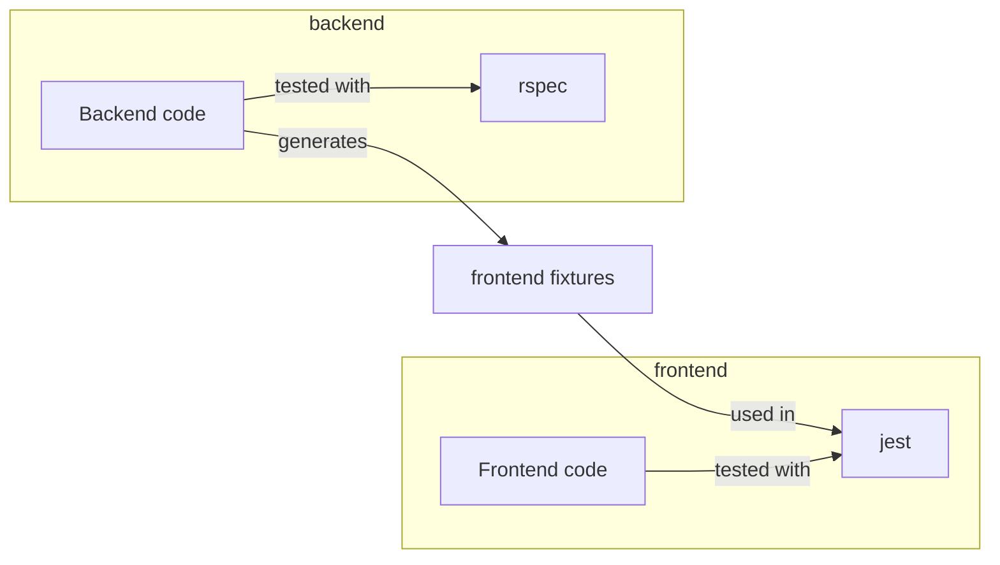
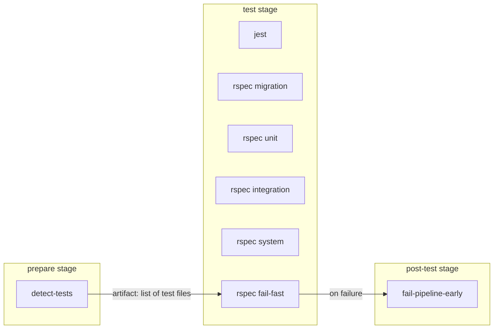
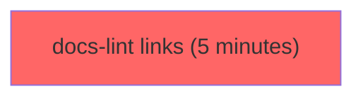
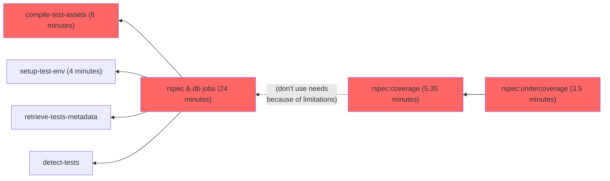
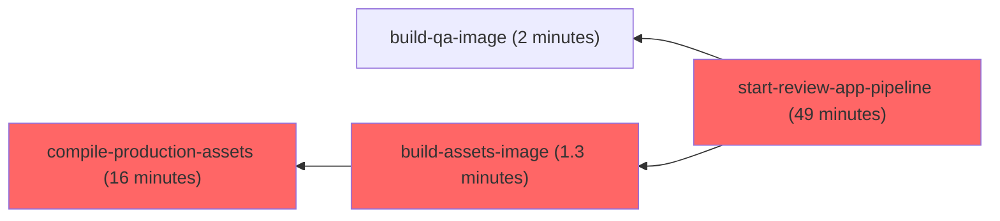
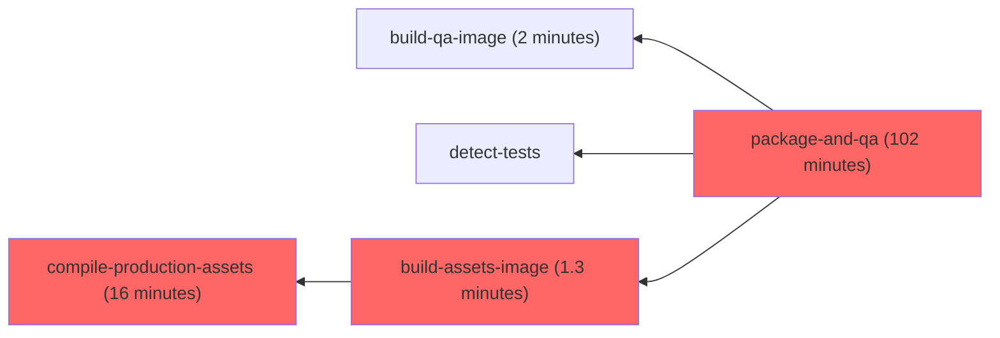

# Pipelines for the GitLab project

Pipelines for [`gitlab-org/gitlab`](https://gitlab.com/gitlab-org/gitlab) (as well as the `dev` instance's) is configured in the usual
[`.gitlab-ci.yml`](https://gitlab.com/gitlab-org/gitlab/-/blob/master/.gitlab-ci.yml)
which itself includes files under
[`.gitlab/ci/`](https://gitlab.com/gitlab-org/gitlab/-/tree/master/.gitlab/ci)
for easier maintenance.

We're striving to [dogfood](https://about.gitlab.com/handbook/engineering/development/principles/#dogfooding)
GitLab [CI/CD features and best-practices](../ci/yaml/index.md)
as much as possible.

## Minimal test jobs before a merge request is approved

**To reduce the pipeline cost and shorten the job duration, before a merge request is approved, the pipeline will run a minimal set of RSpec & Jest tests that are related to the merge request changes.**

After a merge request has been approved, the pipeline would contain the full RSpec & Jest tests. This will ensure that all tests
have been run before a merge request is merged.

### Overview of the GitLab project test dependency

To understand how the minimal test jobs are executed, we need to understand the dependency between
GitLab code (frontend and backend) and the respective tests (Jest and RSpec).
This dependency can be visualized in the following diagram:



In summary:

- RSpec tests are dependent on the backend code.
- Jest tests are dependent on both frontend and backend code, the latter through the frontend fixtures.

### RSpec minimal jobs

#### Determining related RSpec test files in a merge request

To identify the minimal set of tests needed, we use the [`test_file_finder` gem](https://gitlab.com/gitlab-org/ci-cd/test_file_finder), with two strategies:

- dynamic mapping from test coverage tracing (generated via the [`Crystalball` gem](https://github.com/toptal/crystalball))
  ([see where it's used](https://gitlab.com/gitlab-org/gitlab/-/blob/47d507c93779675d73a05002e2ec9c3c467cd698/tooling/bin/find_tests#L15))
- static mapping maintained in the [`tests.yml` file](https://gitlab.com/gitlab-org/gitlab/-/blob/master/tests.yml) for special cases that cannot
  be mapped via coverage tracing ([see where it's used](https://gitlab.com/gitlab-org/gitlab/-/blob/47d507c93779675d73a05002e2ec9c3c467cd698/tooling/bin/find_tests#L12))

The test mappings contain a map of each source files to a list of test files which is dependent of the source file.

In the `detect-tests` job, we use this mapping to identify the minimal tests needed for the current merge request.

#### Exceptional cases

In addition, there are a few circumstances where we would always run the full RSpec tests:

- when the `pipeline:run-all-rspec` label is set on the merge request
- when the merge request is created by an automation (for example, Gitaly update or MR targeting a stable branch)
- when the merge request is created in a security mirror
- when any CI configuration file is changed (for example, `.gitlab-ci.yml` or `.gitlab/ci/**/*`)

### Jest minimal jobs

#### Determining related Jest test files in a merge request

To identify the minimal set of tests needed, we pass a list of all the changed files into `jest` using the [`--findRelatedTests`](https://jestjs.io/docs/cli#--findrelatedtests-spaceseparatedlistofsourcefiles) option.
In this mode, `jest` would resolve all the dependencies of related to the changed files, which include test files that have these files in the dependency chain.

#### Exceptional cases

In addition, there are a few circumstances where we would always run the full Jest tests:

- when the `pipeline:run-all-jest` label is set on the merge request
- when the merge request is created by an automation (for example, Gitaly update or MR targeting a stable branch)
- when the merge request is created in a security mirror
- when any CI configuration file is changed (for example, `.gitlab-ci.yml` or `.gitlab/ci/**/*`)
- when any frontend "core" file is changed (for example, `package.json`, `yarn.lock`, `babel.config.js`, `jest.config.*.js`, `config/helpers/**/*.js`)
- when any vendored JavaScript file is changed (for example, `vendor/assets/javascripts/**/*`)
- when any backend file is changed ([see the patterns list for details](https://gitlab.com/gitlab-org/gitlab/-/blob/3616946936c1adbd9e754c1bd06f86ba670796d8/.gitlab/ci/rules.gitlab-ci.yml#L205-216))

### Fork pipelines

We only run the minimal RSpec & Jest jobs for fork pipelines unless the `pipeline:run-all-rspec`
label is set on the MR. The goal is to reduce the CI/CD minutes consumed by fork pipelines.

See the [experiment issue](https://gitlab.com/gitlab-org/quality/team-tasks/-/issues/1170).

## Faster feedback when reverting merge requests

When you need to revert a merge request, to get accelerated feedback, you can add the `~pipeline:revert` label to your merge request.

When this label is assigned, the following steps of the CI/CD pipeline are skipped:

- The `package-and-qa` job.
- The `rspec:undercoverage` job.
- The entire [Review Apps process](testing_guide/review_apps.md).

Apply the label to the merge request, and run a new pipeline for the MR.

## Fail-fast job in merge request pipelines

To provide faster feedback when a merge request breaks existing tests, we are experimenting with a
fail-fast mechanism.

An `rspec fail-fast` job is added in parallel to all other `rspec` jobs in a merge
request pipeline. This job runs the tests that are directly related to the changes
in the merge request.

If any of these tests fail, the `rspec fail-fast` job fails, triggering a
`fail-pipeline-early` job to run. The `fail-pipeline-early` job:

- Cancels the currently running pipeline and all in-progress jobs.
- Sets pipeline to have status `failed`.

For example:



The `rspec fail-fast` is a no-op if there are more than 10 test files related to the
merge request. This prevents `rspec fail-fast` duration from exceeding the average
`rspec` job duration and defeating its purpose.

This number can be overridden by setting a CI/CD variable named `RSPEC_FAIL_FAST_TEST_FILE_COUNT_THRESHOLD`.

## Test jobs

We have dedicated jobs for each [testing level](testing_guide/testing_levels.md) and each job runs depending on the
changes made in your merge request.
If you want to force all the RSpec jobs to run regardless of your changes, you can add the `pipeline:run-all-rspec` label to the merge request.

WARNING:
Forcing all jobs on docs only related MRs would not have the prerequisite jobs and would lead to errors

### Test suite parallelization

Our current RSpec tests parallelization setup is as follows:

1. The `retrieve-tests-metadata` job in the `prepare` stage ensures we have a
   `knapsack/report-master.json` file:
   - The `knapsack/report-master.json` file is fetched from the latest `main` pipeline which runs `update-tests-metadata`
     (for now it's the 2-hourly `maintenance` scheduled master pipeline), if it's not here we initialize the file with `{}`.
1. Each `[rspec|rspec-ee] [migration|unit|integration|system|geo] n m` job are run with
   `knapsack rspec` and should have an evenly distributed share of tests:
   - It works because the jobs have access to the `knapsack/report-master.json`
     since the "artifacts from all previous stages are passed by default".
   - the jobs set their own report path to
     `"knapsack/${TEST_TOOL}_${TEST_LEVEL}_${DATABASE}_${CI_NODE_INDEX}_${CI_NODE_TOTAL}_report.json"`.
   - if knapsack is doing its job, test files that are run should be listed under
     `Report specs`, not under `Leftover specs`.
1. The `update-tests-metadata` job (which only runs on scheduled pipelines for
   [the canonical project](https://gitlab.com/gitlab-org/gitlab) takes all the
   `knapsack/rspec*.json` files and merge them all together into a single
   `knapsack/report-master.json` file that is saved as artifact.

After that, the next pipeline uses the up-to-date `knapsack/report-master.json` file.

### Flaky tests

#### Automatic skipping of flaky tests

Tests that are [known to be flaky](testing_guide/flaky_tests.md#automatic-retries-and-flaky-tests-detection) are
skipped unless the `$SKIP_FLAKY_TESTS_AUTOMATICALLY` variable is set to `false` or if the `~"pipeline:run-flaky-tests"`
label is set on the MR.

See the [experiment issue](https://gitlab.com/gitlab-org/quality/team-tasks/-/issues/1069).

#### Automatic retry of failing tests in a separate process

Unless `$RETRY_FAILED_TESTS_IN_NEW_PROCESS` variable is set to `false` (`true` by default), RSpec tests that failed are automatically retried once in a separate
RSpec process. The goal is to get rid of most side-effects from previous tests that may lead to a subsequent test failure.

We keep track of retried tests in the `$RETRIED_TESTS_REPORT_FILE` file saved as artifact by the `rspec:flaky-tests-report` job.

See the [experiment issue](https://gitlab.com/gitlab-org/quality/team-tasks/-/issues/1148).

### Single database testing

By default, all tests run with [multiple databases](database/multiple_databases.md).

We also run tests with a single database in nightly scheduled pipelines, and in merge requests that touch database-related files.

If you want to force tests to run with a single database, you can add the `pipeline:run-single-db` label to the merge request.

### Monitoring

The GitLab test suite is [monitored](performance.md#rspec-profiling) for the `main` branch, and any branch
that includes `rspec-profile` in their name.

### Logging

- Rails logging to `log/test.log` is disabled by default in CI [for
  performance reasons](https://jtway.co/speed-up-your-rails-test-suite-by-6-in-1-line-13fedb869ec4). To override this setting, provide the
  `RAILS_ENABLE_TEST_LOG` environment variable.

## Review app jobs

Consult the [Review Apps](testing_guide/review_apps.md) dedicated page for more information.

If you want to force a Review App to be deployed regardless of your changes, you can add the `pipeline:run-review-app` label to the merge request.

## As-if-FOSS jobs

The `* as-if-foss` jobs run the GitLab test suite "as if FOSS", meaning as if the jobs would run in the context
of `gitlab-org/gitlab-foss`. These jobs are only created in the following cases:

- when the `pipeline:run-as-if-foss` label is set on the merge request
- when the merge request is created in the `gitlab-org/security/gitlab` project
- when any CI configuration file is changed (for example, `.gitlab-ci.yml` or `.gitlab/ci/**/*`)

The `* as-if-foss` jobs are run in addition to the regular EE-context jobs. They have the `FOSS_ONLY='1'` variable
set and get the `ee/` folder removed before the tests start running.

The intent is to ensure that a change doesn't introduce a failure after `gitlab-org/gitlab` is synced to `gitlab-org/gitlab-foss`.

## As-if-JH jobs

The `* as-if-jh` jobs run the GitLab test suite "as if JiHu", meaning as if the jobs would run in the context
of [GitLab JH](jh_features_review.md). These jobs are only created in the following cases:

- when the `pipeline:run-as-if-jh` label is set on the merge request
- when the `pipeline:run-all-rspec` label is set on the merge request
- when any code or backstage file is changed
- when any startup CSS file is changed

The `* as-if-jh` jobs are run in addition to the regular EE-context jobs. The `jh/` folder is added before the tests start running.

The intent is to ensure that a change doesn't introduce a failure after `gitlab-org/gitlab` is synced to [GitLab JH](https://jihulab.com/gitlab-cn/gitlab).

### When to consider applying `pipeline:run-as-if-jh` label

If a Ruby file is renamed and there's a corresponding [`prepend_mod` line](jh_features_review.md#jh-features-based-on-ce-or-ee-features),
it's likely that GitLab JH is relying on it and requires a corresponding
change to rename the module or class it's prepending.

### Corresponding JH branch

You can create a corresponding JH branch on [GitLab JH](https://jihulab.com/gitlab-cn/gitlab) by
appending `-jh` to the branch name. If a corresponding JH branch is found,
`* as-if-jh` jobs grab the `jh` folder from the respective branch,
rather than from the default branch `main-jh`.

NOTE:
For now, CI will try to fetch the branch on the [GitLab JH mirror](https://gitlab.com/gitlab-org/gitlab-jh-mirrors/gitlab), so it might take some time for the new JH branch to propagate to the mirror.

## `undercover` RSpec test

> [Introduced](https://gitlab.com/gitlab-org/gitlab/-/merge_requests/74859) in GitLab 14.6.

The `rspec:undercoverage` job runs [`undercover`](https://rubygems.org/gems/undercover)
to detect, and fail if any changes introduced in the merge request has zero coverage.

The `rspec:undercoverage` job obtains coverage data from the `rspec:coverage`
job.

In the event of an emergency, or false positive from this job, add the
`pipeline:skip-undercoverage` label to the merge request to allow this job to
fail.

### Troubleshooting `rspec:undercoverage` failures

The `rspec:undercoverage` job has [known bugs](https://gitlab.com/groups/gitlab-org/-/epics/8254)
that can cause false positive failures. You can test coverage locally to determine if it's
safe to apply `~"pipeline:skip-undercoverage"`. For example, using `<spec>` as the name of the
test causing the failure:

1. Run `SIMPLECOV=1 bundle exec rspec <spec>`.
1. Run `scripts/undercoverage`.

If these commands return `undercover: ✅ No coverage is missing in latest changes` then you can apply `~"pipeline:skip-undercoverage"` to bypass pipeline failures.

## Ruby versions testing

Our test suite runs against Ruby 2 in merge requests and default branch pipelines.

We also run our test suite against Ruby 3 on another 2-hourly scheduled pipelines, as GitLab.com will soon run on Ruby 3.

## PostgreSQL versions testing

Our test suite runs against PG12 as GitLab.com runs on PG12 and
[Omnibus defaults to PG12 for new installs and upgrades](../administration/package_information/postgresql_versions.md).

We do run our test suite against PG11 and PG13 on nightly scheduled pipelines.

We also run our test suite against PG11 upon specific database library changes in MRs and `main` pipelines (with the `rspec db-library-code pg11` job).

### Current versions testing

| Where? | PostgreSQL version | Ruby version |
| ------ | ------------------ | ------------ |
| Merge requests    | 12 (default version), 11 for DB library changes | 2.7 (default version) |
| `master` branch commits | 12 (default version), 11 for DB library changes | 2.7 (default version) |
| `maintenance` scheduled pipelines (every 2 hours at even hour) | 12 (default version), 11 for DB library changes | 2.7 (default version) |
| `maintenance` scheduled pipelines (every 2 hours at odd hour) | 12 (default version), 11 for DB library changes | 3.0 (set in the schedule variables) |
| `nightly` scheduled pipelines | 12 (default version), 11, 13 | 2.7 (default version) |

### Long-term plan

We follow the [PostgreSQL versions shipped with Omnibus GitLab](../administration/package_information/postgresql_versions.md):

| PostgreSQL version | 14.1 (July 2021)       | 14.2 (August 2021)     | 14.3 (September 2021)  | 14.4 (October 2021)    | 14.5 (November 2021)   | 14.6 (December 2021)   |
| -------------------| ---------------------- | ---------------------- | ---------------------- | ---------------------- | ---------------------- | ---------------------- |
| PG12               | MRs/`2-hour`/`nightly` | MRs/`2-hour`/`nightly` | MRs/`2-hour`/`nightly` | MRs/`2-hour`/`nightly` | MRs/`2-hour`/`nightly` | MRs/`2-hour`/`nightly` |
| PG11               | `nightly`              | `nightly`              | `nightly`              | `nightly`              | `nightly`              | `nightly`              |
| PG13               | `nightly`              | `nightly`              | `nightly`              | `nightly`              | `nightly`              | `nightly`              |

## Redis versions testing

Our test suite runs against Redis 6 as GitLab.com runs on Redis 6 and
[Omnibus defaults to Redis 6 for new installs and upgrades](https://gitlab.com/gitlab-org/omnibus-gitlab/-/blob/master/config/software/redis.rb).

We do run our test suite against Redis 5 on `nightly` scheduled pipelines, specifically when running backward-compatible and forward-compatible PostgreSQL jobs.

### Current versions testing

| Where? | Redis version |
| ------ | ------------------ |
| MRs    | 6 |
| `default branch` (non-scheduled pipelines) | 6 |
| `nightly` scheduled pipelines | 5 |

## Pipelines types for merge requests

In general, pipelines for an MR fall into one of the following types (from shorter to longer), depending on the changes made in the MR:

- [Documentation pipeline](#documentation-pipeline): For MRs that touch documentation.
- [Backend pipeline](#backend-pipeline): For MRs that touch backend code.
- [Frontend pipeline](#frontend-pipeline): For MRs that touch frontend code.
- [End-to-end pipeline](#end-to-end-pipeline): For MRs that touch code in the `qa/` folder.

A "pipeline type" is an abstract term that mostly describes the "critical path" (for example, the chain of jobs for which the sum
of individual duration equals the pipeline's duration).
We use these "pipeline types" in [metrics dashboards](https://app.periscopedata.com/app/gitlab/858266/GitLab-Pipeline-Durations)
in order to detect what types and jobs need to be optimized first.

An MR that touches multiple areas would be associated with the longest type applicable. For instance, an MR that touches backend
and frontend would fall into the "Frontend" pipeline type since this type takes longer to finish than the "Backend" pipeline type.

We use the [`rules:`](../ci/yaml/index.md#rules) and [`needs:`](../ci/yaml/index.md#needs) keywords extensively
to determine the jobs that need to be run in a pipeline. Note that an MR that includes multiple types of changes would
have a pipelines that include jobs from multiple types (for example, a combination of docs-only and code-only pipelines).

Following are graphs of the critical paths for each pipeline type. Jobs that aren't part of the critical path are omitted.

### Documentation pipeline

[Reference pipeline](https://gitlab.com/gitlab-org/gitlab/-/pipelines/432049110).



### Backend pipeline

[Reference pipeline](https://gitlab.com/gitlab-org/gitlab/-/pipelines/433316063).



### Frontend pipeline

[Reference pipeline](https://gitlab.com/gitlab-org/gitlab/-/pipelines/431913287).



### End-to-end pipeline

[Reference pipeline](https://gitlab.com/gitlab-org/gitlab/-/pipelines/431918463).



## CI configuration internals

### Workflow rules

Pipelines for the GitLab project are created using the [`workflow:rules` keyword](../ci/yaml/index.md#workflow)
feature of the GitLab CI/CD.

Pipelines are always created for the following scenarios:

- `main` branch, including on schedules, pushes, merges, and so on.
- Merge requests.
- Tags.
- Stable, `auto-deploy`, and security branches.

Pipeline creation is also affected by the following CI/CD variables:

- If `$FORCE_GITLAB_CI` is set, pipelines are created.
- If `$GITLAB_INTERNAL` is not set, pipelines are not created.

No pipeline is created in any other cases (for example, when pushing a branch with no
MR for it).

The source of truth for these workflow rules is defined in [`.gitlab-ci.yml`](https://gitlab.com/gitlab-org/gitlab/-/blob/master/.gitlab-ci.yml).

### Default image

The default image is defined in [`.gitlab-ci.yml`](https://gitlab.com/gitlab-org/gitlab/-/blob/master/.gitlab-ci.yml).

<!-- vale gitlab.Spelling = NO -->

It includes Ruby, Go, Git, Git LFS, Chrome, Node, Yarn, PostgreSQL, and Graphics Magick.

<!-- vale gitlab.Spelling = YES -->

The images used in our pipelines are configured in the
[`gitlab-org/gitlab-build-images`](https://gitlab.com/gitlab-org/gitlab-build-images)
project, which is push-mirrored to [`gitlab/gitlab-build-images`](https://dev.gitlab.org/gitlab/gitlab-build-images)
for redundancy.

The current version of the build images can be found in the
["Used by GitLab section"](https://gitlab.com/gitlab-org/gitlab-build-images/blob/master/.gitlab-ci.yml).

### Default variables

In addition to the [predefined CI/CD variables](../ci/variables/predefined_variables.md),
each pipeline includes default variables defined in
[`.gitlab-ci.yml`](https://gitlab.com/gitlab-org/gitlab/-/blob/master/.gitlab-ci.yml).

### Stages

The current stages are:

- `sync`: This stage is used to synchronize changes from [`gitlab-org/gitlab`](https://gitlab.com/gitlab-org/gitlab) to
  [`gitlab-org/gitlab-foss`](https://gitlab.com/gitlab-org/gitlab-foss).
- `prepare`: This stage includes jobs that prepare artifacts that are needed by
  jobs in subsequent stages.
- `build-images`: This stage includes jobs that prepare Docker images
  that are needed by jobs in subsequent stages or downstream pipelines.
- `fixtures`: This stage includes jobs that prepare fixtures needed by frontend tests.
- `lint`: This stage includes linting and static analysis jobs.
- `test`: This stage includes most of the tests, and DB/migration jobs.
- `post-test`: This stage includes jobs that build reports or gather data from
  the `test` stage's jobs (for example, coverage, Knapsack metadata, and so on).
- `review`: This stage includes jobs that build the CNG images, deploy them, and
  run end-to-end tests against Review Apps (see [Review Apps](testing_guide/review_apps.md) for details).
  It also includes Docs Review App jobs.
- `qa`: This stage includes jobs that perform QA tasks against the Review App
  that is deployed in stage `review`.
- `post-qa`: This stage includes jobs that build reports or gather data from
  the `qa` stage's jobs (for example, Review App performance report).
- `pages`: This stage includes a job that deploys the various reports as
  GitLab Pages (for example, [`coverage-ruby`](https://gitlab-org.gitlab.io/gitlab/coverage-ruby/),
  and `webpack-report` (found at `https://gitlab-org.gitlab.io/gitlab/webpack-report/`, but there is
  [an issue with the deployment](https://gitlab.com/gitlab-org/gitlab/-/issues/233458)).
- `notify`: This stage includes jobs that notify various failures to Slack.

### Dependency Proxy

Some of the jobs are using images from Docker Hub, where we also use
`${GITLAB_DEPENDENCY_PROXY}` as a prefix to the image path, so that we pull
images from our [Dependency Proxy](../user/packages/dependency_proxy/index.md).

`${GITLAB_DEPENDENCY_PROXY}` is a group CI/CD variable defined in
[`gitlab-org`](https://gitlab.com/gitlab-org) as
`${CI_DEPENDENCY_PROXY_GROUP_IMAGE_PREFIX}/`. This means when we use an image
defined as:

```yaml
image: ${GITLAB_DEPENDENCY_PROXY}alpine:edge
```

Projects in the `gitlab-org` group pull from the Dependency Proxy, while
forks that reside on any other personal namespaces or groups fall back to
Docker Hub unless `${GITLAB_DEPENDENCY_PROXY}` is also defined there.

### Common job definitions

Most of the jobs [extend from a few CI definitions](../ci/yaml/index.md#extends)
defined in [`.gitlab/ci/global.gitlab-ci.yml`](https://gitlab.com/gitlab-org/gitlab/-/blob/master/.gitlab/ci/global.gitlab-ci.yml)
that are scoped to a single [configuration keyword](../ci/yaml/index.md#job-keywords).

| Job definitions  | Description |
|------------------|-------------|
| `.default-retry` | Allows a job to [retry](../ci/yaml/index.md#retry) upon `unknown_failure`, `api_failure`, `runner_system_failure`, `job_execution_timeout`, or `stuck_or_timeout_failure`. |
| `.default-before_script` | Allows a job to use a default `before_script` definition suitable for Ruby/Rails tasks that may need a database running (for example, tests). |
| `.setup-test-env-cache` | Allows a job to use a default `cache` definition suitable for setting up test environment for subsequent Ruby/Rails tasks. |
| `.rails-cache` | Allows a job to use a default `cache` definition suitable for Ruby/Rails tasks. |
| `.static-analysis-cache` | Allows a job to use a default `cache` definition suitable for static analysis tasks. |
| `.coverage-cache` | Allows a job to use a default `cache` definition suitable for coverage tasks. |
| `.qa-cache` | Allows a job to use a default `cache` definition suitable for QA tasks. |
| `.yarn-cache` | Allows a job to use a default `cache` definition suitable for frontend jobs that do a `yarn install`. |
| `.assets-compile-cache` | Allows a job to use a default `cache` definition suitable for frontend jobs that compile assets. |
| `.use-pg11` | Allows a job to run the `postgres` 11 and `redis` services (see [`.gitlab/ci/global.gitlab-ci.yml`](https://gitlab.com/gitlab-org/gitlab/-/blob/master/.gitlab/ci/global.gitlab-ci.yml) for the specific versions of the services). |
| `.use-pg11-ee` | Same as `.use-pg11` but also use an `elasticsearch` service (see [`.gitlab/ci/global.gitlab-ci.yml`](https://gitlab.com/gitlab-org/gitlab/-/blob/master/.gitlab/ci/global.gitlab-ci.yml) for the specific version of the service). |
| `.use-pg12` | Allows a job to use the `postgres` 12 and `redis` services (see [`.gitlab/ci/global.gitlab-ci.yml`](https://gitlab.com/gitlab-org/gitlab/-/blob/master/.gitlab/ci/global.gitlab-ci.yml) for the specific versions of the services). |
| `.use-pg12-ee` | Same as `.use-pg12` but also use an `elasticsearch` service (see [`.gitlab/ci/global.gitlab-ci.yml`](https://gitlab.com/gitlab-org/gitlab/-/blob/master/.gitlab/ci/global.gitlab-ci.yml) for the specific version of the service). |
| `.use-pg13` | Allows a job to use the `postgres` 13 and `redis` services (see [`.gitlab/ci/global.gitlab-ci.yml`](https://gitlab.com/gitlab-org/gitlab/-/blob/master/.gitlab/ci/global.gitlab-ci.yml) for the specific versions of the services). |
| `.use-pg13-ee` | Same as `.use-pg13` but also use an `elasticsearch` service (see [`.gitlab/ci/global.gitlab-ci.yml`](https://gitlab.com/gitlab-org/gitlab/-/blob/master/.gitlab/ci/global.gitlab-ci.yml) for the specific version of the service). |
| `.use-kaniko` | Allows a job to use the `kaniko` tool to build Docker images. |
| `.as-if-foss` | Simulate the FOSS project by setting the `FOSS_ONLY='1'` CI/CD variable. |
| `.use-docker-in-docker` | Allows a job to use Docker in Docker. |

### `rules`, `if:` conditions and `changes:` patterns

We're using the [`rules` keyword](../ci/yaml/index.md#rules) extensively.

All `rules` definitions are defined in
[`rules.gitlab-ci.yml`](https://gitlab.com/gitlab-org/gitlab/-/blob/master/.gitlab/ci/rules.gitlab-ci.yml),
then included in individual jobs via [`extends`](../ci/yaml/index.md#extends).

The `rules` definitions are composed of `if:` conditions and `changes:` patterns,
which are also defined in
[`rules.gitlab-ci.yml`](https://gitlab.com/gitlab-org/gitlab/-/blob/master/.gitlab/ci/rules.gitlab-ci.yml)
and included in `rules` definitions via [YAML anchors](../ci/yaml/yaml_optimization.md#anchors)

#### `if:` conditions

<!-- vale gitlab.Substitutions = NO -->

| `if:` conditions | Description | Notes |
|------------------|-------------|-------|
| `if-not-canonical-namespace`                                 | Matches if the project isn't in the canonical (`gitlab-org/`) or security (`gitlab-org/security`) namespace. | Use to create a job for forks (by using `when: on_success|manual`), or **not** create a job for forks (by using `when: never`). |
| `if-not-ee`                                                  | Matches if the project isn't EE (that is, project name isn't `gitlab` or `gitlab-ee`). | Use to create a job only in the FOSS project (by using `when: on_success|manual`), or **not** create a job if the project is EE (by using `when: never`). |
| `if-not-foss`                                                | Matches if the project isn't FOSS (that is, project name isn't `gitlab-foss`, `gitlab-ce`, or `gitlabhq`). | Use to create a job only in the EE project (by using `when: on_success|manual`), or **not** create a job if the project is FOSS (by using `when: never`). |
| `if-default-refs`                                            | Matches if the pipeline is for `master`, `main`, `/^[\d-]+-stable(-ee)?$/` (stable branches), `/^\d+-\d+-auto-deploy-\d+$/` (auto-deploy branches), `/^security\//` (security branches), merge requests, and tags. | Note that jobs aren't created for branches with this default configuration. |
| `if-master-refs`                                             | Matches if the current branch is `master` or `main`. | |
| `if-master-push`                                             | Matches if the current branch is `master` or `main` and pipeline source is `push`. | |
| `if-master-schedule-maintenance`                                | Matches if the current branch is `master` or `main` and pipeline runs on a 2-hourly schedule. | |
| `if-master-schedule-nightly`                                 | Matches if the current branch is `master` or `main` and pipeline runs on a nightly schedule. | |
| `if-auto-deploy-branches`                                    | Matches if the current branch is an auto-deploy one. | |
| `if-master-or-tag`                                           | Matches if the pipeline is for the `master` or `main` branch or for a tag. | |
| `if-merge-request`                                           | Matches if the pipeline is for a merge request. | |
| `if-merge-request-title-as-if-foss`                          | Matches if the pipeline is for a merge request and the MR has label ~"pipeline:run-as-if-foss" | |
| `if-merge-request-title-update-caches`                       | Matches if the pipeline is for a merge request and the MR has label ~"pipeline:update-cache". | |
| `if-merge-request-title-run-all-rspec`                       | Matches if the pipeline is for a merge request and the MR has label ~"pipeline:run-all-rspec". | |
| `if-security-merge-request`                                  | Matches if the pipeline is for a security merge request. | |
| `if-security-schedule`                                       | Matches if the pipeline is for a security scheduled pipeline. | |
| `if-nightly-master-schedule`                                 | Matches if the pipeline is for a `master` scheduled pipeline with `$NIGHTLY` set. | |
| `if-dot-com-gitlab-org-schedule`                             | Limits jobs creation to scheduled pipelines for the `gitlab-org` group on GitLab.com. | |
| `if-dot-com-gitlab-org-master`                               | Limits jobs creation to the `master` or `main` branch for the `gitlab-org` group on GitLab.com. | |
| `if-dot-com-gitlab-org-merge-request`                        | Limits jobs creation to merge requests for the `gitlab-org` group on GitLab.com. | |
| `if-dot-com-gitlab-org-and-security-tag`                     | Limits job creation to tags for the `gitlab-org` and `gitlab-org/security` groups on GitLab.com. | |
| `if-dot-com-gitlab-org-and-security-merge-request`           | Limit jobs creation to merge requests for the `gitlab-org` and `gitlab-org/security` groups on GitLab.com. | |
| `if-dot-com-gitlab-org-and-security-tag`                     | Limit jobs creation to tags for the `gitlab-org` and `gitlab-org/security` groups on GitLab.com. | |
| `if-dot-com-ee-schedule`                                     | Limits jobs to scheduled pipelines for the `gitlab-org/gitlab` project on GitLab.com. | |
| `if-security-pipeline-merge-result`                          | Matches if the pipeline is for a security merge request triggered by `@gitlab-release-tools-bot`. | |

<!-- vale gitlab.Substitutions = YES -->

#### `changes:` patterns

| `changes:` patterns          | Description                                                              |
|------------------------------|--------------------------------------------------------------------------|
| `ci-patterns`                | Only create job for CI configuration-related changes.                    |
| `ci-build-images-patterns`   | Only create job for CI configuration-related changes related to the `build-images` stage. |
| `ci-review-patterns`         | Only create job for CI configuration-related changes related to the `review` stage. |
| `ci-qa-patterns`             | Only create job for CI configuration-related changes related to the `qa` stage. |
| `yaml-lint-patterns`         | Only create job for YAML-related changes.                                |
| `docs-patterns`              | Only create job for docs-related changes.                                |
| `frontend-dependency-patterns` | Only create job when frontend dependencies are updated (that is, `package.json`, and `yarn.lock`). changes. |
| `frontend-patterns`          | Only create job for frontend-related changes.                           |
| `backend-patterns`           | Only create job for backend-related changes.                           |
| `db-patterns`                | Only create job for DB-related changes. |
| `backstage-patterns`         | Only create job for backstage-related changes (that is, Danger, fixtures, RuboCop, specs). |
| `code-patterns`              | Only create job for code-related changes.                                |
| `qa-patterns`                | Only create job for QA-related changes.                                  |
| `code-backstage-patterns`    | Combination of `code-patterns` and `backstage-patterns`.                 |
| `code-qa-patterns`           | Combination of `code-patterns` and `qa-patterns`.                        |
| `code-backstage-qa-patterns` | Combination of `code-patterns`, `backstage-patterns`, and `qa-patterns`. |
| `static-analysis-patterns`   | Only create jobs for Static Analytics configuration-related changes.     |

## Performance

### Interruptible pipelines

By default, all jobs are [interruptible](../ci/yaml/index.md#interruptible), except the
`dont-interrupt-me` job which runs automatically on `main`, and is `manual`
otherwise.

If you want a running pipeline to finish even if you push new commits to a merge
request, be sure to start the `dont-interrupt-me` job before pushing.

### Git fetch caching

Because GitLab.com uses the [pack-objects cache](../administration/gitaly/configure_gitaly.md#pack-objects-cache),
concurrent Git fetches of the same pipeline ref are deduplicated on
the Gitaly server (always) and served from cache (when available).

This works well for the following reasons:

- The pack-objects cache is enabled on all Gitaly servers on GitLab.com.
- The CI/CD [Git strategy setting](../ci/pipelines/settings.md#choose-the-default-git-strategy) for `gitlab-org/gitlab` is **Git clone**,
  causing all jobs to fetch the same data, which maximizes the cache hit ratio.
- We use [shallow clone](../ci/pipelines/settings.md#limit-the-number-of-changes-fetched-during-clone) to avoid downloading the full Git
  history for every job.

### Caching strategy

1. All jobs must only pull caches by default.
1. All jobs must be able to pass with an empty cache. In other words, caches are only there to speed up jobs.
1. We currently have several different cache definitions defined in
   [`.gitlab/ci/global.gitlab-ci.yml`](https://gitlab.com/gitlab-org/gitlab/-/blob/master/.gitlab/ci/global.gitlab-ci.yml),
   with fixed keys:
   - `.setup-test-env-cache`
   - `.ruby-cache`
   - `.rails-cache`
   - `.static-analysis-cache`
   - `.rubocop-cache`
   - `.coverage-cache`
   - `.danger-review-cache`
   - `.qa-cache`
   - `.yarn-cache`
   - `.assets-compile-cache` (the key includes `${NODE_ENV}` so it's actually two different caches).
1. These cache definitions are composed of [multiple atomic caches](../ci/caching/index.md#use-multiple-caches).
1. Only the following jobs, running in 2-hourly `maintenance` scheduled pipelines, are pushing (that is, updating) to the caches:
   - `update-setup-test-env-cache`, defined in [`.gitlab/ci/rails.gitlab-ci.yml`](https://gitlab.com/gitlab-org/gitlab/-/blob/master/.gitlab/ci/rails.gitlab-ci.yml).
   - `update-gitaly-binaries-cache`, defined in [`.gitlab/ci/rails.gitlab-ci.yml`](https://gitlab.com/gitlab-org/gitlab/-/blob/master/.gitlab/ci/rails.gitlab-ci.yml).
   - `update-rubocop-cache`, defined in [`.gitlab/ci/rails.gitlab-ci.yml`](https://gitlab.com/gitlab-org/gitlab/-/blob/master/.gitlab/ci/rails.gitlab-ci.yml).
   - `update-qa-cache`, defined in [`.gitlab/ci/qa.gitlab-ci.yml`](https://gitlab.com/gitlab-org/gitlab/-/blob/master/.gitlab/ci/qa.gitlab-ci.yml).
   - `update-assets-compile-production-cache`, defined in [`.gitlab/ci/frontend.gitlab-ci.yml`](https://gitlab.com/gitlab-org/gitlab/-/blob/master/.gitlab/ci/frontend.gitlab-ci.yml).
   - `update-assets-compile-test-cache`, defined in [`.gitlab/ci/frontend.gitlab-ci.yml`](https://gitlab.com/gitlab-org/gitlab/-/blob/master/.gitlab/ci/frontend.gitlab-ci.yml).
   - `update-yarn-cache`, defined in [`.gitlab/ci/frontend.gitlab-ci.yml`](https://gitlab.com/gitlab-org/gitlab/-/blob/master/.gitlab/ci/frontend.gitlab-ci.yml).
   - `update-storybook-yarn-cache`, defined in [`.gitlab/ci/frontend.gitlab-ci.yml`](https://gitlab.com/gitlab-org/gitlab/-/blob/master/.gitlab/ci/frontend.gitlab-ci.yml).
1. These jobs can also be forced to run in merge requests with the `pipeline:update-cache` label (this can be useful to warm the caches in a MR that updates the cache keys).

### Artifacts strategy

We limit the artifacts that are saved and retrieved by jobs to the minimum in order to reduce the upload/download time and costs, as well as the artifacts storage.

### Components caching

Some external components (currently only GitLab Workhorse) of GitLab need to be built from source as a preliminary step for running tests.

In [this MR](https://gitlab.com/gitlab-org/gitlab/-/merge_requests/79766), we introduced a new `build-components` job that:

- runs automatically for all GitLab.com `gitlab-org/gitlab` scheduled pipelines
- runs automatically for any `master` commit that touches the `workhorse/` folder
- is manual for GitLab.com's `gitlab-org`'s MRs

This job tries to download a generic package that contains GitLab Workhorse binaries needed in the GitLab test suite (under `tmp/tests/gitlab-workhorse`).

- If the package URL returns a 404:
   1. It runs `scripts/setup-test-env`, so that the GitLab Workhorse binaries are built.
   1. It then creates an archive which contains the binaries and upload it [as a generic package](https://gitlab.com/gitlab-org/gitlab/-/packages/).
- Otherwise, if the package already exists, it exit the job successfully.

We also changed the `setup-test-env` job to:

1. First download the GitLab Workhorse generic package build and uploaded by `build-components`.
1. If the package is retrieved successfully, its content is placed in the right folder (for example, `tmp/tests/gitlab-workhorse`), preventing the building of the binaries when `scripts/setup-test-env` is run later on.
1. If the package URL returns a 404, the behavior doesn't change compared to the current one: the GitLab Workhorse binaries are built as part of `scripts/setup-test-env`.

NOTE:
The version of the package is the workhorse tree SHA (for example, `git rev-parse HEAD:workhorse`).

### Pre-clone step

NOTE:
We no longer use this optimization for `gitlab-org/gitlab` because the [pack-objects cache](../administration/gitaly/configure_gitaly.md#pack-objects-cache)
allows Gitaly to serve the full CI/CD fetch traffic now. See [Git fetch caching](#git-fetch-caching).

The pre-clone step works by using the `CI_PRE_CLONE_SCRIPT` variable
[defined by GitLab.com shared runners](../ci/runners/saas/linux_saas_runner.md#pre-clone-script).

---

[Return to Development documentation](index.md)
