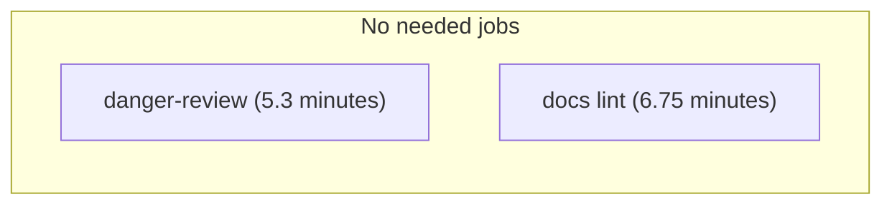
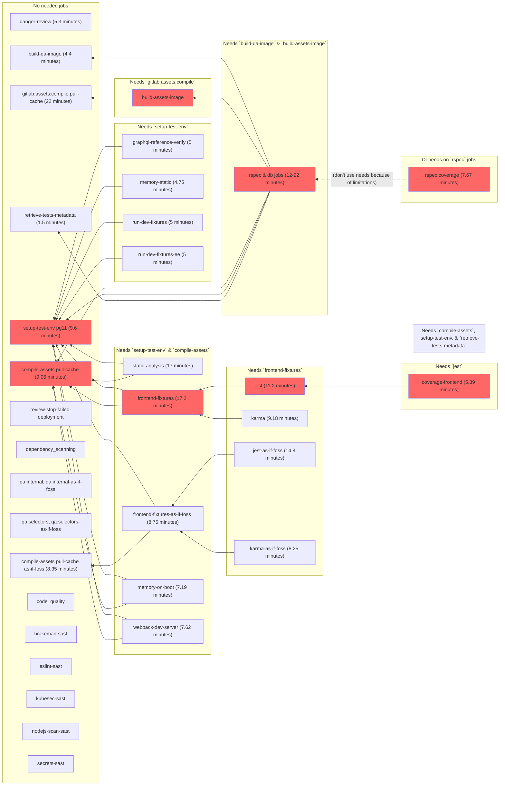
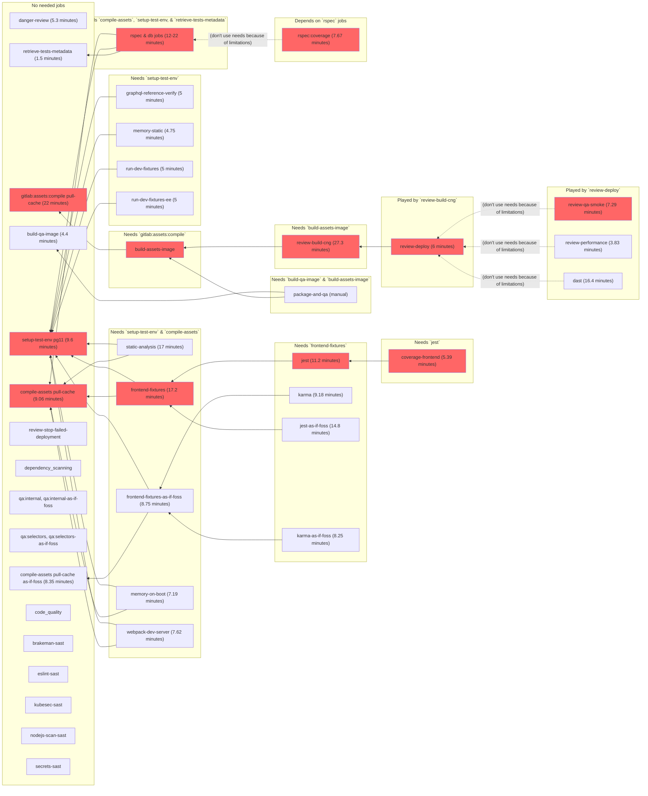
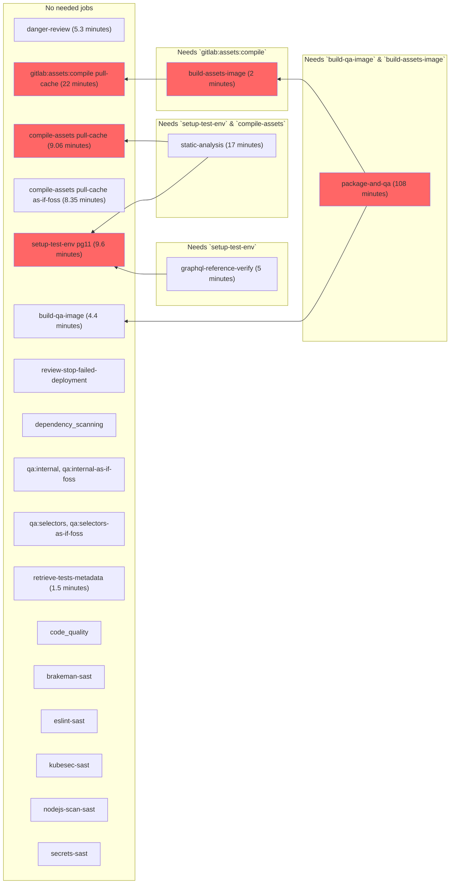

# Pipelines for the GitLab project

Pipelines for <https://gitlab.com/gitlab-org/gitlab> and <https://gitlab.com/gitlab-org/gitlab-foss> (as well as the
`dev` instance's mirrors) are configured in the usual
[`.gitlab-ci.yml`](https://gitlab.com/gitlab-org/gitlab/blob/master/.gitlab-ci.yml)
which itself includes files under
[`.gitlab/ci/`](https://gitlab.com/gitlab-org/gitlab/tree/master/.gitlab/ci)
for easier maintenance.

We're striving to [dogfood](https://about.gitlab.com/handbook/engineering/#dogfooding)
GitLab [CI/CD features and best-practices](../ci/yaml/README.md)
as much as possible.

## Stages

The current stages are:

- `sync`: This stage is used to synchronize changes from <https://gitlab.com/gitlab-org/gitlab> to
  <https://gitlab.com/gitlab-org/gitlab-foss>.
- `prepare`: This stage includes jobs that prepare artifacts that are needed by
  jobs in subsequent stages.
- `build-images`: This stage includes jobs that prepare docker images
  that are needed by jobs in subsequent stages or downstream pipelines.
- `fixtures`: This stage includes jobs that prepare fixtures needed by frontend tests.
- `test`: This stage includes most of the tests, DB/migration jobs, and static analysis jobs.
- `post-test`: This stage includes jobs that build reports or gather data from
  the `test` stage's jobs (e.g. coverage, Knapsack metadata etc.).
- `review-prepare`: This stage includes a job that build the CNG images that are
  later used by the (Helm) Review App deployment (see
  [Review Apps](testing_guide/review_apps.md) for details).
- `review`: This stage includes jobs that deploy the GitLab and Docs Review Apps.
- `qa`: This stage includes jobs that perform QA tasks against the Review App
  that is deployed in the previous stage.
- `post-qa`: This stage includes jobs that build reports or gather data from
  the `qa` stage's jobs (e.g. Review App performance report).
- `pages`: This stage includes a job that deploys the various reports as
  GitLab Pages (e.g. <https://gitlab-org.gitlab.io/gitlab/coverage-ruby/>,
  <https://gitlab-org.gitlab.io/gitlab/coverage-javascript/>,
  <https://gitlab-org.gitlab.io/gitlab/webpack-report/>).

## Default image

The default image is defined in <https://gitlab.com/gitlab-org/gitlab/blob/master/.gitlab-ci.yml>.

It includes Ruby, Go, Git, Git LFS, Chrome, Node, Yarn, PostgreSQL, and Graphics Magick.

The images used in our pipelines are configured in the
[`gitlab-org/gitlab-build-images`](https://gitlab.com/gitlab-org/gitlab-build-images)
project, which is push-mirrored to <https://dev.gitlab.org/gitlab/gitlab-build-images>
for redundancy.

The current version of the build images can be found in the
["Used by GitLab section"](https://gitlab.com/gitlab-org/gitlab-build-images/blob/master/.gitlab-ci.yml).

## Default variables

In addition to the [predefined variables](../ci/variables/predefined_variables.md),
each pipeline includes default variables defined in
<https://gitlab.com/gitlab-org/gitlab/blob/master/.gitlab-ci.yml>.

## Common job definitions

Most of the jobs [extend from a few CI definitions](../ci/yaml/README.md#extends)
defined in [`.gitlab/ci/global.gitlab-ci.yml`](https://gitlab.com/gitlab-org/gitlab/blob/master/.gitlab/ci/global.gitlab-ci.yml)
that are scoped to a single [configuration parameter](../ci/yaml/README.md#configuration-parameters).

| Job definitions  | Description |
|------------------|-------------|
| `.default-tags` | Ensures a job has the `gitlab-org` tag to ensure it's using our dedicated runners. |
| `.default-retry` | Allows a job to [retry](../ci/yaml/README.md#retry) upon `unknown_failure`, `api_failure`, `runner_system_failure`, `job_execution_timeout`, or `stuck_or_timeout_failure`. |
| `.default-before_script` | Allows a job to use a default `before_script` definition suitable for Ruby/Rails tasks that may need a database running (e.g. tests). |
| `.default-cache` | Allows a job to use a default `cache` definition suitable for Ruby/Rails and frontend tasks. |
| `.use-pg9` | Allows a job to use the `postgres:9.6.17` and `redis:alpine` services. |
| `.use-pg10` | Allows a job to use the `postgres:10.12` and `redis:alpine` services. |
| `.use-pg11` | Allows a job to use the `postgres:11.6` and `redis:alpine` services. |
| `.use-pg9-ee` | Same as `.use-pg9` but also use the `docker.elastic.co/elasticsearch/elasticsearch:6.4.2` services. |
| `.use-pg10-ee` | Same as `.use-pg10` but also use the `docker.elastic.co/elasticsearch/elasticsearch:6.4.2` services. |
| `.use-pg11-ee` | Same as `.use-pg11` but also use the `docker.elastic.co/elasticsearch/elasticsearch:6.4.2` services. |
| `.use-kaniko` | Allows a job to use the `kaniko` tool to build Docker images. |
| `.as-if-foss` | Simulate the FOSS project by setting the `FOSS_ONLY='1'` environment variable. |

## `workflow:rules`

We're using the [`workflow:rules` keyword](../ci/yaml/README.md#workflowrules) to
define default rules to determine whether or not a pipeline is created.

These rules are defined in <https://gitlab.com/gitlab-org/gitlab/blob/master/.gitlab-ci.yml>
and are as follows:

1. If `$FORCE_GITLAB_CI` is set, create a pipeline.
1. For merge requests, create a pipeline.
1. For `master` branch, create a pipeline (this includes on schedules, pushes, merges, etc.).
1. For tags, create a pipeline.
1. If `$GITLAB_INTERNAL` isn't set, don't create a pipeline.
1. For stable, auto-deploy, and security branches, create a pipeline.
1. For any other cases (e.g. when pushing a branch with no MR for it), no pipeline is created.

## `rules`, `if:` conditions and `changes:` patterns

We're using the [`rules` keyword](../ci/yaml/README.md#rules) extensively.

All `rules` definitions are defined in
<https://gitlab.com/gitlab-org/gitlab/-/blob/master/.gitlab/ci/rules.gitlab-ci.yml>,
then included in individual jobs via [`extends`](../ci/yaml/README.md#extends).

The `rules` definitions are composed of `if:` conditions and `changes:` patterns,
which are also defined in
<https://gitlab.com/gitlab-org/gitlab/-/blob/master/.gitlab/ci/rules.gitlab-ci.yml>
and included in `rules` definitions via [YAML anchors](../ci/yaml/README.md#anchors)

### `if:` conditions

| `if:` conditions | Description | Notes |
|------------------|-------------|-------|
| `if-not-canonical-namespace`                                 | Matches if the project isn't in the canonical (`gitlab-org/`) or security (`gitlab-org/security`) namespace. | Use to create a job for forks (by using `when: on_success\|manual`), or **not** create a job for forks (by using `when: never`). |
| `if-not-ee`                                                  | Matches if the project isn't EE (i.e. project name isn't `gitlab` or `gitlab-ee`). | Use to create a job only in the FOSS project (by using `when: on_success|manual`), or **not** create a job if the project is EE (by using `when: never`). |
| `if-not-foss`                                                | Matches if the project isn't FOSS (i.e. project name isn't `gitlab-foss`, `gitlab-ce`, or `gitlabhq`). | Use to create a job only in the EE project (by using `when: on_success|manual`), or **not** create a job if the project is FOSS (by using `when: never`). |
| `if-default-refs`                                            | Matches if the pipeline is for `master`, `/^[\d-]+-stable(-ee)?$/` (stable branches), `/^\d+-\d+-auto-deploy-\d+$/` (auto-deploy branches), `/^security\//` (security branches), merge requests, and tags. | Note that jobs won't be created for branches with this default configuration. |
| `if-master-refs`                                             | Matches if the current branch is `master`. | |
| `if-master-or-tag`                                           | Matches if the pipeline is for the `master` branch or for a tag. | |
| `if-merge-request`                                           | Matches if the pipeline is for a merge request. | |
| `if-nightly-master-schedule`                                 | Matches if the pipeline is for a `master` scheduled pipeline with `$NIGHTLY` set. | |
| `if-dot-com-gitlab-org-schedule`                             | Limits jobs creation to scheduled pipelines for the `gitlab-org` group on GitLab.com. | |
| `if-dot-com-gitlab-org-master`                               | Limits jobs creation to the `master` branch for the `gitlab-org` group on GitLab.com. | |
| `if-dot-com-gitlab-org-merge-request`                        | Limits jobs creation to merge requests for the `gitlab-org` group on GitLab.com. | |
| `if-dot-com-gitlab-org-and-security-tag`                     | Limits job creation to tags for the `gitlab-org` and `gitlab-org/security` groups on GitLab.com. | |
| `if-dot-com-gitlab-org-and-security-merge-request`           | Limit jobs creation to merge requests for the `gitlab-org` and `gitlab-org/security` groups on GitLab.com. | |
| `if-dot-com-ee-schedule`                                     | Limits jobs to scheduled pipelines for the `gitlab-org/gitlab` project on GitLab.com. | |
| `if-cache-credentials-schedule`                              | Limits jobs to scheduled pipelines with the `$CI_REPO_CACHE_CREDENTIALS` variable set. | |

### `changes:` patterns

| `changes:` patterns          | Description                                                              |
|------------------------------|--------------------------------------------------------------------------|
| `ci-patterns`                | Only create job for CI config-related changes.                           |
| `yaml-patterns`              | Only create job for YAML-related changes.                                |
| `docs-patterns`              | Only create job for docs-related changes.                                |
| `frontend-dependency-patterns` | Only create job when frontend dependencies are updated (i.e. `package.json`, and `yarn.lock`). changes.                                |
| `frontend-patterns`          | Only create job for frontend-related changes.                           |
| `backstage-patterns`         | Only create job for backstage-related changes (i.e. Danger, fixtures, RuboCop, specs).                           |
| `code-patterns`              | Only create job for code-related changes.                                |
| `qa-patterns`                | Only create job for QA-related changes.                                  |
| `code-backstage-patterns`    | Combination of `code-patterns` and `backstage-patterns`.                 |
| `code-qa-patterns`           | Combination of `code-patterns` and `qa-patterns`.                        |
| `code-backstage-qa-patterns` | Combination of `code-patterns`, `backstage-patterns`, and `qa-patterns`. |

## Interruptible jobs pipelines

By default, all jobs are [interruptible](../ci/yaml/README.md#interruptible), except the
`dont-interrupt-me` job which runs automatically on `master`, and is `manual`
otherwise.

If you want a running pipeline to finish even if you push new commits to a merge
request, be sure to start the `dont-interrupt-me` job before pushing.

## PostgreSQL versions testing

### Current versions testing

| Where? | PG version |
| ------ | ------ |
| MRs | 9.6 |
| `master` (non-scheduled pipelines) | 9.6 / 11 |
| 2-hourly scheduled pipelines | 9.6 / 11 |
| Nightly scheduled pipeline | 9.6 / 10 |

### Long-term plan

We follow the [PostgreSQL versions shipped with Omnibus GitLab](https://docs.gitlab.com/omnibus/package-information/postgresql_versions.html):

| PG version | 12.10 (April 2020) | 13.0 (May 2020) | 13.1 (June 2020) | 13.2 (July 2020) | 13.3 (August 2020) | 13.4, 13.5   | 13.6 (November 2020) | 14.0 (May 2021?) |
| ------ | ------------------ | --------------- | ---------------- | ---------------- | ------------------ | ------------ | -------------------- | ---------------- |
| PG9.6  | MRs/`master`/`2-hour`/`nightly` | -               | -                | -                | -                  | -            | -                    | -                |
| PG10   | `nightly`           | -               | -                | -                | -                  | -            | -                    | -                |
| PG11   | `master`/`2-hour` | MRs/`master`/`2-hour`/`nightly` | MRs/`master`/`2-hour`/`nightly` | MRs/`master`/`2-hour`/`nightly` | MRs/`master`/`2-hour`/`nightly` | MRs/`master`/`2-hour`/`nightly` | `nightly`              | -                |
| PG12   | -                  | -               | -                | -                | `master`/`2-hour` | `master`/`2-hour` | MRs/`master`/`2-hour`/`nightly`         | `master`/`2-hour` |
| PG13   | -                  | -               | -                | -                | -                  | -            | -                    | MRs/`master`/`2-hour`/`nightly`     |

## Pipeline types

Since we use the [`rules:`](../ci/yaml/README.md#rules) and [`needs:`](../ci/yaml/README.md#needs) keywords extensively,
we have four main pipeline types which are described below. Note that an MR that includes multiple types of changes would
have a pipelines that include jobs from multiple types (e.g. a combination of docs-only and code-only pipelines).

### Docs-only MR pipeline

Reference pipeline: <https://gitlab.com/gitlab-org/gitlab/pipelines/135236627>



### Code-only MR pipeline

Reference pipeline: <https://gitlab.com/gitlab-org/gitlab/pipelines/136295694>



### Frontend-only MR pipeline

Reference pipeline: <https://gitlab.com/gitlab-org/gitlab/pipelines/134661039>



### QA-only MR pipeline

Reference pipeline: <https://gitlab.com/gitlab-org/gitlab/pipelines/134645109>



## Test jobs

Consult [GitLab tests in the Continuous Integration (CI) context](testing_guide/ci.md)
for more information.

## Review app jobs

Consult the [Review Apps](testing_guide/review_apps.md) dedicated page for more information.

## Pre-clone step

The `gitlab-org/gitlab` project on GitLab.com uses a [pre-clone step](https://gitlab.com/gitlab-org/gitlab/issues/39134)
to seed the project with a recent archive of the repository. This is done for
several reasons:

- It speeds up builds because a 800 MB download only takes seconds, as opposed to a full Git clone.
- It significantly reduces load on the file server, as smaller deltas mean less time spent in `git pack-objects`.

The pre-clone step works by using the `CI_PRE_CLONE_SCRIPT` variable
[defined by GitLab.com shared runners](../user/gitlab_com/index.md#pre-clone-script).

The `CI_PRE_CLONE_SCRIPT` is currently defined as a project CI/CD
variable:

```shell
echo "Downloading archived master..."
wget -O /tmp/gitlab.tar.gz https://storage.googleapis.com/gitlab-ci-git-repo-cache/project-278964/gitlab-master.tar.gz

if [ ! -f /tmp/gitlab.tar.gz ]; then
    echo "Repository cache not available, cloning a new directory..."
    exit
fi

rm -rf $CI_PROJECT_DIR
echo "Extracting tarball into $CI_PROJECT_DIR..."
mkdir -p $CI_PROJECT_DIR
cd $CI_PROJECT_DIR
tar xzf /tmp/gitlab.tar.gz
rm -f /tmp/gitlab.tar.gz
chmod a+w $CI_PROJECT_DIR
```

The first step of the script downloads `gitlab-master.tar.gz` from
Google Cloud Storage. There is a [GitLab CI job named `cache-repo`](https://gitlab.com/gitlab-org/gitlab/blob/master/.gitlab/ci/cache-repo.gitlab-ci.yml#L5)
that is responsible for keeping that archive up-to-date. Every two hours
on a scheduled pipeline, it does the following:

1. Creates a fresh clone of the `gitlab-org/gitlab` repository on GitLab.com.
1. Saves the data as a `.tar.gz`.
1. Uploads it into the Google Cloud Storage bucket.

When a CI job runs with this configuration, you'll see something like
this:

```shell
$ eval "$CI_PRE_CLONE_SCRIPT"
Downloading archived master...
Extracting tarball into /builds/group/project...
Fetching changes...
Reinitialized existing Git repository in /builds/group/project/.git/
```

Note that the `Reinitialized existing Git repository` message shows that
the pre-clone step worked. The runner runs `git init`, which
overwrites the Git configuration with the appropriate settings to fetch
from the GitLab repository.

`CI_REPO_CACHE_CREDENTIALS` contains the Google Cloud service account
JSON for uploading to the `gitlab-ci-git-repo-cache` bucket. These
credentials are stored in the 1Password GitLab.com Production vault.

Note that this bucket should be located in the same continent as the
runner, or [network egress charges will apply](https://cloud.google.com/storage/pricing).

---

[Return to Development documentation](README.md)
