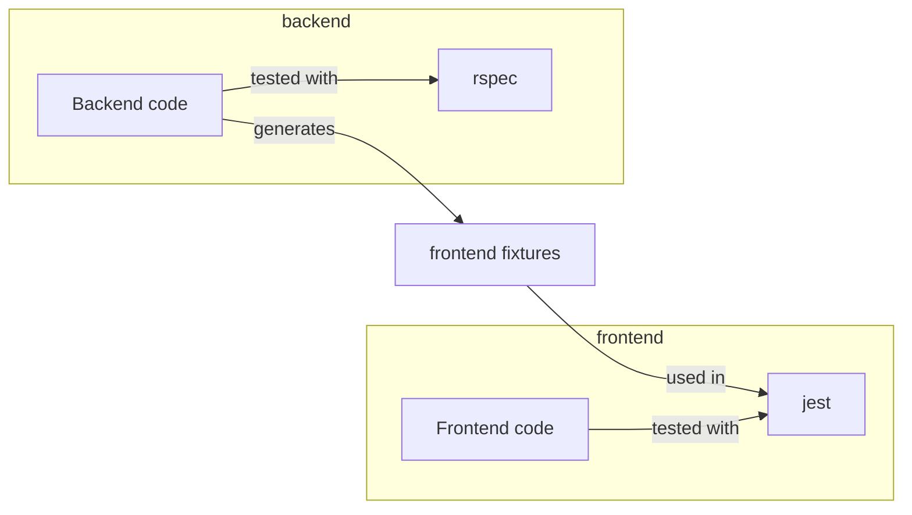
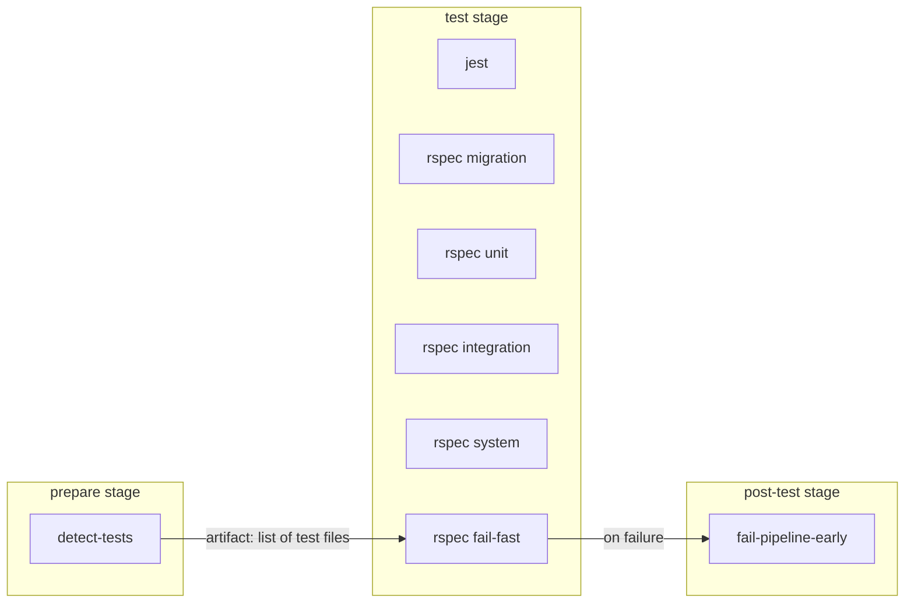
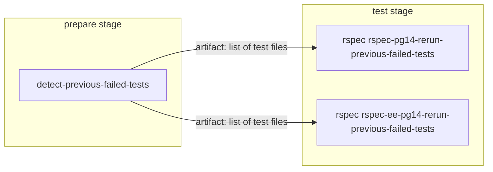
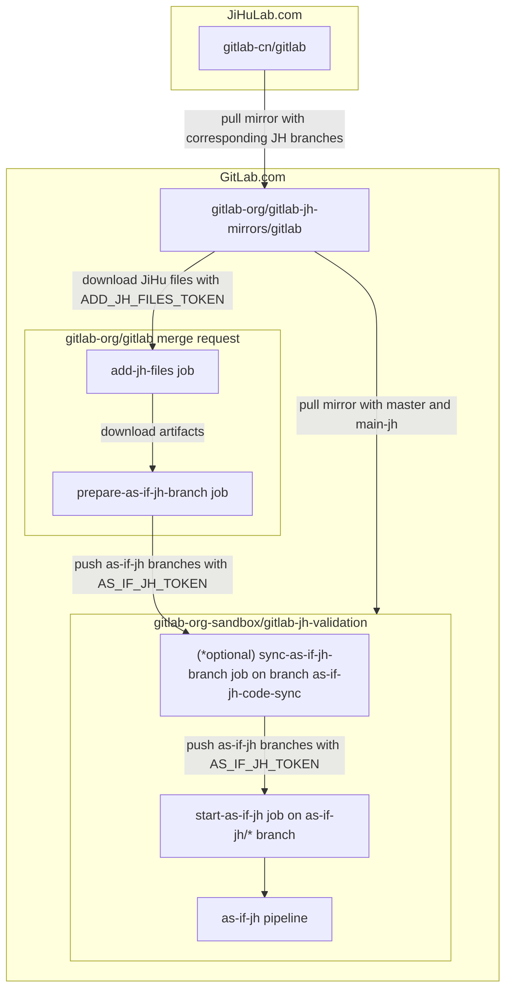
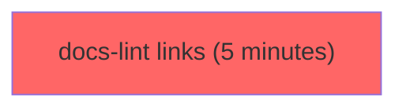
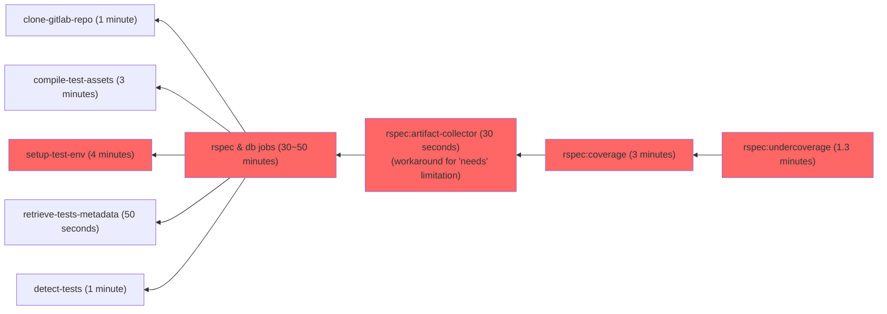
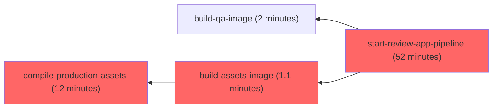
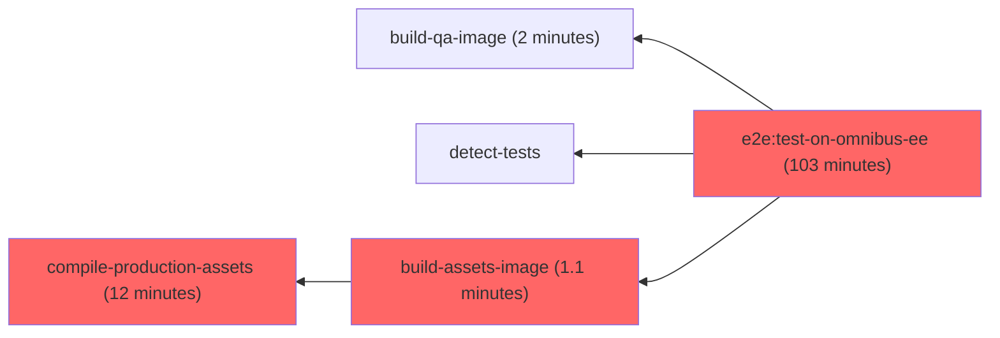

Pipelines for [`gitlab-org/gitlab`](https://gitlab.com/gitlab-org/gitlab) (as well as the `dev` instance's) is configured in the usual
[`.gitlab-ci.yml`](https://gitlab.com/gitlab-org/gitlab/-/blob/master/.gitlab-ci.yml)
which itself includes files under
[`.gitlab/ci/`](https://gitlab.com/gitlab-org/gitlab/-/tree/master/.gitlab/ci)
for easier maintenance.

We're striving to [dogfood](https://handbook.gitlab.com/handbook/engineering/development/principles/#dogfooding)
GitLab [CI/CD features and best-practices](../../ci/_index.md) as much as possible.

Do not use [CI/CD components](../../ci/components/_index.md) in `gitlab-org/gitlab` pipelines
unless they are mirrored on the `dev.gitlab.com` instance. CI/CD components do not work across different instances,
and [cause failing pipelines](https://gitlab.com/gitlab-com/gl-infra/production/-/issues/17683#note_1795756077)
on the `dev.gitlab.com` mirror if they do not exist on that instance.

## Pipeline tiers

**under active development:** For more information, see [epic 58](https://gitlab.com/groups/gitlab-org/quality/engineering-productivity/-/epics/58).

A merge request will typically run several CI/CD pipelines. Depending on where the merge request is at in the approval process, we will trigger different kinds of pipelines. We call those kinds of pipelines **pipeline tiers**.

We currently have three tiers:

1. `pipeline::tier-1`: The merge request has no approvals
1. `pipeline::tier-2`: The merge request has at least one approval, but still requires more approvals
1. `pipeline::tier-3`: The merge request has all the approvals it needs

Typically, the lower the pipeline tier, the fastest the pipeline should be.
The higher the pipeline tier, the more confidence the pipeline should give us by running more tests

See the [Introduce "tiers" in MR pipelines](https://gitlab.com/groups/gitlab-org/quality/engineering-productivity/-/epics/58) epic for more information on the implementation.

## Predictive test jobs before a merge request is approved

**To reduce the pipeline cost and shorten the job duration, before a merge request is approved, the pipeline will run a predictive set of RSpec & Jest tests that are likely to fail for the merge request changes.**

After a merge request has been approved, the pipeline would contain the full RSpec & Jest tests. This will ensure that all tests
have been run before a merge request is merged.

### Overview of the GitLab project test dependency

To understand how the predictive test jobs are executed, we need to understand the dependency between
GitLab code (frontend and backend) and the respective tests (Jest and RSpec).
This dependency can be visualized in the following diagram:

In summary:

- RSpec tests are dependent on the backend code.
- Jest tests are dependent on both frontend and backend code, the latter through the frontend fixtures.

### Predictive Tests Dashboards

- <https://10az.online.tableau.com/#/site/gitlab/views/DRAFTTestIntelligenceAccuracy/TestIntelligenceAccuracy>

### The `detect-tests` CI job

Most CI/CD pipelines for `gitlab-org/gitlab` will run a [`detect-tests` CI job](https://gitlab.com/gitlab-org/gitlab/-/blob/2348d57cf4710f89b96b25de0cf33a455d38325e/.gitlab/ci/setup.gitlab-ci.yml#L115-154) in the `prepare` stage to detect which backend/frontend tests should be run based on the files that changed in the given MR.

The `detect-tests` job will create many files that will contain the backend/frontend tests that should be run. Those files will be read in subsequent jobs in the pipeline, and only those tests will be executed.

### RSpec predictive jobs

#### Determining predictive RSpec test files in a merge request

To identify the RSpec tests that are likely to fail in a merge request, we use *dynamic mappings* and *static mappings*.

##### Dynamic mappings

First, we use the [`test_file_finder` gem](https://gitlab.com/gitlab-org/ruby/gems/test_file_finder), with dynamic mapping strategies coming from the [`Crystalball` gem](https://github.com/toptal/crystalball))
  ([see where it's used](https://gitlab.com/gitlab-org/gitlab/-/blob/2348d57cf4710f89b96b25de0cf33a455d38325e/tooling/lib/tooling/find_tests.rb#L20), and [the mapping strategies we use in Crystalball](https://gitlab.com/gitlab-org/gitlab/-/blob/master/spec/crystalball_env.rb)).

In addition to `test_file_finder`, we have added several advanced mappings to detect even more tests to run:

- [`FindChanges`](https://gitlab.com/gitlab-org/gitlab/-/blob/28943cbd8b6d7e9a350d00e5ea5bb52123ee14a4/tooling/lib/tooling/find_changes.rb) ([!74003](https://gitlab.com/gitlab-org/gitlab/-/merge_requests/74003))
  - Automatically detect Jest tests to run upon backend changes (via frontend fixtures)
- [`PartialToViewsMappings`](https://gitlab.com/gitlab-org/gitlab/-/blob/28943cbd8b6d7e9a350d00e5ea5bb52123ee14a4/tooling/lib/tooling/mappings/partial_to_views_mappings.rb) ([#395016](https://gitlab.com/gitlab-org/gitlab/-/issues/395016))
  - Run view specs when Rails partials included in those views are changed in an MR
- [`JsToSystemSpecsMappings`](https://gitlab.com/gitlab-org/gitlab/-/blob/28943cbd8b6d7e9a350d00e5ea5bb52123ee14a4/tooling/lib/tooling/mappings/js_to_system_specs_mappings.rb) ([#386754](https://gitlab.com/gitlab-org/gitlab/-/issues/386754))
  - Run certain system specs if a JavaScript file was changed in an MR
- [`GraphqlBaseTypeMappings`](https://gitlab.com/gitlab-org/gitlab/-/blob/28943cbd8b6d7e9a350d00e5ea5bb52123ee14a4/tooling/lib/tooling/mappings/graphql_base_type_mappings.rb) ([#386756](https://gitlab.com/gitlab-org/gitlab/-/issues/386756))
  - If a GraphQL type class changed, we should try to identify the other GraphQL types that potentially include this type, and run their specs.
- [`ViewToSystemSpecsMappings`](https://gitlab.com/gitlab-org/gitlab/-/blob/28943cbd8b6d7e9a350d00e5ea5bb52123ee14a4/tooling/lib/tooling/mappings/view_to_system_specs_mappings.rb) ([#395017](https://gitlab.com/gitlab-org/gitlab/-/issues/395017))
  - When a view gets changed, we try to find feature specs that would test that area of the code.
- [`ViewToJsMappings`](https://gitlab.com/gitlab-org/gitlab/-/blob/8d7dfb7c043adf931128088b9ffab3b4a39af6f5/tooling/lib/tooling/mappings/view_to_js_mappings.rb) ([#386719](https://gitlab.com/gitlab-org/gitlab/-/issues/386719))
  - If a JS file is changed, we should try to identify the system specs that are covering this JS component.
- [`FindFilesUsingFeatureFlags`](https://gitlab.com/gitlab-org/gitlab/-/blob/master/tooling/lib/tooling/find_files_using_feature_flags.rb) ([#407366](https://gitlab.com/gitlab-org/gitlab/-/issues/407366))
  - If a feature flag was changed, we check which Ruby file is including that feature flag, and we add it to the list of changed files in the detect-tests CI job. The remainder of the job will then detect which frontend/backend tests should be run based on those changed files.

##### Static mappings

We use the [`test_file_finder` gem](https://gitlab.com/gitlab-org/ruby/gems/test_file_finder), with a static mapping maintained in the [`tests.yml` file](https://gitlab.com/gitlab-org/gitlab/-/blob/master/tests.yml) for special cases that cannot
  be mapped via dynamic mappings ([see where it's used](https://gitlab.com/gitlab-org/gitlab/-/blob/2348d57cf4710f89b96b25de0cf33a455d38325e/tooling/lib/tooling/find_tests.rb#L17)).

The [test mappings](https://gitlab.com/gitlab-org/gitlab/-/blob/master/tests.yml) contain a map of each source files to a list of test files which is dependent of the source file.

#### Exceptional cases

In addition, there are a few circumstances where we would always run the full RSpec tests:

- when the `pipeline:run-all-rspec` label is set on the merge request. This label will trigger all RSpec tests including those run in the `as-if-foss` jobs.
- when the `pipeline:mr-approved` label is set on the merge request, and if the code changes satisfy the `backend-patterns` rule. Note that this label is assigned by triage automation when the merge request is approved by any reviewer. It is not recommended to apply this label manually.
- when the merge request is created by an automation (for example, Gitaly update or MR targeting a stable branch)
- when the merge request is created in a security mirror
- when any CI configuration file is changed (for example, `.gitlab-ci.yml` or `.gitlab/ci/**/*`)

#### Have you encountered a problem with backend predictive tests?

If so, have a look at [the Engineering Productivity RUNBOOK on predictive tests](https://gitlab.com/gitlab-org/quality/engineering-productivity/team/-/blob/main/runbooks/predictive-tests.md) for instructions on how to act upon predictive tests issues. Additionally, if you identified any test selection gaps, let `@gl-dx/eng-prod` know so that we can take the necessary steps to optimize test selections.

### Jest predictive jobs

#### Determining predictive Jest test files in a merge request

To identify the jest tests that are likely to fail in a merge request, we pass a list of all the changed files into `jest` using the [`--findRelatedTests`](https://jestjs.io/docs/cli#--findrelatedtests-spaceseparatedlistofsourcefiles) option.
In this mode, `jest` would resolve all the dependencies of related to the changed files, which include test files that have these files in the dependency chain.

#### Exceptional cases

In addition, there are a few circumstances where we would always run the full Jest tests:

- when the `pipeline:run-all-jest` label is set on the merge request
- when the merge request is created by an automation (for example, Gitaly update or MR targeting a stable branch)
- when the merge request is created in a security mirror
- when relevant CI configuration file is changed (`.gitlab/ci/rules.gitlab-ci.yml`, `.gitlab/ci/frontend.gitlab-ci.yml`)
- when any frontend dependency file is changed (for example, `package.json`, `yarn.lock`, `config/webpack.config.js`, `config/helpers/**/*.js`)
- when any vendored JavaScript file is changed (for example, `vendor/assets/javascripts/**/*`)

The `rules` definitions for full Jest tests are defined at `.frontend:rules:jest` in
[`rules.gitlab-ci.yml`](https://gitlab.com/gitlab-org/gitlab/-/blob/42321b18b946c64d2f6f788c38844499a5ae9141/.gitlab/ci/rules.gitlab-ci.yml#L938-955).

#### Have you encountered a problem with frontend predictive tests?

If so, have a look at [the Engineering Productivity RUNBOOK on predictive tests](https://gitlab.com/gitlab-org/quality/engineering-productivity/team/-/blob/main/runbooks/predictive-tests.md) for instructions on how to act upon predictive tests issues.

### Fork pipelines

We run only the predictive RSpec & Jest jobs for fork pipelines, unless the `pipeline:run-all-rspec`
label is set on the MR. The goal is to reduce the compute quota consumed by fork pipelines.

See the [experiment issue](https://gitlab.com/gitlab-org/quality/quality-engineering/team-tasks/-/issues/1170).

## Fail-fast job in merge request pipelines

To provide faster feedback when a merge request breaks existing tests, we implemented a fail-fast mechanism.

An `rspec fail-fast` job is added in parallel to all other `rspec` jobs in a merge
request pipeline. This job runs the tests that are directly related to the changes
in the merge request.

If any of these tests fail, the `rspec fail-fast` job fails, triggering a
`fail-pipeline-early` job to run. The `fail-pipeline-early` job:

- Cancels the currently running pipeline and all in-progress jobs.
- Sets pipeline to have status `failed`.

For example:

The `rspec fail-fast` is a no-op if there are more than 10 test files related to the
merge request. This prevents `rspec fail-fast` duration from exceeding the average
`rspec` job duration and defeating its purpose.

This number can be overridden by setting a CI/CD variable named `RSPEC_FAIL_FAST_TEST_FILE_COUNT_THRESHOLD`.

## Re-run previously failed tests in merge request pipelines

In order to reduce the feedback time after resolving failed tests for a merge request, the `rspec rspec-pg14-rerun-previous-failed-tests`
and `rspec rspec-ee-pg14-rerun-previous-failed-tests` jobs run the failed tests from the previous MR pipeline.

This was introduced on August 25th 2021, with <https://gitlab.com/gitlab-org/gitlab/-/merge_requests/69053>.

### How it works?

1. The `detect-previous-failed-tests` job (`prepare` stage) detects the test files associated with failed RSpec
   jobs from the previous MR pipeline.
1. The `rspec rspec-pg14-rerun-previous-failed-tests` and `rspec rspec-ee-pg14-rerun-previous-failed-tests` jobs
   will run the test files gathered by the `detect-previous-failed-tests` job.

## Merge trains

### Current usage

[We started using merge trains in June 2024](https://gitlab.com/gitlab-org/gitlab/-/merge_requests/154540).

At the moment, **Merge train pipelines don't run any tests**: they only enforce the
["Merging a merge request" guidelines](../code_review.md#merging-a-merge-request)
that already existed before the enablement of merge trains, but that we couldn't easily enforce.

Merge train pipelines run a single `pre-merge-checks` job which ensures the latest pipeline before merge is:

1. A [Merged Results pipeline](../../ci/pipelines/merged_results_pipelines.md)
1. A [`tier-3` pipeline](#pipeline-tiers) (a full pipeline, not a predictive one)
1. Created at most 8 hours ago (72 hours for stable branches)

We opened [a feedback issue](https://gitlab.com/gitlab-org/quality/engineering-productivity/team/-/issues/513)
to iterate on this solution.

### Next iterations

We opened [a dedicated issue to discuss the next iteration for merge trains](https://gitlab.com/gitlab-org/quality/engineering-productivity/team/-/issues/516)
to actually start running tests in merge train pipelines.

### Challenges for enabling merge trains running "full" test pipelines

#### Why do we need to have a "stable" default branch?

If the default branch is unstable (for example, the CI/CD pipelines for the default branch are failing frequently), all of the merge requests pipelines that were added AFTER a faulty merge request pipeline would have to be **canceled** and **added back to the train**, which would create a lot of delays if the merge train is long.

#### How stable does the default branch have to be?

We don't have a specific number, but we need to have better numbers for flaky tests failures and infrastructure failures (see the [Master Broken Incidents RCA Dashboard](https://10az.online.tableau.com/#/site/gitlab/workbooks/2296993/views)).

## Faster feedback for some merge requests

### Broken `master` Fixes

When you need to [fix a broken `master`](https://handbook.gitlab.com/handbook/engineering/workflow/#resolution-of-broken-master), you can add the `pipeline::expedited` label to expedite the pipelines that run on the merge request.

Note that the merge request also needs to have the `master:broken` or `master:foss-broken` label set.

### Revert MRs

To make your Revert MRs faster, use the [revert MR template](https://gitlab.com/gitlab-org/gitlab/-/blob/master/.gitlab/merge_request_templates/Revert%20To%20Resolve%20Incident.md) **before** you create your merge request. It will apply the `pipeline::expedited` label and others that will expedite the pipelines that run on the merge request.

### The `pipeline::expedited` label

When this label is assigned, the following steps of the CI/CD pipeline are skipped:

- The `e2e:test-on-omnibus` job.
- The `rspec:undercoverage` job.
- The entire [review apps process](../testing_guide/review_apps.md).

Apply the label to the merge request, and run a new pipeline for the MR.

## Test jobs

We have dedicated jobs for each [testing level](../testing_guide/testing_levels.md) and each job runs depending on the
changes made in your merge request.
If you want to force all the RSpec jobs to run regardless of your changes, you can add the `pipeline:run-all-rspec` label to the merge request.

WARNING:
Forcing all jobs on docs only related MRs would not have the prerequisite jobs and would lead to errors

### End-to-end jobs

The [`e2e:test-on-omnibus`](../testing_guide/end_to_end/_index.md#using-the-test-on-omnibus-job) child pipeline
runs end-to-end jobs automatically depending on changes, and is manual in other cases.
See `.qa:rules:test-on-omnibus` in
[`rules.gitlab-ci.yml`](https://gitlab.com/gitlab-org/gitlab/-/blob/master/.gitlab/ci/rules.gitlab-ci.yml) for
the specific list of rules.

If you want to force `e2e:test-on-omnibus` to run regardless of your changes, you can add the
`pipeline:run-all-e2e` label to the merge request.

The [`e2e:test-on-gdk`](../testing_guide/end_to_end/_index.md#using-the-test-on-gdk-job) child pipeline runs
E2E specs automatically for all `code patterns changes`. See `.qa:rules:e2e:test-on-gdk` in  [`rules.gitlab-ci.yml`](https://gitlab.com/gitlab-org/gitlab/-/blob/master/.gitlab/ci/rules.gitlab-ci.yml) for specific set of rules.

Consult the [End-to-end Testing](../testing_guide/end_to_end/_index.md) dedicated page for more information.

### Observability end-to-end jobs

The [GitLab Observability Backend](https://gitlab.com/gitlab-org/opstrace/opstrace) has dedicated [end-to-end tests](https://gitlab.com/gitlab-org/opstrace/opstrace/-/tree/main/test/e2e/frontend) that run against a GitLab instance. These tests are designed to ensure the integration between GitLab and the Observability Backend is functioning correctly.

The GitLab pipeline has dedicated jobs (see [`observability-backend.gitlab-ci.yml`](https://gitlab.com/gitlab-org/gitlab/-/blob/master/.gitlab/ci/observability-backend.gitlab-ci.yml)) that can be executed from GitLab MRs. These jobs will trigger the E2E tests on the GitLab Observability Backend pipeline against a GitLab instance built from the GitLab MR branch. These jobs are useful to make sure that the GitLab changes under review will not break E2E tests on the GitLab Observability Backend pipeline.

There are two Observability end-to-end jobs:

- `e2e:observability-backend-main-branch`: executes the tests against the main branch of the GitLab Observability Backend.
- `e2e:observability-backend`: executes the tests against a branch of the GitLab Observability Backend with the same name as the MR branch.

The Observability E2E jobs are triggered automatically **only** for merge requests that touch relevant files, such as those in the `lib/gitlab/observability/` directory or specific configuration files related to observability features.

To run these jobs manually, you can add the `pipeline:run-observability-e2e-tests-main-branch` or `pipeline:run-observability-e2e-tests-current-branch` label to your merge request.

In the following example workflow, a developer creates an MR that touches Observability code and uses Observability end-to-end jobs:

1. A developer creates a GitLab MR that touches observability code. The MR automatically executes the `e2e:observability-backend-main-branch` job.
1. If `e2e:observability-backend-main-branch` fails, it means that either the MR broke something (and needs fixing), or the MR made changes that requires the e2e tests to be updated.
1. To update the e2e tests, the developer should:
   1. Create a branch in the GitLab Observability Backend [repository](https://gitlab.com/gitlab-org/opstrace/opstrace), with the same name as the GitLab branch containing the breaking changes.
   1. Fix the [e2e tests](https://gitlab.com/gitlab-org/opstrace/opstrace/-/tree/main/test/e2e/frontend).
   1. Create a merge request with the changes.
1. The developer should add the `pipeline:run-observability-e2e-tests-current-branch` label on the GitLab MR and wait for the `e2e:observability-backend` job to succeed.
1. If `e2e:observability-backend` succeeds, the developer can merge both MRs.

In addition, the developer can manually add `pipeline:run-observability-e2e-tests-main-branch` to force the MR to run the `e2e:observability-backend-main-branch` job. This could be useful in case of changes to files that are not being tracked as related to observability.

There might be situations where the developer would need to skip those tests. To skip tests:

- For an MR, apply the label `pipeline:skip-observability-e2e-tests label`.
- For a whole project, set the CI variable `SKIP_GITLAB_OBSERVABILITY_BACKEND_TRIGGER`.

### Review app jobs

The [`start-review-app-pipeline`](../testing_guide/review_apps.md) child pipeline deploys a Review App and runs
end-to-end tests against it automatically depending on changes, and is manual in other cases.
See `.review:rules:start-review-app-pipeline` in
[`rules.gitlab-ci.yml`](https://gitlab.com/gitlab-org/gitlab/-/blob/master/.gitlab/ci/rules.gitlab-ci.yml) for
the specific list of rules.

If you want to force a Review App to be deployed regardless of your changes, you can add the
`pipeline:run-review-app` label to the merge request.

Consult the [review apps](../testing_guide/review_apps.md) dedicated page for more information.

### As-if-FOSS jobs and cross project downstream pipeline

To ensure the relevant changes are working properly in the FOSS project,
under some conditions we also run:

- `* as-if-foss` jobs in the same pipeline
- Cross project downstream FOSS pipeline

The `* as-if-foss` jobs run the GitLab test suite "as if FOSS", meaning as if
the jobs would run in the context of `gitlab-org/gitlab-foss`. On the other
hand, cross project downstream FOSS pipeline actually runs inside the FOSS
project, which should be even closer to an actual FOSS environment.

We run them in the following cases:

- when the `pipeline:run-as-if-foss` label is set on the merge request
- when the merge request is created in the `gitlab-org/security/gitlab` project
- when CI configuration file is changed (for example, `.gitlab-ci.yml` or `.gitlab/ci/**/*`)

The `* as-if-foss` jobs are run in addition to the regular EE-context jobs.
They have the `FOSS_ONLY='1'` variable set and get the `ee/` folder removed
before the tests start running.

Cross project downstream FOSS pipeline simulates merging the merge request
into the default branch in the FOSS project instead, which removes a list of
files. The list can be found in
[`.gitlab/ci/as-if-foss.gitlab-ci.yml`](https://gitlab.com/gitlab-org/gitlab/-/blob/215d1e27d74cbebaa787d35bf7dcabc5c34ebf86/.gitlab/ci/as-if-foss.gitlab-ci.yml#L22-30)
and in
[`merge-train/bin/merge-train`](https://gitlab.com/gitlab-org/merge-train/-/blob/041d942ae1b5615703b7a786982340b61620e7c5/bin/merge-train#L228-239).

The intent is to ensure that a change doesn't introduce a failure after
`gitlab-org/gitlab` is synced to `gitlab-org/gitlab-foss`.

#### Tokens set in the project variables

- `AS_IF_FOSS_TOKEN`: This is a [GitLab FOSS](https://gitlab.com/gitlab-org/gitlab-foss)
  project token with `developer` role and `write_repository` permission,
  to push generated `as-if-foss/*` branch.
  - Note that the same name for the security project should use another token
    from the security FOSS project, so that we never push security changes to
    a public project.

### As-if-JH cross project downstream pipeline

#### What it is

This pipeline is also called [JiHu validation pipeline](https://handbook.gitlab.com/handbook/ceo/chief-of-staff-team/jihu-support/jihu-validation-pipelines/),
and it's currently allowed to fail. When that happens, follow
[What to do when the validation pipeline fails](https://handbook.gitlab.com/handbook/ceo/chief-of-staff-team/jihu-support/jihu-validation-pipelines/#what-to-do-when-the-validation-pipeline-failed).

#### How we run it

The `start-as-if-jh` job triggers a cross project downstream pipeline which
runs the GitLab test suite "as if JiHu", meaning as if the pipeline would run
in the context of [GitLab JH](../jh_features_review.md). These jobs are only
created in the following cases:

- when changes are made to feature flags
- when the `pipeline:run-as-if-jh` label is set on the merge request

This pipeline runs under the context of a generated branch in the
[GitLab JH validation](https://gitlab.com/gitlab-org-sandbox/gitlab-jh-validation)
project, which is a mirror of the
[GitLab JH mirror](https://gitlab.com/gitlab-org/gitlab-jh-mirrors/gitlab).

The generated branch name is prefixed with `as-if-jh/` along with the branch
name in the merge request. This generated branch is based on the merge request
branch, additionally adding changes downloaded from the
[corresponding JH branch](#corresponding-jh-branch) on top to turn the whole
pipeline as if JiHu.

The intent is to ensure that a change doesn't introduce a failure after
[GitLab](https://gitlab.com/gitlab-org/gitlab) is synchronized to
[GitLab JH](https://jihulab.com/gitlab-cn/gitlab).

#### When to consider applying `pipeline:run-as-if-jh` label

If a Ruby file is renamed and there's a corresponding [`prepend_mod` line](../jh_features_review.md#jh-features-based-on-ce-or-ee-features),
it's likely that GitLab JH is relying on it and requires a corresponding
change to rename the module or class it's prepending.

#### Corresponding JH branch

You can create a corresponding JH branch on [GitLab JH](https://jihulab.com/gitlab-cn/gitlab) by
appending `-jh` to the branch name. If a corresponding JH branch is found,
as-if-jh pipeline grabs files from the respective branch, rather than from the
default branch `main-jh`.

NOTE:
For now, CI will try to fetch the branch on the [GitLab JH mirror](https://gitlab.com/gitlab-org/gitlab-jh-mirrors/gitlab), so it might take some time for the new JH branch to propagate to the mirror.

NOTE:
While [GitLab JH validation](https://gitlab.com/gitlab-org-sandbox/gitlab-jh-validation) is a mirror of
[GitLab JH mirror](https://gitlab.com/gitlab-org/gitlab-jh-mirrors/gitlab),
it does not include any corresponding JH branch beside the default `main-jh`.
This is why when we want to fetch corresponding JH branch we should fetch it
from the main mirror, rather than the validation project.

#### How as-if-JH pipeline was configured

The whole process looks like this:

NOTE:
We only run `sync-as-if-jh-branch` when there are dependencies changes.

##### Tokens set in the project variables

- `ADD_JH_FILES_TOKEN`: This is a [GitLab JH mirror](https://gitlab.com/gitlab-org/gitlab-jh-mirrors/gitlab)
  project token with `read_api` permission, to be able to download JiHu files.
- `AS_IF_JH_TOKEN`: This is a [GitLab JH validation](https://gitlab.com/gitlab-org-sandbox/gitlab-jh-validation)
  project token with `developer` role and `write_repository` permission,
  to push generated `as-if-jh/*` branch.

##### How we generate the as-if-JH branch

First `add-jh-files` job will download the required JiHu files from the
corresponding JH branch, saving in artifacts. Next `prepare-as-if-jh-branch`
job will create a new branch from the merge request branch, commit the
changes, and finally push the branch to the
[validation project](https://gitlab.com/gitlab-org-sandbox/gitlab-jh-validation).

Optionally, if the merge requests have changes to the dependencies, we have an
additional step to run `sync-as-if-jh-branch` job to trigger a downstream
pipeline on [`as-if-jh-code-sync` branch](https://gitlab.com/gitlab-org-sandbox/gitlab-jh-validation/-/blob/as-if-jh-code-sync/jh/.gitlab-ci.yml)
in the validation project. This job will perform the same process as
[JiHu code-sync](https://jihulab.com/gitlab-cn/code-sync/-/blob/main-jh/.gitlab-ci.yml), making sure the dependencies changes can be brought to the
as-if-jh branch prior to run the validation pipeline.

If there are no dependencies changes, we don't run this process.

##### How we trigger and run the as-if-JH pipeline

After having the `as-if-jh/*` branch prepared and optionally synchronized,
`start-as-if-jh` job will trigger a pipeline in the
[validation project](https://gitlab.com/gitlab-org-sandbox/gitlab-jh-validation)
to run the cross-project downstream pipeline.

##### How the GitLab JH mirror project is set up

The [GitLab JH mirror](https://gitlab.com/gitlab-org/gitlab-jh-mirrors/gitlab) project is private and CI is disabled.

It's a pull mirror pulling from [GitLab JH](https://jihulab.com/gitlab-cn/gitlab),
mirroring all branches, overriding divergent refs, triggering no pipelines
when mirror is updated.

The pulling user is [`@gitlab-jh-validation-bot`](https://gitlab.com/gitlab-jh-validation-bot), who
is a maintainer in the project. The credentials can be found in the 1password
engineering vault.

No password is used from mirroring because GitLab JH is a public project.

##### How the GitLab JH validation project is set up

This [GitLab JH validation](https://gitlab.com/gitlab-org-sandbox/gitlab-jh-validation) project is public and CI is enabled, with temporary
project variables set.

It's a pull mirror pulling from [GitLab JH mirror](https://gitlab.com/gitlab-org/gitlab-jh-mirrors/gitlab),
mirroring specific branches: `(master|main-jh)`, overriding
divergent refs, triggering no pipelines when mirror is updated.

The pulling user is [`@gitlab-jh-validation-bot`](https://gitlab.com/gitlab-jh-validation-bot), who is a maintainer in the project, and also a
maintainer in the
[GitLab JH mirror](https://gitlab.com/gitlab-org/gitlab-jh-mirrors/gitlab).
The credentials can be found in the 1password engineering vault.

A personal access token from `@gitlab-jh-validation-bot` with
`write_repository` permission is used as the password to pull changes from
the GitLab JH mirror. Username is set with `gitlab-jh-validation-bot`.

There is also a [pipeline schedule](https://gitlab.com/gitlab-org-sandbox/gitlab-jh-validation/-/pipeline_schedules)
to run maintenance pipelines with variable `SCHEDULE_TYPE` set to `maintenance`
running every day, updating cache.

The default CI/CD configuration file is also set at `jh/.gitlab-ci.yml` so it
runs exactly like [GitLab JH](https://jihulab.com/gitlab-cn/gitlab/-/blob/main-jh/jh/.gitlab-ci.yml).

Additionally, a special branch
[`as-if-jh-code-sync`](https://gitlab.com/gitlab-org-sandbox/gitlab-jh-validation/-/blob/as-if-jh-code-sync/jh/.gitlab-ci.yml)
is set and protected. Maintainers can push and developers can merge for this
branch. We need to set it so developers can merge because we need to let
developers to trigger pipelines for this branch. This is a compromise
before we resolve [Developer-level users no longer able to run pipelines on protected branches](https://gitlab.com/gitlab-org/gitlab/-/issues/230939).

It's used to run `sync-as-if-jh-branch` to synchronize the dependencies
when the merge requests changed the dependencies. See
[How we generate the as-if-JH branch](#how-we-generate-the-as-if-jh-branch)
for how it works.

###### Temporary GitLab JH validation project variables

- `BUNDLER_CHECKSUM_VERIFICATION_OPT_IN` is set to `false`
  - We can remove this variable after JiHu has
    [`jh/Gemfile.checksum`](https://jihulab.com/gitlab-cn/gitlab/-/blob/main-jh/jh/Gemfile.checksum)
    committed. More context can be found at:
    [Setting it to `false` to skip it](https://gitlab.com/gitlab-org/gitlab/-/merge_requests/118938#note_1374688877)

##### Why do we have both the mirror project and validation project?

We have separate projects for a several reasons.

- **Security**: Previously, we had the mirror project only. However, to fully
  mitigate a [security issue](https://gitlab.com/gitlab-org/gitlab/-/issues/369898),
  we had to make the mirror project private.
- **Isolation**: We want to run JH code in a completely isolated and standalone project.
  We should not run it under the `gitlab-org` group, which is where the mirror
  project is. The validation project is completely isolated.
- **Cost**: We don't want to connect to JiHuLab.com from each merge request.
  It is more cost effective to mirror the code from JiHuLab.com to
  somewhere at GitLab.com, and have our merge requests fetch code from there.
  This means that the validation project can fetch code from the mirror, rather
  than from JiHuLab.com. The mirror project will periodically fetch from
  JiHuLab.com.
- **Branch separation/security/efficiency**: We want to mirror all branches,
  so that we can fetch the corresponding JH branch from JiHuLab.com. However,
  we don't want to overwrite the `as-if-jh-code-sync` branch in the validation project,
  because we use it to control the validation pipeline and it has access to
  `AS_IF_JH_TOKEN`. However, we cannot mirror all branches except a single
  one. See [this issue](https://gitlab.com/gitlab-org/gitlab/-/issues/413032) for details.

  Given this issue, the validation project is set to only mirror `master` and
  `main-jh`. Technically, we don't even need those branches, but we do want to
  keep the repository up-to-date with all the default branches so that when
  we push changes from the merge request, we only need to push changes from
  the merge request, which can be more efficient.

- Separation of concerns:
  - Validation project only has the following branches:
    - `master` and `main-jh` to keep changes up-to-date.
    - `as-if-jh-code-sync` for dependency synchronization.
      We should never mirror this.
    - `as-if-jh/*` branches from the merge requests.
      We should never mirror these.
  - All branches from the mirror project are all coming from JiHuLab.com.
    We never push anything to the mirror project, nor does it run any
    pipelines. CI/CD is disabled in the mirror project.

We can consider merging the two projects to simplify the
setup and process, but we need to make sure that all of these reasons
are no longer concerns.

### `rspec:undercoverage` job

The `rspec:undercoverage` job runs [`undercover`](https://rubygems.org/gems/undercover)
to detect, and fail if any changes introduced in the merge request has zero coverage.

The `rspec:undercoverage` job obtains coverage data from the `rspec:coverage`
job.

If the `rspec:undercoverage` job detects missing coverage due to a CE method being overridden in EE, add the `pipeline:run-as-if-foss` label to the merge request and start a new pipeline.

In the event of an emergency, or false positive from this job, add the
`pipeline:skip-undercoverage` label to the merge request to allow this job to
fail.

#### Troubleshooting `rspec:undercoverage` failures

The `rspec:undercoverage` job has [known bugs](https://gitlab.com/groups/gitlab-org/-/epics/8254)
that can cause false positive failures. Such false positive failures may also happen if you are updating database migration that is too old.
You can test coverage locally to determine if it's safe to apply `pipeline:skip-undercoverage`. For example, using `<spec>` as the name of the
test causing the failure:

1. Run `RUN_ALL_MIGRATION_TESTS=1 SIMPLECOV=1 bundle exec rspec <spec>`.
1. Run `scripts/undercoverage`.

If these commands return `undercover: ✅ No coverage is missing in latest changes` then you can apply `pipeline:skip-undercoverage` to bypass pipeline failures.

### `pajamas_adoption` job

> - [Introduced](https://gitlab.com/gitlab-org/gitlab/-/merge_requests/141368) in GitLab 16.8.

The `pajamas_adoption` job runs the [Pajamas Adoption Scanner](https://gitlab-org.gitlab.io/frontend/pajamas-adoption-scanner/) in merge requests to prevent regressions in the adoption of the [Pajamas Design System](https://design.gitlab.com/).

The job fails if the scanner detects regressions caused by a merge request. If the regressions cannot be fixed in the merge request, add the `pipeline:skip-pajamas-adoption` label to the merge request, then retry the job.

## Test suite parallelization

Our current RSpec tests parallelization setup is as follows:

1. The `retrieve-tests-metadata` job in the `prepare` stage ensures we have a
   `knapsack/report-master.json` file:
   - The `knapsack/report-master.json` file is fetched from the latest `main` pipeline which runs `update-tests-metadata`
     (for now it's the 2-hourly `maintenance` scheduled master pipeline), if it's not here we initialize the file with `{}`.
1. Each `[rspec|rspec-ee] [migration|unit|integration|system|geo] n m` job are run with
   `knapsack rspec` and should have an evenly distributed share of tests:
   - It works because the jobs have access to the `knapsack/report-master.json`
     since the "artifacts from all previous stages are passed by default".
   - the jobs set their own report path to
     `"knapsack/${TEST_TOOL}_${TEST_LEVEL}_${DATABASE}_${CI_NODE_INDEX}_${CI_NODE_TOTAL}_report.json"`.
   - if knapsack is doing its job, test files that are run should be listed under
     `Report specs`, not under `Leftover specs`.
1. The `update-tests-metadata` job (which only runs on scheduled pipelines for
   [the canonical project](https://gitlab.com/gitlab-org/gitlab) and updates the `knapsack/report-master.json` in 2 ways:
   1. By default, it takes all the `knapsack/rspec*.json` files and merge them all together into a single
      `knapsack/report-master.json` file that is saved as artifact.
   1. (Experimental) When the `AVERAGE_KNAPSACK_REPORT` environment variable is set to `true`, instead of merging the reports, the job will calculate the average of the test duration between `knapsack/report-master.json` and `knapsack/rspec*.json` to reduce the performance impact from potentially random factors such as spec ordering, runner hardware differences, flaky tests, etc.
      This experimental approach is aimed to better predict the duration for each spec files to distribute load among parallel jobs more evenly so the jobs can finish around the same time.

After that, the next pipeline uses the up-to-date `knapsack/report-master.json` file.

## Flaky tests

### Automatic skipping of flaky tests

We used to skip tests that are [known to be flaky](../testing_guide/unhealthy_tests.md#automatic-retries-and-flaky-tests-detection),
but we stopped doing so since that could actually lead to actual broken `master`.
Instead, we introduced
[a fast-quarantining process](../testing_guide/unhealthy_tests.md#fast-quarantine)
to proactively quarantine any flaky test reported in `#master-broken` incidents.

This fast-quarantining process can be disabled by setting the `$FAST_QUARANTINE`
variable to `false`.

### Automatic retry of failing tests in a separate process

Unless `$RETRY_FAILED_TESTS_IN_NEW_PROCESS` variable is set to `false` (`true` by default), RSpec tests that failed are automatically retried once in a separate
RSpec process. The goal is to get rid of most side-effects from previous tests that may lead to a subsequent test failure.

We keep track of retried tests in the `$RETRIED_TESTS_REPORT_FILE` file saved as artifact by the `rspec:flaky-tests-report` job.

See the [experiment issue](https://gitlab.com/gitlab-org/quality/quality-engineering/team-tasks/-/issues/1148).

## Compatibility testing

By default, we run all tests with the versions that runs on GitLab.com.

Other versions (usually one back-compatible version, and one forward-compatible version) should be running in nightly scheduled pipelines.

Exceptions to this general guideline should be motivated and documented.

### Ruby versions testing

We're running Ruby 3.2 on GitLab.com, as well as for the default branch.
To prepare for the next Ruby version, we run merge requests in Ruby 3.3.
Please see the roadmap at
[Ruby 3.3 epic](https://gitlab.com/groups/gitlab-org/-/epics/12350)
for more details.

To make sure all supported Ruby versions are working, we also run our test
suite on dedicated 2-hourly scheduled pipelines for each supported versions.

For merge requests, you can add the following labels to run the respective
Ruby version only:

- `pipeline:run-in-ruby3_3`

### PostgreSQL versions testing

Our test suite runs against PostgreSQL 14 as GitLab.com runs on PostgreSQL 14 and
[Omnibus defaults to PG14 for new installs and upgrades](../../administration/package_information/postgresql_versions.md).

We run our test suite against PostgreSQL 14, 15 and 16 on nightly scheduled pipelines.

#### Current versions testing

| Where?                                                                                        | PostgreSQL version           | Ruby version          |
|-----------------------------------------------------------------------------------------------|------------------------------|-----------------------|
| Merge requests                                                                                | 14 (default version)         | 3.2 (default version) |
| `master` branch commits                                                                       | 14 (default version)         | 3.2 (default version) |
| `maintenance` scheduled pipelines for the `master` branch (every even-numbered hour at XX:05) | 14 (default version)         | 3.2 (default version) |
| `maintenance` scheduled pipelines for the `ruby-next` branch (every odd-numbered hour at XX:10) | 14 (default version)         | 3.3                   |
| `nightly` scheduled pipelines for the `master` branch                                         | 14 (default version), 15, 16 | 3.2 (default version) |

For the next Ruby versions we're testing against with, we run
maintenance scheduled pipelines every 2 hours on the `ruby-next` branch.
`ruby-next` must not have any changes. The branch is only there to run
pipelines with another Ruby version in the scheduled maintenance pipelines.

Additionally, we have scheduled pipelines running on `ruby-sync` branch also
every 2 hours, updating all next branches to be up-to-date with
the default branch `master`. No pipelines will be triggered by this push.

The `gitlab` job in the `ruby-sync` branch uses a `gitlab-org/gitlab` project
token named `RUBY_SYNC` with `write_repository` scope and `Maintainer` role,
expiring on 2025-12-02. The token is stored in the `RUBY_SYNC_TOKEN` variable
in the pipeline schedule for `ruby-sync` branch.

### Redis versions testing

Our test suite runs against Redis 6 as GitLab.com runs on Redis 6 and
[Omnibus defaults to Redis 6 for new installs and upgrades](https://gitlab.com/gitlab-org/omnibus-gitlab/-/blob/master/config/software/redis.rb).

We do run our test suite against Redis 7 on `nightly` scheduled pipelines, specifically when running forward-compatible PostgreSQL 15 jobs.

#### Current versions testing

| Where? | Redis version |
| ------ | ------------------ |
| MRs    | 6 |
| `default branch` (non-scheduled pipelines) | 6 |
| `nightly` scheduled pipelines | 7 |

### Single database testing

By default, all tests run with [multiple databases](../database/multiple_databases.md).

We also run tests with a single database in nightly scheduled pipelines, and in merge requests that touch database-related files.

Single database tests run in two modes:

1. **Single database with one connection**. Where GitLab connects to all the tables using one connection pool.
   This runs through all the jobs that end with `-single-db`
1. **Single database with two connections**. Where GitLab connects to `gitlab_main`, `gitlab_ci` database tables
   using different database connections. This runs through all the jobs that end with `-single-db-ci-connection`.

If you want to force tests to run with a single database, you can add the `pipeline:run-single-db` label to the merge request.

## Monitoring

The GitLab test suite is [monitored](../performance.md#rspec-profiling) for the `main` branch, and any branch
that includes `rspec-profile` in their name.

## Logging

- Rails logging to `log/test.log` is disabled by default in CI
  [for performance reasons](https://jtway.co/speed-up-your-rails-test-suite-by-6-in-1-line-13fedb869ec4).
  To override this setting, provide the
  `RAILS_ENABLE_TEST_LOG` environment variable.

## Pipelines types for merge requests

In general, pipelines for an MR fall into one of the following types (from shorter to longer), depending on the changes made in the MR:

- [Documentation pipeline](#documentation-pipeline): For MRs that touch documentation.
- [Backend pipeline](#backend-pipeline): For MRs that touch backend code.
- [Review app pipeline](#review-app-pipeline): For MRs that touch frontend code.
- [End-to-end pipeline](#end-to-end-pipeline): For MRs that touch code in the `qa/` folder.

A "pipeline type" is an abstract term that mostly describes the "critical path" (for example, the chain of jobs for which the sum
of individual duration equals the pipeline's duration).
We use these "pipeline types" in [metrics dashboards](https://10az.online.tableau.com/#/site/gitlab/views/GitlabPipelineDurations/SuccessfulMergeRequestPipelineDurationHistogramsbyTypes?:iid=1)
to detect what types and jobs need to be optimized first.

An MR that touches multiple areas would be associated with the longest type applicable. For instance, an MR that touches backend
and frontend would fall into the "Frontend" pipeline type since this type takes longer to finish than the "Backend" pipeline type.

We use the [`rules:`](../../ci/yaml/_index.md#rules) and [`needs:`](../../ci/yaml/_index.md#needs) keywords extensively
to determine the jobs that need to be run in a pipeline. Note that an MR that includes multiple types of changes would
have a pipelines that include jobs from multiple types (for example, a combination of docs-only and code-only pipelines).

Following are graphs of the critical paths for each pipeline type. Jobs that aren't part of the critical path are omitted.

### Documentation pipeline

[Reference pipeline](https://gitlab.com/gitlab-org/gitlab/-/pipelines/432049110).

### Backend pipeline

[Reference pipeline](https://gitlab.com/gitlab-org/gitlab/-/pipelines/1118782302).

### Review app pipeline

[Reference pipeline](https://gitlab.com/gitlab-org/gitlab/-/pipelines/431913287).

### End-to-end pipeline

[Reference pipeline](https://gitlab.com/gitlab-org/gitlab/-/pipelines/431918463).

## CI configuration internals

See the dedicated [CI configuration internals page](internals.md).

## Performance

See the dedicated [CI configuration performance page](performance.md).

---

[Return to Development documentation](../_index.md)
