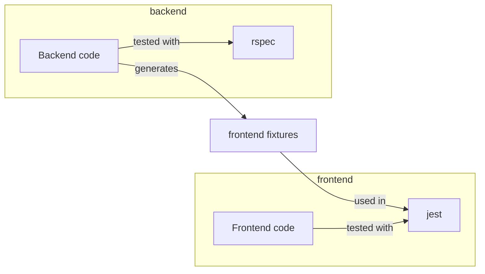
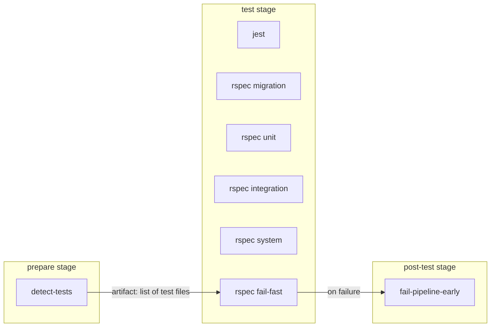
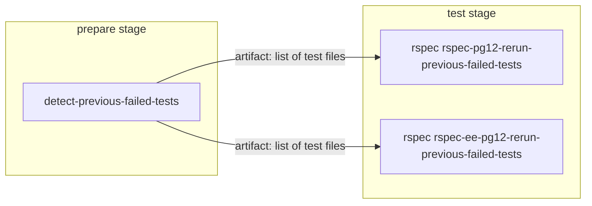
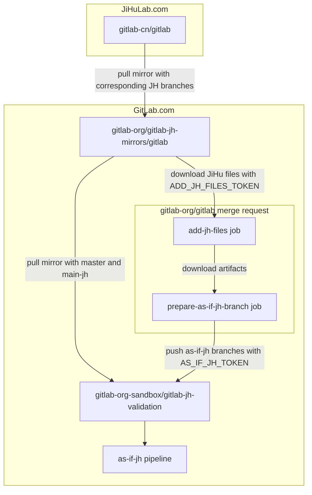
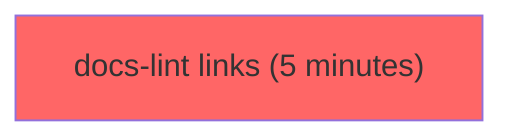
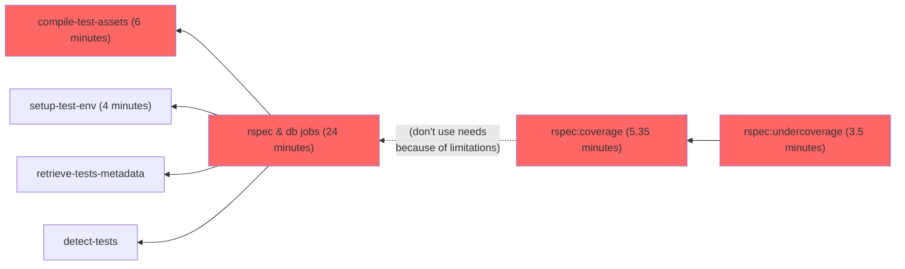
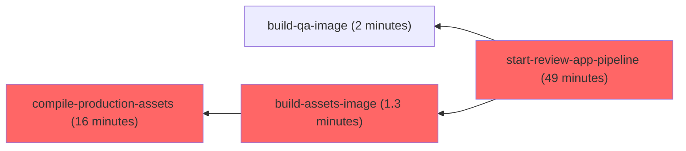
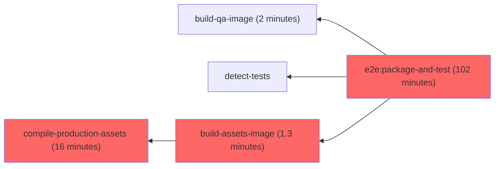

# Pipelines for the GitLab project

Pipelines for [`gitlab-org/gitlab`](https://gitlab.com/gitlab-org/gitlab) (as well as the `dev` instance's) is configured in the usual
[`.gitlab-ci.yml`](https://gitlab.com/gitlab-org/gitlab/-/blob/master/.gitlab-ci.yml)
which itself includes files under
[`.gitlab/ci/`](https://gitlab.com/gitlab-org/gitlab/-/tree/master/.gitlab/ci)
for easier maintenance.

We're striving to [dogfood](https://about.gitlab.com/handbook/engineering/development/principles/#dogfooding)
GitLab [CI/CD features and best-practices](../../ci/yaml/index.md)
as much as possible.

## Minimal test jobs before a merge request is approved

**To reduce the pipeline cost and shorten the job duration, before a merge request is approved, the pipeline will run a minimal set of RSpec & Jest tests that are related to the merge request changes.**

After a merge request has been approved, the pipeline would contain the full RSpec & Jest tests. This will ensure that all tests
have been run before a merge request is merged.

### Overview of the GitLab project test dependency

To understand how the minimal test jobs are executed, we need to understand the dependency between
GitLab code (frontend and backend) and the respective tests (Jest and RSpec).
This dependency can be visualized in the following diagram:

In summary:

- RSpec tests are dependent on the backend code.
- Jest tests are dependent on both frontend and backend code, the latter through the frontend fixtures.

### RSpec minimal jobs

#### Determining related RSpec test files in a merge request

To identify the minimal set of tests needed, we use the [`test_file_finder` gem](https://gitlab.com/gitlab-org/ci-cd/test_file_finder), with two strategies:

- dynamic mapping from test coverage tracing (generated via the [`Crystalball` gem](https://github.com/toptal/crystalball))
  ([see where it's used](https://gitlab.com/gitlab-org/gitlab/-/blob/47d507c93779675d73a05002e2ec9c3c467cd698/tooling/bin/find_tests#L15))
- static mapping maintained in the [`tests.yml` file](https://gitlab.com/gitlab-org/gitlab/-/blob/master/tests.yml) for special cases that cannot
  be mapped via coverage tracing ([see where it's used](https://gitlab.com/gitlab-org/gitlab/-/blob/47d507c93779675d73a05002e2ec9c3c467cd698/tooling/bin/find_tests#L12))

The test mappings contain a map of each source files to a list of test files which is dependent of the source file.

In the `detect-tests` job, we use this mapping to identify the minimal tests needed for the current merge request.

Later on in [the `rspec fail-fast` job](#fail-fast-job-in-merge-request-pipelines), we run the minimal tests needed for the current merge request.

#### Exceptional cases

In addition, there are a few circumstances where we would always run the full RSpec tests:

- when the `pipeline:run-all-rspec` label is set on the merge request. This label will trigger all RSpec tests including those run in the `as-if-foss` jobs.
- when the `pipeline:mr-approved` label is set on the merge request, and if the code changes satisfy the `backend-patterns` rule. Note that this label is assigned by triage automation when the merge request is approved by any reviewer. It is not recommended to apply this label manually.
- when the merge request is created by an automation (for example, Gitaly update or MR targeting a stable branch)
- when the merge request is created in a security mirror
- when any CI configuration file is changed (for example, `.gitlab-ci.yml` or `.gitlab/ci/**/*`)

### Jest minimal jobs

#### Determining related Jest test files in a merge request

To identify the minimal set of tests needed, we pass a list of all the changed files into `jest` using the [`--findRelatedTests`](https://jestjs.io/docs/cli#--findrelatedtests-spaceseparatedlistofsourcefiles) option.
In this mode, `jest` would resolve all the dependencies of related to the changed files, which include test files that have these files in the dependency chain.

#### Exceptional cases

In addition, there are a few circumstances where we would always run the full Jest tests:

- when the `pipeline:run-all-jest` label is set on the merge request
- when the merge request is created by an automation (for example, Gitaly update or MR targeting a stable branch)
- when the merge request is created in a security mirror
- when relevant CI configuration file is changed (`.gitlab/ci/rules.gitlab-ci.yml`, `.gitlab/ci/frontend.gitlab-ci.yml`)
- when any frontend dependency file is changed (for example, `package.json`, `yarn.lock`, `config/webpack.config.js`, `config/helpers/**/*.js`)
- when any vendored JavaScript file is changed (for example, `vendor/assets/javascripts/**/*`)

The `rules` definitions for full Jest tests are defined at `.frontend:rules:jest` in
[`rules.gitlab-ci.yml`](https://gitlab.com/gitlab-org/gitlab/-/blob/42321b18b946c64d2f6f788c38844499a5ae9141/.gitlab/ci/rules.gitlab-ci.yml#L938-955).

### Fork pipelines

We run only the minimal RSpec & Jest jobs for fork pipelines, unless the `pipeline:run-all-rspec`
label is set on the MR. The goal is to reduce the CI/CD minutes consumed by fork pipelines.

See the [experiment issue](https://gitlab.com/gitlab-org/quality/team-tasks/-/issues/1170).

## Fail-fast job in merge request pipelines

To provide faster feedback when a merge request breaks existing tests, we are experimenting with a
fail-fast mechanism.

An `rspec fail-fast` job is added in parallel to all other `rspec` jobs in a merge
request pipeline. This job runs the tests that are directly related to the changes
in the merge request.

If any of these tests fail, the `rspec fail-fast` job fails, triggering a
`fail-pipeline-early` job to run. The `fail-pipeline-early` job:

- Cancels the currently running pipeline and all in-progress jobs.
- Sets pipeline to have status `failed`.

For example:

The `rspec fail-fast` is a no-op if there are more than 10 test files related to the
merge request. This prevents `rspec fail-fast` duration from exceeding the average
`rspec` job duration and defeating its purpose.

This number can be overridden by setting a CI/CD variable named `RSPEC_FAIL_FAST_TEST_FILE_COUNT_THRESHOLD`.

## Re-run previously failed tests in merge request pipelines

In order to reduce the feedback time after resolving failed tests for a merge request, the `rspec rspec-pg12-rerun-previous-failed-tests`
and `rspec rspec-ee-pg12-rerun-previous-failed-tests` jobs run the failed tests from the previous MR pipeline.

This was introduced on August 25th 2021, with <https://gitlab.com/gitlab-org/gitlab/-/merge_requests/69053>.

### How it works?

1. The `detect-previous-failed-tests` job (`prepare` stage) detects the test files associated with failed RSpec
   jobs from the previous MR pipeline.
1. The `rspec rspec-pg12-rerun-previous-failed-tests` and `rspec rspec-ee-pg12-rerun-previous-failed-tests` jobs
   will run the test files gathered by the `detect-previous-failed-tests` job.

## Faster feedback for some merge requests

### Broken Master Fixes

When you need to [fix a broken `master`](https://about.gitlab.com/handbook/engineering/workflow/#resolution-of-broken-master), you can add the `pipeline:expedite` label to expedite the pipelines that run on the merge request.

Note that the merge request also needs to have the `master:broken` or `master:foss-broken` label set.

### Revert MRs

To make your Revert MRs faster, use the [revert MR template](https://gitlab.com/gitlab-org/gitlab/-/blob/master/.gitlab/merge_request_templates/Revert%20To%20Resolve%20Incident.md) **before** you create your merge request. It will apply the `pipeline:expedite` label and others that will expedite the pipelines that run on the merge request.

### The `~pipeline:expedite` label

When this label is assigned, the following steps of the CI/CD pipeline are skipped:

- The `e2e:package-and-test` job.
- The `rspec:undercoverage` job.
- The entire [Review Apps process](../testing_guide/review_apps.md).

Apply the label to the merge request, and run a new pipeline for the MR.

## Test jobs

We have dedicated jobs for each [testing level](../testing_guide/testing_levels.md) and each job runs depending on the
changes made in your merge request.
If you want to force all the RSpec jobs to run regardless of your changes, you can add the `pipeline:run-all-rspec` label to the merge request.

WARNING:
Forcing all jobs on docs only related MRs would not have the prerequisite jobs and would lead to errors

### Test suite parallelization

Our current RSpec tests parallelization setup is as follows:

1. The `retrieve-tests-metadata` job in the `prepare` stage ensures we have a
   `knapsack/report-master.json` file:
   - The `knapsack/report-master.json` file is fetched from the latest `main` pipeline which runs `update-tests-metadata`
     (for now it's the 2-hourly `maintenance` scheduled master pipeline), if it's not here we initialize the file with `{}`.
1. Each `[rspec|rspec-ee] [migration|unit|integration|system|geo] n m` job are run with
   `knapsack rspec` and should have an evenly distributed share of tests:
   - It works because the jobs have access to the `knapsack/report-master.json`
     since the "artifacts from all previous stages are passed by default".
   - the jobs set their own report path to
     `"knapsack/${TEST_TOOL}_${TEST_LEVEL}_${DATABASE}_${CI_NODE_INDEX}_${CI_NODE_TOTAL}_report.json"`.
   - if knapsack is doing its job, test files that are run should be listed under
     `Report specs`, not under `Leftover specs`.
1. The `update-tests-metadata` job (which only runs on scheduled pipelines for
   [the canonical project](https://gitlab.com/gitlab-org/gitlab) takes all the
   `knapsack/rspec*.json` files and merge them all together into a single
   `knapsack/report-master.json` file that is saved as artifact.

After that, the next pipeline uses the up-to-date `knapsack/report-master.json` file.

### Flaky tests

#### Automatic skipping of flaky tests

Tests that are [known to be flaky](../testing_guide/flaky_tests.md#automatic-retries-and-flaky-tests-detection) are
skipped unless the `$SKIP_FLAKY_TESTS_AUTOMATICALLY` variable is set to `false` or if the `~"pipeline:run-flaky-tests"`
label is set on the MR.

See the [experiment issue](https://gitlab.com/gitlab-org/quality/team-tasks/-/issues/1069).

#### Automatic retry of failing tests in a separate process

Unless `$RETRY_FAILED_TESTS_IN_NEW_PROCESS` variable is set to `false` (`true` by default), RSpec tests that failed are automatically retried once in a separate
RSpec process. The goal is to get rid of most side-effects from previous tests that may lead to a subsequent test failure.

We keep track of retried tests in the `$RETRIED_TESTS_REPORT_FILE` file saved as artifact by the `rspec:flaky-tests-report` job.

See the [experiment issue](https://gitlab.com/gitlab-org/quality/team-tasks/-/issues/1148).

### Compatibility testing

By default, we run all tests with the versions that runs on GitLab.com.

Other versions (usually one back-compatible version, and one forward-compatible version) should be running in nightly scheduled pipelines.

Exceptions to this general guideline should be motivated and documented.

#### Single database testing

By default, all tests run with [multiple databases](../database/multiple_databases.md).

We also run tests with a single database in nightly scheduled pipelines, and in merge requests that touch database-related files.

If you want to force tests to run with a single database, you can add the `pipeline:run-single-db` label to the merge request.

### Monitoring

The GitLab test suite is [monitored](../performance.md#rspec-profiling) for the `main` branch, and any branch
that includes `rspec-profile` in their name.

### Logging

- Rails logging to `log/test.log` is disabled by default in CI
  [for performance reasons](https://jtway.co/speed-up-your-rails-test-suite-by-6-in-1-line-13fedb869ec4).
  To override this setting, provide the
  `RAILS_ENABLE_TEST_LOG` environment variable.

## Review app jobs

Consult the [Review Apps](../testing_guide/review_apps.md) dedicated page for more information.

If you want to force a Review App to be deployed regardless of your changes, you can add the `pipeline:run-review-app` label to the merge request.

## As-if-FOSS jobs

The `* as-if-foss` jobs run the GitLab test suite "as if FOSS", meaning as if the jobs would run in the context
of `gitlab-org/gitlab-foss`. These jobs are only created in the following cases:

- when the `pipeline:run-as-if-foss` label is set on the merge request
- when the merge request is created in the `gitlab-org/security/gitlab` project
- when any CI configuration file is changed (for example, `.gitlab-ci.yml` or `.gitlab/ci/**/*`)

The `* as-if-foss` jobs are run in addition to the regular EE-context jobs. They have the `FOSS_ONLY='1'` variable
set and get the `ee/` folder removed before the tests start running.

The intent is to ensure that a change doesn't introduce a failure after `gitlab-org/gitlab` is synced to `gitlab-org/gitlab-foss`.

## As-if-JH cross project downstream pipeline

The `start-as-if-jh` job triggers a cross project downstream pipeline which
runs the GitLab test suite "as if JiHu", meaning as if the pipeline would run
in the context of [GitLab JH](../jh_features_review.md). These jobs are only
created in the following cases:

- when the `pipeline:run-as-if-jh` label is set on the merge request

This pipeline runs under the context of a generated branch in the
[GitLab JH validation](https://gitlab.com/gitlab-org-sandbox/gitlab-jh-validation)
project, which is a mirror of the
[GitLab JH mirror](https://gitlab.com/gitlab-org/gitlab-jh-mirrors/gitlab).

The generated branch name is prefixed with `as-if-jh/` along with the branch
name in the merge request. This generated branch is based on the merge request
branch, additionally adding changes downloaded from the
[corresponding JH branch](#corresponding-jh-branch) on top to turn the whole
pipeline as if JiHu.

The intent is to ensure that a change doesn't introduce a failure after
[GitLab](https://gitlab.com/gitlab-org/gitlab) is synchronized to
[GitLab JH](https://jihulab.com/gitlab-cn/gitlab).

### When to consider applying `pipeline:run-as-if-jh` label

If a Ruby file is renamed and there's a corresponding [`prepend_mod` line](../jh_features_review.md#jh-features-based-on-ce-or-ee-features),
it's likely that GitLab JH is relying on it and requires a corresponding
change to rename the module or class it's prepending.

### Corresponding JH branch

You can create a corresponding JH branch on [GitLab JH](https://jihulab.com/gitlab-cn/gitlab) by
appending `-jh` to the branch name. If a corresponding JH branch is found,
as-if-jh pipeline grabs files from the respective branch, rather than from the
default branch `main-jh`.

NOTE:
For now, CI will try to fetch the branch on the [GitLab JH mirror](https://gitlab.com/gitlab-org/gitlab-jh-mirrors/gitlab), so it might take some time for the new JH branch to propagate to the mirror.

NOTE:
While [GitLab JH validation](https://gitlab.com/gitlab-org-sandbox/gitlab-jh-validation) is a mirror of
[GitLab JH mirror](https://gitlab.com/gitlab-org/gitlab-jh-mirrors/gitlab),
it does not include any corresponding JH branch beside the default `main-jh`.
This is why when we want to fetch corresponding JH branch we should fetch it
from the main mirror, rather than the validation project.

### How as-if-JH pipeline was configured

The whole process looks like this:

#### Tokens set in the project variables

- `ADD_JH_FILES_TOKEN`: This is a [GitLab JH mirror](https://gitlab.com/gitlab-org/gitlab-jh-mirrors/gitlab)
  project token with `read_api` permission, to be able to download JiHu files.
- `AS_IF_JH_TOKEN`: This is a [GitLab JH validation](https://gitlab.com/gitlab-org-sandbox/gitlab-jh-validation)
  project token with `write_repository` permission, to push generated `as-if-jh/*` branch.

#### How we generate the as-if-JH branch

First `add-jh-files` job will download the required JiHu files from the
corresponding JH branch, saving in artifacts. Next `prepare-as-if-jh-branch`
job will create a new branch from the merge request branch, commit the
changes, and finally push the branch to the
[validation project](https://gitlab.com/gitlab-org-sandbox/gitlab-jh-validation).

#### How we trigger and run the as-if-JH pipeline

After having the `as-if-jh/*` branch, `start-as-if-jh` job will trigger a pipeline
in the [validation project](https://gitlab.com/gitlab-org-sandbox/gitlab-jh-validation)
to run the cross-project downstream pipeline.

#### How the GitLab JH mirror project is set up

The [GitLab JH mirror](https://gitlab.com/gitlab-org/gitlab-jh-mirrors/gitlab) project is private and CI is disabled.

It's a pull mirror pulling from [GitLab JH](https://jihulab.com/gitlab-cn/gitlab),
mirroring all branches, overriding divergent refs, triggering no pipelines
when mirror is updated.

The pulling user is [`@gitlab-jh-bot`](https://gitlab.com/gitlab-jh-bot), who
is a maintainer in the project. The credentials can be found in the 1password
engineering vault.

No password is used from mirroring because GitLab JH is a public project.

#### How the GitLab JH validation project is set up

This [GitLab JH validation](https://gitlab.com/gitlab-org-sandbox/gitlab-jh-validation) project is public and CI is enabled, without any project variables.

It's a pull mirror pulling from [GitLab JH mirror](https://gitlab.com/gitlab-org/gitlab-jh-mirrors/gitlab),
mirroring only protected branches, `master` and `main-jh`, overriding
divergent refs, triggering no pipelines when mirror is updated.

The pulling user is [`@gitlab-jh-validation-bot`](https://gitlab.com/gitlab-jh-validation-bot), who is a maintainer in the project, and also a
reporter in the
[GitLab JH mirror](https://gitlab.com/gitlab-org/gitlab-jh-mirrors/gitlab).
The credentials can be found in the 1password engineering vault.

A personal access token from `@gitlab-jh-validation-bot` with
`write_repository` permission is used as the password to pull changes from
the GitLab JH mirror. Username is set with `gitlab-jh-validation-bot`.

There is also a [pipeline schedule](https://gitlab.com/gitlab-org-sandbox/gitlab-jh-validation/-/pipeline_schedules)
to run maintenance pipelines with variable `SCHEDULE_TYPE` set to `maintenance`
running every day, updating cache.

The default CI/CD configuration file is also set at `jh/.gitlab-ci.yml` so it
runs exactly like [GitLab JH](https://jihulab.com/gitlab-cn/gitlab/-/blob/main-jh/jh/.gitlab-ci.yml).

## Ruby 2.7 jobs

We're running Ruby 3.0 for the merge requests and the default branch. However,
we're still running Ruby 2.7 for GitLab.com and there are older versions that
we need to maintain. We need a way to still try out Ruby 2.7 in merge requests.

You can add the `pipeline:run-in-ruby2` label to the merge request to switch
the Ruby version used for running the whole test suite to 2.7. When you do
this, the test suite will no longer run in Ruby 3.0 (default), and an
additional job `verify-ruby-3.0` will also run and always fail to remind us to
remove the label and run in Ruby 3.0 before merging the merge request.

This should let us:

- Test changes for Ruby 2.7
- Make sure it will not break anything when it's merged into the default branch

## `undercover` RSpec test

> [Introduced](https://gitlab.com/gitlab-org/gitlab/-/merge_requests/74859) in GitLab 14.6.

The `rspec:undercoverage` job runs [`undercover`](https://rubygems.org/gems/undercover)
to detect, and fail if any changes introduced in the merge request has zero coverage.

The `rspec:undercoverage` job obtains coverage data from the `rspec:coverage`
job.

In the event of an emergency, or false positive from this job, add the
`pipeline:skip-undercoverage` label to the merge request to allow this job to
fail.

### Troubleshooting `rspec:undercoverage` failures

The `rspec:undercoverage` job has [known bugs](https://gitlab.com/groups/gitlab-org/-/epics/8254)
that can cause false positive failures. You can test coverage locally to determine if it's
safe to apply `~"pipeline:skip-undercoverage"`. For example, using `<spec>` as the name of the
test causing the failure:

1. Run `SIMPLECOV=1 bundle exec rspec <spec>`.
1. Run `scripts/undercoverage`.

If these commands return `undercover: ✅ No coverage is missing in latest changes` then you can apply `~"pipeline:skip-undercoverage"` to bypass pipeline failures.

## Ruby versions testing

Our test suite runs against Ruby 3 in merge requests and default branch pipelines.

We also run our test suite against Ruby 2.7 on another 2-hourly scheduled pipelines, as GitLab.com still runs on Ruby 2.7.

## PostgreSQL versions testing

Our test suite runs against PG12 as GitLab.com runs on PG12 and
[Omnibus defaults to PG12 for new installs and upgrades](../../administration/package_information/postgresql_versions.md).

We do run our test suite against PG11 and PG13 on nightly scheduled pipelines.

We also run our test suite against PG11 upon specific database library changes in MRs and `main` pipelines (with the `rspec db-library-code pg11` job).

### Current versions testing

| Where?                                                                                         | PostgreSQL version                              | Ruby version |
|------------------------------------------------------------------------------------------------|-------------------------------------------------|--------------|
| Merge requests                                                                                 | 12 (default version), 11 for DB library changes | 3.0 (default version) |
| `master` branch commits                                                                        | 12 (default version), 11 for DB library changes | 3.0 (default version) |
| `maintenance` scheduled pipelines for the `master` branch (every even-numbered hour)           | 12 (default version), 11 for DB library changes | 3.0 (default version) |
| `maintenance` scheduled pipelines for the `ruby2` branch (every odd-numbered hour), see below. | 12 (default version), 11 for DB library changes | 2.7 |
| `nightly` scheduled pipelines for the `master` branch                                          | 12 (default version), 11, 13                    | 3.0 (default version) |

There are 2 pipeline schedules used for testing Ruby 2.7. One is triggering a
pipeline in `ruby2-sync` branch, which updates the `ruby2` branch with latest
`master`, and no pipelines will be triggered by this push. The other schedule
is triggering a pipeline in `ruby2` 5 minutes after it, which is considered
the maintenance schedule to run test suites and update cache.

Any changes in `ruby2` are only for running the pipeline. It should
never be merged back to `master`. Any other Ruby 2.7 changes should go into
`master` directly, which should be compatible with Ruby 3.

Previously, `ruby2-sync` was using a project token stored in `RUBY2_SYNC_TOKEN`
(now backed up in `RUBY2_SYNC_TOKEN_NOT_USED`), however due to various
permissions issues, we ended up using an access token from `gitlab-bot` so now
`RUBY2_SYNC_TOKEN` is actually an access token from `gitlab-bot`.

### Long-term plan

We follow the [PostgreSQL versions shipped with Omnibus GitLab](../../administration/package_information/postgresql_versions.md):

| PostgreSQL version | 14.1 (July 2021)       | 14.2 (August 2021)     | 14.3 (September 2021)  | 14.4 (October 2021)    | 14.5 (November 2021)   | 14.6 (December 2021)   |
| -------------------| ---------------------- | ---------------------- | ---------------------- | ---------------------- | ---------------------- | ---------------------- |
| PG12               | MRs/`2-hour`/`nightly` | MRs/`2-hour`/`nightly` | MRs/`2-hour`/`nightly` | MRs/`2-hour`/`nightly` | MRs/`2-hour`/`nightly` | MRs/`2-hour`/`nightly` |
| PG11               | `nightly`              | `nightly`              | `nightly`              | `nightly`              | `nightly`              | `nightly`              |
| PG13               | `nightly`              | `nightly`              | `nightly`              | `nightly`              | `nightly`              | `nightly`              |

## Redis versions testing

Our test suite runs against Redis 6 as GitLab.com runs on Redis 6 and
[Omnibus defaults to Redis 6 for new installs and upgrades](https://gitlab.com/gitlab-org/omnibus-gitlab/-/blob/master/config/software/redis.rb).

We do run our test suite against Redis 5 on `nightly` scheduled pipelines, specifically when running backward-compatible and forward-compatible PostgreSQL jobs.

### Current versions testing

| Where? | Redis version |
| ------ | ------------------ |
| MRs    | 6 |
| `default branch` (non-scheduled pipelines) | 6 |
| `nightly` scheduled pipelines | 5 |

## Pipelines types for merge requests

In general, pipelines for an MR fall into one of the following types (from shorter to longer), depending on the changes made in the MR:

- [Documentation pipeline](#documentation-pipeline): For MRs that touch documentation.
- [Backend pipeline](#backend-pipeline): For MRs that touch backend code.
- [Frontend pipeline](#frontend-pipeline): For MRs that touch frontend code.
- [End-to-end pipeline](#end-to-end-pipeline): For MRs that touch code in the `qa/` folder.

A "pipeline type" is an abstract term that mostly describes the "critical path" (for example, the chain of jobs for which the sum
of individual duration equals the pipeline's duration).
We use these "pipeline types" in [metrics dashboards](https://app.periscopedata.com/app/gitlab/858266/GitLab-Pipeline-Durations) to detect what types and jobs need to be optimized first.

An MR that touches multiple areas would be associated with the longest type applicable. For instance, an MR that touches backend
and frontend would fall into the "Frontend" pipeline type since this type takes longer to finish than the "Backend" pipeline type.

We use the [`rules:`](../../ci/yaml/index.md#rules) and [`needs:`](../../ci/yaml/index.md#needs) keywords extensively
to determine the jobs that need to be run in a pipeline. Note that an MR that includes multiple types of changes would
have a pipelines that include jobs from multiple types (for example, a combination of docs-only and code-only pipelines).

Following are graphs of the critical paths for each pipeline type. Jobs that aren't part of the critical path are omitted.

### Documentation pipeline

[Reference pipeline](https://gitlab.com/gitlab-org/gitlab/-/pipelines/432049110).

### Backend pipeline

[Reference pipeline](https://gitlab.com/gitlab-org/gitlab/-/pipelines/433316063).

### Frontend pipeline

[Reference pipeline](https://gitlab.com/gitlab-org/gitlab/-/pipelines/431913287).

### End-to-end pipeline

[Reference pipeline](https://gitlab.com/gitlab-org/gitlab/-/pipelines/431918463).

## CI configuration internals

See the dedicated [CI configuration internals page](internals.md).

## Performance

See the dedicated [CI configuration performance page](performance.md).

---

[Return to Development documentation](../index.md)
