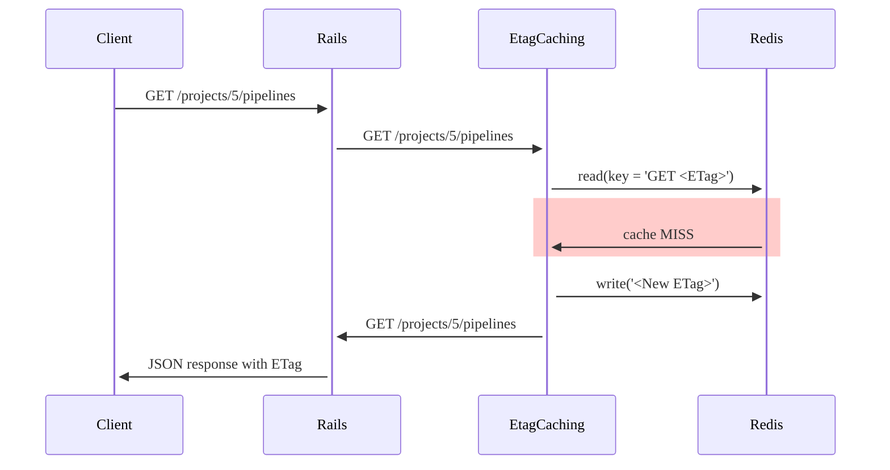
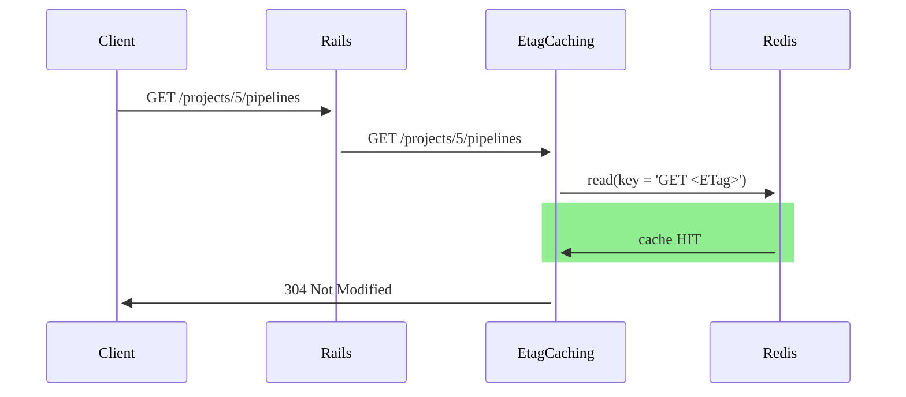

Polling for changes (repeatedly asking server if there are any new changes)
introduces high load on a GitLab instance, because it usually requires
executing at least a few SQL queries. This makes scaling large GitLab
instances (like GitLab.com) very difficult so we do not allow adding new
features that require polling and hit the database.

Instead you should use polling mechanism with ETag caching in Redis.

## How to use it

1. Add the path of the endpoint which you want to poll to
   `Gitlab::EtagCaching::Router`.
1. Set the polling interval header for the response with
   `Gitlab::PollingInterval.set_header`.
1. Implement cache invalidation for the path of your endpoint using
   `Gitlab::EtagCaching::Store`. Whenever a resource changes you
   have to invalidate the ETag for the path that depends on this
   resource.
1. Check that the mechanism works:
   - requests should return status code 304
   - there should be no SQL queries logged in `log/development.log`

## How it works

Cache Miss:

Cache Hit:

1. Whenever a resource changes we generate a random value and store it in
   Redis.
1. When a client makes a request we set the `ETag` response header to the value
   from Redis.
1. The client caches the response (client-side caching) and sends the ETag as
   the `If-None-Match` header with every subsequent request for the same
   resource.
1. If the `If-None-Match` header matches the current value in Redis we know
   that the resource did not change so we can send 304 response immediately,
   without querying the database at all. The client's browser uses the
   cached response.
1. If the `If-None-Match` header does not match the current value in Redis
   we have to generate a new response, because the resource changed.

Do not use query parameters (for example `?scope=all`) for endpoints where you
want to enable ETag caching. The middleware takes into account only the request
path and ignores query parameters. All parameters should be included in the
request path. By doing this we avoid query parameter ordering problems and make
route matching easier.

For more information see:

- [`Poll-Interval` header](fe_guide/performance.md#real-time-components)
- [RFC 7232](https://www.rfc-editor.org/rfc/rfc7232)
- [ETag proposal](https://gitlab.com/gitlab-org/gitlab-foss/-/issues/26926)
