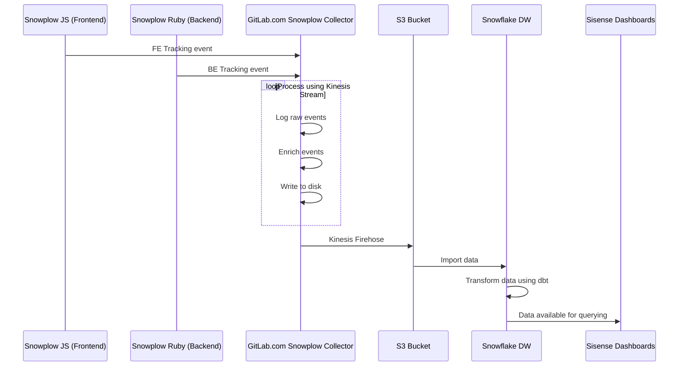

# Snowplow Guide

This guide provides an overview of how Snowplow works, and implementation details.

For more information about Product Analytics, see:

- [Product Analytics Guide](https://about.gitlab.com/handbook/product/product-analytics-guide/)
- [Usage Ping Guide](usage_ping.md)

More useful links:

- [Product Analytics Direction](https://about.gitlab.com/direction/product-analytics/)
- [Data Analysis Process](https://about.gitlab.com/handbook/business-ops/data-team/#data-analysis-process/)
- [Data for Product Managers](https://about.gitlab.com/handbook/business-ops/data-team/programs/data-for-product-managers/)
- [Data Infrastructure](https://about.gitlab.com/handbook/business-ops/data-team/platform/infrastructure/)

## What is Snowplow

Snowplow is an enterprise-grade marketing and product analytics platform which helps track the way users engage with our website and application.

[Snowplow](https://github.com/snowplow/snowplow) consists of the following loosely-coupled sub-systems:

- **Trackers** fire Snowplow events. Snowplow has 12 trackers, covering web, mobile, desktop, server, and IoT.
- **Collectors** receive Snowplow events from trackers. We have three different event collectors, synchronizing events either to Amazon S3, Apache Kafka, or Amazon Kinesis.
- **Enrich** cleans up the raw Snowplow events, enriches them and puts them into storage. We have an Hadoop-based enrichment process, and a Kinesis-based or Kafka-based process.
- **Storage** is where the Snowplow events live. We store the Snowplow events in a flat file structure on S3, and in the Redshift and PostgreSQL databases.
- **Data modeling** is where event-level data is joined with other data sets and aggregated into smaller data sets, and business logic is applied. This produces a clean set of tables which make it easier to perform analysis on the data. We have data models for Redshift and Looker.
- **Analytics** are performed on the Snowplow events or on the aggregate tables.


## Snowplow schema

We have many definitions of Snowplow's schema. We have an active issue to [standardize this schema](https://gitlab.com/gitlab-org/gitlab/-/issues/207930) including the following definitions:

- Frontend and backend taxonomy as listed below
- [Structured event taxonomy](#structured-event-taxonomy)
- [Self describing events](https://github.com/snowplow/snowplow/wiki/Custom-events#self-describing-events)
- [Iglu schema](https://gitlab.com/gitlab-org/iglu/)
- [Snowplow authored events](https://github.com/snowplow/snowplow/wiki/Snowplow-authored-events)

## Enabling Snowplow

Tracking can be enabled at:

- The instance level, which enables tracking on both the frontend and backend layers.
- User level, though user tracking can be disabled on a per-user basis. GitLab tracking respects the [Do Not Track](https://www.eff.org/issues/do-not-track) standard, so any user who has enabled the Do Not Track option in their browser is not tracked at a user level.

We use Snowplow for the majority of our tracking strategy and it is enabled on GitLab.com. On a self-managed instance, Snowplow can be enabled by navigating to:

- **Admin Area > Settings > General** in the UI.
- `admin/application_settings/integrations` in your browser.

The following configuration is required:

| Name          | Value                     |
|---------------|---------------------------|
| Collector     | `snowplow.trx.gitlab.net` |
| Site ID       | `gitlab`                  |
| Cookie domain | `.gitlab.com`             |

## Snowplow request flow

The following example shows a basic request/response flow between the following components:

- Snowplow JS / Ruby Trackers on GitLab.com
- [GitLab.com Snowplow Collector](https://gitlab.com/gitlab-com/gl-infra/readiness/-/blob/master/library/snowplow/index.md)
- GitLab's S3 Bucket
- GitLab's Snowflake Data Warehouse
- Sisense:



## Structured event taxonomy

When adding new click events, we should add them in a way that's internally consistent. If we don't, it is very painful to perform analysis across features since each feature captures events differently.

The current method provides several attributes that are sent on each click event. Please try to follow these guidelines when specifying events to capture:

| attribute | type    | required | description |
| --------- | ------- | -------- | ----------- |
| category  | text    | true     | The page or backend area of the application. Unless infeasible, please use the Rails page attribute by default in the frontend, and namespace + classname on the backend. |
| action    | text    | true     | The action the user is taking, or aspect that's being instrumented. The first word should always describe the action or aspect: clicks should be `click`, activations should be `activate`, creations should be `create`, etc. Use underscores to describe what was acted on; for example, activating a form field would be `activate_form_input`. An interface action like clicking on a dropdown would be `click_dropdown`, while a behavior like creating a project record from the backend would be `create_project` |
| label     | text    | false    | The specific element, or object that's being acted on. This is either the label of the element (e.g. a tab labeled 'Create from template' may be `create_from_template`) or a unique identifier if no text is available (e.g. closing the Groups dropdown in the top navbar might be `groups_dropdown_close`), or it could be the name or title attribute of a record being created. |
| property  | text    | false    | Any additional property of the element, or object being acted on. |
| value     | decimal | false    | Describes a numeric value or something directly related to the event. This could be the value of an input (e.g. `10` when clicking `internal` visibility). |

### Web-specific parameters

Snowplow JS adds many [web-specific parameters](https://docs.snowplowanalytics.com/docs/collecting-data/collecting-from-own-applications/snowplow-tracker-protocol/#Web-specific_parameters) to all web events by default.

## Implementing Snowplow JS (Frontend) tracking

GitLab provides `Tracking`, an interface that wraps the [Snowplow JavaScript Tracker](https://github.com/snowplow/snowplow/wiki/javascript-tracker) for tracking custom events. There are a few ways to use tracking, but each generally requires at minimum, a `category` and an `action`. Additional data can be provided that adheres to our [Structured event taxonomy](#structured-event-taxonomy).

| field      | type   | default value              | description                                                                                                                                                                                                    |
|:-----------|:-------|:---------------------------|:---------------------------------------------------------------------------------------------------------------------------------------------------------------------------------------------------------------|
| `category` | string | document.body.dataset.page | Page or subsection of a page that events are being captured within.                                                                                                                                            |
| `action`   | string | 'generic'                  | Action the user is taking. Clicks should be `click` and activations should be `activate`, so for example, focusing a form field would be `activate_form_input`, and clicking a button would be `click_button`. |
| `data`     | object | {}                         | Additional data such as `label`, `property`, `value`, and `context` as described in our [Structured event taxonomy](#structured-event-taxonomy). |

### Tracking in HAML (or Vue Templates)

When working within HAML (or Vue templates) we can add `data-track-*` attributes to elements of interest. All elements that have a `data-track-event` attribute automatically have event tracking bound on clicks.

Below is an example of `data-track-*` attributes assigned to a button:

```haml
%button.btn{ data: { track: { event: "click_button", label: "template_preview", property: "my-template" } } }
```

```html
<button class="btn"
  data-track-event="click_button"
  data-track-label="template_preview"
  data-track-property="my-template"
/>
```

Event listeners are bound at the document level to handle click events on or within elements with these data attributes. This allows them to be properly handled on re-rendering and changes to the DOM. Note that because of the way these events are bound, click events should not be stopped from propagating up the DOM tree. If for any reason click events are being stopped from propagating, you need to implement your own listeners and follow the instructions in [Tracking in raw JavaScript](#tracking-in-raw-javascript).

Below is a list of supported `data-track-*` attributes:

| attribute             | required | description |
|:----------------------|:---------|:------------|
| `data-track-event`    | true     | Action the user is taking. Clicks must be prepended with `click` and activations must be prepended with `activate`. For example, focusing a form field would be `activate_form_input` and clicking a button would be `click_button`. |
| `data-track-label`    | false    | The `label` as described in our [Structured event taxonomy](#structured-event-taxonomy). |
| `data-track-property` | false    | The `property` as described in our [Structured event taxonomy](#structured-event-taxonomy). |
| `data-track-value`    | false    | The `value` as described in our [Structured event taxonomy](#structured-event-taxonomy). If omitted, this is the element's `value` property or an empty string. For checkboxes, the default value is the element's checked attribute or `false` when unchecked. |
| `data-track-context`  | false    | The `context` as described in our [Structured event taxonomy](#structured-event-taxonomy). |

### Tracking within Vue components

There's a tracking Vue mixin that can be used in components if more complex tracking is required. To use it, first import the `Tracking` library and request a mixin.

```javascript
import Tracking from '~/tracking';
const trackingMixin = Tracking.mixin({ label: 'right_sidebar' });
```

You can provide default options that are passed along whenever an event is tracked from within your component. For instance, if all events within a component should be tracked with a given `label`, you can provide one at this time. Available defaults are `category`, `label`, `property`, and `value`. If no category is specified, `document.body.dataset.page` is used as the default.

You can then use the mixin normally in your component with the `mixin` Vue declaration. The mixin also provides the ability to specify tracking options in `data` or `computed`. These override any defaults and allow the values to be dynamic from props, or based on state.

```javascript
export default {
  mixins: [trackingMixin],
  // ...[component implementation]...
  data() {
    return {
      expanded: false,
      tracking: {
        label: 'left_sidebar'
      }
    };
  },
}
```

The mixin provides a `track` method that can be called within the template, or from component methods. An example of the whole implementation might look like the following.

```javascript
export default {
  mixins: [Tracking.mixin({ label: 'right_sidebar' })],
  data() {
    return {
      expanded: false,
    };
  },
  methods: {
    toggle() {
      this.expanded = !this.expanded;
      this.track('click_toggle', { value: this.expanded })
    }
  }
};
```

And if needed within the template, you can use the `track` method directly as well.

```html
<template>
  <div>
    <a class="toggle" @click.prevent="toggle">Toggle</a>
    <div v-if="expanded">
      <p>Hello world!</p>
      <a @click.prevent="track('click_action')">Track an event</a>
    </div>
  </div>
</template>
```

### Tracking in raw JavaScript

Custom event tracking and instrumentation can be added by directly calling the `Tracking.event` static function. The following example demonstrates tracking a click on a button by calling `Tracking.event` manually.

```javascript
import Tracking from '~/tracking';

const button = document.getElementById('create_from_template_button');
button.addEventListener('click', () => {
  Tracking.event('dashboard:projects:index', 'click_button', {
    label: 'create_from_template',
    property: 'template_preview',
    value: 'rails',
  });
})
```

### Tests and test helpers

In Jest particularly in Vue tests, you can use the following:

```javascript
import { mockTracking } from 'helpers/tracking_helper';

describe('MyTracking', () => {
  let spy;

  beforeEach(() => {
    spy = mockTracking('_category_', wrapper.element, jest.spyOn);
  });

  it('tracks an event when clicked on feedback', () => {
    wrapper.find('.discover-feedback-icon').trigger('click');

    expect(spy).toHaveBeenCalledWith('_category_', 'click_button', {
      label: 'security-discover-feedback-cta',
      property: '0',
    });
  });
});
```

In obsolete Karma tests it's used as below:

```javascript
import { mockTracking, triggerEvent } from 'spec/helpers/tracking_helper';

describe('my component', () => {
  let trackingSpy;

  beforeEach(() => {
    trackingSpy = mockTracking('_category_', vm.$el, spyOn);
  });

  const triggerEvent = () => {
    // action which should trigger a event
  };

  it('tracks an event when toggled', () => {
    expect(trackingSpy).not.toHaveBeenCalled();

    triggerEvent('a.toggle');

    expect(trackingSpy).toHaveBeenCalledWith('_category_', 'click_edit_button', {
      label: 'right_sidebar',
      property: 'confidentiality',
    });
  });
});
```

## Implementing Snowplow Ruby (Backend) tracking

GitLab provides `Gitlab::Tracking`, an interface that wraps the [Snowplow Ruby Tracker](https://github.com/snowplow/snowplow/wiki/ruby-tracker) for tracking custom events.

Custom event tracking and instrumentation can be added by directly calling the `GitLab::Tracking.event` class method, which accepts the following arguments:

| argument   | type   | default value | description                                                                                                                                                                                                                                                            |
|:-----------|:-------|:--------------|:-----------------------------------------------------------------------------------------------------------------------------------------------------------------------------------------------------------------------------------------------------------------------|
| `category` | string | 'application' | Area or aspect of the application. This could be `HealthCheckController` or `Lfs::FileTransformer` for instance.                                                                                                                                                       |
| `action`   | string | 'generic'     | The action being taken, which can be anything from a controller action like `create` to something like an Active Record callback.                                                                                                                                      |
| `data`     | object | {}            | Additional data such as `label`, `property`, `value`, and `context` as described in [Structured event taxonomy](#structured-event-taxonomy). These are set as empty strings if you don't provide them. |

Tracking can be viewed as either tracking user behavior, or can be used for instrumentation to monitor and visualize performance over time in an area or aspect of code.

For example:

```ruby
class Projects::CreateService < BaseService
  def execute
    project = Project.create(params)

    Gitlab::Tracking.event('Projects::CreateService', 'create_project',
      label: project.errors.full_messages.to_sentence,
      value: project.valid?
    )
  end
end
```

### Unit testing

Use the `expect_snowplow_event` helper when testing backend Snowplow events. See [testing best practices](
https://docs.gitlab.com/ee/development/testing_guide/best_practices.html#test-snowplow-events) for details.

### Performance

We use the [AsyncEmitter](https://github.com/snowplow/snowplow/wiki/Ruby-Tracker#52-the-asyncemitter-class) when tracking events, which allows for instrumentation calls to be run in a background thread. This is still an active area of development.

## Developing and testing Snowplow

There are several tools for developing and testing Snowplow Event

| Testing Tool                                 | Frontend Tracking  | Backend Tracking    | Local Development Environment | Production Environment | Production Environment |
|----------------------------------------------|--------------------|---------------------|-------------------------------|------------------------|------------------------|
| Snowplow Analytics Debugger Chrome Extension | **{check-circle}** | **{dotted-circle}** | **{check-circle}**            | **{check-circle}**     | **{check-circle}**     |
| Snowplow Inspector Chrome Extension          | **{check-circle}** | **{dotted-circle}** | **{check-circle}**            | **{check-circle}**     | **{check-circle}**     |
| Snowplow Micro                               | **{check-circle}** | **{check-circle}**  | **{check-circle}**            | **{dotted-circle}**    | **{dotted-circle}**    |
| Snowplow Mini                                | **{check-circle}** | **{check-circle}**  | **{dotted-circle}**           | **{status_preparing}** | **{status_preparing}** |

**Legend**

**{check-circle}** Available, **{status_preparing}** In progress, **{dotted-circle}** Not Planned

### Preparing your MR for Review

1. For frontend events, in the MR description section, add a screenshot of the event's relevant section using the [Snowplow Analytics Debugger](https://chrome.google.com/webstore/detail/snowplow-analytics-debugg/jbnlcgeengmijcghameodeaenefieedm) Chrome browser extension.
1. For backend events, please use Snowplow Micro and add the output of the Snowplow Micro good events  `GET http://localhost:9090/micro/good`.

### Snowplow Analytics Debugger Chrome Extension

Snowplow Analytics Debugger is a browser extension for testing frontend events. This works on production, staging and local development environments.

1. Install the [Snowplow Analytics Debugger](https://chrome.google.com/webstore/detail/snowplow-analytics-debugg/jbnlcgeengmijcghameodeaenefieedm) Chrome browser extension.
1. Open Chrome DevTools to the Snowplow Analytics Debugger tab.
1. Learn more at [Igloo Analytics](https://www.iglooanalytics.com/blog/snowplow-analytics-debugger-chrome-extension.html).

### Snowplow Inspector Chrome Extension

Snowplow Inspector Chrome Extension is a browser extension for testing frontend events. This works on production, staging and local development environments.

1. Install [Snowplow Inspector](https://chrome.google.com/webstore/detail/snowplow-inspector/maplkdomeamdlngconidoefjpogkmljm?hl=en).
1. Open the Chrome extension by pressing the Snowplow Inspector icon beside the address bar.
1. Click around on a webpage with Snowplow and you should see JavaScript events firing in the inspector window.

### Snowplow Micro

Snowplow Micro is a very small version of a full Snowplow data collection pipeline: small enough that it can be launched by a test suite. Events can be recorded into Snowplow Micro just as they can a full Snowplow pipeline. Micro then exposes an API that can be queried.

Snowplow Micro is a Docker-based solution for testing frontend and backend events in a local development environment. You need to modify GDK using the instructions below to set this up.

- Read [Introducing Snowplow Micro](https://snowplowanalytics.com/blog/2019/07/17/introducing-snowplow-micro/)
- Look at the [Snowplow Micro repository](https://github.com/snowplow-incubator/snowplow-micro)
- Watch our [installation guide recording](https://www.youtube.com/watch?v=OX46fo_A0Ag)

1. Install [Snowplow Micro](https://github.com/snowplow-incubator/snowplow-micro):

   ```shell
   docker run --mount type=bind,source=$(pwd)/example,destination=/config -p 9090:9090 snowplow/snowplow-micro:latest --collector-config /config/micro.conf --iglu /config/iglu.json
   ```

1. Install Snowplow Micro by cloning the settings in [this project](https://gitlab.com/gitlab-org/snowplow-micro-configuration):

   ```shell
   git clone git@gitlab.com:gitlab-org/snowplow-micro-configuration.git
   ./snowplow-micro.sh
   ```

1. Update port in SQL to set `9090`:

   ```shell
   gdk psql -d gitlabhq_development
   update application_settings set snowplow_collector_hostname='localhost:9090', snowplow_enabled=true, snowplow_cookie_domain='.gitlab.com';
   ```

1. Update `app/assets/javascripts/tracking.js` to [remove this line](https://gitlab.com/snippets/1918635):

   ```javascript
   forceSecureTracker: true
   ```

1. Update `lib/gitlab/tracking.rb` to [add these lines](https://gitlab.com/snippets/1918635):

   ```ruby
   protocol: 'http',
   port: 9090,
   ```

1. Update `lib/gitlab/tracking.rb` to [change async emitter from https to http](https://gitlab.com/snippets/1918635):

   ```ruby
   SnowplowTracker::AsyncEmitter.new(Gitlab::CurrentSettings.snowplow_collector_hostname, protocol: 'http'),
   ```

1. Enable Snowplow in the admin area, Settings::Integrations::Snowplow to point to:
   `http://localhost:3000/admin/application_settings/integrations#js-snowplow-settings`.

1. Restart GDK:

   ```shell
   `gdk restart`
   ```

1. Send a test Snowplow event from the Rails console:

   ```ruby
   Gitlab::Tracking.self_describing_event('iglu:com.gitlab/pageview_context/jsonschema/1-0-0', data: { page_type: 'MY_TYPE' }, context: nil)
   ```

### Snowplow Mini

[Snowplow Mini](https://github.com/snowplow/snowplow-mini) is an easily-deployable, single-instance version of Snowplow.

Snowplow Mini can be used for testing frontend and backend events on a production, staging and local development environment.

For GitLab.com, we're setting up a [QA and Testing environment](https://gitlab.com/gitlab-org/telemetry/-/issues/266) using Snowplow Mini.
