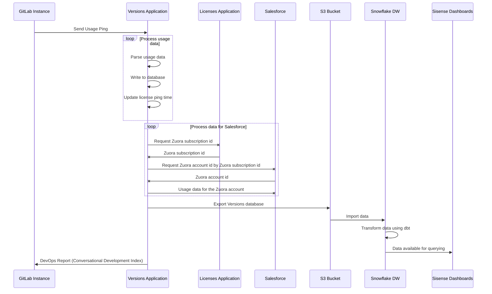

# Usage Ping Guide

> - Introduced in GitLab Enterprise Edition 8.10.
> - More statistics were added in GitLab Enterprise Edition 8.12.
> - Moved to GitLab Core in 9.1.
> - More statistics were added in GitLab Ultimate 11.2.

This guide describes Usage Ping's purpose and how it's implemented.

For more information about Product Analytics, see:

- [Product Analytics Guide](https://about.gitlab.com/handbook/product/product-analytics-guide/)
- [Snowplow Guide](snowplow.md)

More useful links:

- [Product Analytics Direction](https://about.gitlab.com/direction/product-analytics/)
- [Data Analysis Process](https://about.gitlab.com/handbook/business-ops/data-team/#data-analysis-process/)
- [Data for Product Managers](https://about.gitlab.com/handbook/business-ops/data-team/programs/data-for-product-managers/)
- [Data Infrastructure](https://about.gitlab.com/handbook/business-ops/data-team/platform/infrastructure/)

## What is Usage Ping?

- GitLab sends a weekly payload containing usage data to GitLab Inc. Usage Ping provides high-level data to help our product, support, and sales teams. It does not send any project names, usernames, or any other specific data. The information from the usage ping is not anonymous, it is linked to the hostname of the instance. Sending usage ping is optional, and any instance can disable analytics.
- The usage data is primarily composed of row counts for different tables in the instance’s database. By comparing these counts month over month (or week over week), we can get a rough sense for how an instance is using the different features within the product. In addition to counts, other facts
    that help us classify and understand GitLab installations are collected.
- Usage ping is important to GitLab as we use it to calculate our Stage Monthly Active Users (SMAU) which helps us measure the success of our stages and features.
- While usage ping is enabled, GitLab gathers data from the other instances and can show usage statistics of your instance to your users.

### Why should we enable Usage Ping?

- The main purpose of Usage Ping is to build a better GitLab. Data about how GitLab is used is collected to better understand feature/stage adoption and usage, which helps us understand how GitLab is adding value and helps our team better understand the reasons why people use GitLab and with this knowledge we're able to make better product decisions.
- As a benefit of having the usage ping active, GitLab lets you analyze the users’ activities over time of your GitLab installation.
- As a benefit of having the usage ping active, GitLab provides you with The DevOps Report,which gives you an overview of your entire instance’s adoption of Concurrent DevOps from planning to monitoring.
- You get better, more proactive support. (assuming that our TAMs and support organization used the data to deliver more value)
- You get insight and advice into how to get the most value out of your investment in GitLab. Wouldn't you want to know that a number of features or values are not being adopted in your organization?
- You get a report that illustrates how you compare against other similar organizations (anonymized), with specific advice and recommendations on how to improve your DevOps processes.
- Usage Ping is enabled by default. To disable it, see [Disable Usage Ping](#disable-usage-ping).

### Limitations

- Usage Ping does not track frontend events things like page views, link clicks, or user sessions, and only focuses on aggregated backend events.
- Because of these limitations we recommend instrumenting your products with Snowplow for more detailed analytics on GitLab.com and use Usage Ping to track aggregated backend events on self-managed.

## Usage Ping payload

You can view the exact JSON payload sent to GitLab Inc. in the administration panel. To view the payload:

1. Navigate to **Admin Area > Settings > Metrics and profiling**.
1. Expand the **Usage statistics** section.
1. Click the **Preview payload** button.

For an example payload, see [Example Usage Ping payload](#example-usage-ping-payload).

## Disable Usage Ping

To disable Usage Ping in the GitLab UI, go to the **Settings** page of your administration panel and uncheck the **Usage Ping** checkbox.

To disable Usage Ping and prevent it from being configured in the future through the administration panel, Omnibus installs can set the following in [`gitlab.rb`](https://docs.gitlab.com/omnibus/settings/configuration.html#configuration-options):

```ruby
gitlab_rails['usage_ping_enabled'] = false
```

Source installations can set the following in `gitlab.yml`:

```yaml
production: &base
  # ...
  gitlab:
    # ...
    usage_ping_enabled: false
```

## Usage Ping request flow

The following example shows a basic request/response flow between a GitLab instance, the Versions Application, the License Application, Salesforce, GitLab's S3 Bucket, GitLab's Snowflake Data Warehouse, and Sisense:



## How Usage Ping works

1. The Usage Ping [cron job](https://gitlab.com/gitlab-org/gitlab/-/blob/master/app/workers/gitlab_usage_ping_worker.rb#L30) is set in Sidekiq to run weekly.
1. When the cron job runs, it calls [`GitLab::UsageData.to_json`](https://gitlab.com/gitlab-org/gitlab/-/blob/master/app/services/submit_usage_ping_service.rb#L22).
1. `GitLab::UsageData.to_json` [cascades down](https://gitlab.com/gitlab-org/gitlab/-/blob/master/lib/gitlab/usage_data.rb#L22) to ~400+ other counter method calls.
1. The response of all methods calls are [merged together](https://gitlab.com/gitlab-org/gitlab/-/blob/master/lib/gitlab/usage_data.rb#L14) into a single JSON payload in `GitLab::UsageData.to_json`.
1. The JSON payload is then [posted to the Versions application]( https://gitlab.com/gitlab-org/gitlab/-/blob/master/app/services/submit_usage_ping_service.rb#L20)
   If a firewall exception is needed, the required URL depends on several things. If 
   the hostname is `version.gitlab.com`, the protocol is `TCP`, and the port number is `443`,
   the required URL is <https://version.gitlab.com/>.

## Implementing Usage Ping

Usage Ping consists of two kinds of data, counters and observations. Counters track how often a certain event
happened over time, such as how many CI pipelines have run. They are monotonic and always trend up.
Observations are facts collected from one or more GitLab instances and can carry arbitrary data. There are no
general guidelines around how to collect those, due to the individual nature of that data.

There are several types of counters which are all found in `usage_data.rb`:

- **Ordinary Batch Counters:** Simple count of a given ActiveRecord_Relation
- **Distinct Batch Counters:** Distinct count of a given ActiveRecord_Relation on given column
- **Sum Batch Counters:** Sum the values of a given ActiveRecord_Relation on given column
- **Alternative Counters:** Used for settings and configurations
- **Redis Counters:** Used for in-memory counts.

NOTE: **Note:**
Only use the provided counter methods. Each counter method contains a built in fail safe to isolate each counter to avoid breaking the entire Usage Ping.

### Why batch counting

For large tables, PostgreSQL can take a long time to count rows due to MVCC [(Multi-version Concurrency Control)](https://en.wikipedia.org/wiki/Multiversion_concurrency_control). Batch counting is a counting method where a single large query is broken into multiple smaller queries. For example, instead of a single query querying 1,000,000 records, with batch counting, you can execute 100 queries of 10,000 records each. Batch counting is useful for avoiding database timeouts as each batch query is significantly shorter than one single long running query.

For GitLab.com, there are extremely large tables with 15 second query timeouts, so we use batch counting to avoid encountering timeouts. Here are the sizes of some GitLab.com tables:

| Table                        | Row counts in millions |
|------------------------------|------------------------|
| `merge_request_diff_commits` | 2280                   |
| `ci_build_trace_sections`    | 1764                   |
| `merge_request_diff_files`   | 1082                   |
| `events`                     | 514                    |

There are two batch counting methods provided, `Ordinary Batch Counters` and `Distinct Batch Counters`. Batch counting requires indexes on columns to calculate max, min, and range queries. In some cases, a specialized index may need to be added on the columns involved in a counter.

### Ordinary Batch Counters

Handles `ActiveRecord::StatementInvalid` error

Simple count of a given ActiveRecord_Relation, does a non-distinct batch count, smartly reduces batch_size and handles errors.

Method: `count(relation, column = nil, batch: true, start: nil, finish: nil)`

Arguments:

- `relation` the ActiveRecord_Relation to perform the count
- `column` the column to perform the count on, by default is the primary key
- `batch`: default `true` in order to use batch counting
- `start`: custom start of the batch counting in order to avoid complex min calculations
- `end`: custom end of the batch counting in order to avoid complex min calculations

Examples:

```ruby
count(User.active)
count(::Clusters::Cluster.aws_installed.enabled, :cluster_id)
count(::Clusters::Cluster.aws_installed.enabled, :cluster_id, start: ::Clusters::Cluster.minimum(:id), finish: ::Clusters::Cluster.maximum(:id))
```

### Distinct Batch Counters

Handles `ActiveRecord::StatementInvalid` error

Distinct count of a given ActiveRecord_Relation on given column, a distinct batch count, smartly reduces batch_size and handles errors.

Method: `distinct_count(relation, column = nil, batch: true, batch_size: nil, start: nil, finish: nil)`

Arguments:

- `relation` the ActiveRecord_Relation to perform the count
- `column` the column to perform the distinct count, by default is the primary key
- `batch`: default `true` in order to use batch counting
- `batch_size`: if none set it uses default value 10000 from `Gitlab::Database::BatchCounter`
- `start`: custom start of the batch counting in order to avoid complex min calculations
- `end`: custom end of the batch counting in order to avoid complex min calculations

Examples:

```ruby
distinct_count(::Project, :creator_id)
distinct_count(::Note.with_suggestions.where(time_period), :author_id, start: ::User.minimum(:id), finish: ::User.maximum(:id))
distinct_count(::Clusters::Applications::CertManager.where(time_period).available.joins(:cluster), 'clusters.user_id')
```

### Sum Batch Counters

Handles `ActiveRecord::StatementInvalid` error

Sum the values of a given ActiveRecord_Relation on given column and handles errors.

Method: `sum(relation, column, batch_size: nil, start: nil, finish: nil)`

Arguments:

- `relation` the ActiveRecord_Relation to perform the operation
- `column` the column to sum on
- `batch_size`: if none set it uses default value 1000 from `Gitlab::Database::BatchCounter`
- `start`: custom start of the batch counting in order to avoid complex min calculations
- `end`: custom end of the batch counting in order to avoid complex min calculations

Examples:

```ruby
sum(JiraImportState.finished, :imported_issues_count)
```

### Grouping & Batch Operations

The `count`, `distinct_count`, and `sum` batch counters can accept an `ActiveRecord::Relation`
object, which groups by a specified column. With a grouped relation, the methods do batch counting,
handle errors, and returns a hash table of key-value pairs.

Examples:

```ruby
count(Namespace.group(:type))
# returns => {nil=>179, "Group"=>54}

distinct_count(Project.group(:visibility_level), :creator_id)
# returns => {0=>1, 10=>1, 20=>11}

sum(Issue.group(:state_id), :weight))
# returns => {1=>3542, 2=>6820}
```

### Redis Counters

Handles `::Redis::CommandError` and `Gitlab::UsageDataCounters::BaseCounter::UnknownEvent`
returns -1 when a block is sent or hash with all values -1 when a `counter(Gitlab::UsageDataCounters)` is sent
different behavior due to 2 different implementations of Redis counter

Method: `redis_usage_data(counter, &block)`

Arguments:

- `counter`: a counter from `Gitlab::UsageDataCounters`, that has `fallback_totals` method implemented
- or a `block`: which is evaluated

#### Ordinary Redis Counters

Examples of implementation:

- Using Redis methods [`INCR`](https://redis.io/commands/incr), [`GET`](https://redis.io/commands/get), and [`Gitlab::UsageDataCounters::WikiPageCounter`](https://gitlab.com/gitlab-org/gitlab/-/blob/master/lib/gitlab/usage_data_counters/wiki_page_counter.rb)
- Using Redis methods [`HINCRBY`](https://redis.io/commands/hincrby), [`HGETALL`](https://redis.io/commands/hgetall), and [`Gitlab::UsageCounters::PodLogs`](https://gitlab.com/gitlab-org/gitlab/-/blob/master/lib/gitlab/usage_counters/pod_logs.rb)

#### Redis HLL Counters

With `Gitlab::UsageDataCounters::HLLRedisCounter` we have available data structures used to count unique values.

Implemented using Redis methods [PFADD](https://redis.io/commands/pfadd) and [PFCOUNT](https://redis.io/commands/pfcount).

##### Adding new events

1. Define events in [`known_events`](https://gitlab.com/gitlab-org/gitlab/-/blob/master/lib/gitlab/usage_data_counters/known_events/).

   Example event:

   ```yaml
   - name: i_compliance_credential_inventory
     category: compliance
     redis_slot: compliance
     expiry: 42  # 6 weeks
     aggregation: weekly
   ```

   Keys:

   - `name`: unique event name.

     Name format `<prefix>_<redis_slot>_name`.

     Use one of the following prefixes for the event's name:

        - `g_` for group, as an event which is tracked for group.
        - `p_` for project, as an event which is tracked for project.
        - `i_` for instance, as an event which is tracked for instance.
        - `a_` for events encompassing all `g_`, `p_`, `i_`.
        - `o_` for other.

     Consider including in the event's name the Redis slot in order to be able to count totals for a specific category.

     Example names: `i_compliance_credential_inventory`, `g_analytics_contribution`.

   - `category`: event category. Used for getting total counts for events in a category, for easier
     access to a group of events.
   - `redis_slot`: optional Redis slot; default value: event name. Used if needed to calculate totals
     for a group of metrics. Ensure keys are in the same slot. For example:
     `i_compliance_credential_inventory` with `redis_slot: 'compliance'` builds Redis key
     `i_{compliance}_credential_inventory-2020-34`. If `redis_slot` is not defined the Redis key will
     be `{i_compliance_credential_inventory}-2020-34`.
   - `expiry`: expiry time in days. Default: 29 days for daily aggregation and 6 weeks for weekly
     aggregation.
   - `aggregation`: aggregation `:daily` or `:weekly`. The argument defines how we build the Redis
     keys for data storage. For `daily` we keep a key for metric per day of the year, for `weekly` we
     keep a key for metric per week of the year.
   - `feature_flag`: optional. For details, see our [GitLab internal Feature flags](../feature_flags/) documentation.

1. Track event in controller using `RedisTracking` module with `track_redis_hll_event(*controller_actions, name:, feature:, feature_default_enabled: false)`.

   Arguments:

   - `controller_actions`: controller actions we want to track.
   - `name`: event name.
   - `feature`: feature name, all metrics we track should be under feature flag.
   - `feature_default_enabled`: feature flag is disabled by default, set to `true` for it to be enabled by default.

   Example usage:

   ```ruby
   # controller
   class ProjectsController < Projects::ApplicationController
     include RedisTracking

     skip_before_action :authenticate_user!, only: :show
     track_redis_hll_event :index, :show, name: 'g_compliance_example_feature_visitors', feature: :compliance_example_feature, feature_default_enabled: true

     def index
       render html: 'index'
     end

    def new
      render html: 'new'
    end

    def show
      render html: 'show'
    end
   end
   ```

1. Track event in API using `increment_unique_values(event_name, values)` helper method.

   In order to be able to track the event, Usage Ping must be enabled and the event feature `usage_data_<event_name>` must be enabled.

   Arguments:

   - `event_name`: event name.
   - `values`: values counted, one value or array of values.

   Example usage:

   ```ruby
   get ':id/registry/repositories' do
     repositories = ContainerRepositoriesFinder.new(
       user: current_user, subject: user_group
     ).execute

     increment_unique_values('i_list_repositories', current_user.id)

     present paginate(repositories), with: Entities::ContainerRegistry::Repository, tags: params[:tags], tags_count: params[:tags_count]
   end
   ```

1. Track event using `track_usage_event(event_name, values) in services and graphql

   Increment unique values count using Redis HLL, for given event name.

   Example:

   [Track usage event for incident created in service](https://gitlab.com/gitlab-org/gitlab/-/blob/master/app/services/issues/update_service.rb)

   [Track usage event for incident created in graphql](https://gitlab.com/gitlab-org/gitlab/-/blob/master/app/graphql/mutations/alert_management/update_alert_status.rb)

   ```ruby
     track_usage_event(:incident_management_incident_created, current_user.id)
   ```

1. Track event using `UsageData` API

   Increment unique users count using Redis HLL, for given event name.

   Tracking events using the `UsageData` API requires the `usage_data_api` feature flag to be enabled, which is enabled by default.

   API requests are protected by checking for a valid CSRF token.

   In order to be able to increment the values the related feature `usage_data<event_name>` should be enabled.

   ```plaintext
   POST /usage_data/increment_unique_users
   ```

   | Attribute | Type | Required | Description |
   | :-------- | :--- | :------- | :---------- |
   | `event` | string | yes | The event name it should be tracked |

   Response

   Return 200 if tracking failed for any reason.

   - `200` if event was tracked or any errors
   - `400 Bad request` if event parameter is missing
   - `401 Unauthorized` if user is not authenticated
   - `403 Forbidden` for invalid CSRF token provided

1. Track events using JavaScript/Vue API helper which calls the API above

   Example usage for an existing event already defined in [known events](https://gitlab.com/gitlab-org/gitlab/-/blob/master/lib/gitlab/usage_data_counters/known_events/):

   Note that `usage_data_api` and `usage_data_#{event_name}` should be enabled in order to be able to track events

   ```javascript
   import api from '~/api';

   api.trackRedisHllUserEvent('my_already_defined_event_name'),
   ```

1. Track event using base module `Gitlab::UsageDataCounters::HLLRedisCounter.track_event(values, event_name)`.

   Arguments:

   - `values`: One value or array of values we count. For example: user_id, visitor_id, user_ids.
   - `event_name`: event name.

1. Track event on context level using base module `Gitlab::UsageDataCounters::HLLRedisCounter.track_event_in_context(entity_id, event_name, context)`.

   Arguments:

   - `entity_id`: value we count. For example: user_id, visitor_id.
   - `event_name`: event name.
   - `context`: context value. Allowed values are `default`, `free`, `bronze`, `silver`, `gold`, `starter`, `premium`, `ultimate`

1. Get event data using `Gitlab::UsageDataCounters::HLLRedisCounter.unique_events(event_names:, start_date:, end_date:, context: '')`.

   Arguments:

   - `event_names`: the list of event names.
   - `start_date`: start date of the period for which we want to get event data.
   - `end_date`: end date of the period for which we want to get event data.
   - `context`: context of the event. Allowed values are `default`, `free`, `bronze`, `silver`, `gold`, `starter`, `premium`, `ultimate`.

1. Testing tracking and getting unique events

Trigger events in rails console by using `track_event` method

   ```ruby
   Gitlab::UsageDataCounters::HLLRedisCounter.track_event(1, 'g_compliance_audit_events')
   Gitlab::UsageDataCounters::HLLRedisCounter.track_event(2, 'g_compliance_audit_events')
   ```

Next, get the unique events for the current week.

   ```ruby
   # Get unique events for metric for current_week
   Gitlab::UsageDataCounters::HLLRedisCounter.unique_events(event_names: 'g_compliance_audit_events',
   start_date: Date.current.beginning_of_week, end_date: Date.current.end_of_week)
   ```

##### Recommendations

We have the following recommendations for [Adding new events](#adding-new-events):

- Event aggregation: weekly.
- Key expiry time: 
  - Daily: 29 days.
  - Weekly: 42 days.
- When adding new metrics, use a [feature flag](../../operations/feature_flags.md) to control the impact.
- For feature flags triggered by another service, set `default_enabled: false`, 
  - Events can be triggered using the `UsageData` API, which helps when there are > 10 events per change

##### Enable/Disable Redis HLL tracking

Events are tracked behind [feature flags](../feature_flags/index.md) due to concerns for Redis performance and scalability.

For a full list of events and coresponding feature flags see, [known_events](https://gitlab.com/gitlab-org/gitlab/-/blob/master/lib/gitlab/usage_data_counters/known_events/) files.

To enable or disable tracking for specific event within <https://gitlab.com> or <https://staging.gitlab.com>, run commands such as the following to
[enable or disable the corresponding feature](../feature_flags/index.md).

```shell
/chatops run feature set <feature_name> true
/chatops run feature set <feature_name> false
```

##### Known events in usage data payload

All events added in [`known_events/common.yml`](https://gitlab.com/gitlab-org/gitlab/-/blob/master/lib/gitlab/usage_data_counters/known_events/common.yml) are automatically added to usage data generation under the `redis_hll_counters` key. This column is stored in [version-app as a JSON](https://gitlab.com/gitlab-services/version-gitlab-com/-/blob/master/db/schema.rb#L209).
For each event we add metrics for the weekly and monthly time frames, and totals for each where applicable:

- `#{event_name}_weekly`: Data for 7 days for daily [aggregation](#adding-new-events) events and data for the last complete week for weekly [aggregation](#adding-new-events) events.
- `#{event_name}_monthly`: Data for 28 days for daily [aggregation](#adding-new-events) events and data for the last 4 complete weeks for weekly [aggregation](#adding-new-events) events.
- `#{category}_total_unique_counts_weekly`: Total unique counts for events in the same category for the last 7 days or the last complete week, if events are in the same Redis slot and we have more than one metric.
- `#{category}_total_unique_counts_monthly`: Total unique counts for events in same category for the last 28 days or the last 4 complete weeks, if events are in the same Redis slot and we have more than one metric.

Example of `redis_hll_counters` data:

```ruby
{:redis_hll_counters=>
  {"compliance"=>
    {"g_compliance_dashboard_weekly"=>0,
     "g_compliance_dashboard_monthly"=>0,
     "g_compliance_audit_events_weekly"=>0,
     "g_compliance_audit_events_monthly"=>0,
     "compliance_total_unique_counts_weekly"=>0,
     "compliance_total_unique_counts_monthly"=>0},
   "analytics"=>
    {"g_analytics_contribution_weekly"=>0,
     "g_analytics_contribution_monthly"=>0,
     "g_analytics_insights_weekly"=>0,
     "g_analytics_insights_monthly"=>0,
     "analytics_total_unique_counts_weekly"=>0,
     "analytics_total_unique_counts_monthly"=>0},
   "ide_edit"=>
    {"g_edit_by_web_ide_weekly"=>0,
     "g_edit_by_web_ide_monthly"=>0,
     "g_edit_by_sfe_weekly"=>0,
     "g_edit_by_sfe_monthly"=>0,
     "ide_edit_total_unique_counts_weekly"=>0,
     "ide_edit_total_unique_counts_monthly"=>0},
   "search"=>
    {"i_search_total_weekly"=>0, "i_search_total_monthly"=>0, "i_search_advanced_weekly"=>0, "i_search_advanced_monthly"=>0, "i_search_paid_weekly"=>0, "i_search_paid_monthly"=>0, "search_total_unique_counts_weekly"=>0, "search_total_unique_counts_monthly"=>0},
   "source_code"=>{"wiki_action_weekly"=>0, "wiki_action_monthly"=>0}
 }
```

Example usage:

```ruby
# Redis Counters
redis_usage_data(Gitlab::UsageDataCounters::WikiPageCounter)
redis_usage_data { ::Gitlab::UsageCounters::PodLogs.usage_totals[:total] }

# Define events in common.yml https://gitlab.com/gitlab-org/gitlab/-/blob/master/lib/gitlab/usage_data_counters/known_events/common.yml

# Tracking events
Gitlab::UsageDataCounters::HLLRedisCounter.track_event(visitor_id, 'expand_vulnerabilities')

# Get unique events for metric
redis_usage_data { Gitlab::UsageDataCounters::HLLRedisCounter.unique_events(event_names: 'expand_vulnerabilities', start_date: 28.days.ago, end_date: Date.current) }
```

### Alternative Counters

Handles `StandardError` and fallbacks into -1 this way not all measures fail if we encounter one exception.
Mainly used for settings and configurations.

Method: `alt_usage_data(value = nil, fallback: -1, &block)`

Arguments:

- `value`: a simple static value in which case the value is simply returned.
- or a `block`: which is evaluated
- `fallback: -1`: the common value used for any metrics that are failing.

Example of usage:

```ruby
alt_usage_data { Gitlab::VERSION }
alt_usage_data { Gitlab::CurrentSettings.uuid }
alt_usage_data(999)
```

### Prometheus Queries

In those cases where operational metrics should be part of Usage Ping, a database or Redis query is unlikely
to provide useful data. Instead, Prometheus might be more appropriate, since most of GitLab's architectural
components publish metrics to it that can be queried back, aggregated, and included as usage data.

NOTE: **Note:**
Prometheus as a data source for Usage Ping is currently only available for single-node Omnibus installations
that are running the [bundled Prometheus](../../administration/monitoring/prometheus/index.md) instance.

To query Prometheus for metrics, a helper method is available to `yield` a fully configured
`PrometheusClient`, given it is available as per the note above:

```ruby
with_prometheus_client do |client|
  response = client.query('<your query>')
  ...
end
```

Please refer to [the `PrometheusClient` definition](https://gitlab.com/gitlab-org/gitlab/-/blob/master/lib/gitlab/prometheus_client.rb)
for how to use its API to query for data.

## Developing and testing Usage Ping

### 1. Naming and placing the metrics

Add the metric in one of the top level keys

- `license`: for license related metrics.
- `settings`: for settings related metrics.
- `counts_weekly`: for counters that have data for the most recent 7 days.
- `counts_monthly`: for counters that have data for the most recent 28 days.
- `counts`: for counters that have data for all time.

### 2. Use your Rails console to manually test counters

```ruby
# count
Gitlab::UsageData.count(User.active)
Gitlab::UsageData.count(::Clusters::Cluster.aws_installed.enabled, :cluster_id)

# count distinct
Gitlab::UsageData.distinct_count(::Project, :creator_id)
Gitlab::UsageData.distinct_count(::Note.with_suggestions.where(time_period), :author_id, start: ::User.minimum(:id), finish: ::User.maximum(:id))
```

### 3. Generate the SQL query

Your Rails console returns the generated SQL queries.

Example:

```ruby
pry(main)> Gitlab::UsageData.count(User.active)
   (2.6ms)  SELECT "features"."key" FROM "features"
   (15.3ms)  SELECT MIN("users"."id") FROM "users" WHERE ("users"."state" IN ('active')) AND ("users"."user_type" IS NULL OR "users"."user_type" IN (6, 4))
   (2.4ms)  SELECT MAX("users"."id") FROM "users" WHERE ("users"."state" IN ('active')) AND ("users"."user_type" IS NULL OR "users"."user_type" IN (6, 4))
   (1.9ms)  SELECT COUNT("users"."id") FROM "users" WHERE ("users"."state" IN ('active')) AND ("users"."user_type" IS NULL OR "users"."user_type" IN (6, 4)) AND "users"."id" BETWEEN 1 AND 100000
```

### 4. Optimize queries with #database-lab

Paste the SQL query into `#database-lab` to see how the query performs at scale.

- `#database-lab` is a Slack channel which uses a production-sized environment to test your queries.
- GitLab.com’s production database has a 15 second timeout.
- Any single query must stay below [1 second execution time](../query_performance.md#timing-guidelines-for-queries) with cold caches.
- Add a specialized index on columns involved to reduce the execution time.

In order to have an understanding of the query's execution we add in the MR description the following information:

- For counters that have a `time_period` test we add information for both cases:
  - `time_period = {}` for all time periods
  - `time_period = { created_at: 28.days.ago..Time.current }` for last 28 days period
- Execution plan and query time before and after optimization
- Query generated for the index and time
- Migration output for up and down execution

We also use `#database-lab` and [explain.depesz.com](https://explain.depesz.com/). For more details, see the [database review guide](../database_review.md#preparation-when-adding-or-modifying-queries).

#### Optimization recommendations and examples

- Use specialized indexes [example 1](https://gitlab.com/gitlab-org/gitlab/-/merge_requests/26871), [example 2](https://gitlab.com/gitlab-org/gitlab/-/merge_requests/26445).
- Use defined `start` and `finish`, and simple queries, because these values can be memoized and reused, [example](https://gitlab.com/gitlab-org/gitlab/-/merge_requests/37155).
- Avoid joins and write the queries as simply as possible, [example](https://gitlab.com/gitlab-org/gitlab/-/merge_requests/36316).
- Set a custom `batch_size` for `distinct_count`, [example](https://gitlab.com/gitlab-org/gitlab/-/merge_requests/38000).

### 5. Add the metric definition

When adding, changing, or updating metrics, please update the [Event Dictionary's **Usage Ping** table](https://about.gitlab.com/handbook/product/product-analytics-guide#event-dictionary).

### 6. Add new metric to Versions Application

Check if new metrics need to be added to the Versions Application. See `usage_data` [schema](https://gitlab.com/gitlab-services/version-gitlab-com/-/blob/master/db/schema.rb#L147) and usage data [parameters accepted](https://gitlab.com/gitlab-services/version-gitlab-com/-/blob/master/app/services/usage_ping.rb). Any metrics added under the `counts` key are saved in the `stats` column.

### 7. Add the feature label

Add the `feature` label to the Merge Request for new Usage Ping metrics. These are user-facing changes and are part of expanding the Usage Ping feature.

### 8. Add a changelog file

Ensure you comply with the [Changelog entries guide](../changelog.md).

### 9. Ask for a Product Analytics Review

On GitLab.com, we have DangerBot setup to monitor Product Analytics related files and DangerBot recommends a Product Analytics review. Mention `@gitlab-org/growth/product_analytics/engineers` in your MR for a review.

### 10. Verify your metric

On GitLab.com, the Product Analytics team regularly monitors Usage Ping. They may alert you that your metrics need further optimization to run quicker and with greater success. You may also use the [Usage Ping QA dashboard](https://app.periscopedata.com/app/gitlab/632033/Usage-Ping-QA) to check how well your metric performs. The dashboard allows filtering by GitLab version, by "Self-managed" & "Saas" and shows you how many failures have occurred for each metric. Whenever you notice a high failure rate, you may re-optimize your metric.

### Optional: Test Prometheus based Usage Ping

If the data submitted includes metrics [queried from Prometheus](#prometheus-queries) that you would like to inspect and verify,
then you need to ensure that a Prometheus server is running locally, and that furthermore the respective GitLab components
are exporting metrics to it. If you do not need to test data coming from Prometheus, no further action
is necessary, since Usage Ping should degrade gracefully in the absence of a running Prometheus server.

There are currently three kinds of components that may export data to Prometheus, and which are included in Usage Ping:

- [`node_exporter`](https://github.com/prometheus/node_exporter) - Exports node metrics from the host machine
- [`gitlab-exporter`](https://gitlab.com/gitlab-org/gitlab-exporter) - Exports process metrics from various GitLab components
- various GitLab services such as Sidekiq and the Rails server that export their own metrics

#### Test with an Omnibus container

This is the recommended approach to test Prometheus based Usage Ping.

The easiest way to verify your changes is to build a new Omnibus image from your code branch via CI, then download the image
and run a local container instance:

1. From your merge request, click on the `qa` stage, then trigger the `package-and-qa` job. This job triggers an Omnibus
build in a [downstream pipeline of the `omnibus-gitlab-mirror` project](https://gitlab.com/gitlab-org/build/omnibus-gitlab-mirror/-/pipelines).
1. In the downstream pipeline, wait for the `gitlab-docker` job to finish.
1. Open the job logs and locate the full container name including the version. It takes the following form: `registry.gitlab.com/gitlab-org/build/omnibus-gitlab-mirror/gitlab-ee:<VERSION>`.
1. On your local machine, make sure you are logged in to the GitLab Docker registry. You can find the instructions for this in
[Authenticate to the GitLab Container Registry](../../user/packages/container_registry/index.md#authenticate-with-the-container-registry).
1. Once logged in, download the new image via `docker pull registry.gitlab.com/gitlab-org/build/omnibus-gitlab-mirror/gitlab-ee:<VERSION>`
1. For more information about working with and running Omnibus GitLab containers in Docker, please refer to [GitLab Docker images](https://docs.gitlab.com/omnibus/docker/README.html) in the Omnibus documentation.

#### Test with GitLab development toolkits

This is the less recommended approach, since it comes with a number of difficulties when emulating a real GitLab deployment.

The [GDK](https://gitlab.com/gitlab-org/gitlab-development-kit) is not currently set up to run a Prometheus server or `node_exporter` alongside other GitLab components. If you would
like to do so, [Monitoring the GDK with Prometheus](https://gitlab.com/gitlab-org/gitlab-development-kit/-/blob/master/doc/howto/prometheus/index.md#monitoring-the-gdk-with-prometheus) is a good start.

The [GCK](https://gitlab.com/gitlab-org/gitlab-compose-kit) has limited support for testing Prometheus based Usage Ping.
By default, it already comes with a fully configured Prometheus service that is set up to scrape a number of components,
but with the following limitations:

- It does not currently run a `gitlab-exporter` instance, so several `process_*` metrics from services such as Gitaly may be missing.
- While it runs a `node_exporter`, `docker-compose` services emulate hosts, meaning that it would normally report itself to not be associated
with any of the other services that are running. That is not how node metrics are reported in a production setup, where `node_exporter`
always runs as a process alongside other GitLab components on any given node. From Usage Ping's perspective none of the node data would therefore
appear to be associated to any of the services running, since they all appear to be running on different hosts. To alleviate this problem, the `node_exporter` in GCK was arbitrarily "assigned" to the `web` service, meaning only for this service `node_*` metrics appears in Usage Ping.

## Aggregated metrics

> - [Introduced](https://gitlab.com/gitlab-org/gitlab/-/merge_requests/45979) in GitLab 13.6.
> - It's [deployed behind a feature flag](../../user/feature_flags.md), disabled by default.
> - It's enabled on GitLab.com.

CAUTION: **Warning:**
This feature is intended solely for internal GitLab use.

In order to add data for aggregated metrics into Usage Ping payload you should add corresponding definition into  [`aggregated_metrics.yml`](https://gitlab.com/gitlab-org/gitlab/-/blob/master/lib/gitlab/usage_data_counters/aggregated_metrics.yml) file. Each aggregate definition includes following parts:

- name: unique name under which aggregate metric is added to Usage Ping payload
- operator: operator that defines how aggregated metric data is counted. Available operators are:
  - `OR`: removes duplicates and counts all entries that triggered any of listed events
  - `AND`: removes duplicates and counts all elements that were observed triggering all of following events
- events: list of events names (from [`known_events.yml`](#known-events-in-usage-data-payload)) to aggregate into metric. All events in this list must have the same `redis_slot` and `aggregation` attributes.
- feature_flag: name of [development feature flag](../feature_flags/development.md#development-type) that is checked before
metrics aggregation is performed. Corresponding feature flag should have `default_enabled` attribute set to `false`.
`feature_flag` attribute is **OPTIONAL**  and can be omitted, when `feature_flag` is missing no feature flag is checked.

Example aggregated metric entries:

```yaml
- name: product_analytics_test_metrics_union
  operator: OR
  events: ['i_search_total', 'i_search_advanced', 'i_search_paid']
- name: product_analytics_test_metrics_intersection_with_feautre_flag
  operator: AND
  events: ['i_search_total', 'i_search_advanced', 'i_search_paid']
  feature_flag: example_aggregated_metric
```

Aggregated metrics are added under `aggregated_metrics` key in both `counts_weekly` and `counts_monthly` top level keys in Usage Ping payload.

```ruby
{
  :counts_monthly => {
    :deployments => 1003,
    :successful_deployments => 78,
    :failed_deployments => 275,
    :packages => 155,
    :personal_snippets => 2106,
    :project_snippets => 407,
    :promoted_issues => 719,
    :aggregated_metrics => {
      :product_analytics_test_metrics_union => 7,
      :product_analytics_test_metrics_intersection_with_feautre_flag => 2
    },
    :snippets => 2513
  }
}
```

## Example Usage Ping payload

The following is example content of the Usage Ping payload.

```json
{
  "uuid": "0000000-0000-0000-0000-000000000000",
  "hostname": "example.com",
  "version": "12.10.0-pre",
  "installation_type": "omnibus-gitlab",
  "active_user_count": 999,
  "recorded_at": "2020-04-17T07:43:54.162+00:00",
  "edition": "EEU",
  "license_md5": "00000000000000000000000000000000",
  "license_id": null,
  "historical_max_users": 999,
  "licensee": {
    "Name": "ABC, Inc.",
    "Email": "email@example.com",
    "Company": "ABC, Inc."
  },
  "license_user_count": 999,
  "license_starts_at": "2020-01-01",
  "license_expires_at": "2021-01-01",
  "license_plan": "ultimate",
  "license_add_ons": {
  },
  "license_trial": false,
  "counts": {
    "assignee_lists": 999,
    "boards": 999,
    "ci_builds": 999,
    ...
  },
  "container_registry_enabled": true,
  "dependency_proxy_enabled": false,
  "gitlab_shared_runners_enabled": true,
  "gravatar_enabled": true,
  "influxdb_metrics_enabled": true,
  "ldap_enabled": false,
  "mattermost_enabled": false,
  "omniauth_enabled": true,
  "prometheus_enabled": false,
  "prometheus_metrics_enabled": false,
  "reply_by_email_enabled": "incoming+%{key}@incoming.gitlab.com",
  "signup_enabled": true,
  "web_ide_clientside_preview_enabled": true,
  "ingress_modsecurity_enabled": true,
  "projects_with_expiration_policy_disabled": 999,
  "projects_with_expiration_policy_enabled": 999,
  ...
  "elasticsearch_enabled": true,
  "license_trial_ends_on": null,
  "geo_enabled": false,
  "git": {
    "version": {
      "major": 2,
      "minor": 26,
      "patch": 1
    }
  },
  "gitaly": {
    "version": "12.10.0-rc1-93-g40980d40",
    "servers": 56,
    "clusters": 14,
    "filesystems": [
      "EXT_2_3_4"
    ]
  },
  "gitlab_pages": {
    "enabled": true,
    "version": "1.17.0"
  },
  "container_registry_server": {
    "vendor": "gitlab",
    "version": "2.9.1-gitlab"
  },
  "database": {
    "adapter": "postgresql",
    "version": "9.6.15",
    "pg_system_id": 6842684531675334351
  },
  "avg_cycle_analytics": {
    "issue": {
      "average": 999,
      "sd": 999,
      "missing": 999
    },
    "plan": {
      "average": null,
      "sd": 999,
      "missing": 999
    },
    "code": {
      "average": null,
      "sd": 999,
      "missing": 999
    },
    "test": {
      "average": null,
      "sd": 999,
      "missing": 999
    },
    "review": {
      "average": null,
      "sd": 999,
      "missing": 999
    },
    "staging": {
      "average": null,
      "sd": 999,
      "missing": 999
    },
    "production": {
      "average": null,
      "sd": 999,
      "missing": 999
    },
    "total": 999
  },
  "analytics_unique_visits": {
    "g_analytics_contribution": 999,
    ...
  },
  "usage_activity_by_stage": {
    "configure": {
      "project_clusters_enabled": 999,
      ...
    },
    "create": {
      "merge_requests": 999,
      ...
    },
    "manage": {
      "events": 999,
      ...
    },
    "monitor": {
      "clusters": 999,
      ...
    },
    "package": {
      "projects_with_packages": 999
    },
    "plan": {
      "issues": 999,
      ...
    },
    "release": {
      "deployments": 999,
      ...
    },
    "secure": {
      "user_container_scanning_jobs": 999,
      ...
    },
    "verify": {
      "ci_builds": 999,
      ...
    }
  },
  "usage_activity_by_stage_monthly": {
    "configure": {
      "project_clusters_enabled": 999,
      ...
    },
    "create": {
      "merge_requests": 999,
      ...
    },
    "manage": {
      "events": 999,
      ...
    },
    "monitor": {
      "clusters": 999,
      ...
    },
    "package": {
      "projects_with_packages": 999
    },
    "plan": {
      "issues": 999,
      ...
    },
    "release": {
      "deployments": 999,
      ...
    },
    "secure": {
      "user_container_scanning_jobs": 999,
      ...
    },
    "verify": {
      "ci_builds": 999,
      ...
    }
  },
  "topology": {
    "duration_s": 0.013836685999194742,
    "application_requests_per_hour": 4224,
    "query_apdex_weekly_average": 0.996,
    "failures": [],
    "nodes": [
      {
        "node_memory_total_bytes": 33269903360,
        "node_memory_utilization": 0.35,
        "node_cpus": 16,
        "node_cpu_utilization": 0.2,
        "node_uname_info": {
          "machine": "x86_64",
          "sysname": "Linux",
          "release": "4.19.76-linuxkit"
        },
        "node_services": [
          {
            "name": "web",
            "process_count": 16,
            "process_memory_pss": 233349888,
            "process_memory_rss": 788220927,
            "process_memory_uss": 195295487,
            "server": "puma"
          },
          {
            "name": "sidekiq",
            "process_count": 1,
            "process_memory_pss": 734080000,
            "process_memory_rss": 750051328,
            "process_memory_uss": 731533312
          },
          ...
        ],
        ...
      },
      ...
    ]
  }
}
```

## Notable changes

In GitLab 13.5, `pg_system_id` was added to send the [PostgreSQL system identifier](https://www.2ndquadrant.com/en/blog/support-for-postgresqls-system-identifier-in-barman/).

## Exporting Usage Ping SQL queries and definitions

Two Rake tasks exist to export Usage Ping definitions.

- The Rake tasks export the raw SQL queries for `count`, `distinct_count`, `sum`.
- The Rake tasks export the Redis counter class or the line of the Redis block for `redis_usage_data`.
- The Rake tasks calculate the `alt_usage_data` metrics.

In the home directory of your local GitLab installation run the following Rake tasks for the YAML and JSON versions respectively:

```shell
# for YAML export
bin/rake gitlab:usage_data:dump_sql_in_yaml

# for JSON export
bin/rake gitlab:usage_data:dump_sql_in_json

# You may pipe the output into a file
bin/rake gitlab:usage_data:dump_sql_in_yaml > ~/Desktop/usage-metrics-2020-09-02.yaml
```

## Generating and troubleshooting usage ping

To get a usage ping, or to troubleshoot caching issues on your GitLab instance, please follow [instructions to generate usage ping](../../administration/troubleshooting/gitlab_rails_cheat_sheet.md#generate-usage-ping).
