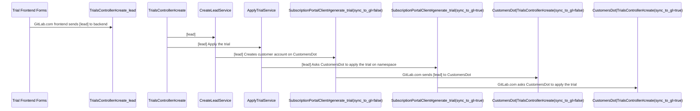
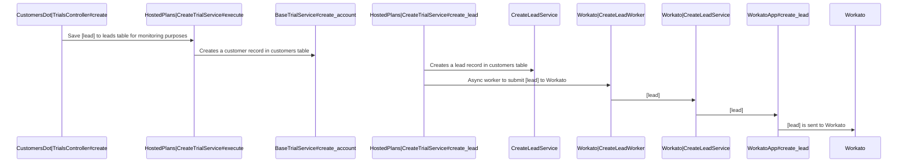
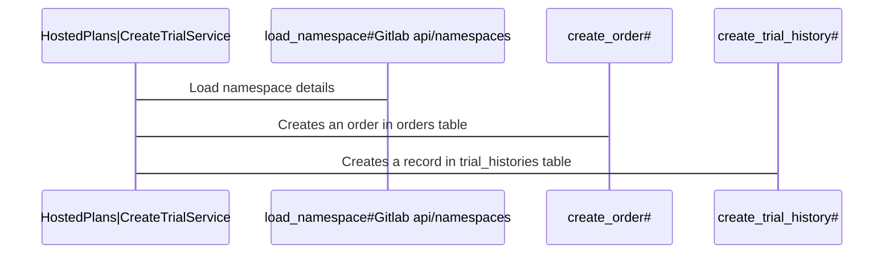
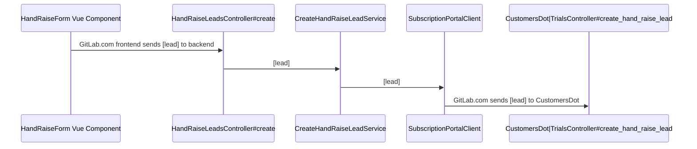
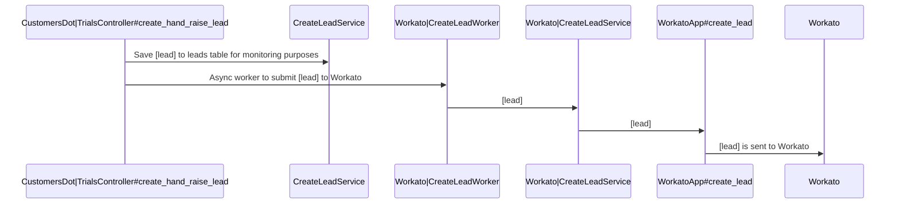
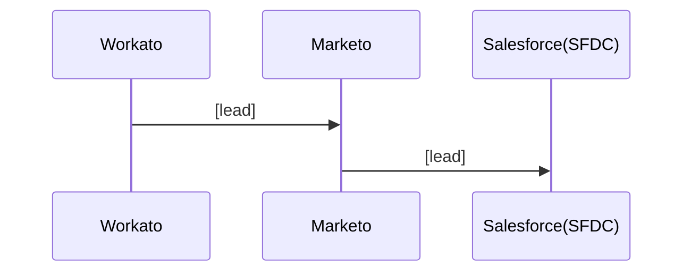

# Product Qualified Lead (PQL) development guidelines

The Product Qualified Lead (PQL) funnel connects our users with our team members. Read more about [PQL product principles](https://handbook.gitlab.com/handbook/product/product-principles/#product-qualified-leads-pqls).

A hand-raise PQL is a user who requests to speak to sales from within the product.

## Set up your development environment

1. Set up GDK with a connection to your local CustomersDot instance.
1. Set up CustomersDot to talk to a staging instance of Workato.

1. Set up CustomersDot using the [standard install instructions](https://gitlab.com/gitlab-org/customers-gitlab-com/-/blob/staging/doc/setup/installation_steps.md).
1. Set the `CUSTOMER_PORTAL_URL` environment variable to your local (or ngrok) URL of your CustomersDot instance.
1. Place `export CUSTOMER_PORTAL_URL='https://XXX.ngrok.io/'` in your shell `rc` script (`~/.zshrc` or `~/.bash_profile` or `~/.bashrc`) and restart GDK.
1. Enter the credentials on CustomersDot development to Workato in your `/config/secrets.yml` and restart. Credentials for the Workato Staging are in the 1Password Subscription portal vault. The URL for staging is `https://apim.workato.com/gitlab-dev/services/marketo/lead`.

```yaml
  workato_url: "<%= ENV['WORKATO_URL'] %>"
  workato_client_id: "<%= ENV['WORKATO_CLIENT_ID'] %>"
  workato_client_secret: "<%= ENV['WORKATO_CLIENT_SECRET'] %>"
```

### Set up lead monitoring

1. Set up access for the Marketo sandbox, similar [to this example request](https://gitlab.com/gitlab-com/team-member-epics/access-requests/-/issues/13162).

### Manually test leads

1. Register a new user with a unique email on your local GitLab instance.
1. Send the PQL lead by submitting your new form or creating a new trial or a new hand raise lead.
1. Use easily identifiable values that can be easily seen in Workato staging.
1. Observe the entry in the staging instance of Workato and paste in the merge request comment and mention.

## Troubleshooting

- Check the application and Sidekiq logs on `gitlab.com` and CustomersDot to monitor leads.
- Check the `leads` table in CustomersDot.
- Ask for access to the Marketo Sandbox and validate the leads there, [to this example request](https://gitlab.com/gitlab-com/team-member-epics/access-requests/-/issues/13162).

## Embed a hand-raise lead form

[HandRaiseLeadButton](https://gitlab.com/gitlab-org/gitlab/-/blob/master/ee/app/assets/javascripts/hand_raise_leads/hand_raise_lead/components/hand_raise_lead_button.vue) is a reusable component that adds a button and a hand-raise modal to any screen.

You can import a hand-raise lead button the following way.

```javascript
import HandRaiseLeadButton from 'ee/hand_raise_leads/hand_raise_lead/components/hand_raise_lead_button.vue';

export default {
  components: {
    HandRaiseLeadButton,
...
</script>

<template>

<hand-raise-lead-button />

```

The hand-raise lead form accepts the following parameters via provide or inject.

```javascript
    provide: {
      small,
      user: {
        namespaceId,
        userName,
        firstName,
        lastName,
        companyName,
        glmContent,
      },
      ctaTracking: {
        action,
        label,
        property,
        value,
        experiment,
      },
    },
```

The `ctaTracking` parameters follow the `data-track` attributes for implementing Snowplow tracking. The provided tracking attributes are attached to the button inside the `HandRaiseLeadButton` component, which triggers the hand-raise lead modal when selected.

### Monitor the lead location

When embedding a new hand raise form, use a unique `glmContent` or `glm_content` field that is different to any existing values.

We currently use the following `glm_content` values:

| `glm_content` value                 | Notes |
|-------------------------------------|-------|
| `discover-group-security`           | This value is used in the group security feature discovery page. |
| `discover-group-security-pqltest`   | This value is used in the group security feature discovery page [experiment with 3 CTAs](https://gitlab.com/gitlab-org/gitlab/-/issues/349799). |
| `discover-project-security`         | This value is used in the project security feature discovery page. |
| `discover-project-security-pqltest` | This value is used in the project security feature discovery page [experiment with 3 CTAs](https://gitlab.com/gitlab-org/gitlab/-/issues/349799). |
| `group-billing`                     | This value is used in the group billing page. |
| `trial-status-show-group`           | This value is used in the upper-left nav when a namespace has an active trial. |

### Test the component

In a jest test, you may test the presence of the component.

```javascript
expect(wrapper.findComponent(HandRaiseLeadButton).exists()).toBe(true);
```

## PQL lead flow

The flow of a PQL lead is as follows:

1. A user triggers a [`HandRaiseLeadButton` component](#embed-a-hand-raise-lead-form) on `gitlab.com`.
1. The `HandRaiseLeadButton` submits any information to the following API endpoint: `/-/subscriptions/hand_raise_leads`.
1. That endpoint reposts the form to the CustomersDot `trials/create_hand_raise_lead` endpoint.
1. CustomersDot records the form data to the `leads` table and posts the form to [Workato](https://handbook.gitlab.com/handbook/marketing/marketing-operations/workato/).
1. Workato sends the form to Marketo.
1. Marketo does scoring and sends the form to Salesforce.
1. Our Sales team uses Salesforce to connect to the leads.

### Trial lead flow

#### Trial lead flow on GitLab.com



#### Trial lead flow on CustomersDot (`sync_to_gl`)



#### Applying the trial to a namespace on CustomersDot



### Hand raise lead flow

#### Hand raise flow on GitLab.com



#### Hand raise flow on CustomersDot



### PQL flow after Workato for all lead types


