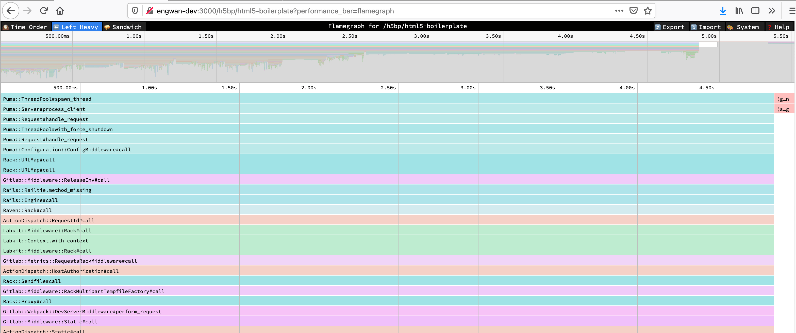
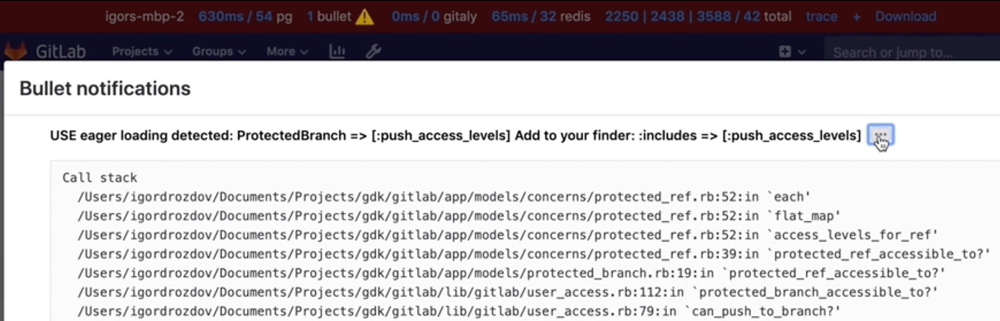
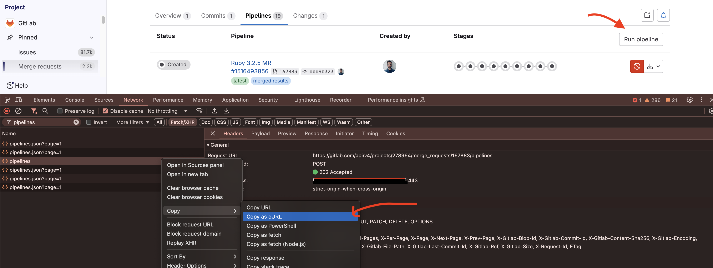
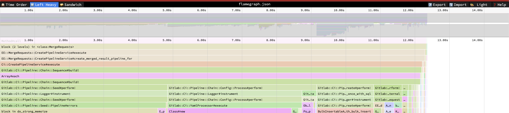
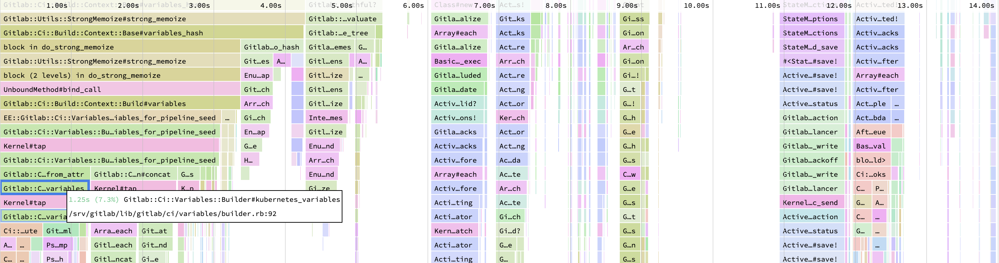
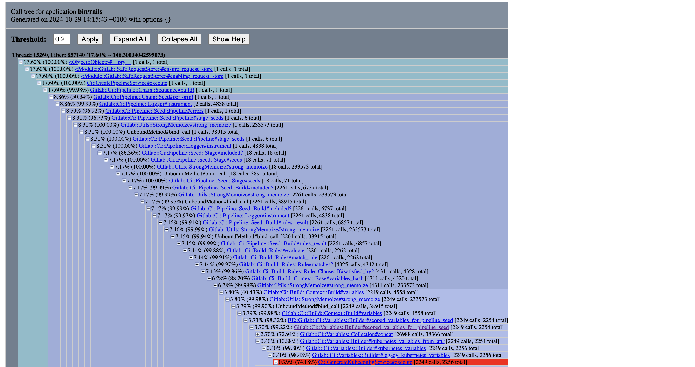

To make it easier to track down performance problems GitLab comes with a set of
profiling tools, some of these are available by default while others need to be
explicitly enabled.

## Profiling a URL

There is a `Gitlab::Profiler.profile` method, and corresponding
`bin/profile-url` script, that enable profiling a GET or POST request to a
specific URL, either as an anonymous user (the default) or as a specific user.

The first argument to the profiler is either a full URL
(including the instance hostname) or an absolute path, including the
leading slash.

By default the report dump will be stored in a temporary file, which can be
interacted with using the [Stackprof API](#reading-a-gitlabprofiler-report).

When using the script, command-line documentation is available by passing no
arguments.

When using the method in an interactive console session, any changes to the
application code within that console session is reflected in the profiler
output.

For example:

```ruby
Gitlab::Profiler.profile('/my-user')
# Returns the location of the temp file where the report dump is stored
class UsersController; def show; sleep 100; end; end
Gitlab::Profiler.profile('/my-user')
# Returns the location of the temp file where the report dump is stored
# where 100 seconds is spent in UsersController#show
```

For routes that require authorization you must provide a user to
`Gitlab::Profiler`. You can do this like so:

```ruby
Gitlab::Profiler.profile('/gitlab-org/gitlab-test', user: User.first)
```

Passing a `logger:` keyword argument to `Gitlab::Profiler.profile` sends
ActiveRecord and ActionController log output to that logger. Further options are
documented with the method source.

```ruby
Gitlab::Profiler.profile('/gitlab-org/gitlab-test', user: User.first, logger: Logger.new($stdout))
```

Pass in a `profiler_options` hash to configure the output file (`out`) of the sampling data. For example:

```ruby
Gitlab::Profiler.profile('/gitlab-org/gitlab-test', user: User.first, profiler_options: { out: 'tmp/profile.dump' })
```

## Reading a `GitLab::Profiler` report

You can get a summary of where time was spent by running Stackprof against the sampling data. For example:

```shell
stackprof tmp/profile.dump
```

Example sampling data:

```plaintext
==================================
  Mode: wall(1000)
  Samples: 8745 (6.92% miss rate)
  GC: 1399 (16.00%)
==================================
     TOTAL    (pct)     SAMPLES    (pct)     FRAME
      1022  (11.7%)        1022  (11.7%)     Sprockets::PathUtils#stat
       957  (10.9%)         957  (10.9%)     (marking)
       493   (5.6%)         493   (5.6%)     Sprockets::PathUtils#entries
       576   (6.6%)         471   (5.4%)     Mustermann::AST::Translator#decorator_for
       439   (5.0%)         439   (5.0%)     (sweeping)
       630   (7.2%)         241   (2.8%)     Sprockets::Cache::FileStore#get
       208   (2.4%)         208   (2.4%)     ActiveSupport::FileUpdateChecker#watched
       206   (2.4%)         206   (2.4%)     Digest::Instance#file
       544   (6.2%)         176   (2.0%)     Sprockets::Cache::FileStore#safe_open
       176   (2.0%)         176   (2.0%)     ActiveSupport::FileUpdateChecker#max_mtime
       268   (3.1%)         147   (1.7%)     ActiveRecord::ConnectionAdapters::PostgreSQLAdapter#exec_no_cache
       140   (1.6%)         140   (1.6%)     ActiveSupport::BacktraceCleaner#add_gem_filter
       116   (1.3%)         116   (1.3%)     Bootsnap::CompileCache::ISeq.storage_to_output
       160   (1.8%)         113   (1.3%)     Gem::Version#<=>
       109   (1.2%)         109   (1.2%)     block in <main>
       108   (1.2%)         108   (1.2%)     Gem::Version.new
       131   (1.5%)         105   (1.2%)     Sprockets::EncodingUtils#unmarshaled_deflated
      1166  (13.3%)          82   (0.9%)     Mustermann::RegexpBased#initialize
        82   (0.9%)          78   (0.9%)     FileUtils.touch
        72   (0.8%)          72   (0.8%)     Sprockets::Manifest.compile_match_filter
        71   (0.8%)          70   (0.8%)     Grape::Router#compile!
        91   (1.0%)          65   (0.7%)     ActiveRecord::ConnectionAdapters::PostgreSQL::DatabaseStatements#query
        93   (1.1%)          64   (0.7%)     ActionDispatch::Journey::Path::Pattern::AnchoredRegexp#accept
        59   (0.7%)          59   (0.7%)     Mustermann::AST::Translator.dispatch_table
        62   (0.7%)          59   (0.7%)     Rails::BacktraceCleaner#initialize
      2492  (28.5%)          49   (0.6%)     Sprockets::PathUtils#stat_directory
       242   (2.8%)          49   (0.6%)     Gitlab::Instrumentation::RedisBase.add_call_details
        47   (0.5%)          47   (0.5%)     URI::RFC2396_Parser#escape
        46   (0.5%)          46   (0.5%)     #<Class:0x00000001090c2e70>#__setobj__
        44   (0.5%)          44   (0.5%)     Sprockets::Base#normalize_logical_path
```

You can also generate flamegraphs:

```shell
stackprof --d3-flamegraph tmp/profile.dump > flamegraph.html
```

See [the Stackprof documentation](https://github.com/tmm1/stackprof) for more details.

## Speedscope flamegraphs

You can generate a flamegraph for a particular URL by selecting a flamegraph sampling mode button in the performance bar or by adding the `performance_bar=flamegraph` parameter to the request.



Find more information about the views in the [Speedscope docs](https://github.com/jlfwong/speedscope#views).

Find more information about different sampling modes in the [Stackprof docs](https://github.com/tmm1/stackprof#sampling).

This is enabled for all users that can access the performance bar.

<!-- vale gitlab_base.SubstitutionWarning = NO -->
<!-- Here, "bullet" is a false positive -->

## Bullet

Bullet is a Gem that can be used to track down N+1 query problems. It logs
query problems to the Rails log and the browser console. The **Bullet** section is
displayed on the [performance bar](../administration/monitoring/performance/performance_bar.md).



Bullet is enabled only in development mode by default. However, logging is disabled,
because Bullet logging is noisy. To configure Bullet and its logging:

- To manually enable or disable Bullet on an environment, add these lines to
  `config/gitlab.yml`, changing the `enabled` value as needed:

  ```yaml
  bullet:
    enabled: false
  ```

- To enable Bullet logging, set the `ENABLE_BULLET` environment variable to a
  non-empty value before starting GitLab:

  ```shell
  ENABLE_BULLET=true bundle exec rails s
  ```

As a follow-up to finding `N+1` queries with Bullet, consider writing a
[QueryRecoder test](database/query_recorder.md) to prevent a regression.

<!-- vale gitlab_base.SubstitutionWarning = YES -->

## System stats

During or after profiling, you may want to get detailed information about the Ruby virtual machine process,
such as memory consumption, time spent on CPU, or garbage collector statistics. These are easy to produce individually
through various tools, but for convenience, a summary endpoint has been added that exports this data as a JSON payload:

```shell
curl localhost:3000/-/metrics/system | jq
```

Example output:

```json
{
  "version": "ruby 2.7.2p137 (2020-10-01 revision a8323b79eb) [x86_64-linux-gnu]",
  "gc_stat": {
    "count": 118,
    "heap_allocated_pages": 11503,
    "heap_sorted_length": 11503,
    "heap_allocatable_pages": 0,
    "heap_available_slots": 4688580,
    "heap_live_slots": 3451712,
    "heap_free_slots": 1236868,
    "heap_final_slots": 0,
    "heap_marked_slots": 3451450,
    "heap_eden_pages": 11503,
    "heap_tomb_pages": 0,
    "total_allocated_pages": 11503,
    "total_freed_pages": 0,
    "total_allocated_objects": 32679478,
    "total_freed_objects": 29227766,
    "malloc_increase_bytes": 84760,
    "malloc_increase_bytes_limit": 32883343,
    "minor_gc_count": 88,
    "major_gc_count": 30,
    "compact_count": 0,
    "remembered_wb_unprotected_objects": 114228,
    "remembered_wb_unprotected_objects_limit": 228456,
    "old_objects": 3185330,
    "old_objects_limit": 6370660,
    "oldmalloc_increase_bytes": 21838024,
    "oldmalloc_increase_bytes_limit": 119181499
  },
  "memory_rss": 1326501888,
  "memory_uss": 1048563712,
  "memory_pss": 1139554304,
  "time_cputime": 82.885264633,
  "time_realtime": 1610459445.5579069,
  "time_monotonic": 24001.23145713,
  "worker_id": "puma_0"
}
```

NOTE:
This endpoint is only available for Rails web workers. Sidekiq workers cannot be inspected this way.

## Settings that impact performance

### Application settings

1. `development` environment by default works with hot-reloading enabled, this makes Rails to check file changes every request, and create a potential contention lock, as hot reload is single threaded.
1. `development` environment can load code lazily once the request is fired which results in first request to always be slow.

To disable those features for profiling/benchmarking set the `RAILS_PROFILE` environment variable to `true` before starting GitLab. For example when using GDK:

- create a file [`env.runit`](https://gitlab.com/gitlab-org/gitlab-development-kit/-/blob/main/doc/runit.md#modifying-environment-configuration-for-services) in the root GDK directory
- add `export RAILS_PROFILE=true` to your `env.runit` file
- restart GDK with `gdk restart`

*This environment variable is only applicable for the development mode.*

### GC settings

Ruby's garbage collector (GC) can be tuned via a variety of environment variables that will directly impact application performance.

The following table lists these variables along with their default values.

| Environment variable | Default value |
|--|--|
| `RUBY_GC_HEAP_INIT_SLOTS` | `10000` |
| `RUBY_GC_HEAP_FREE_SLOTS` | `4096` |
| `RUBY_GC_HEAP_FREE_SLOTS_MIN_RATIO` | `0.20` |
| `RUBY_GC_HEAP_FREE_SLOTS_GOAL_RATIO` | `0.40` |
| `RUBY_GC_HEAP_FREE_SLOTS_MAX_RATIO` | `0.65` |
| `RUBY_GC_HEAP_GROWTH_FACTOR` | `1.8` |
| `RUBY_GC_HEAP_GROWTH_MAX_SLOTS` | `0 (disable)` |
| `RUBY_GC_HEAP_OLDOBJECT_LIMIT_FACTOR` | `2.0` |
| `RUBY_GC_MALLOC_LIMIT(_MIN)` | `(16 * 1024 * 1024 /* 16MB */)` |
| `RUBY_GC_MALLOC_LIMIT_MAX` | `(32 * 1024 * 1024 /* 32MB */)` |
| `RUBY_GC_MALLOC_LIMIT_GROWTH_FACTOR` | `1.4` |
| `RUBY_GC_OLDMALLOC_LIMIT(_MIN)` | `(16 * 1024 * 1024 /* 16MB */)` |
| `RUBY_GC_OLDMALLOC_LIMIT_MAX` | `(128 * 1024 * 1024 /* 128MB */)` |
| `RUBY_GC_OLDMALLOC_LIMIT_GROWTH_FACTOR` | `1.2` |

([Source](https://github.com/ruby/ruby/blob/45b29754cfba8435bc4980a87cd0d32c648f8a2e/gc.c#L254-L308))

GitLab may decide to change these settings to speed up application performance, lower memory requirements, or both.

You can see how each of these settings affect GC performance, memory use and application start-up time for an idle instance of
GitLab by running the `scripts/perf/gc/collect_gc_stats.rb` script. It will output GC stats and general timing data to standard
out as CSV.

## An example of investigating performance issues

The Pipeline Authoring team has worked on solving [the pipeline creation performance issues](https://gitlab.com/groups/gitlab-org/-/epics/7290)
and used both the existing profiling methods such as [stackprof flamegraphs](#speedscope-flamegraphs) and [`memory_profiler`](performance.md#using-memory-profiler)
and a new method [`ruby-prof`](https://ruby-prof.github.io/).

### Using stackprof flamegraphs

[Performance bar](../administration/monitoring/performance/performance_bar.md) is a great tool to get a stackprof report
and see a flamegraph via a single click;


However, it's not available for other than GET requests.

To get a flamegraph for a POST request, we use the `performance_bar=flamegraph` parameter with the API request.
In our case, we want to see the flamegraph for [the pipeline creation endpoint of a merge request](../api/merge_requests.md#create-merge-request-pipeline).

Normally, we could use the following command to get a stackprof report as a JSON file but our user control
of `Gitlab::PerformanceBar.allowed_for_user?(request.env['warden']&.user)` allows only users authenticated via the web interface.

```shell
# This will not work on production

curl --request POST \
  --output flamegraph.json \
  --header 'Content-Type: application/json' \
  --header 'PRIVATE-TOKEN: :token' \
  "https://gitlab.example.com/api/v4/projects/:id/merge_requests/:iid/pipelines?performance_bar=flamegraph"
```

To get around this, we copy the request as `curl` and use it in the terminal.



We'll have a `curl` command like this:

```shell
curl "https://gitlab.com/api/v4/projects/:id/merge_requests/:iid/pipelines" \
  -H 'accept: application/json, text/plain, */*' \
  -H 'content-type: application/json' \
  -H 'cookie: xyz' \
  -H 'x-csrf-token: xyz' \
  --data-raw '{"async":true}'
```

- Notice the `async` parameter in the request body.
  We need to remove it to get the actual performance of the pipeline creation endpoint.
- We need to add the `performance_bar=flamegraph` parameter to the request.
- We need to add the `--output flamegraph.json` parameter to save the JSON response to a file.
- Lastly, we need to accept the JSON response only.

```shell
curl "https://gitlab.com/api/v4/projects/:id/merge_requests/:iid/pipelines?performance_bar=flamegraph" \
  -X POST \
  -o flamegraph.json \
  -H 'accept: application/json' \
  -H 'content-type: application/json' \
  -H 'cookie: xyz' \
  -H 'x-csrf-token: xyz'
```

Then, we use the `flamegraph.json` file on the `https://www.speedscope.app/` website to see the flamegraph.



As an example, when investigating into this speedscope flamegraph, we saw that the `kubernetes_variables` method was
taking a lot of time and created [an issue](https://gitlab.com/gitlab-org/gitlab/-/issues/498648).



### Using `ruby-prof`

Another method to see where to spend most of the time is to use `ruby-prof`.
It's not an included gem in the Gemfile, so we need to add it to the Gemfile and run `bundle install` first.

To investigate the problem, we need to have a replica repository. To do this, we could mirror the repository
from the production instance to the development instance. Then, we can run the `ruby-prof` profiler to see where
the time is spent.

```ruby
# RAILS_PROFILE=true GITALY_DISABLE_REQUEST_LIMITS=true rails console

require 'ruby-prof'

ActiveRecord::Base.logger = nil
project = Project.find_by_full_path('root/gitlab-mirror')
user = project.first_owner
merge_request = project.merge_requests.find_by_iid(1)

profile = RubyProf::Profile.new
profile.exclude_common_methods! # see https://github.com/ruby-prof/ruby-prof/blob/1.7.0/lib/ruby-prof/exclude_common_methods.rb

profile.start

Gitlab::SafeRequestStore.ensure_request_store do
  Ci::CreatePipelineService
    .new(project, user, ref: merge_request.source_branch)
    .execute(:merge_request_event, merge_request: merge_request)
    .payload
end; nil

result = profile.stop

callstack_printer = RubyProf::CallStackPrinter.new(result)
File.open('tmp/ruby-prof-callstack-report.html', 'w') do |file|
  callstack_printer.print(file)
end

::Ci::DestroyPipelineService.new(project, user).execute(Ci::Pipeline.last)
```



Here, we can see that we call `Ci::GenerateKubeconfigService` ~2k times.
This is a good indicator that we need to investigate this.

### Using `memory_profiler`

[`memory_profiler`](performance.md#using-memory-profiler) is a tool to profile memory usage.
This is also important because high memory usage can lead to performance issues.

As we did with `stackprof`, we could also use `curl` with the `performance_bar` parameter.

```shell
curl "https://gitlab.com/api/v4/projects/:id/merge_requests/:iid/pipelines?performance_bar=memory" \
  -X POST \
  -o flamegraph.json \
  -H 'accept: application/json' \
  -H 'content-type: application/json' \
  -H 'cookie: xyz' \
  -H 'x-csrf-token: xyz'
```

However, this will not work on production because we have 60-second timeouts for the requests.
So, we need to use the development environment to get the memory profile.
More information can be found in the [memory profiler documentation](performance.md#using-memory-profiler).

```ruby
# RAILS_PROFILE=true GITALY_DISABLE_REQUEST_LIMITS=true rails console

require 'memory_profiler'

ActiveRecord::Base.logger = nil
project = Project.find_by_full_path('root/gitlab-mirror')
user = project.first_owner
merge_request = project.merge_requests.find_by_iid(1)

# Warmup
Ci::CreatePipelineService
  .new(project, user, ref: merge_request.source_branch)
  .execute(:merge_request_event, merge_request: merge_request); nil

report = MemoryProfiler.report do
  Gitlab::SafeRequestStore.ensure_request_store do
    Ci::CreatePipelineService
      .new(project, user, ref: merge_request.source_branch)
      .execute(:merge_request_event, merge_request: merge_request); nil
  end
end; nil

output = File.open('tmp/memory-profile-report.txt', 'w')
report.pretty_print(output, detailed_report: true, scale_bytes: true, normalize_paths: true)
```

Result;

```plaintext
#
# Note: I redacted some parts related to the gems and the Rails framework.
#       also, the output is shortened for readability.
#

Total allocated: 1.30 GB (12974240 objects)
Total retained:  29.67 MB (335085 objects)

allocated memory by gem
-----------------------------------
 675.48 MB  gitlab/lib

...

allocated memory by file
-----------------------------------
 253.68 MB  gitlab/lib/gitlab/ci/variables/collection/item.rb
 143.58 MB  gitlab/lib/gitlab/ci/variables/collection.rb
  51.66 MB  gitlab/lib/gitlab/config/entry/configurable.rb
  20.89 MB  gitlab/lib/gitlab/ci/pipeline/expression/lexeme/base.rb

...

allocated memory by location
-----------------------------------
 107.12 MB  gitlab/lib/gitlab/ci/variables/collection/item.rb:64
  70.22 MB  gitlab/lib/gitlab/ci/variables/collection.rb:28
  57.66 MB  gitlab/lib/gitlab/ci/variables/collection.rb:82
  45.70 MB  gitlab/lib/gitlab/config/entry/configurable.rb:67
  42.35 MB  gitlab/lib/gitlab/ci/variables/collection/item.rb:17
  42.35 MB  gitlab/lib/gitlab/ci/variables/collection/item.rb:80
  41.32 MB  gitlab/lib/gitlab/ci/variables/collection/item.rb:76
  20.10 MB  gitlab/lib/gitlab/ci/variables/collection/item.rb:72

...
```

In this example, we see where we can optimize the memory usage by looking at the allocated memory by file and location.

And in [a recent work](https://gitlab.com/gitlab-org/gitlab/-/issues/499707),
we [found a way](https://gitlab.com/gitlab-org/gitlab/-/merge_requests/171387) to improve the memory usage and got this result;

```plaintext
#
# Note: I redacted some parts related to the gems and the Rails framework.
#       also, the output is shortened for readability.
#

Total allocated: 1.08 GB (11171148 objects)
Total retained:  29.67 MB (335082 objects)

allocated memory by gem
-----------------------------------
 495.88 MB  gitlab/lib

...

allocated memory by file
-----------------------------------
 112.44 MB  gitlab/lib/gitlab/ci/variables/collection.rb
 105.24 MB  gitlab/lib/gitlab/ci/variables/collection/item.rb
  51.66 MB  gitlab/lib/gitlab/config/entry/configurable.rb
  20.89 MB  gitlab/lib/gitlab/ci/pipeline/expression/lexeme/base.rb

...
```

Total memory reduction for this example pipeline; ~200 MB.
