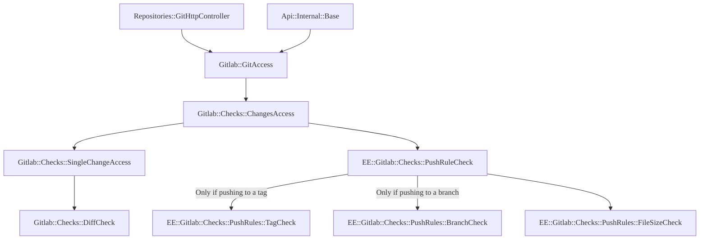

This document was created to help contributors understand the code design of
[push rules](../../user/project/repository/push_rules.md). You should read this
document before making changes to the code for this feature.

This document is intentionally limited to an overview of how the code is
designed, as code can change often. To understand how a specific part of the
feature works, view the code and the specs. The details here explain how the
major components of the push rules feature work.

NOTE:
This document should be updated when parts of the codebase referenced in this
document are updated, removed, or new parts are added.

## Business logic

The business logic is contained in two main places. The `PushRule` model stores
the settings for a rule and then we have checks that use those settings to
change the push behavior.

- `PushRule`: the main model used to store the configuration of each push rule.
  - Defined in `ee/app/models/push_rule.rb`.
- `EE::Gitlab::Checks::DiffCheck`: Diff check prevents filenames matching the
  push rule's `file_name_regex` and also files with names matching known secret
  files, for example `id_rsa`.
  - Defined in `ee/lib/ee/gitlab/checks/diff_check.rb`.
- `EE::Gitlab::Checks::PushRuleCheck`: Executes various push rule checks.
  - Defined in `ee/lib/ee/gitlab/checks/push_rule_check.rb`.
- `EE::Gitlab::Checks::PushRules::BranchCheck`: Executes push rule checks
  related to branch rules.
  - Defined in `ee/lib/ee/gitlab/checks/push_rules/branch_check.rb`.
- `EE::Gitlab::Checks::PushRules::CommitCheck`: Executes push rule checks
  related to commit rules.
  - Defined in `ee/lib/ee/gitlab/checks/push_rules/commit_check.rb`.
- `EE::Gitlab::Checks::PushRules::FileSizeCheck`: Executes push rule checks
  related to file size rules.
  - Defined in `ee/lib/ee/gitlab/checks/push_rules/file_size_check.rb`.
- `EE::Gitlab::Checks::PushRules::TagCheck`: Executes push rule checks
  related to tag rules.
  - Defined in `ee/lib/ee/gitlab/checks/push_rules/tag_check.rb`.

## Entrypoints

The following controllers and APIs are all entrypoints into the push rules logic:

- `Admin::PushRulesController`: This controller is used to manage the global push rule.
- `Group::PushRulesController`: This controller is used to manage the group-level push rule.
- `Project::PushRulesController`: This controller is used to manage the project-level push rule.
- `Api::Internal::Base`: This `/internal/allowed` endpoint is called when pushing to GitLab over SSH to
  ensure the user is allowed to push. The `/internal/allowed` endpoint performs a
  `Gitlab::Checks::DiffCheck`. In EE, this includes push rules checks.
  - Defined in `lib/api/internal/base.rb`.
- `Repositories::GitHttpController`: When changes are pushed to GitLab over HTTP, the controller performs an access
  check to ensure the user is allowed to push. The checks perform a
  `Gitlab::Checks::DiffCheck`. In EE, this includes push rules checks.
  - Defined in `app/controllers/repositories/git_http_controller.rb`.

## Flow

These flowcharts should help explain the flow from the controllers down to the
models for different features.

### Git push over SSH

NOTE:
The `PushRuleCheck` only triggers checks in parallel if the
`parallel_push_checks` feature flag is enabled. Otherwise tag or branch check
runs first, then file size.
