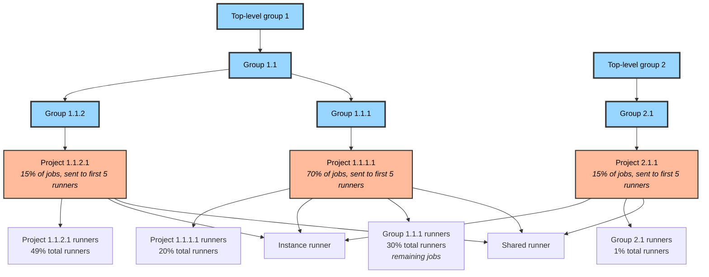

Rake tasks are available for developers and others contributing to GitLab.

## Set up database with developer seeds

If your database user does not have advanced privileges, you must create the database manually before running this command.

```shell
bundle exec rake setup
```

The `setup` task is an alias for `gitlab:setup`.
This tasks calls `db:reset` to create the database, and calls `db:seed_fu` to seed the database.
`db:setup` calls `db:seed` but this does nothing.

### Environment variables

**MASS_INSERT**: Create millions of users (2m), projects (5m) and its
relations. It's highly recommended to run the seed with it to catch slow queries
while developing. Expect the process to take up to 20 extra minutes.

See also [Mass inserting Rails models](mass_insert.md).

**LARGE_PROJECTS**: Create large projects (through import) from a predefined set of URLs.

### Seeding Data

#### Seeding issues for all projects or a single project

You can seed issues for all or a given project with the `gitlab:seed:issues`
task:

```shell
# All projects
bin/rake gitlab:seed:issues

# A specific project
bin/rake "gitlab:seed:issues[group-path/project-path]"
```

By default, this seeds an average of 2 issues per week for the last 5 weeks per
project.

#### Seeding issues for Insights charts

DETAILS:
**Tier:** Ultimate
**Offering:** GitLab.com, GitLab Self-Managed, GitLab Dedicated

You can seed issues specifically for working with the
[Insights charts](../user/project/insights/_index.md) with the
`gitlab:seed:insights:issues` task:

```shell
# All projects
bin/rake gitlab:seed:insights:issues

# A specific project
bin/rake "gitlab:seed:insights:issues[group-path/project-path]"
```

By default, this seeds an average of 10 issues per week for the last 52 weeks
per project. All issues are also randomly labeled with team, type, severity,
and priority.

#### Seeding groups with subgroups

You can seed groups with subgroups that contain milestones/projects/issues
with the `gitlab:seed:group_seed` task:

```shell
bin/rake "gitlab:seed:group_seed[subgroup_depth, username, organization_path]"
```

Group are additionally seeded with epics if GitLab instance has epics feature available.

#### Seeding a runner fleet test environment

Use the `gitlab:seed:runner_fleet` task to seed a full runner fleet, specifically groups with subgroups and projects that contain runners and pipelines:

```shell
bin/rake "gitlab:seed:runner_fleet[username, registration_prefix, runner_count, job_count]"
```

By default, the Rake task uses the `root` username to create 40 runners and 400 jobs.



#### Seeding custom metrics for the monitoring dashboard

A lot of different types of metrics are supported in the monitoring dashboard.

To import these metrics, you can run:

```shell
bundle exec rake 'gitlab:seed:development_metrics[your_project_id]'
```

#### Seed a project with vulnerabilities

You can seed a project with [security vulnerabilities](../user/application_security/vulnerabilities/_index.md).

```shell
# Seed all projects
bin/rake 'gitlab:seed:vulnerabilities'

# Seed a specific project
bin/rake 'gitlab:seed:vulnerabilities[group-path/project-path]'
```

#### Seed a project with environments

You can seed a project with [environments](../ci/environments/_index.md).

By default, this creates 10 environments, each with the prefix `ENV_`.
Only `project_path` is required to run this command.

```shell
bundle exec rake "gitlab:seed:project_environments[project_path, seed_count, prefix]"

# Examples
bundle exec rake "gitlab:seed:project_environments[flightjs/Flight]"
bundle exec rake "gitlab:seed:project_environments[flightjs/Flight, 25, FLIGHT_ENV_]"
```

#### Seed a group with dependencies

```shell
bundle exec rake gitlab:seed:dependencies
```

#### Seed CI variables

You can seed a project, group, or instance with [CI variables](../ci/variables/_index.md).

By default, each command creates 10 CI variables. Variable names are prepended with its own
default prefix (`VAR_` for project-level variables, `GROUP_VAR_` for group-level variables,
and `INSTANCE_VAR_` for instance-level variables).

Instance-level variables do not have environment scopes. Project-level and group-level variables
use the default `"*"` environment scope if no `environment_scope` is supplied. If `environment_scope`
is set to `"unique"`, each variable is created with its own unique environment.

```shell
# Seed a project with project-level CI variables
# Only `project_path` is required to run this command.
bundle exec rake "gitlab:seed:ci_variables_project[project_path, seed_count, environment_scope, prefix]"

# Seed a group with group-level CI variables
# Only `group_name` is required to run this command.
bundle exec rake "gitlab:seed:ci_variables_group[group_name, seed_count, environment_scope, prefix]"

# Seed an instance with instance-level CI variables
bundle exec rake "gitlab:seed:ci_variables_instance[seed_count, prefix]"

# Examples
bundle exec rake "gitlab:seed:ci_variables_project[flightjs/Flight]"
bundle exec rake "gitlab:seed:ci_variables_project[flightjs/Flight, 25, staging]"
bundle exec rake "gitlab:seed:ci_variables_project[flightjs/Flight, 25, unique, CI_VAR_]"

bundle exec rake "gitlab:seed:ci_variables_group[group_name]"
bundle exec rake "gitlab:seed:ci_variables_group[group_name, 25, staging]"
bundle exec rake "gitlab:seed:ci_variables_group[group_name, 25, unique, CI_VAR_]"

bundle exec rake "gitlab:seed:ci_variables_instance"
bundle exec rake "gitlab:seed:ci_variables_instance[25, CI_VAR_]"
```

#### Seed a project for merge train development

Seeds a project with merge trains configured and 20 merge requests(each with 3 commits). The command:

```shell
rake gitlab:seed:merge_trains:project
```

### Automation

If you're very sure that you want to **wipe the current database** and refill
seeds, you can set the `FORCE` environment variable to `yes`:

```shell
FORCE=yes bundle exec rake setup
```

This skips the action confirmation/safety check, saving you from answering
`yes` manually.

### Discard `stdout`

Since the script would print a lot of information, it could be slowing down
your terminal, and it would generate more than 20G logs if you just redirect
it to a file. If we don't care about the output, we could just redirect it to
`/dev/null`:

```shell
echo 'yes' | bundle exec rake setup > /dev/null
```

Because you can't see the questions from `stdout`, you might just want
to `echo 'yes'` to keep it running. It would still print the errors on `stderr`
so no worries about missing errors.

### Extra Project seed options

There are a few environment flags you can pass to change how projects are seeded

- `SIZE`: defaults to `8`, max: `32`. Amount of projects to create.
- `LARGE_PROJECTS`: defaults to false. If set, clones 6 large projects to help with testing.
- `FORK`: defaults to false. If set to `true`, forks `torvalds/linux` five times. Can also be set to an existing project `full_path` to fork that instead.

## Run tests

To run the test you can use the following commands:

- `bin/rake spec` to run the RSpec suite
- `bin/rake spec:unit` to run only the unit tests
- `bin/rake spec:integration` to run only the integration tests
- `bin/rake spec:system` to run only the system tests

`bin/rake spec` takes significant time to pass.
Instead of running the full test suite locally, you can save a lot of time by running
a single test or directory related to your changes. After you submit a merge request,
CI runs full test suite for you. Green CI status in the merge request means
full test suite is passed.

You can't run `rspec .` since this tries to run all the `_spec.rb`
files it can find, also the ones in `/tmp`

You can pass RSpec command line options to the `spec:unit`,
`spec:integration`, and `spec:system` tasks. For example, `bin/rake "spec:unit[--tag ~geo --dry-run]"`.

For an RSpec test, to run a single test file you can run:

```shell
bin/rspec spec/controllers/commit_controller_spec.rb
```

To run several tests inside one directory:

- `bin/rspec spec/requests/api/` for the RSpec tests if you want to test API only

### Run RSpec tests which failed in merge request pipeline on your machine

If your merge request pipeline failed with RSpec test failures,
you can run all the failed tests on your machine with the following Rake task:

```shell
bin/rake spec:merge_request_rspec_failure
```

There are a few caveats for this Rake task:

- You need to be on the same branch on your machine as the source branch of the merge request.
- The pipeline must have been completed.
- You may need to wait for the test report to be parsed and retry again.

This Rake task depends on the [unit test reports](../ci/testing/unit_test_reports.md) feature,
which only gets parsed when it is requested for the first time.

### Speed up tests, Rake tasks, and migrations

[Spring](https://github.com/rails/spring) is a Rails application pre-loader. It
speeds up development by keeping your application running in the background so
you don't need to boot it every time you run a test, Rake task or migration.

If you want to use it, you must export the `ENABLE_SPRING` environment
variable to `1`:

```shell
export ENABLE_SPRING=1
```

Alternatively you can use the following on each spec run,

```shell
bundle exec spring rspec some_spec.rb
```

## RuboCop tasks

## Generate initial RuboCop TODO list

One way to generate the initial list is to run the Rake task `rubocop:todo:generate`:

```shell
bundle exec rake rubocop:todo:generate
```

To generate TODO list for specific RuboCop rules, pass them comma-separated as
argument to the Rake task:

```shell
bundle exec rake 'rubocop:todo:generate[Gitlab/NamespacedClass,Lint/Syntax]'
bundle exec rake rubocop:todo:generate\[Gitlab/NamespacedClass,Lint/Syntax\]
```

Some shells require brackets to be escaped or quoted.

See [Resolving RuboCop exceptions](rubocop_development_guide.md#resolving-rubocop-exceptions)
on how to proceed from here.

### Run RuboCop in graceful mode

You can run RuboCop in "graceful mode". This means all enabled cop rules are
silenced which have "grace period" activated (via `Details: grace period`).

Run:

```shell
bundle exec rake 'rubocop:check:graceful'
bundle exec rake 'rubocop:check:graceful[Gitlab/NamespacedClass]'
```

## Compile Frontend Assets

You shouldn't ever need to compile frontend assets manually in development, but
if you ever need to test how the assets get compiled in a production
environment you can do so with the following command:

```shell
RAILS_ENV=production NODE_ENV=production bundle exec rake gitlab:assets:compile
```

This compiles and minifies all JavaScript and CSS assets and copy them along
with all other frontend assets (images, fonts, etc) into `/public/assets` where
they can be easily inspected.

## Emoji tasks

To update the Emoji aliases file (used for Emoji autocomplete), run the
following:

```shell
bundle exec rake tanuki_emoji:aliases
```

To import the fallback Emoji images, run the following:

```shell
bundle exec rake tanuki_emoji:import
```

To update the Emoji digests file (used for Emoji autocomplete) based on the currently
available Emoji, run the following:

```shell
bundle exec rake tanuki_emoji:digests
```

To generate a sprite file containing all the Emoji, run:

```shell
bundle exec rake tanuki_emoji:sprite
```

See [How to update Emojis](fe_guide/emojis.md) for detailed instructions.

## Update project templates

See [contributing to project templates for GitLab team members](project_templates/add_new_template.md#for-gitlab-team-members).

## Generate route lists

To see the full list of API routes, you can run:

```shell
bundle exec rake grape:path_helpers
```

The generated list includes a full list of API endpoints and functional
RESTful API verbs.

For the Rails controllers, run:

```shell
bundle exec rails routes
```

Since these take some time to create, it's often helpful to save the output to
a file for quick reference.

## Show obsolete `ignored_columns`

To see a list of all obsolete `ignored_columns` definitions run:

```shell
bundle exec rake db:obsolete_ignored_columns
```

Feel free to remove their definitions from their `ignored_columns` definitions.

## Validate GraphQL queries

To check the validity of one or more of our front-end GraphQL queries,
run:

```shell
# Validate all queries
bundle exec rake gitlab:graphql:validate
# Validate one query
bundle exec rake gitlab:graphql:validate[path/to/query.graphql]
# Validate a directory
bundle exec rake gitlab:graphql:validate[path/to/queries]
```

This prints out a report with an entry for each query, explaining why
each query is invalid if it fails to pass validation.

We strip out `@client` fields during validation so it is important to mark
client fields with the `@client` directive to avoid false positives.

## Analyze GraphQL queries

Analogous to `ANALYZE` in SQL, we can run `gitlab:graphql:analyze` to
estimate the of the cost of running a query.

Usage:

```shell
# Analyze all queries
bundle exec rake gitlab:graphql:analyze
# Analyze one query
bundle exec rake gitlab:graphql:analyze[path/to/query.graphql]
# Analyze a directory
bundle exec rake gitlab:graphql:analyze[path/to/queries]
```

This prints out a report for each query, including the complexity
of the query if it is valid.

The complexity depends on the arguments in some cases, so the reported
complexity is a best-effort assessment of the upper bound.

## Update GraphQL documentation and schema definitions

To generate GraphQL documentation based on the GitLab schema, run:

```shell
bundle exec rake gitlab:graphql:compile_docs
```

In its current state, the Rake task:

- Generates output for GraphQL objects.
- Places the output at `doc/api/graphql/reference/_index.md`.

This uses some features from `graphql-docs` gem like its schema parser and helper methods.
The docs generator code comes from our side giving us more flexibility, like using Haml templates and generating Markdown files.

To edit the content, you may need to edit the following:

- The template. You can edit the template at `tooling/graphql/docs/templates/default.md.haml`.
  The actual renderer is at `Tooling::Graphql::Docs::Renderer`.
- The applicable `description` field in the code, which
  [Updates machine-readable schema files](#update-machine-readable-schema-files),
  which is then used by the `rake` task described earlier.

`@parsed_schema` is an instance variable that the `graphql-docs` gem expects to have available.
`Gitlab::Graphql::Docs::Helper` defines the `object` method we use. This is also where you
should implement any new methods for new types you'd like to display.

### Update machine-readable schema files

To generate GraphQL schema files based on the GitLab schema, run:

```shell
bundle exec rake gitlab:graphql:schema:dump
```

This uses GraphQL Ruby's built-in Rake tasks to generate files in both [IDL](https://www.prisma.io/blog/graphql-sdl-schema-definition-language-6755bcb9ce51) and JSON formats.

### Update documentation and schema definitions

The following command combines the intent of [Update GraphQL documentation and schema definitions](#update-graphql-documentation-and-schema-definitions) and [Update machine-readable schema files](#update-machine-readable-schema-files):

```shell
bundle exec rake gitlab:graphql:update_all
```

## Update audit event types documentation

For information on updating audit event types documentation, see
[Generate documentation](audit_event_guide/_index.md#generate-documentation).

## Update OpenAPI client for Error Tracking feature

NOTE:
This Rake task needs `docker` to be installed.

To update generated code for OpenAPI client located in
`gems/error_tracking_open_api` run the following commands:

```shell
# Run rake task
bundle exec rake gems:error_tracking_open_api:generate

# Review and test the changes

# Commit the changes
git commit -m 'Update ErrorTrackingOpenAPI from OpenAPI definition' gems/error_tracking_open_api
```

## Update banned SSH keys

You can add [banned SSH keys](../security/ssh_keys_restrictions.md#block-banned-or-compromised-keys)
from any Git repository by using the `gitlab:security:update_banned_ssh_keys` Rake task:

1. Find a public remote Git repository containing SSH public keys.
   The public key files must have the `.pub` file extension.
1. Make sure that `/tmp/` directory has enough space to store the remote Git repository.
1. To add the SSH keys to your banned-key list, run this command, replacing
   `GIT_URL` and `OUTPUT_FILE` with appropriate values:

   ```shell
   # @param git_url - Remote Git URL.
   # @param output_file - Update keys to an output file. Default is config/security/banned_ssh_keys.yml.

   bundle exec rake "gitlab:security:update_banned_ssh_keys[GIT_URL, OUTPUT_FILE]"
   ```

This task clones the remote repository, recursively walks the file system looking for files
ending in `.pub`, parses those files as SSH public keys, and then adds the public key fingerprints
to `output_file`. The contents of `config/security/banned_ssh_keys.yml` is read by GitLab and kept
in memory. It is not recommended to increase the size of this file beyond 1 megabyte in size.

## Output current navigation structure to YAML

_This task relies on your current environment setup (licensing, feature flags, projects/groups), so output may vary from run-to-run or environment-to-environment. We may look to standardize output in a future iteration._

Product, UX, and tech writing need a way to audit the entire GitLab navigation,
yet may not be comfortable directly reviewing the code in `lib/sidebars`. You
can dump the entire nav structure to YAML via the `gitlab:nav:dump_structure`
Rake task:

```shell
bundle exec rake gitlab:nav:dump_structure
```
