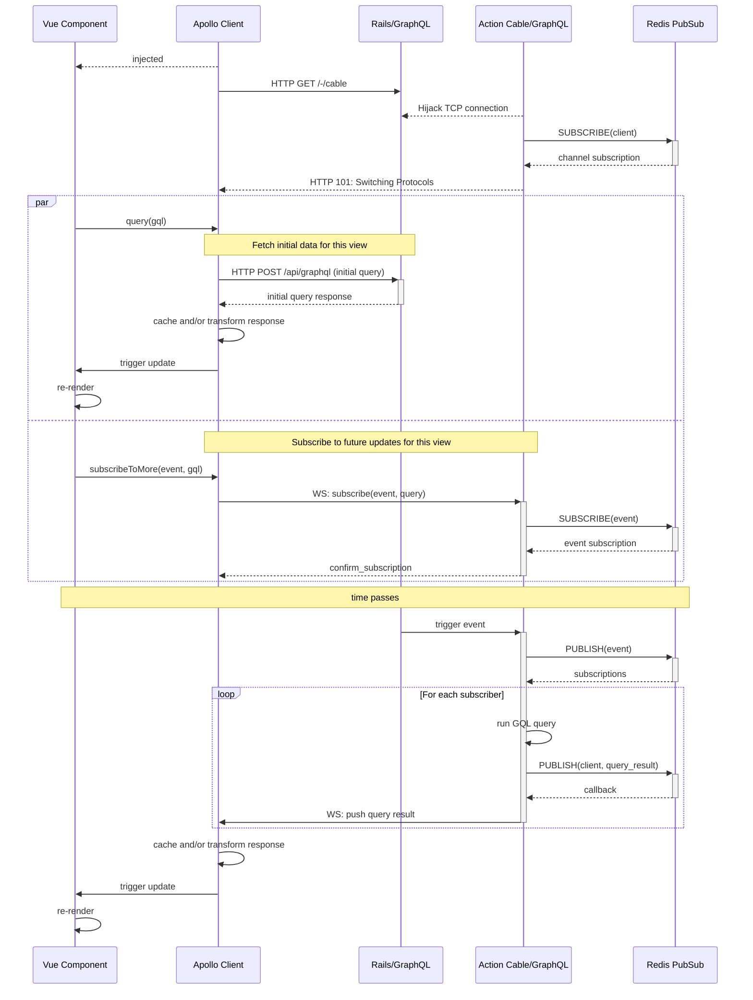

GitLab provides an interactive user experience through individual view components that accept
user input and reflect state changes back to the user. For example, on the Merge Request
page, users can approve, leave comments, interact with the CI/CD pipeline, and more.

However, GitLab often does not reflect state updates in a timely manner.
This means parts of the page display stale data that only update after users reload the page.

To address this, GitLab has introduced technology and programming APIs that allow view components
to receive state updates in real-time over a WebSocket.

The following documentation tells you how to build and deploy view components that
receive updates in real-time from the GitLab Ruby on Rails server.

NOTE:
Action Cable and GraphQL subscriptions are a work-in-progress and under active development.
Developers must evaluate their use case to check if these are the right tools to use.
If you are not sure, ask for help in the [`#f_real-time` internal Slack channel](https://gitlab.slack.com/archives/CUX9Z2N66).

## Build real-time view components

Prerequisites:

Read the:

- [GraphQL development guide](fe_guide/graphql.md).
- [Vue development guide](fe_guide/vue.md).

To build a real-time view component on GitLab, you must:

- Integrate a Vue component with Apollo subscriptions in the GitLab frontend.
- Add and trigger GraphQL subscriptions from the GitLab Ruby on Rails backend.

### Integrate a Vue component with Apollo subscriptions

NOTE:
Our current real-time stack assumes that client code is built using Vue as the rendering layer and
Apollo as the state and networking layer. If you are working with a part of
the GitLab frontend that has not been migrated to Vue + Apollo yet, complete that task first.

Consider a hypothetical `IssueView` Vue component that observes and renders GitLab `Issue` data.
For simplicity, we assume here that all it does is render an issue's title and description:

```javascript
import issueQuery from '~/issues/queries/issue_view.query.graqhql';

export default {
  props: {
    issueId: {
      type: Number,
      required: false,
      default: null,
    },
  },
  apollo: {
    // Name of the Apollo query object. Must match the field name bound by `data`.
    issue: {
      // Query used for the initial fetch.
      query: issueQuery,
      // Bind arguments used for the initial fetch query.
      variables() {
        return {
          iid: this.issueId,
        };
      },
      // Map response data to view properties.
      update(data) {
        return data.project?.issue || {};
      },
    },
  },
  // Reactive Vue component data. Apollo updates these when queries return or subscriptions fire.
  data() {
    return {
      issue: {}, // It is good practice to return initial state here while the view is loading.
    };
  },
};

// The <template> code is omitted for brevity as it is not relevant to this discussion.
```

The query should:

- Be defined at `app/assets/javascripts/issues/queries/issue_view.query.graqhql`.
- Contain the following GraphQL operation:

  ```plaintext
  query gitlabIssue($iid: String!) {
    # We hard-code the path here only for illustration. Don't do this in practice.
    project(fullPath: "gitlab-org/gitlab") {
      issue(iid: $iid) {
        title
        description
      }
    }
  }
  ```

So far this view component only defines the initial fetch query to populate itself with data.
This is an ordinary GraphQL `query` operation sent as an HTTP POST request, initiated by the view.
Any subsequent updates on the server would make this view stale. For it to receive updates from the server, you must:

1. Add a GraphQL subscription definition.
1. Define an Apollo subscription hook.

#### Add a GraphQL subscription definition

A subscription defines a GraphQL query as well, but it is wrapped inside a GraphQL `subscription` operation.
This query is initiated by the backend and its results pushed over a WebSocket into the view component.

Similar to the initial fetch query, you must:

- Define the subscription file at `app/assets/javascripts/issues/queries/issue_updated.subscription.graqhql`.
- Include the following GraphQL operation in the file:

  ```plaintext
  subscription issueUpdatedSubscription($iid: String!) {
    issueUpdated($issueId: IssueID!) {
      issue(issueId: $issueId) {
        title
        description
      }
    }
  }
  ```

When adding new subscriptions, use the following naming guidelines:

- End the subscription's operation name with `Subscription`, or `SubscriptionEE` if it's exclusive to GitLab EE.
  For example, `issueUpdatedSubscription`, or `issueUpdatedSubscriptionEE`.
- Use a "has happened" action verb in the subscription's event name. For example, `issueUpdated`.

While subscription definitions look similar to ordinary queries, there are some key differences that are important to understand:

- The `query`:
  - Originates from the frontend.
  - Uses an internal ID (`iid`, numeric), which is how entities are usually referenced in URLs.
    Because the internal ID is relative to the enclosing namespace (in this example, the `project`), you must nest the query under the `fullPath`.
- The `subscription`:
  - Is a request from the frontend to the backend to receive future updates.
  - Consists of:
    - The operation name describing the subscription itself (`issueUpdatedSubscription` in this example).
    - A nested event query (`issueUpdated` in this example). The nested event query:
      - Executes when running the [GraphQL trigger](#trigger-graphql-subscriptions) of the same name,
        so the event name used in the subscription must match the trigger field used in the backend.
      - Uses a global ID string instead of a numeric internal ID, which is the preferred way to identify resources in GraphQL.
        For more information, see [GraphQL global IDs](fe_guide/graphql.md#global-ids).

#### Define an Apollo subscription hook

After defining the subscription, add it to the view component using Apollo's `subscribeToMore` property:

```javascript
import issueQuery from '~/issues/queries/issue_view.query.graqhql';
import issueUpdatedSubscription from '~/issues/queries/issue_updated.subscription.graqhql';

export default {
  // As before.
  // ...
  apollo: {
    issue: {
      // As before.
      // ...
      // This Apollo hook enables real-time pushes.
      subscribeToMore: {
        // Subscription operation that returns future updates.
        document: issueUpdatedSubscription,
        // Bind arguments used for the subscription operation.
        variables() {
          return {
            iid: this.issueId,
          };
        },
        // Implement this to return true|false if subscriptions should be disabled.
        // Useful when using feature-flags.
        skip() {
          return this.shouldSkipRealTimeUpdates;
        },
      },
    },
  },
  // As before.
  // ...
  computed: {
    shouldSkipRealTimeUpdates() {
      return false; // Might check a feature flag here.
    },
  },
};
```

Now you can enable the view component to receive updates over a WebSocket connection through Apollo.
Next, we cover how events are triggered from the backend to initiate a push update to the frontend.

### Trigger GraphQL subscriptions

Writing a view component that can receive updates from a WebSocket is only half the story.
In the GitLab Rails application, we need to perform the following steps:

1. Implement a `GraphQL::Schema::Subscription` class. This class:
   - Is used by `graphql-ruby` to resolve the `subscription` operation sent by the frontend.
   - Defines the arguments a subscription takes and the payload returned to the caller, if any.
   - Runs any necessary business logic to ensure that the caller is authorized to create this subscription.
1. Add a new `field` to the `Types::SubscriptionType` class. This field maps the event name used
   [when integrating the Vue component](#integrate-a-vue-component-with-apollo-subscriptions) to the
   `GraphQL::Schema::Subscription` class.
1. Add a method matching the event name to `GraphqlTriggers` that runs the corresponding GraphQL trigger.
1. Use a service or Active Record model class to execute the new trigger as part of your domain logic.

#### Implement the subscription

If you subscribe to a an event that is already implemented as a `GraphQL::Schema::Subscription`, this step is optional.
Otherwise, create a new class under `app/graphql/subscriptions/`
that implements the new subscription. For the example of an `issueUpdated` event happening in response to an `Issue` being updated,
the subscription implementation is as follows:

```ruby
module Subscriptions
  class IssueUpdated < BaseSubscription
    include Gitlab::Graphql::Laziness

    payload_type Types::IssueType

    argument :issue_id, Types::GlobalIDType[Issue],
              required: true,
              description: 'ID of the issue.'

    def authorized?(issue_id:)
      issue = force(GitlabSchema.find_by_gid(issue_id))

      unauthorized! unless issue && Ability.allowed?(current_user, :read_issue, issue)

      true
    end
  end
end
```

When creating this new class:

- Make sure every subscription type inherits from `Subscriptions::BaseSubscription`.
- Use an appropriate `payload_type` to indicate what data subscribed queries may access,
  or define the individual `field`s you want to expose.
- You may also define custom `subscribe` and `update` hooks that are called each time a client subscribes or
  an event fires. Refer to the [official documentation](https://graphql-ruby.org/subscriptions/subscription_classes)
  for how to use these methods.
- Implement `authorized?` to perform any necessary permission checks. These checks execute for each call
  to `subscribe` or `update`.

Read more about GraphQL subscription classes [in the official documentation](https://graphql-ruby.org/subscriptions/subscription_classes).

#### Hook up the subscription

Skip this step if you did not implement a new subscription class.

After you implement a new subscription class, you must map that class to a `field` on the `SubscriptionType` before
it can execute. Open the `Types::SubscriptionType` class and add the new field:

```ruby
module Types
  class SubscriptionType < ::Types::BaseObject
    graphql_name 'Subscription'

    # Existing fields
    # ...

    field :issue_updated,
      subscription: Subscriptions::IssueUpdated, null: true,
      description: 'Triggered when an issue is updated.'
  end
end
```

NOTE:
If you are connecting an EE subscription, update `EE::Types::SubscriptionType` instead.

Make sure the `:issue_updated` argument matches the name used in the `subscription` request sent by the frontend in camel-case (`issueUpdated`), or `graphql-ruby` does not know which subscribers to inform. The event can now trigger.

#### Add the new trigger

Skip this step if you can reuse an existing trigger.

We use a facade around `GitlabSchema.subscriptions.trigger` to make it simpler to trigger an event.
Add the new trigger to `GraphqlTriggers`:

```ruby
module GraphqlTriggers
  # Existing triggers
  # ...

  def self.issue_updated(issue)
    GitlabSchema.subscriptions.trigger(:issue_updated, { issue_id: issue.to_gid }, issue)
  end
end
```

NOTE:
If the trigger is for an EE subscription, update `EE::GraphqlTriggers` instead.

- The first argument, `:issue_updated`, must match the `field` name used in the previous
  step.
- The argument hash specifies the issue for which we publish the event.
  GraphQL uses this hash to identify the topic it should publish the event to.

The final step is to call into this trigger function.

#### Execute the trigger

The implementation of this step depends on what exactly it is you are building. In the example
of the issue's fields changing, we could extend `Issues::UpdateService` to call `GraphqlTriggers.issue_updated`.

The real-time view component is now functional. Updates to an issue should now propagate immediately into the GitLab UI.

## Deploy real-time view components

WebSockets are a relatively new technology at GitLab, and supporting them at
scale introduces some challenges. For that reason, new features should be rolled
out using the instructions below.

### Shipping a real-time component

You can work on the frontend and backend at the same time, because updates over WebSockets
are difficult to simulate without the necessary backend code in place.

However, it is safer to send changes in separate merge requests and deploy the backend changes first.
This ensures that when the frontend starts subscribing to events, the backend is already prepared
to service them.

### Reuse an existing WebSocket connection

Features reusing an existing connection incur minimal risk. Feature flag rollout
is recommended to give more control to self-hosting customers. However,
it is not necessary to roll out in percentages, or to estimate new connections for
GitLab.com.

### Introduce a new WebSocket connection

Any change that introduces a WebSocket connection to part of the GitLab application
incurs some scalability risk, both to nodes responsible for maintaining open
connections and on downstream services; such as Redis and the primary database.

### Estimate peak connections

The first real-time feature to be fully enabled on GitLab.com was
[real-time assignees](https://gitlab.com/gitlab-org/gitlab/-/issues/17589). By comparing
peak throughput to the issue page against peak simultaneous WebSocket connections it is
possible to crudely estimate that each 1 request per second adds
approximately 4200 WebSocket connections.

To understand the impact a new feature might have, sum the peak throughput (RPS)
to the pages it originates from (`n`) and apply the formula:

```ruby
(n * 4200) / peak_active_connections
```

Current active connections are visible on
[this Grafana chart](https://dashboards.gitlab.net/d/websockets-main/websockets-overview?viewPanel=1357460996&orgId=1).

This calculation is crude, and should be revised as new features are
deployed. It yields a rough estimate of the capacity that must be
supported, as a proportion of existing capacity.

### Graduated roll-out

New capacity may need to be provisioned to support your changes, depending on
current saturation and the proportion of new connections required. While
Kubernetes makes this relatively easy in most cases, there remains a risk to
downstream services.

To mitigate this, ensure that the code establishing the new WebSocket connection
is feature flagged and defaulted to `off`. A careful, percentage-based roll-out
of the feature flag ensures that effects can be observed on the
[WebSocket dashboard](https://dashboards.gitlab.net/d/websockets-main/websockets-overview?orgId=1)

1. Create a
   [feature flag roll-out](https://gitlab.com/gitlab-org/gitlab/-/blob/master/.gitlab/issue_templates/Feature%20Flag%20Roll%20Out.md)
   issue.
1. Add the estimated new connections required under the **What are we expecting to happen** section.
1. Copy in a member of the Plan and Scalability teams to estimate a percentage-based
   roll-out plan.

### Backward compatibility

For the duration of the feature flag roll-out and indefinitely thereafter,
real-time features must be backward-compatible, or at least degrade
gracefully. Not all customers have Action Cable enabled, and further work
needs to be done before Action Cable can be enabled by default.

Making real-time a requirement represents a breaking change, so the next
opportunity to do this is version 15.0.

### Real-time infrastructure on GitLab.com

On GitLab.com, WebSocket connections are served from dedicated infrastructure,
entirely separate from the regular Web fleet and deployed with Kubernetes. This
limits risk to nodes handling requests but not to shared services. For more
information on the WebSockets Kubernetes deployment see
[this epic](https://gitlab.com/groups/gitlab-com/gl-infra/-/epics/355).

## The GitLab real-time stack in depth

Because a push initiated by the server needs to propagate over the network and trigger a view update
in the client without any user interaction whatsoever, real-time features can only be understood
by looking at the entire stack including frontend and backend.

NOTE:
For historic reasons, the controller routes that service updates in response to clients polling
for changes are called `realtime_changes`. They use conditional GET requests and are unrelated
to the real-time behavior covered in this guide.

Any real-time update pushed into a client originates from the GitLab Rails application. We use the following
technologies to initiate and service these updates:

In the GitLab Rails backend:

- Redis PubSub to handle subscription state.
- Action Cable to handle WebSocket connections and data transport.
- `graphql-ruby` to implement GraphQL subscriptions and triggers.

In the GitLab frontend:

- Apollo Client to handle GraphQL requests, routing and caching.
- Vue.js to define and render view components that update in real-time.

The following figure illustrates how data propagates between these layers.



In the subsequent sections we explain each element of this stack in detail.

### Action Cable and WebSockets

[Action Cable](https://guides.rubyonrails.org/action_cable_overview.html) is a library that adds
[WebSocket](https://www.rfc-editor.org/rfc/rfc6455) support to Ruby on Rails.
WebSockets were developed as an HTTP-friendly solution to enhance existing HTTP-based servers and
applications with bidirectional communication over a single TCP connection.
A client first sends an ordinary HTTP request to the server, asking it to upgrade the connection
to a WebSocket instead. When successful, the same TCP connection can then be used by both client
and server to send and receive data in either direction.

Because the WebSocket protocol does not prescribe how the transmitted data is encoded or structured,
we need libraries like Action Cable that take care of these concerns. Action Cable:

- Handles the initial connection upgrade from HTTP to the WebSocket protocol. Subsequent requests using
  the `ws://` scheme are then handled by the Action Cable server and not Action Pack.
- Defines how data transmitted over the WebSocket is encoded. Action Cable specifies this to be JSON. This allows the
  application to provide data as a Ruby Hash and Action Cable (de)serializes it from and to JSON.
- Provides callback hooks to handle clients connecting or disconnecting and client authentication.
- Provides `ActionCable::Channel` as a developer abstraction to implement publish/subscribe and remote procedure calls.

Action Cable supports different implementations to track which client is subscribed to which
`ActionCable::Channel`. At GitLab we use the Redis adapter, which uses
[Redis PubSub](https://redis.io/docs/latest/develop/interact/pubsub/) channels as a distributed message bus.
Shared storage is necessary because different clients might connect to the same Action Cable channel
from different Puma instances.

NOTE:
Do not confuse Action Cable channels with Redis PubSub channels. An Action Cable `Channel` object is a
programming abstraction to classify and handle the various kinds of data going over the WebSocket connection.
In Action Cable, the underlying PubSub channel is referred to as a broadcasting instead and the association
between a client and a broadcasting is called a subscription. In particular, there can be many broadcastings
(PubSub channels) and subscriptions for each Action Cable `Channel`.

Because Action Cable allows us to express different kinds of behavior through its `Channel` API, and because
updates to any `Channel` can use the same WebSocket connection, we only require a single WebSocket connection
to be established for each GitLab page to enhance a view component on that page with real-time behavior.

To implement real-time updates on a GitLab page, we do not write individual `Channel` implementations.
Instead, we provide the `GraphqlChannel` to which all pages that require push-based updates on GitLab
subscribe.

### GraphQL subscriptions: Backend

GitLab supports [GraphQL](https://graphql.org) for clients to request structured data from the server
using GraphQL queries. Refer to the [GitLab GraphQL overview](../api/graphql/_index.md) to learn about why we adopted GraphQL.
GraphQL support in the GitLab backend is provided by the [`graphql-ruby`](https://graphql-ruby.org) gem.

Ordinarily, GraphQL queries are client-initiated HTTP POST requests that follow the standard request-response cycle.
For real-time functionality, we use GraphQL subscriptions instead, which are an implementation of the publish/subscribe pattern.
In this approach the client first sends a subscription request to the `GraphqlChannel` with the:

- Name of the subscription `field` (the event name).
- GraphQL query to run when this event triggers.

This information is used by the server to create a `topic` that represents this event stream. The topic is a unique name
derived from the subscription arguments and event name and is used to identify all subscribers
that need to be informed if the event triggers. More than one client can subscribe to the
same topic. For example, `issuableAssigneesUpdated:issuableId:<hashed_id>` might serve as the topic
that clients subscribe to if they wish to be updated whenever the assignees for the issue with the
given ID change.

The backend is responsible for triggering a subscription, typically in response to a domain
event such as "issue added to epic" or "user assigned to issue". At GitLab, this could be a service object
or an ActiveRecord model object.
A trigger is executed by calling into [`GitlabSchema.subscriptions.trigger`](https://gitlab.com/gitlab-org/gitlab/-/blob/5e3c334116178eec5f50fc5fee2ec0b3841a2504/app/graphql/graphql_triggers.rb) with the respective event name and arguments,
from which `graphql-ruby` derives the topic. It then finds all subscribers for this topic, executes the query for
each subscriber, and pushes the result back to all topic subscribers.

Because we use Action Cable as the underlying transport for GraphQL subscriptions, topics are implemented
as Action Cable broadcastings, which as mentioned above represent Redis PubSub channels.
This means that for each subscriber, two PubSub channels are used:

- One `graphql-event:<namespace>:<topic>` channel per each topic. This channel is used to track which client is subscribed
  to which event and is shared among all potential clients. The use of a `namespace` is optional and it can be blank.
- One `graphql-subscription:<subscription-id>` channel per each client. This channel is used to transmit the query result
  back to the respective client and hence cannot be shared between different clients.

The next section describes how the GitLab frontend uses GraphQL subscriptions to implement real-time updates.

### GraphQL subscriptions: Frontend

Because the GitLab frontend executes JavaScript, not Ruby, we need a different GraphQL implementation
to send GraphQL queries, mutations, and subscriptions from the client to the server.
We use [Apollo](https://www.apollographql.com) to do this.

Apollo is a comprehensive implementation of GraphQL in JavaScript and is split into `apollo-server` and `apollo-client`
as well as additional utility modules. Because we run a Ruby backend, we use `apollo-client` instead of `apollo-server`.

It simplifies:

- Networking, connection management and request routing.
- Client-side state management and response caching.
- Integrating GraphQL with view components using a bridge module.

NOTE:
When reading the Apollo Client documentation, it assumes that React.js is used for view rendering. We do not use React.js
at GitLab. We use Vue.js, which integrates with Apollo using the [Vue.js adapter](https://apollo.vuejs.org/).

Apollo provides functions and hooks with which you define how:

- Views send queries, mutations or subscriptions.
- Responses should be dealt with.
- Response data is cached.

The entry point is `ApolloClient`, which is a GraphQL client object that:

- Is shared between all view components on a single page.
- All view components use internally to communicate with the server.

To decide how different types of requests should be routed, Apollo uses the `ApolloLink` abstraction. Specifically,
it splits real-time server subscriptions from other GraphQL requests using the `ActionCableLink`. This:

- Establishes the WebSocket connection to Action Cable.
- Maps server pushes to an `Observable` event stream in the client that views can subscribe to in order to update themselves.

For more information about Apollo and Vue.js, see the [GitLab GraphQL development guide](fe_guide/graphql.md).
