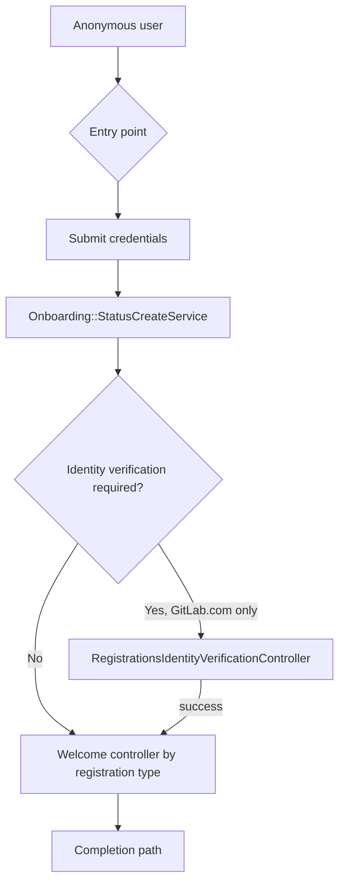

GitLab.com registers and onboards new users after the
Unified Lightweight Registration project removed the older, flag-gated
registration paths. It covers the controllers and services that run between
an anonymous visitor arriving at a sign-up page and that user landing in a
project or group.

The SaaS (GitLab.com) registration flow is the primary focus below. Self-managed
subscription purchases share some of these services, and the differences are
called out explicitly where they apply.

## Overview

The flow has five stages: pick an entry point, submit credentials, initialize
the account status, optionally verify identity, then run a welcome step that
is specific to why the user registered.

## Entry points

An anonymous user can start registration from several places:

| Entry point | Path | Controller |
|-------------|------|------------|
| Standard sign-up | `/users/sign_up` | `RegistrationsController#new` (CE, prepended by `EE::RegistrationsController`) |
| Invite link | `/users/sign_up?invite=...` | `RegistrationsController#new`, using the `AcceptsPendingInvitations` concern |
| Trial sign-up | `/-/trial_registrations/new` | `TrialRegistrationsController#new` (EE) |
| OmniAuth (Google or GitHub) | `/users/auth/:provider` | OmniAuth request phase, redirects to the provider |
| OmniAuth callback | `/users/auth/:provider/callback` | `OmniauthCallbacksController#handle_omniauth` |
| Sign-in page | `/users/sign_in` | Shows the same social sign-up buttons |
| Subscription purchase | `/-/subscriptions/new` | `GitlabSubscriptions::SubscriptionsController#new` |

The social sign-up buttons cover only Google (`google_oauth2`) and GitHub
(`github`), listed as `POPULAR_PROVIDERS`. SAML is available per group as
Enterprise SSO, but it is not one of the self-serve sign-up buttons.

When an anonymous user reaches `/-/subscriptions/new`, `ensure_registered!`
calls `store_location_for(:user, request.fullpath)`. After the user
registers, they return to the subscription checkout page instead of the
default completion path.

A self-managed subscription purchase follows a separate branch. The query
parameters `deployment_type=self_managed` and `plan_id` trigger the
`GitlabSubscriptions::SelfManagedPurchaseRedirect` concern, which is included
in both `EE::RegistrationsController` and
`GitlabSubscriptions::SubscriptionsController#new`.

## Submitting credentials

Once the user submits the sign-up form, one of these actions creates the
`User` record:

- `POST /users` → `RegistrationsController#create`, which builds the user
  through `Users::RegistrationsBuildService`.
- `POST /-/trial_registrations` → `TrialRegistrationsController#create`,
  which overrides `#resource` to build the user through
  `Users::AuthorizedBuildService` instead.
- OmniAuth sign-up → `OmniauthCallbacksController#handle_omniauth`. If the
  OmniAuth identity belongs to an existing user with two-factor
  authentication enabled, `sign_in_user_flow` intercepts the request with
  `prompt_for_two_factor` instead of completing sign-in immediately.

## Devise and account status initialization

Two pieces of Devise-adjacent logic run right after account creation:

- The `IdentityVerifiable` concern
  (`ee/app/models/concerns/identity_verifiable.rb`) overrides
  `active_for_authentication?` to return `false` for unverified users on
  GitLab.com, which forces the user into the identity verification path
  before they can sign in normally. This only applies when
  `Gitlab::Saas.feature_available?(:identity_verification)` is true.
- `Onboarding::StatusCreateService` writes the `user_details.onboarding_status`
  JSONB column and sets `onboarding_in_progress = true`. It records
  `registration_type`, `initial_registration_type`, and the `glm_source` and
  `glm_content` marketing attribution parameters. This step is skipped for
  self-managed subscription registrations.

Onboarding as a whole is gated by `Onboarding.enabled?`, which delegates to
`Gitlab::Saas.feature_available?(:onboarding)`.

Separately, enterprise user association can run at this point too. The
`Groups::EnterpriseUsers::Associable` concern checks eligibility during
registration, and `Groups::EnterpriseUsers::AssociateService` can also run
retroactively and asynchronously through `AssociateWorker`.

## Registration type strategy

Onboarding behavior depends on why the user registered. `Onboarding::StatusPresenter`
delegates to `Onboarding::UserStatus`, which selects a strategy class using
the `REGISTRATION_KLASSES` and `REGISTRATION_TYPE` mappings defined in
`ee/app/models/onboarding/user_status.rb`. All strategy classes live under
`ee/app/models/onboarding/`.

| Registration type | Strategy class | Welcome controller | Primary service |
|--------------------|-----------------|---------------------|-------------------|
| Free | `FreeRegistration` | `Registrations::WelcomeController` | `Onboarding::FreeNamespaceCreateService` |
| Trial | `TrialRegistration` | `Registrations::TrialWelcomeController` | `Onboarding::TrialNamespaceCreateService` |
| Automatic trial | `AutomaticTrialRegistration` (subclass of `TrialRegistration`) | `Registrations::TrialWelcomeController` | `Onboarding::TrialNamespaceCreateService` |
| Invite | `InviteRegistration` | `Registrations::InviteWelcomeController` | `Users::InviteSignupService` |
| Subscription | `SubscriptionRegistration` | `Registrations::SubscriptionWelcomeController` | `Onboarding::SubscriptionNamespaceCreateService`, then `Onboarding::FinishService` |
| Subscription, self-managed | `SubscriptionSmRegistration` | None. `Onboarding::StatusCreateService` is skipped for this type. | None |

`AutomaticTrialRegistration` covers the free-to-trial conversion. A user
registers as `free`, but the current `registration_type` becomes `trial`
while `initial_registration_type` stays `free` for analytics. This
conversion happens when a free user who selected "for my company" is routed
by `FreeAutomaticTrialConstraint` to `Registrations::TrialWelcomeController`.
`Onboarding::TrialNamespaceCreateService` then sets `registration_type` to
`trial`, which is why `Onboarding::UserStatus` resolves the strategy to
`AutomaticTrialRegistration` rather than plain `TrialRegistration`.

## Identity verification (GitLab.com only)

Identity verification runs at `GET /users/identity_verification`, handled by
`RegistrationsIdentityVerificationController#show`.

The `/-/users/identity_verification` path is handled by a different,
unrelated controller used for reverifying an already-signed-in user. Do not
confuse the two when tracing a registration issue.

Which verification methods are required depends on a risk score:

| Risk level | Required methods |
|------------|-------------------|
| Low | Email |
| Medium | Email, phone |
| High | Email, phone, credit card |
| Assumed-high | Email, credit card, phone |

Each method is backed by its own service:

- Email: the `verify_email_code` action calls
  `Users::EmailVerification::ValidateTokenService`.
- Phone: the `send_phone_verification_code` and
  `verify_phone_verification_code` actions call
  `PhoneVerification::Users::SendVerificationCodeService` and
  `PhoneVerification::Users::VerifyCodeService`. Both delegate to
  `PhoneVerification::TelesignClient::*`, which talks to the Telesign
  vendor API.
- Credit card: the `verify_credit_card` (`GET`) and
  `verify_credit_card_captcha` (`POST`) actions have no single dedicated
  service. Verification relies on `credit_card_validation` and
  `Users::AutoBanService`. The Zuora hosted payment form is embedded in the
  frontend and brokered through CustomersDot using
  `Gitlab::SubscriptionPortal::Client#payment_form_params` and
  `#validate_payment_method`. `Users::UpsertCreditCardValidationService`
  persists the result, including `zuora_payment_method_xid` and the
  associated Stripe fields.

`Users::BaseIdentityVerificationController` also enforces an Arkose
challenge through `Arkose::TokenVerificationService` as an anti-abuse check
on this path.

When verification succeeds, the `success` action:

1. Accepts any pending invitations.
1. Signs the user in.
1. Calls `Onboarding::TriggerAccountCreatedIterableService`.
1. Resolves the redirect (see [Completion paths](#completion-paths)).

`Onboarding::StatusConvertToInviteService` only runs as part of that
pending-invitations step, and only when invitations actually exist.

## Welcome controllers and services

After credentials are submitted and, where required, identity is verified,
a welcome controller finishes setting up the account. These are the current
controllers and services; earlier iterations of this flow used
`Users::SignupService` and `Users::SubscriptionSignupService`, both of which
were removed once the feature flags they supported were cleaned up.

- `Registrations::WelcomeController#update` calls
  `Onboarding::FreeNamespaceCreateService`.
- `Registrations::TrialWelcomeController#update` calls
  `Onboarding::TrialNamespaceCreateService`, which creates the sales lead
  through `GitlabSubscriptions::CreateLeadService`. This controller is
  served at `/users/sign_up/welcome` under both the `TrialUserConstraint`
  and the `FreeAutomaticTrialConstraint`.
- `Registrations::InviteWelcomeController#update` calls
  `Users::InviteSignupService`.
- `Registrations::SubscriptionWelcomeController#update` calls
  `Onboarding::SubscriptionNamespaceCreateService`, then
  `Onboarding::FinishService`, then redirects to
  `users_sign_up_customers_portal_redirect_path`.
- `Registrations::CompanyController` (`/users/sign_up/company`, `new` and
  `create`) calls `Onboarding::StatusStepUpdateService` and
  `GitlabSubscriptions::CreateCompanyLeadService`.
- `Registrations::GroupsController` (`create` and `import`) calls
  `Onboarding::FinishService`.
- `Registrations::CustomersPortalRedirectController#show` is the final leg
  for subscription and trial users. It redirects to CustomersDot with
  `auto_submit_sso=true`.

## Completion paths

Where a user lands once onboarding finishes depends on their registration
type:

| Registration type | Destination |
|--------------------|-------------|
| Free | `project_learn_gitlab_path(project)`, or `new_project_path` when the `remove_onboarding_tutorial_pages` flag is enabled |
| Trial | `namespace_project_get_started_path` |
| Subscription | `stored_location_for(:user)`, which resolves to the subscription checkout page through the CustomersDot redirect |
| Invite | The invited project or group, through `polymorphic_path(last_invited_member_source)` |
| None of the above | `/dashboard/projects` |

## External systems

Registration and onboarding depend on several systems outside the main
GitLab.com Rails application:

| System | Used for |
|--------|----------|
| CustomersDot | Leads and subscriptions, through `Gitlab::SubscriptionPortal::Client` |
| Arkose | Anti-abuse challenges during identity verification |
| Telesign | Phone number verification |
| Zuora, through CustomersDot | Credit card verification, including stored Stripe fields |
| Email or SMTP | Confirmation instructions and verification codes |
| Redis | Session state and `stored_location_for` redirects |
| PostgreSQL | The `user_details.onboarding_status` JSONB column |

## Tracking

Registration and onboarding capture data for attribution and conversion
analysis:

- `glm_source` and `glm_content` query parameters are stored on
  `onboarding_status` when the account status is created.
- Registration and identity verification steps emit Snowplow and internal
  product-analytics events.
- Conversion analysis distinguishes `initial_registration_type` from the
  current `registration_type`, which is how the free-to-trial conversion
  described in [Registration type strategy](#registration-type-strategy) is
  measured.
