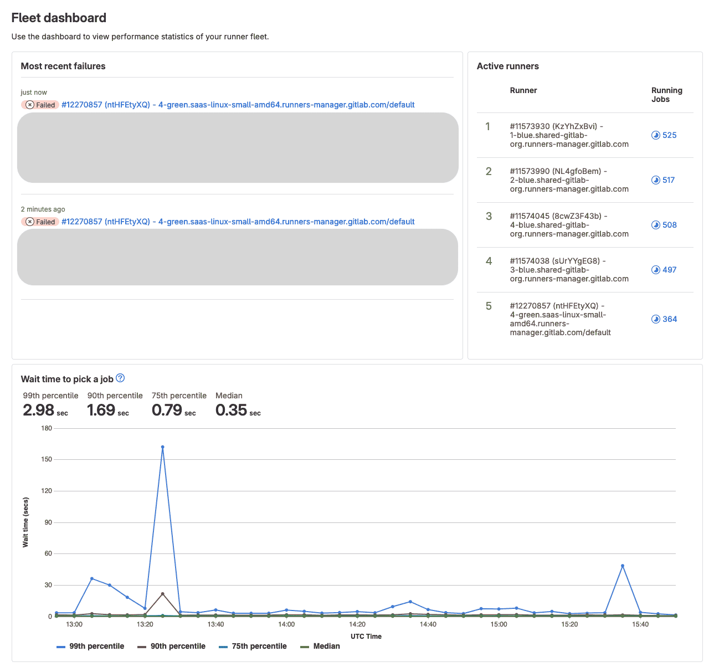

# Runner Fleet Dashboard **(ULTIMATE EXPERIMENT)**

> [Introduced](https://gitlab.com/gitlab-org/gitlab/-/issues/424495) in GitLab 16.6 behind several [feature flags](#enable-feature-flags).

This feature is an [Experiment](../policy/experiment-beta-support.md).
To join the list of users testing this feature, contact us in
[epic 11180](https://gitlab.com/groups/gitlab-org/-/epics/11180).

GitLab administrators can use the Runner Fleet Dashboard to assess the health of your instance runners.
The Runner Fleet Dashboard shows:

- Recent CI errors related caused by runner infrastructure.
- Number of concurrent jobs executed on most busy runners.
- Histogram of job queue times (available only with ClickHouse).

There is a proposal to introduce [more features](#whats-next) to the Runner Fleet Dashboard.



## View the Runner Fleet Dashboard

Prerequisites:

- You must be an administrator.

To view the runner fleet dashboard:

1. On the left sidebar, at the bottom, select **Admin Area**.
1. Select **Runners**.
1. Click **Fleet dashboard**.

Most of the dashboard works without any additional actions, with the
exception of **Wait time to pick a job** chart and [proposed features](#whats-next).
These features require setting up an additional infrastructure, described in this page.

To test the Runner Fleet Dashboard and gather feedback, we have launched an early adopters program
for some customers to try this feature.

## Requirements

To test the Runner Fleet Dashboard as part of the early adopters program, you must:

- Run GitLab 16.7 or above.
- Have an [Ultimate license](https://about.gitlab.com/pricing/).
- Be able to run ClickHouse database. We recommend using [ClickHouse Cloud](https://clickhouse.cloud/).

## Setup

To setup ClickHouse as the GitLab data storage:

1. [Run ClickHouse Cluster and configure database](#run-and-configure-clickhouse).
1. [Configure GitLab connection to Clickhouse](#configure-the-gitlab-connection-to-clickhouse).
1. [Run ClickHouse migrations](#run-clickhouse-migrations).
1. [Enable the feature flags](#enable-feature-flags).

### Run and configure ClickHouse

The most straightforward way to run ClickHouse is with [ClickHouse Cloud](https://clickhouse.cloud/).
You can also [run ClickHouse on your own server](https://clickhouse.com/docs/en/install). Refer to the ClickHouse
documentation regarding [recommendations for self-managed instances](https://clickhouse.com/docs/en/install#recommendations-for-self-managed-clickhouse).

When you run ClickHouse on a hosted server, various data points might impact the resource consumption, like the number
of builds that run on your instance each month, the selected hardware, the data center choice to host ClickHouse, and more.
Regardless, the cost should not be significant.

NOTE:
ClickHouse is a secondary data store for GitLab. All your data is still stored in Postgres,
and only duplicated in ClickHouse for analytics purposes.

To create necessary user and database objects:

1. Generate a secure password and save it.
1. Sign in to the ClickHouse SQL console.
1. Execute the following command. Replace `PASSWORD_HERE` with the generated password.

    ```sql
    CREATE DATABASE gitlab_clickhouse_main_production;
    CREATE USER gitlab IDENTIFIED WITH sha256_password BY 'PASSWORD_HERE';
    CREATE ROLE gitlab_app;
    GRANT SELECT, INSERT, ALTER, CREATE, UPDATE, DROP, TRUNCATE, OPTIMIZE ON gitlab_clickhouse_main_production.* TO gitlab_app;
    GRANT gitlab_app TO gitlab;
    ```

### Configure the GitLab connection to ClickHouse

::Tabs

:::TabTitle Linux package

To provide GitLab with ClickHouse credentials:

1. Edit `/etc/gitlab/gitlab.rb`:

   ```ruby
    gitlab_rails['clickhouse_databases']['main']['database'] = 'gitlab_clickhouse_main_production'
    gitlab_rails['clickhouse_databases']['main']['url'] = 'https://example.com/path'
    gitlab_rails['clickhouse_databases']['main']['username'] = 'gitlab'
    gitlab_rails['clickhouse_databases']['main']['password'] = 'PASSWORD_HERE' # replace with the actual password
   ```

1. Save the file and reconfigure GitLab:

   ```shell
   sudo gitlab-ctl reconfigure
   ```

:::TabTitle Helm chart (Kubernetes)

1. Save the ClickHouse password as a Kubernetes Secret:

   ```shell
   kubectl create secret generic gitlab-clickhouse-password --from-literal="main_password=PASSWORD_HERE"
   ```

1. Export the Helm values:

   ```shell
   helm get values gitlab > gitlab_values.yaml
   ```

1. Edit `gitlab_values.yaml`:

    ```yaml
    global:
      clickhouse:
        enabled: true
        main:
          username: default
          password:
            secret: gitlab-clickhouse-password
            key: main_password
          database: gitlab_clickhouse_main_production
          url: 'http://example.com'
    ```

1. Save the file and apply the new values:

   ```shell
   helm upgrade -f gitlab_values.yaml gitlab gitlab/gitlab
   ```

::EndTabs

To verify that your connection is set up successfully:

1. Log in to [Rails console](../administration/operations/rails_console.md#starting-a-rails-console-session)
1. Execute the following:

    ```ruby
    ClickHouse::Client.select('SELECT 1', :main)
    ```

   If successful, the command returns `[{"1"=>1}]`

### Run ClickHouse migrations

To create the required database objects execute:

```shell
sudo gitlab-rake gitlab:clickhouse:migrate
```

### Enable feature flags

Features that use ClickHouse are currently under development and are disabled by feature flags.

To enable these features, [enable](../administration/feature_flags.md#how-to-enable-and-disable-features-behind-flags)
the following feature flags:

| Feature flag name                  | Purpose                                                                   |
|------------------------------------|---------------------------------------------------------------------------|
| `ci_data_ingestion_to_click_house` | Enables synchronization of new finished CI builds to Clickhouse database. |
| `clickhouse_ci_analytics`          | Enables the **Wait time to pick a job** chart.                            |

## What's next

Support for usage and cost analysis are proposed in
[epic 11183](https://gitlab.com/groups/gitlab-org/-/epics/11183).

## Feedback

To help us improve the Runner Fleet Dashboard, you can provide feedback in
[issue 421737](https://gitlab.com/gitlab-org/gitlab/-/issues/421737).
In particular:

- How easy or difficult it was to setup GitLab to make the dashboard work.
- How useful you found the dashboard.
- What other information you would like to see on that dashboard.
- Any other related thoughts and ideas.
