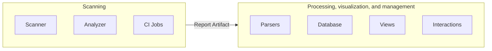
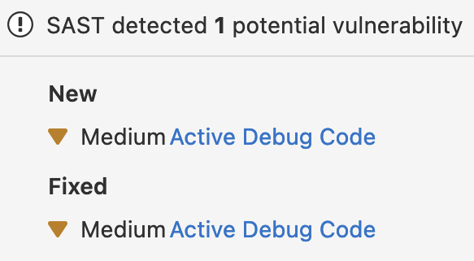

The Sec section is responsible for GitLab application security features, the "Sec" part of
DevSecOps. Development guides that are specific to the Sec section are listed here.

See [Terminology](../../user/application_security/terminology/_index.md) for an overview of our shared terminology.

## Architecture

- [Overview](#overview)
- [Scanning](#scanning)
- [Processing, visualization, and management](#processing-visualization-and-management)
- [Severity Levels](../../user/application_security/vulnerabilities/severities.md)
- [Analyzer Development](analyzer_development_guide.md)

## Overview

The architecture supporting the Secure features is split into two main parts:

- Scanning
- Processing, visualization, and management



### Scanning

The scanning part is responsible for finding vulnerabilities in given resources, and exporting results.
The scans are executed in CI/CD jobs via several small projects called [Analyzers](../../user/application_security/terminology/_index.md#analyzer), which can be found in our [Analyzers subgroup](https://gitlab.com/gitlab-org/security-products/analyzers).
The Analyzers are wrappers around security tools called [Scanners](../../user/application_security/terminology/_index.md#scanner), developed internally or externally, to integrate them into GitLab.
The Analyzers are mainly written in Go.

Some 3rd party integrators also make additional Scanners available by following our [integration documentation](../integrations/secure.md), which leverages the same architecture.

The results of the scans are exported as JSON reports that must comply with the [Secure report format](../../user/application_security/terminology/_index.md#secure-report-format) and are uploaded as [CI/CD Job Report artifacts](../../ci/jobs/job_artifacts.md) to make them available for processing after the pipelines completes.

### Processing, visualization, and management

After the data is available as a Report Artifact it can be processed by the GitLab Rails application to enable our security features, including:

- [Security Dashboards](../../user/application_security/security_dashboard/_index.md), Merge Request widget, Pipeline view, and so on.
- [Security scan results](../../user/application_security/detect/security_scan_results.md).
- [Approval rules](../../user/application_security/_index.md#security-approvals-in-merge-requests).

Depending on the context, the security reports may be stored either in the database or stay as Report Artifacts for on-demand access.

#### Security report ingestion overview

For details on how GitLab processes the reports generated by the scanners, see
[Security report ingestion overview](security_report_ingestion_overview.md).

## CI/CD template development

While CI/CD templates are the responsibility of the Verify section, many are critical to the Sec Section's feature usage.
If you are working with CI/CD templates, read the [development guide for GitLab CI/CD templates](../cicd/templates.md).

## Importance of the primary identifier

Within analyzer JSON reports, the [`identifiers` field](../integrations/secure.md#identifiers) contains a collection of types and categories by which
a vulnerability can be described (that is, a CWE family).

The first item in the `identifiers` collection is known as the [primary identifier](../../user/application_security/terminology/_index.md#primary-identifier),
a critical component to both describing and tracking vulnerabilities.

In most other cases, the `identifiers` collection is unordered, where the remaining secondary identifiers act as metadata for grouping vulnerabilities
(see [Analyzer vulnerability translation](#analyzer-vulnerability-translation) below for the exception).

Any time the primary identifier changes and a project pipeline is re-run, ingestion of the new report will "orphan" the previous DB record.
Because our processing logic relies on generating a delta of two different vulnerabilities, it can end up looking rather confusing. For example:



After being [merged](../integrations/secure.md#tracking-and-merging-vulnerabilities), the previous vulnerability is listed as "remediated" and the introduced as ["detected"](../../user/application_security/vulnerabilities/_index.md#vulnerability-status-values).

### Guiding principles for ensuring primary identifier stability

- A primary identifier should never change unless we have a compelling reason.
- Analyzer supporting vulnerability translation must include the legacy primary identifiers in a secondary position to prevent "orphaning" of results.
- Beyond the primary identifier, the order of secondary identifiers does not matter.
- The identifier is unique based on a combination of the `Type` and `Value` fields (see [identifier fingerprint](https://gitlab.com/gitlab-org/gitlab/-/blob/v15.5.1-ee/lib/gitlab/ci/reports/security/identifier.rb#L63)).
- If we change the primary identifier, rolling back analyzers to previous versions will not fix the orphaned results. The data previously ingested into our database is an artifact of previous jobs with few ways of automating data migrations.

### Analyzer vulnerability translation

In the case of the SAST Semgrep analyzer, there is a secondary identifier of particular importance: the identifier linking the report's vulnerability
to the legacy analyzer (that is, bandit or ESLint).

To [enable vulnerability translation](../../user/application_security/sast/analyzers.md#vulnerability-translation)
the Semgrep analyzer relies on a secondary identifier exactly matching the primary identifier of the legacy analyzer.

For example, when [`eslint`](https://gitlab.com/gitlab-org/security-products/analyzers/eslint) was previously used to generate vulnerability records,
the [`semgrep`](https://gitlab.com/gitlab-org/security-products/analyzers/semgrep) analyzer must produce an identifier collection containing the
original ESLint primary identifier.

Given the original `eslint` report:

```json
{
  "version": "14.0.4",
  "vulnerabilities": [
    {
      "identifiers": [
        {
          "type": "eslint_rule_id",
          "name": "ESLint rule ID security/detect-eval-with-expression",
          "value": "security/detect-eval-with-expression"
        }
      ]
    }
  ]
}
```

The corresponding Semgrep report must contain the `eslint_rule_id`:

```json
{
  "version": "14.0.4",
  "vulnerabilities": [
    {
      "identifiers": [
        {
          "type": "semgrep_id",
          "name": "eslint.detect-eval-with-expression",
          "value": "eslint.detect-eval-with-expression",
          "url": "https://semgrep.dev/r/gitlab.eslint.detect-eval-with-expression"
        },
        {
          "type": "eslint_rule_id",
          "name": "ESLint rule ID security/detect-eval-with-expression",
          "value": "security/detect-eval-with-expression"
        }
      ]
    }
  ]
}
```

[Tracking of vulnerabilities](../integrations/secure.md#tracking-and-merging-vulnerabilities) relies on a combination of the two identifiers
to remap DB records previously generated with the legacy analyzers to those generated with the new `semgrep` ones.

## Development Setup: Package Metadata Database synchronization

For security scanning and license compliance features that use the Package Metadata Database (PMDB), you need to set up PMDB synchronization in your development environment.

See the [Package Metadata Synchronization guide](https://gitlab.com/gitlab-org/gitlab-development-kit/-/blob/main/doc/howto/package_metadata_synchronization.md) in the GDK documentation for detailed setup instructions.
