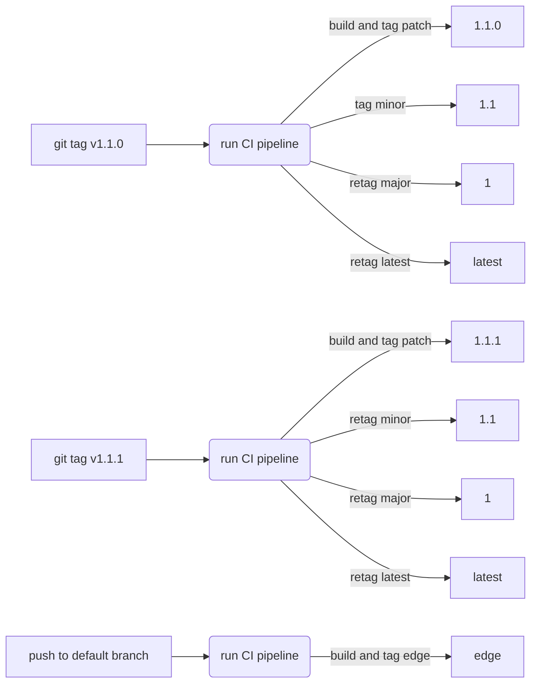

# Sec section analyzer development

Analyzers are shipped as Docker images to execute within a CI pipeline context. This guide describes development and testing
practices across analyzers.

## Shared modules

There are a number of shared Go modules shared across analyzers for common behavior and interfaces:

- The [`command`](https://gitlab.com/gitlab-org/security-products/analyzers/command#how-to-use-the-library) Go package implements a CLI interface.
- The [`common`](https://gitlab.com/gitlab-org/security-products/analyzers/common) project provides miscellaneous shared modules for logging, certificate handling, and directory search capabilities.
- The [`report`](https://gitlab.com/gitlab-org/security-products/analyzers/report) Go package's `Report` and `Finding` structs marshal JSON reports.
- The [`template`](https://gitlab.com/gitlab-org/security-products/analyzers/template) project scaffolds new analyzers.

## How to use the analyzers

Analyzers are shipped as Docker images. For example, to run the
[Semgrep](https://gitlab.com/gitlab-org/security-products/analyzers/semgrep) Docker image to scan the working directory:

1. `cd` into the directory of the source code you want to scan.
1. Run `docker login registry.gitlab.com` and provide username plus
   [personal](../../user/profile/personal_access_tokens.md#create-a-personal-access-token)
   or [project](../../user/project/settings/project_access_tokens.md#create-a-project-access-token)
   access token with at least the `read_registry` scope.
1. Run the Docker image:

   ```shell
   docker run \
       --interactive --tty --rm \
       --volume "$PWD":/tmp/app \
       --env CI_PROJECT_DIR=/tmp/app \
       -w /tmp/app \
       registry.gitlab.com/gitlab-org/security-products/analyzers/semgrep:latest /analyzer run
   ```

1. The Docker container generates a report in the mounted project directory with a report filename corresponding to the analyzer category. For example, [SAST](../../user/application_security/sast) generates a file named `gl-sast-report.json`.

## Analyzers development

To update the analyzer:

1. Modify the Go source code.
1. Build a new Docker image.
1. Run the analyzer against its test project.
1. Compare the generated report with what's expected.

Here's how to create a Docker image named `analyzer`:

```shell
docker build -t analyzer .
```

For example, to test Secret Detection run the following:

```shell
wget https://gitlab.com/gitlab-org/security-products/ci-templates/-/raw/master/scripts/compare_reports.sh
sh ./compare_reports.sh sd test/fixtures/gl-secret-detection-report.json test/expect/gl-secret-detection-report.json \
| patch -Np1 test/expect/gl-secret-detection-report.json && Git commit -m 'Update expectation' test/expect/gl-secret-detection-report.json
rm compare_reports.sh
```

You can also compile the binary for your own environment and run it locally
but `analyze` and `run` probably won't work
since the runtime dependencies of the analyzer are missing.

Here's an example based on
[SpotBugs](https://gitlab.com/gitlab-org/security-products/analyzers/spotbugs):

```shell
go build -o analyzer
./analyzer search test/fixtures
./analyzer convert test/fixtures/app/spotbugsXml.Xml > ./gl-sast-report.json
```

### Execution criteria

[Enabling SAST](../../user/application_security/sast/index.md#configure-sast-in-your-cicd-yaml) requires including a pre-defined [template](https://gitlab.com/gitlab-org/gitlab/-/blob/ee4d473eb9a39f2f84b719aa0ca13d2b8e11dc7e/lib/gitlab/ci/templates/Jobs/SAST.gitlab-ci.yml) to your GitLab CI/CD configuration.

The following independent criteria determine which analyzer needs to be run on a project:

1. The SAST template uses [`rules:exists`](../../ci/yaml/index.md#rulesexists) to determine which analyzer will be run based on the presence of certain files. For example, the Brakeman analyzer [runs when there are](https://gitlab.com/gitlab-org/gitlab/-/blob/ee4d473eb9a39f2f84b719aa0ca13d2b8e11dc7e/lib/gitlab/ci/templates/Jobs/SAST.gitlab-ci.yml#L60) `.rb` files and a `Gemfile`.
1. Each analyzer runs a customizable [match interface](https://gitlab.com/gitlab-org/security-products/analyzers/common/-/blob/master/search/search.go) before it performs the actual analysis. For example: [Flawfinder checks for C/C++ files](https://gitlab.com/gitlab-org/security-products/analyzers/flawfinder/-/blob/f972ac786268fb649553056a94cda05cdc1248b2/plugin/plugin.go#L14).
1. For some analyzers that run on generic file extensions, there is a check based on a CI/CD variable. For example: Kubernetes manifests are written in YAML, so [Kubesec](https://gitlab.com/gitlab-org/security-products/analyzers/kubesec) runs only when [`SCAN_KUBERNETES_MANIFESTS` is set to true](../../user/application_security/sast/index.md#enabling-kubesec-analyzer).

Step 1 helps prevent wastage of CI/CD minutes that would be spent running analyzers not suitable for the project. However, due to [technical limitations](https://gitlab.com/gitlab-org/gitlab/-/issues/227632), it cannot be used for large projects. Therefore, step 2 acts as final check to ensure a mismatched analyzer is able to exit early.

## How to test the analyzers

Video walkthrough of how Dependency Scanning analyzers are using [downstream pipeline](../../ci/pipelines/downstream_pipelines.md) feature to test analyzers using test projects:

[](https://www.youtube.com/watch?v=KauRBlfUbDE)

### Testing local changes

To test local changes in the shared modules (such as `command` or `report`) for an analyzer
you can use the
[`go mod replace`](https://github.com/golang/go/wiki/Modules#when-should-i-use-the-replace-directive)
directive to load `command` with your local changes instead of using the version of command that has been
tagged remotely. For example:

```shell
go mod edit -replace gitlab.com/gitlab-org/security-products/analyzers/command/v3=/local/path/to/command
```

Alternatively you can achieve the same result by manually updating the `go.mod` file:

```plaintext
module gitlab.com/gitlab-org/security-products/analyzers/awesome-analyzer/v2

replace gitlab.com/gitlab-org/security-products/analyzers/command/v3 => /path/to/command

require (
    ...
    gitlab.com/gitlab-org/security-products/analyzers/command/v3 v2.19.0
)
```

#### Testing local changes in Docker

To use Docker with `replace` in the `go.mod` file:

1. Copy the contents of `command` into the directory of the analyzer. `cp -r /path/to/command path/to/analyzer/command`.
1. Add a copy statement in the analyzer's `Dockerfile`: `COPY command /command`.
1. Update the `replace` statement to make sure it matches the destination of the `COPY` statement in the step above:
`replace gitlab.com/gitlab-org/security-products/analyzers/command/v3 => /command`

## Analyzer scripts

The [analyzer-scripts](https://gitlab.com/gitlab-org/secure/tools/analyzer-scripts) repository contains scripts that can be used to interact with most analyzers. They enable you to build, run, and debug analyzers in a GitLab CI-like environment, and are particularly useful for locally validating changes to an analyzer.

For more information, refer to the [project README](https://gitlab.com/gitlab-org/secure/tools/analyzer-scripts/-/blob/master/README.md).

## Versioning and release process

GitLab Security Products use an independent versioning system from GitLab Rails' `MAJOR.MINOR`. All products use a variation of [Semantic Versioning](https://semver.org) and are available as Docker images.

`Patch` version bumps tend to correspond to a `Minor` version bump of the underlying tools (i.e. [`bandit`](https://wiki.openstack.org/wiki/Security/Projects/Bandit)), allowing us greater flexibility in reserving `Minor` bumps for more significant changes to our scanners. In case of breaking changes imposed by the wrapped scanner, creating a new analyzer on a separate repository must be considered.

The analyzers are released as Docker images following this scheme:

- each push to the default branch will override the `edge` image tag
- each push to any `awesome-feature` branch will generate a matching `awesome-feature` image tag
- each Git tag will generate the corresponding `Major.Minor.Patch` image tag. A manual job allows to override the corresponding `Major` and the `latest` image tags to point to this `Major.Minor.Patch`.

In most circumstances it is preferred to rely on the `MAJOR` image,
which is automatically kept up to date with the latest advisories or patches to our tools.
Our [included CI templates](https://gitlab.com/gitlab-org/gitlab/-/tree/master/lib/gitlab/ci/templates/Security) pin to major version but if preferred, users can override their version directly.

To release a new analyzer Docker image, there are two different options:

- [Manual release process](#manual-release-process)
- [Automatic release process](#automatic-release-process)

The following diagram describes the Docker tags that are created when a new analyzer version is released:



Per our Continuous Deployment flow, for new components that do not have a counterpart in the GitLab
Rails application, the component can be released at any time. Until the components
are integrated with the existing application, iteration should not be blocked by
[our standard release cycle and process](https://about.gitlab.com/product-process).

### Manual release process

1. Ensure that the `CHANGELOG.md` entry for the new analyzer is correct.
1. Ensure that the release source (typically the `master` or `main` branch) has a passing pipeline.
1. Create a new release for the analyzer project by selecting the **Deployments** menu on the left-hand side of the project window, then selecting the **Releases** sub-menu.
1. Select **New release** to open the **New Release** page.
    1. In the **Tag name** drop down, enter the same version used in the `CHANGELOG.md`, for example `v2.4.2`, and select the option to create the tag (`Create tag v2.4.2` here).
    1. In the **Release title** text box enter the same version used above, for example `v2.4.2`.
    1. In the `Release notes` text box, copy and paste the notes from the corresponding version in the `CHANGELOG.md`.
    1. Leave all other settings as the default values.
    1. Select **Create release**.

After following the above process and creating a new release, a new Git tag is created with the `Tag name` provided above. This triggers a new pipeline with the given tag version and a new analyzer Docker image is built.

If the analyzer uses the [`analyzer.yml` template](https://gitlab.com/gitlab-org/security-products/ci-templates/blob/b446fd3/includes-dev/analyzer.yml#L209-217), then the pipeline triggered as part of the **New release** process above automatically tags and deploys a new version of the analyzer Docker image.

If the analyzer does not use the `analyzer.yml` template, you'll need to manually tag and deploy a new version of the analyzer Docker image:

1. Select the **CI/CD** menu on the left-hand side of the project window, then select the **Pipelines** sub-menu.
1. A new pipeline should currently be running with the same tag used previously, for example `v2.4.2`.
1. After the pipeline has completed, it will be in a `blocked` state.
1. Select the `Manual job` play button on the right hand side of the window and select `tag version` to tag and deploy a new version of the analyzer Docker image.

Use your best judgment to decide when to create a Git tag, which will then trigger the release job. If you
can't decide, then ask for other's input.

### Automatic release process

The following must be performed before the automatic release process can be used:

1. Configure `CREATE_GIT_TAG: true` as a [`CI/CD` environment variable](../../ci/variables/index.md).
1. Check the `Variables` in the CI/CD project settings. Unless the project already inherits the `GITLAB_TOKEN` environment variable from the project group, create a [project access token](../../user/project/settings/project_access_tokens.md) with `complete read/write access to the API` and configure `GITLAB_TOKEN` as a [`CI/CD` environment variable](../../ci/variables/index.md) which refers to this token.

After the above steps have been completed, the automatic release process executes as follows:

1. A project maintainer merges an MR into the default branch.
1. The default pipeline is triggered, and the `upsert git tag` job is executed.
   - If the most recent version in the `CHANGELOG.md` matches one of the Git tags, the job is a no-op.
   - Else, this job automatically creates a new release and Git tag using the [releases API](../../api/releases/index.md#create-a-release). The version and message is obtained from the most recent entry in the `CHANGELOG.md` file for the project.
1. A pipeline is automatically triggered for the new Git tag. This pipeline releases the `latest`, `major`, `minor` and `patch` Docker images of the analyzer.

### Steps to perform after releasing an analyzer

1. After a new version of the analyzer Docker image has been tagged and deployed, please test it with the corresponding test project.
1. Announce the release on the relevant group Slack channel. Example message:

    > FYI I've just released `ANALYZER_NAME` `ANALYZER_VERSION`. `LINK_TO_RELEASE`

**Never delete a Git tag that has been pushed** as there is a good
chance that the tag will be used and/or cached by the Go package registry.

## Location of Container Images

In order to
[restrict the number of people who have write access to the container registry](https://gitlab.com/gitlab-org/gitlab/-/issues/297525),
all images are to be published to the location below.

- Group: [`https://gitlab.com/security-products/`](https://gitlab.com/security-products/)
- Project path: `https://gitlab.com/security-products/<NAME>` ([example](https://gitlab.com/security-products/container-scanning))
- Registry address: `registry.gitlab.com/security-products/<NAME>[/<IMAGE_NAME>]:[TAG]`
- Permissions
  - Top-level group
    - Maintainer: `@gitlab-org/secure/managers`, `@gitlab-org/govern/managers`
  - Project level
    - A deploy token with `read_registry` and `write_registry` access is used to push images.
    - The token will be entered by its creator as a [**protected** and **masked** variable](../../ci/variables/index.md#for-a-project) on the
      originating project (i.e. the project under [`security-products` namespace](https://gitlab.com/gitlab-org/security-products/))
- Project Settings
  - Visibility, project features, permissions.
    - Project visibility: Public. Uncheck "Users can request access".
    - Issues: disable.
    - Repository: set to "Only Project Members". Disable: Merge requests, Forks, Git LFS, Packages, CI/CD.
    - Disable remaining items: Analytics, Requirements, Wiki, Snippets, Pages, Operations.
  - Service Desk: disable

Each group in the Sec Section is responsible for:

1. Managing the deprecation and removal schedule for their artifacts, and creating issues for this purpose.
1. Creating and configuring projects under the new location.
1. Configuring builds to push release artifacts to the new location.
1. Removing or keeping images in old locations according to their own support agreements.

## Security and Build fixes of Go

The `Dockerfile` of the Secure analyzers implemented in Go must reference a `MAJOR` release of Go, and not a `MINOR` revision.
This ensures that the version of Go used to compile the analyzer includes all the security fixes available at a given time.
For example, the multi-stage Dockerfile of an analyzer must use the `golang:1.15-alpine` image
to build the analyzer CLI, but not `golang:1.15.4-alpine`.

When a `MINOR` revision of Go is released, and when it includes security fixes,
project maintainers must check whether the Secure analyzers need to be re-built.
The version of Go used for the build should appear in the log of the `build` job corresponding to the release,
and it can also be extracted from the Go binary using the [strings](https://en.wikipedia.org/wiki/Strings_(Unix)) command.

If the latest image of the analyzer was built with the affected version of Go, then it needs to be rebuilt.
To rebuild the image, maintainers can either:

- trigger a new pipeline for the Git tag that corresponds to the stable release
- create a new Git tag where the `BUILD` number is incremented
- trigger a pipeline for the default branch, and where the `PUBLISH_IMAGES` variable is set to a non-empty value

Either way a new Docker image is built, and it's published with the same image tags: `MAJOR.MINOR.PATCH` and `MAJOR`.

This workflow assumes full compatibility between `MINOR` revisions of the same `MAJOR` release of Go.
If there's a compatibility issue, the project pipeline will fail when running the tests.
In that case, it might be necessary to reference a `MINOR` revision of Go in the Dockerfile
and document that exception until the compatibility issue has been resolved.

Since it is NOT referenced in the `Dockerfile`, the `MINOR` revision of Go is NOT mentioned in the project changelog.

There may be times where it makes sense to use a build tag as the changes made are build related and don't
require a changelog entry. For example, pushing Docker images to a new registry location.

### Git tag to rebuild

When creating a new Git tag to rebuild the analyzer,
the new tag has the same `MAJOR.MINOR.PATCH` version as before,
but the `BUILD` number (as defined in [semver](https://semver.org/)) is incremented.

For instance, if the latest release of the analyzer is `v1.2.3`,
and if the corresponding Docker image was built using an affected version of Go,
then maintainers create the Git tag `v1.2.3+1` to rebuild the image.
If the latest release is `v1.2.3+1`, then they create `v1.2.3+2`.

The build number is automatically removed from the image tag.
To illustrate, creating a Git tag `v1.2.3+1` in the `gemnasium` project
makes the pipeline rebuild the image, and push it as `gemnasium:1.2.3`.

The Git tag created to rebuild has a simple message that explains why the new build is needed.
Example: `Rebuild with Go 1.15.6`.
The tag has no release notes, and no release is created.

To create a new Git tag to rebuild the analyzer, follow these steps:

1. Create a new Git tag and provide a message

   ```shell
   git tag -a v1.2.3+1 -m "Rebuild with Go 1.15.6"
   ```

1. Push the tags to the repo

   ```shell
   git push origin --tags
   ```

1. A new pipeline for the Git tag will be triggered and a new image will be built and tagged.
1. Run a new pipeline for the `master` branch in order to run the full suite of tests and generate a new vulnerability report for the newly tagged image. This is necessary because the release pipeline triggered in step `3.` above runs only a subset of tests, for example, it does not perform a `Container Scanning` analysis.

### Monthly release process

This should be done on the **18th of each month**. Though, this is a soft deadline and there is no harm in doing it within a few days after.

First, create an new issue for a release with a script from this repo: `./scripts/release_issue.rb MAJOR.MINOR`.
This issue will guide you through the whole release process. In general, you have to perform the following tasks:

- Check the list of supported technologies in GitLab documentation.
  - [Supported languages in SAST](../../user/application_security/sast/index.md#supported-languages-and-frameworks)
  - [Supported languages in DS](../../user/application_security/dependency_scanning/index.md#supported-languages-and-package-managers)
  - [Supported languages in LM](../../user/compliance/license_compliance/index.md#supported-languages-and-package-managers)

- Check that CI **_job definitions are still accurate_** in vendored CI/CD templates and **_all of the ENV vars are propagated_** to the Docker containers upon `docker run` per tool.

  - [SAST vendored CI/CD template](https://gitlab.com/gitlab-org/gitlab/blob/master/lib/gitlab/ci/templates/Security/SAST.gitlab-ci.yml)
  - [Dependency Scanning vendored CI/CD template](https://gitlab.com/gitlab-org/gitlab/blob/master/lib/gitlab/ci/templates/Security/Dependency-Scanning.gitlab-ci.yml)
  - [License Scanning vendored CI/CD template](https://gitlab.com/gitlab-org/gitlab/blob/master/lib/gitlab/ci/templates/Security/License-Scanning.gitlab-ci.yml)
  - [Container Scanning CI/CD template](https://gitlab.com/gitlab-org/gitlab/blob/master/lib/gitlab/ci/templates/Security/Container-Scanning.gitlab-ci.yml)

  If needed, go to the pipeline corresponding to the last Git tag,
  and trigger the manual job that controls the build of this image.

- Current bot accounts used in the pipeline
  - Account name: [`@group_2452873_bot`](https://gitlab.com/group_2452873_bot)
    - Use: Used for creating releases/tags
    - Member of: Group [`gitlab-org/security-products`](https://gitlab.com/groups/gitlab-org/security-products/-/group_members?search=group_2452873_bot)
    - Max role: `Developer`
    - Scope of the associated `GITLAB_TOKEN`:
    - Expiry Date of the associated `GITLAB_TOKEN`:
