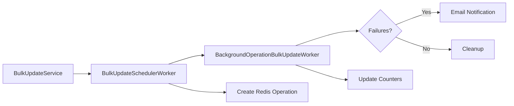

This document describes the background operations system for tracking long-running bulk operations in the security inventory.

## Purpose

Background operations allow users to perform bulk actions across multiple projects asynchronously.
The system provides error tracking and email notifications on failure.

## Architecture

### Flow



1. **Initiate**: User triggers bulk operation through `BulkUpdateService`
1. **Schedule**: `BulkUpdateSchedulerWorker` collects projects and creates Redis operation
1. **Process**: `BackgroundOperationBulkUpdateWorker` processes projects in batches
1. **Finalize**: Last batch detects completion and sends email if failures occurred
1. **Cleanup**: Redis entities are deleted after notification

### Components

| Component | Purpose |
|-----------|---------|
| `Security::Attributes::BulkUpdateSchedulerWorker` | Orchestrates batch scheduling, creates Redis operation |
| `Security::Attributes::BackgroundOperationBulkUpdateWorker` | Processes projects with tracking |
| `Gitlab::BackgroundOperations::RedisStore` | Redis state management |
| `Security::BackgroundOperationMailer` | Failure notification emails |

## Redis data structure

### Operation entity

```plaintext
Key: background_operation:{operation_id}
Type: Hash
Fields:
  - id: operation ID
  - operation_type: type of operation (for example, 'attribute_update')
  - user_id: user who initiated
  - parameters: JSON with operation-specific params
  - status: 'pending' | 'running'
  - total_items: total projects to process
  - successful_items: count of successful projects
  - failed_items: count of failed projects
  - created_at: timestamp
TTL: 72 hours
```

### Failed items list

```plaintext
Key: background_operation:{operation_id}:failed_items
Type: List
Items: JSON objects with:
  - entity_id: ID of failed entity (project or group)
  - entity_type: 'Project' or 'Group'
  - entity_name: name of the entity
  - entity_full_path: full path for linking
  - error_message: human-readable error
  - error_code: machine-readable error code
  - created_at: timestamp
TTL: 72 hours
```

## Error codes

| Code | Meaning |
|------|---------|
| `service_error` | Service returned error response |
| `unexpected_error` | Unexpected exception occurred |

## Feature flag

The `security_bulk_operations_notifications` feature flag controls background operations tracking.

- **Disabled**: Uses legacy `BulkUpdateWorker` (no tracking or notifications)
- **Enabled**: Uses `BackgroundOperationBulkUpdateWorker` (with tracking and notifications)

## Email notifications

Emails are sent **only when failures occur** after the operation completes.

Email includes:

- Summary: total, successful, failed counts
- List of failed items (projects or groups) with error details and links

## Usage

### Creating an operation

```ruby
operation_id = Gitlab::BackgroundOperations::RedisStore.create_operation(
  operation_type: 'attribute_update',
  user_id: user.id,
  total_items: projects_count,
  parameters: { attribute_ids: [1, 2], mode: 'ADD' }
)
```

### Recording success or failure

```ruby
# Record success
Gitlab::BackgroundOperations::RedisStore.increment_successful(operation_id)

# Record failure for a project
Gitlab::BackgroundOperations::RedisStore.add_failed_item(
  operation_id,
  entity_id: project.id,
  entity_type: 'Project',
  entity_name: project.name,
  entity_full_path: project.full_path,
  error_message: 'Permission denied',
  error_code: 'service_error'
)

# Record failure for a group
Gitlab::BackgroundOperations::RedisStore.add_failed_item(
  operation_id,
  entity_id: group.id,
  entity_type: 'Group',
  entity_name: group.name,
  entity_full_path: group.full_path,
  error_message: 'Permission denied',
  error_code: 'service_error'
)
```

### Checking operation status

```ruby
operation = Gitlab::BackgroundOperations::RedisStore.get_operation(operation_id)
# Returns Operation struct with: id, operation_type, user_id, parameters,
#   total_items, successful_items, failed_items

failed_items = Gitlab::BackgroundOperations::RedisStore.get_failed_items(operation_id)
# Returns array of failed item hashes
```

### Cleanup

```ruby
Gitlab::BackgroundOperations::RedisStore.delete_operation(operation_id)
# Deletes both the operation hash and failed items list
```

## Related topics

- [Sidekiq development guidelines](../sidekiq/_index.md)
- [Redis development guidelines](../redis.md)
