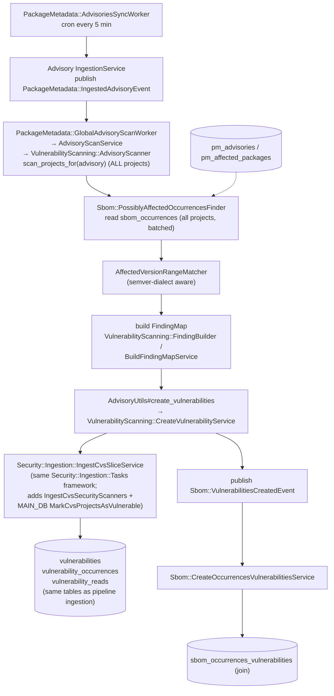

**Focus:** how Continuous Vulnerability Scanning (CVS) synthesizes vulnerabilities by matching
already-stored SBOM data against Package Metadata DB (PMDB) advisories, without an analyzer
running in a pipeline. The active flow is a global scan triggered for each newly published
advisory, converging on the same `vulnerability_*` tables as the
[CycloneDX to security findings](cyclonedx_to_security_findings.md) flow. A second, per-project
trigger exists but is disabled by default, so it is described in text rather than the diagram.

All paths are under `ee/`. `Sbom::*` and `PackageMetadata::*` models live on the sec DB
(`gitlab_sec`). The `vulnerabilities` and related tables live on main/ci.

## Steps

1. **Trigger, global, per new advisory.** The `AdvisoriesSyncWorker` cron (every five minutes)
   feeds the advisory `IngestionService`, which publishes `PackageMetadata::IngestedAdvisoryEvent`
   per recently published advisory. `GlobalAdvisoryScanWorker` calls `AdvisoryScanService` and
   `Gitlab::VulnerabilityScanning::AdvisoryScanner.scan_projects_for(advisory)`, which scans every
   project on the instance affected by that one advisory, something the pipeline model cannot do.
1. **Read stored SBOM data.** `Sbom::PossiblyAffectedOccurrencesFinder` reads `sbom_occurrences`
   across projects in batches, matching against PMDB advisories (`pm_advisories`,
   `pm_affected_packages`) using `AffectedVersionRangeMatcher`, which is semver-dialect aware.
1. **Build findings.** Matches become finding maps through
   `VulnerabilityScanning::FindingBuilder` and `BuildFindingMapService`, synthesized from stored
   data rather than parsed from an analyzer report.
1. **Shared write path.** The scan converges on `AdvisoryUtils#create_vulnerabilities`,
   `Security::VulnerabilityScanning::CreateVulnerabilityService`, and
   `Security::Ingestion::IngestCvsSliceService`. This reuses the same `Security::Ingestion::Tasks`
   framework as pipeline ingestion, so it writes the same `vulnerabilities`,
   `vulnerability_occurrences`, and `vulnerability_reads` tables. CVS adds
   `IngestCvsSecurityScanners` and a main-DB task `MarkCvsProjectsAsVulnerable`, and uses a
   synthetic `sbom_scanner` identity to distinguish CVS vulnerabilities from analyzer
   vulnerabilities.
1. **Link back to SBOM.** `CreateVulnerabilityService` publishes
   `Sbom::VulnerabilitiesCreatedEvent`, which drives `Sbom::CreateOccurrencesVulnerabilitiesService`
   to fill the `sbom_occurrences_vulnerabilities` join, connecting the new vulnerabilities back to
   their occurrences.

## Per-project trigger (disabled by default)

A second trigger runs after each SBOM ingestion, but it is effectively disabled on a default
instance and so is not shown in the diagram. The `Sbom::SbomIngestedEvent` is handled by
`Sbom::ProcessVulnerabilitiesWorker`, which runs `Sbom::CreateVulnerabilitiesService` for that
pipeline. `CreateVulnerabilitiesService#scan_sbom_reports` always skips `dependency_scanning`
sources (DS findings now come through the main pipeline ingestion) and skips every other source
unless `cvs_for_container_scanning` is enabled. That flag is a beta flag disabled by default, so
the worker runs but produces no vulnerabilities until it is enabled. When enabled, this path
handles container-scanning occurrences and also runs
`Security::Ingestion::MarkAsResolvedService` (scanner `sbom_scanner`) to auto-resolve CVS
vulnerabilities no longer present. When it does write, it uses the same shared write path as the
global scan above.

## Settings and flags

Project security settings `continuous_vulnerability_scans_enabled`,
`cvs_for_container_scanning_enabled`, and `cvs_for_dependency_scanning_enabled` (`nil` is treated
as enabled) control CVS; the `cvs_for_container_scanning` feature flag gates the per-project
container path.

**Differences from pipeline ingestion:** event-driven and cron-driven instead of
CI-artifact-driven; findings are synthesized from stored SBOM data and PMDB advisories instead of
parsed from a scanner; the global flow spans all projects; the write slice is
`IngestCvsSliceService`, not `IngestReportSliceService`. **Overlaps:** it reads the same
`sbom_occurrences`, reuses the same `Security::Ingestion::Tasks`, and writes the same
`vulnerability_*` tables.

## Related

- [CycloneDX to security findings](cyclonedx_to_security_findings.md) is the pipeline flow that
  writes the same `vulnerability_*` tables from a CI artifact.
- [CycloneDX license ingestion](cyclonedx_license_ingestion.md) populates the `sbom_occurrences`
  data that the global CVS scan reads.
- [New dependency scanning, the SBOM scan API](dependency_scanning_sbom_scan_api.md) is the
  analyzer-facing API that produces the CycloneDX SBOM.
