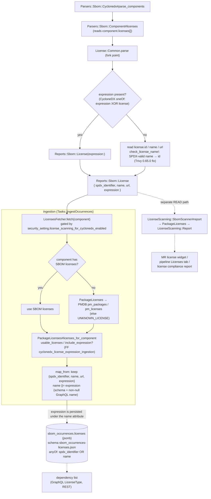

**Focus:** how a license declared in a CycloneDX SBOM becomes the
`sbom_occurrences.licenses` jsonb column. A CycloneDX component can declare a license in three
forms: an SPDX identifier (`license.id`), a free-text name (`license.name`), or an SPDX
expression (`expression`). The three forms diverge at parse time and converge during
ingestion, where an SPDX identifier drives a Package Metadata DB (PMDB) name and URL lookup
and an expression is gated behind a feature flag.

All paths are under `ee/`. Parsing produces a `Reports::Sbom::License` value object with no SPDX
resolution; ingestion resolves the source and writes the result to `sbom_occurrences`. A
separate read path (`LicenseScanning::SbomScanner`) reuses the same resolver to feed the merge
request license widget, the pipeline Licenses tab, and the license compliance report. Two flags
gate this path, both disabled by default: `cyclonedx_license_expression_ingestion` (whether an
expression survives into persisted licenses) and `license_expression_checker` (the
expression-aware policy checker downstream of ingestion).

> [!note]
> An expression is persisted under the `name` attribute, not a dedicated field. `map_from`
> sets `name ||= expression` because `sbom_occurrences.licenses` requires `spdx_identifier` or
> `name` (never `expression` alone) and the GraphQL `LicenseType#name` is non-null. When only an
> expression is present, `name` and `expression` hold the same string.

## Steps

1. **Read licenses off the component.** `Parsers::Sbom::Cyclonedx#parse_components` iterates the
   components; `Parsers::Sbom::Component#licenses` maps each `licenses[]` entry through
   `License::Common.parse`.
1. **Branch on expression vs ID/name.** `License::Common#parse` checks `expression` first (the
   CycloneDX `oneOf`: an entry is either `{expression}` or `{license: {id, name}}`). An
   expression builds `Reports::Sbom::License(expression:)`; otherwise it reads `license['id']`,
   `license['name']`, and `url`. `check_license_name!` moves a `name` into `id` when the name is
   a valid SPDX identifier, a workaround for a Trivy 0.65.0 bug.
1. **Report value object.** Both branches yield a `Reports::Sbom::License` carrying
   `spdx_identifier`, `name`, `url`, and `expression` as plain attributes. No SPDX resolution
   happens at parse time.
1. **Ingestion asks the fetcher.** `Tasks::IngestOccurrences` sets `licenses:` from
   `Sbom::Ingestion::LicensesFetcher#fetch`, gated by
   `security_setting.license_scanning_for_cyclonedx_enabled`.
1. **Source resolution.** Components that carry SBOM-supplied licenses use those. Components
   without them fall back to PMDB through `Gitlab::LicenseScanning::PackageLicenses`
   (`pm_packages`, `pm_licenses`), and to a single `UNKNOWN_LICENSE` when nothing is usable.
1. **Expression gating (feature flag).** In `PackageLicenses`, `usable_licenses` drops
   expression-only licenses, and `include_expression?` adds the `expression` key only when
   `cyclonedx_license_expression_ingestion` is enabled for the project. With the flag off, the
   behavior matches the previous ID and name only behavior.
1. **Name fallback and persist.** `map_from` keeps `spdx_identifier`, `name`, `url`, and
   `expression`, and sets `name ||= expression`, because the JSON schema and the non-null GraphQL
   `LicenseType#name` require a name and expression-only rows have none. The result is written to
   the `sbom_occurrences.licenses` jsonb column, validated by `sbom_occurrences-licenses.json`
   (`anyOf` requires `spdx_identifier` or `name`, never an expression alone).
1. **Separate read path.** Independently of ingestion, `LicenseScanning::SbomScanner#report`
   runs `PackageLicenses` over the latest SBOM pipeline and builds a `LicenseScanning::Report`
   consumed by the merge request license widget, the pipeline Licenses tab, and the license
   compliance report. The stored `sbom_occurrences.licenses` feeds the dependency list (GraphQL
   and REST).
1. **ID vs name vs expression.** `id` is the primary key and drives the PMDB name and URL
   lookup; `name` falls back to the expression string when only an expression is present;
   `expression` is persisted only under the flag and is parsed and evaluated later by
   `Gitlab::SPDX::ExpressionParser` in the policy and compliance layer, not at ingest.

## Related

- [CycloneDX to security findings](cyclonedx_to_security_findings.md) shares the CycloneDX
  parser and produces the vulnerability findings for the same SBOM components.
- [New dependency scanning, the SBOM scan API](dependency_scanning_sbom_scan_api.md) is the
  analyzer-facing API that generates the CycloneDX SBOM consumed here.
- [GitLab CycloneDX property taxonomy](cyclonedx_property_taxonomy.md) is the SBOM format the
  parser validates against.
