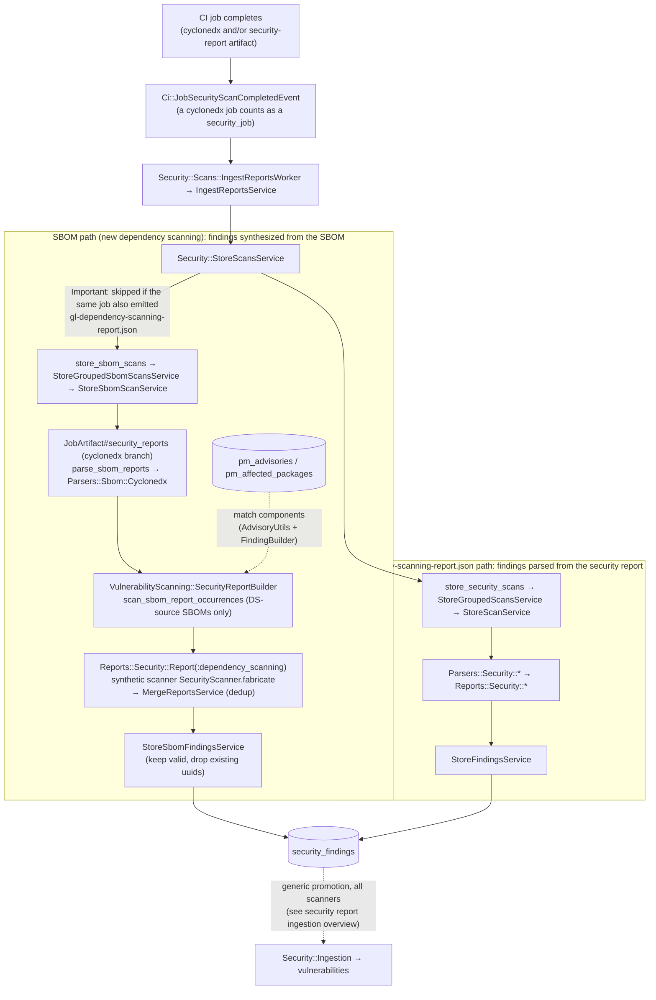

**Focus:** how a dependency-scanning cyclonedx report becomes `security_findings`.
The SBOM-specific part is that the findings are synthesized from the SBOM by
matching its components against Package Metadata DB (PMDB) advisories at store
time, not parsed from a scanner's own vulnerability report. This is what "DS
findings are now ingested during the main ingestion process" refers to.

All paths are under `ee/`. `Sbom::*` and `PackageMetadata::*` models live on the
sec DB (`gitlab_sec`). The `security_findings` table lives on main/ci.

## Steps

1. **Trigger.** A CI job that produced a cyclonedx (or security-report) artifact
   completes and `Ci::Build` publishes `Ci::JobSecurityScanCompletedEvent`. A
   cyclonedx job counts as a `security_job?`, so it enters the same pipeline as
   analyzer reports.
1. **Store stage.** `Security::Scans::IngestReportsWorker` →
   `Security::StoreScansService`, which forks into `store_sbom_scans` (cyclonedx)
   and `store_security_scans` (other reports). **Important:** the cyclonedx SBOM
   finding-synthesis is skipped when the same job also emitted a
   `gl-dependency-scanning-report.json` (job-scoped, matched by `job_id`), so the
   same dependency-scanning findings are not ingested twice. The skip applies only
   to this finding-synthesis path; the separate `sbom_*` occurrence ingestion
   still processes the cyclonedx report. See
   [work item 546429](https://gitlab.com/gitlab-org/gitlab/-/work_items/546429).
1. **SBOM path, build the report.** For a cyclonedx artifact,
   `JobArtifact#security_reports` parses the SBOM (`Parsers::Sbom::Cyclonedx`) and
   hands it to `VulnerabilityScanning::SecurityReportBuilder`.
1. **Advisory matching (the SBOM-specific step).**
   `SecurityReportBuilder#scan_sbom_report_occurrences` matches SBOM components
   against PMDB advisories (`pm_advisories` / `pm_affected_packages`) using
   `AdvisoryUtils` + `FindingBuilder`, producing a
   `Reports::Security::Report(:dependency_scanning)` with a synthetic scanner
   (`SecurityScanner.fabricate`). Only dependency-scanning-source SBOMs (with an
   input file path) are processed; `MergeReportsService` dedups within the report.
1. **Persist findings.** `StoreSbomScanService` calls `StoreSbomFindingsService`,
   which keeps valid findings not already present and writes `security_findings`.
1. **The `gl-dependency-scanning-report.json` path (the overlap).** A
   dependency-scanning analyzer that emits its own security report parses via
   `Parsers::Security::*` and writes the same `security_findings` through the
   generic `StoreFindingsService` (the same path other analyzers use).
1. **What happens next (out of focus here).** `security_findings` are promoted to
   `vulnerabilities` by the generic `Security::Ingestion` path, identical for
   every scanner; see
   [Security report ingestion overview](security_report_ingestion_overview.md).
   Separately, the cyclonedx report is ingested again into the `sbom_*` occurrence
   tables (the dependency inventory) and linked back to these vulnerabilities,
   which is a distinct flow (see the SBOM occurrence ingestion diagram).

**Key point:** the SBOM-specific logic is entirely in cyclonedx →
`security_findings` (advisory matching). Findings → vulnerabilities is generic, so
it is intentionally not redrawn here.

## Related

- [Security report ingestion overview](security_report_ingestion_overview.md)
  - The generic findings → vulnerabilities promotion.
- SBOM occurrence ingestion (dependency inventory + vulnerability linkage), the companion diagram.
- Continuous Vulnerability Scanning (CVS), the off-pipeline sibling of the advisory matching shown here.
