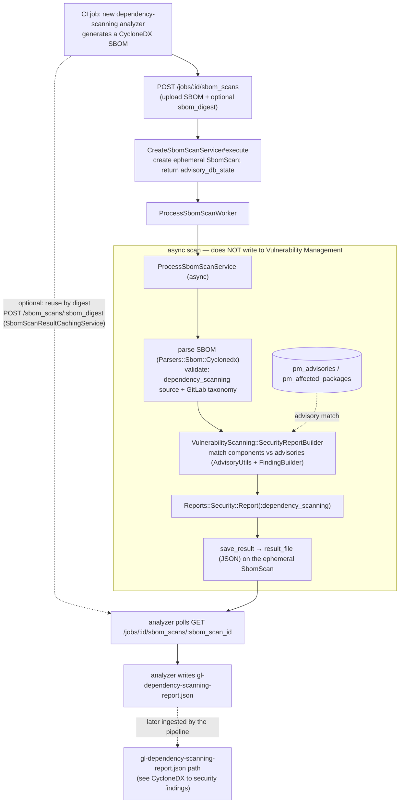

**Focus:** how the new dependency-scanning analyzer turns a CycloneDX SBOM into a
`gl-dependency-scanning-report.json` by calling the GitLab SBOM Vulnerability Scan
API. The API matches the SBOM against Package Metadata DB (PMDB) advisories
server-side and returns vulnerability data as a result file. This flow is
**ephemeral and analyzer-facing**: it does not create `security_findings` or
`vulnerabilities`; those are produced later when the report is ingested (see
[CycloneDX to security findings](cyclonedx_to_security_findings.md)).

Gated by the `dependency_scanning_sbom_scan_api` feature flag; endpoints use
job-token auth. All paths are under `ee/`.

## Steps

1. **Analyzer generates the SBOM.** The new dependency-scanning analyzer runs in
   a CI job and produces a CycloneDX SBOM following the GitLab CycloneDX property
   taxonomy for dependency scanning.
1. **Authorize the upload.** The analyzer calls
   `POST /jobs/:id/sbom_scans/authorize`, which uses `CreateSbomScanService#authorize`
   to return workhorse direct-upload headers (rate limited by
   `dependency_scanning_sbom_scan_api_upload`).
1. **Upload the SBOM.** `POST /jobs/:id/sbom_scans` uploads the file.
   `CreateSbomScanService#execute` creates an **ephemeral** `SbomScan` record and
   enqueues processing via `ProcessSbomScanWorker`.
   <!-- When the project is throttled (`dependency_scanning_sbom_scan_api_throttling`),
   processing is enqueued via `ProcessSbomScanThrottledWorker` (lower urgency) instead. -->
   The response includes the
   `advisory_db_state` (PMDB advisory sync status) so the analyzer knows how fresh
   the advisory data is.
1. **Async scan.** `ProcessSbomScanService` parses the SBOM
   (`Parsers::Sbom::Cyclonedx`), validates it is a `dependency_scanning`-source
   cyclonedx, then runs `VulnerabilityScanning::SecurityReportBuilder` to match
   components against PMDB advisories (`pm_advisories` / `pm_affected_packages`)
   using `AdvisoryUtils` + `FindingBuilder`. This is the **same builder** that the
   [CycloneDX to security findings](cyclonedx_to_security_findings.md) workflow
   uses, but here the output goes to a file, not to the database.
1. **Save the result.** `save_result` stores the resulting
   `Reports::Security::Report(:dependency_scanning)` as a JSON `result_file`
   attached to the ephemeral `SbomScan`. No `security_findings` or
   `vulnerabilities` are written.
1. **Poll and download.** The analyzer polls
   `GET /jobs/:id/sbom_scans/:sbom_scan_id`: `202` while in progress, `200` with
   the `result_file` when finished, `410` on failure.
1. **Optional, reuse by digest.** Before (or instead of) uploading, the analyzer
   can call `POST /jobs/:id/sbom_scans/:sbom_digest`
   (`SbomScanResultCachingService`) to reuse an existing result for an identical
   SBOM digest and purl types, skipping a re-scan.
1. **Output the report.** The analyzer writes the downloaded result as
   `gl-dependency-scanning-report.json`, the standard dependency-scanning report
   artifact.

> [!note]
> This is the overlap with the
> [CycloneDX to security findings](cyclonedx_to_security_findings.md) workflow. The shared piece
> is the logic that builds a vulnerability report from cyclonedx SBOM data,
> `VulnerabilityScanning::SecurityReportBuilder` (with `AdvisoryUtils` and `FindingBuilder`). Both
> workflows run the same builder to match SBOM components against PMDB advisories and produce a
> `Reports::Security::Report(:dependency_scanning)`. They differ only in what happens to that
> report: this API saves it to a `result_file`, while that workflow ingests it into
> `security_findings`.

**How this connects:** the report produced here is the input to the
[CycloneDX to security findings](cyclonedx_to_security_findings.md) workflow's
`gl-dependency-scanning-report.json` path, where it is ingested into
`security_findings`. Because the analyzer already produced that report via this
API, when the same job also uploads the cyclonedx as a pipeline artifact, the
store stage **skips** the cyclonedx finding-synthesis to avoid double ingestion.

## Related

- [CycloneDX to security findings](cyclonedx_to_security_findings.md) — ingests the
  `gl-dependency-scanning-report.json` this API produces.
- [GitLab CycloneDX property taxonomy](cyclonedx_property_taxonomy.md) — the SBOM
  format this API validates against.
- Continuous Vulnerability Scanning (CVS) — the off-pipeline flow that runs the
  same advisory matching over stored SBOM data.
