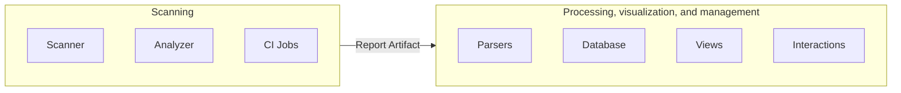

# Sec section development **(FREE)**

The Sec section is responsible for GitLab application security features, the "Sec" part of
DevSecOps. Development guides that are specific to the Sec section are listed here.

See [Terminology](../../user/application_security/terminology) for an overview of our shared terminology.

## Architecture

- [Overview](#overview)
- [Scanning](#scanning)
- [Processing, visualization, and management](#processing-visualization-and-management)
- [Severity Levels](../../user/application_security/vulnerabilities/severities.md)

## Overview

The architecture supporting the Secure features is split into two main parts:

- Scanning
- Processing, visualization, and management

### Scanning

The scanning part is responsible for finding vulnerabilities in given resources, and exporting results.
The scans are executed in CI/CD jobs via several small projects called [Analyzers](../../user/application_security/terminology/index.md#analyzer), which can be found in our [Analyzers sub-group](https://gitlab.com/gitlab-org/security-products/analyzers).
The Analyzers are wrappers around security tools called [Scanners](../../user/application_security/terminology/index.md#scanner), developed internally or externally, to integrate them into GitLab.
The Analyzers are mainly written in Go.

Some 3rd party integrators also make additional Scanners available by following our [integration documentation](../integrations/secure.md), which leverages the same architecture.

The results of the scans are exported as JSON reports that must comply with the [Secure report format](../../user/application_security/terminology/index.md#secure-report-format) and are uploaded as [CI/CD Job Report artifacts](../../ci/pipelines/job_artifacts.md) to make them available for processing after the pipelines completes.

### Processing, visualization, and management

After the data is available as a Report Artifact it can be processed by the GitLab Rails application to enable our security features, including:

- [Security Dashboards](../../user/application_security/security_dashboard/index.md), Merge Request widget, Pipeline view, and so on.
- [Interactions with vulnerabilities](../../user/application_security/index.md#interact-with-findings-and-vulnerabilities).
- [Approval rules](../../user/application_security/index.md#security-approvals-in-merge-requests).

Depending on the context, the security reports may be stored either in the database or stay as Report Artifacts for on-demand access.

## CI/CD template development

While CI/CD templates are the responsibiility of the Verify section, many are critical to the Sec Section's feature usage.
If you are working with CI/CD templates, please read the [development guide for GitLab CI/CD templates](../cicd/templates.md).
