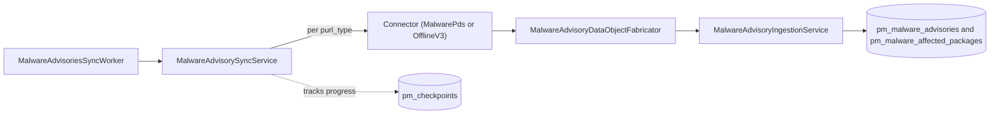

GitLab syncs a private database of GitLab malware advisories (GLAM) into the instance, built on the
Package Metadata Database (PMDB) v3 framework. A cron worker starts a sync service that handles one
package registry at a time. Per registry, a connector fetches advisory archives from the PMDB
Distribution Service (PDS), or reads a locally unpacked snapshot on air-gapped instances. The sync
upserts the entries into the tables and records progress in `pm_checkpoints`, so an interrupted run
resumes where it stopped.

The dependency firewall uses these synced advisories to block malicious packages. For the
user-facing overview, see
[GitLab malware advisories](../../user/application_security/gitlab_advisory_database/_index.md#gitlab-malware-advisories).

## Flow



## Worker

`PackageMetadata::MalwareAdvisoriesSyncWorker` (`ee/app/workers/`) is a cron job
(`include CronjobQueue`) that uses `ExclusiveLeaseGuard`. It sets `sidekiq_options retry: false`,
`urgency :low`, `worker_has_external_dependencies!`, and `idempotent!`.

The worker runs only when all of the following hold:

- The `dependency_scanning` license is available.
- The `sync_malware_advisories` feature flag is enabled.
- In development, the `PM_SYNC_IN_DEV` environment variable is `true`.

The `PM_SYNC_IN_DEV` environment variable does double duty. It enables the sync in development,
and it also skips the 0.25 second throttle that the service otherwise applies between units of
work. As a result, sync run times in development are much faster than production and are not
representative of it.

On GitLab Self-Managed and GitLab Dedicated, the worker adds a per-instance jitter of up to five
minutes before running, so the fleet doesn't call the distribution service on the same tick.
GitLab.com and staging run on the plain cron tick.

## Service

`PackageMetadata::MalwareAdvisorySyncService.execute(lease:)` (`ee/app/services/`) runs the sync.
It is a thin subclass of the shared `PackageMetadata::V3SyncService`, which owns the run flow. The
subclass only names the dataset and supplies its fabricator, ingestion service, and timing. The run
builds a `StopSignal` bounded by `max_lease_length` (the exclusive-lease timeout) and
`max_sync_duration` (the per-run budget, kept below the lease so the run stops before the lease
expires), then iterates `PackageMetadata::SyncConfiguration.configs_for('malware_advisories')`,
which yields one configuration per enabled purl type. See the service class for the current values.

For runs backed by the
[PMDB Distribution Service (PDS)](https://gitlab.com/gitlab-org/security-products/license-db/pmdb-distribution-service),
the service checks the Cloud Connector
instance token once, up front, using `pds_token_available?`. If the token is absent, the service
logs `aborted_no_token` and stops without calling PDS. Otherwise, it filters purl types to the
registries that PDS reports as supported (a `GET /supported` call that fails open), then splits
the remaining work into a first-sync `/all` fetch or a bulk `/delta` fetch per registry.

See the
[OpenAPI specification](https://gitlab.com/gitlab-org/security-products/license-db/pmdb-distribution-service/-/blob/main/docs/openapi.yaml)
for the endpoints described in this section. The PDS project is a private repository, so these
links are not accessible to community contributors.

## Connectors

Located in `ee/lib/gitlab/package_metadata/connector/`:

- `MalwarePds`, a subclass of `Pds`, is the online path. It authenticates to PDS with a Cloud
  Connector instance JSON Web Token (IJWT) and the Cloud Connector identity
  headers. Relative to the configured base URI, it calls `GET /all?purl_type=<registry_id>` for the
  first-sync snapshot (which returns per-shard signed Google Cloud Storage URLs),
  `GET /delta?since=<registry_id>:<seq>` for incremental updates, and `GET /supported`. Archives are
  `.tar.zst` files containing newline-delimited JSON (NDJSON).
- `OfflineV3` (a subclass of `Offline`) is the air-gapped path. It is dataset-neutral and shared by
  every v3 dataset. It reads a locally downloaded snapshot from
  `vendor/package_metadata/malware_advisories/v3/<registry_id>/full_dataset/`, which contains a
  `checkpoint.json` file and `<shard>.tar.zst` archives. The offline path has no delta channel. It
  reads every shard on a first sync or when a newer snapshot arrives, resumes from the last ingested
  shard if a previous run was interrupted, and reads nothing when the checkpoint already covers the
  snapshot. Delta support for the offline path is planned in
  [issue 616703](https://gitlab.com/gitlab-org/gitlab/-/work_items/616703). The download procedure is
  documented in
  [Download GitLab malware advisories](../../topics/offline/quick_start_guide.md#download-gitlab-malware-advisories).
- `SyncConfiguration::Location` selects `:offline` when the vendor directory exists, and `:pds`
  otherwise.
- PDS keys advisories by registry ID, not the raw purl type. For example, `gem` maps to
  `rubygem`, `golang` maps to `go`, and `composer` maps to `packagist`.
  `SyncConfiguration.registry_id` performs this mapping.

If a full sync is interrupted, the affected registry keeps requesting `/all` on the next run
instead of switching to `/delta`, because the `full_sync_target_sequence` marker stays set until
that snapshot finishes. This does not block the whole sync. Checkpoints are keyed per purl type,
so other registries continue running their deltas independently.

## Checkpoints and resumability

Sync progress is tracked in the `pm_checkpoints` table (the `gitlab_pm` database), scoped through
`Checkpoint.for_dataset('malware_advisories', 'v3')`. `first_sync?` determines whether a registry
uses `/all` or `/delta`.

A first-sync `/all` bootstrap is resumable per shard, tracked in the checkpoint `chunk` field. The
`full_sync_target_sequence` marker keeps `first_sync?` true across an interrupted multi-shard
bootstrap, so a resumed sync continues fetching `/all` instead of switching to `/delta` early. A
delta sync resumes per archive `sequence`. In both cases, the checkpoint only advances for data
that has already persisted.

## Ingestion

`MalwareAdvisoryDataObjectFabricator` turns each NDJSON entry into a `MalwareAdvisoryDataObject`.
`MalwareAdvisoryIngestionService` then upserts these objects, through validate-and-skip and bulk
upsert ingestion tasks, into the `pm_malware_advisories` and `pm_malware_affected_packages` tables
(the `gitlab_sec_cell_local` database). This database write is gated separately from the fetch, by
the `ingest_malware_advisories` feature flag.

## Feature flags

| Flag | Purpose |
|------|---------|
| `sync_malware_advisories` | Gates the worker and all PDS or offline data fetches. |
| `ingest_malware_advisories` | Gates the database upsert into the `pm_malware_*` tables. |

Both flags are instance-wide and enabled by default as of GitLab 19.3.

## Logging

The sync emits structured logs to `Gitlab::AppJsonLogger` (`application_json.log`), tagged with
`event: malware_advisory_sync`. Each registry run logs lifecycle phases: `started`, `completed`,
and, when the stop signal fires mid-run, `interrupted`. The service also logs `aborted_no_token`
when no Cloud Connector token is available. Sync success rate for a given period can be derived by
comparing the count of `completed` events to the count of `started` events.

## Observability

The dependency firewall relies on malware advisory data, so a silently failing sync leaves the instance matching against stale advisories.

### Check sync progress and data freshness

Run these in the [Rails console](../../administration/operations/rails_console.md). `sequence` is a unix-seconds cursor for the latest synced data, so `Time.at(sequence)` is how fresh that registry's advisories are. The sync is healthy when it is recent and advances across runs.

```ruby
PackageMetadata::Checkpoint.for_dataset('malware_advisories', 'v3').order(:purl_type).each do |c|
  freshness = c.sequence.to_i.zero? ? 'never' : Time.at(c.sequence)
  puts "#{c.purl_type}: data_through=#{freshness} first_sync=#{c.first_sync?} chunk=#{c.chunk} updated_at=#{c.updated_at}"
end

# Rows ingested so far:
PackageMetadata::MalwareAdvisory.count
PackageMetadata::MalwareAffectedPackage.count
```

A `data_through` that stops moving (or stays `never`) means the sync has stalled.

### Confirm the sync is enabled

```ruby
License.feature_available?(:dependency_scanning)  # must be true
Feature.enabled?(:sync_malware_advisories)         # gates the worker and all fetches
Feature.enabled?(:ingest_malware_advisories)       # gates the database upsert
```

Optional. To run a sync inline immediately (skipping the Self-Managed jitter), run:

```ruby
PackageMetadata::MalwareAdvisoriesSyncWorker.new.perform(true)
```

### Check the logs

The [structured logs](#logging) are in `/var/log/gitlab/gitlab-rails/application_json.log` on an Omnibus instance. Filter them with:

```shell
grep malware_advisory_sync /var/log/gitlab/gitlab-rails/application_json.log \
  | jq -r 'select(.event == "malware_advisory_sync") | "\(.phase) \(.purl_type // "-") \(.message)"'
```

On GitLab.com, GitLab team members can use the
[GLAM sync on GitLab Rails](https://log.gprd.gitlab.net/app/discover#/view/0b47398a-81c5-4cc4-b413-9c991724dca7?_tab=h@aee70b7&_g=h@c01f96a&_a=h@e792507)
view in Kibana, which is already filtered to these entries. Narrow further with `json.phase` or
`json.batch_id`.

A healthy run logs a `started` then `completed` per registry.

## Troubleshooting

| Signal | Meaning | Resolution |
|--------|---------|-----------|
| `phase: aborted_no_token` (error) | No Cloud Connector instance token, so no data is fetched | Confirm the instance is activated and can reach the Cloud Connector service, and check the subscription and token. |
| Repeated `phase: interrupted` with no `completed` | Each run hits the time budget, common during the large first sync. It resumes on the next run | Expected during the initial bootstrap. If it never completes, check for slow network or an oversized snapshot. |
| No `malware_advisory_sync` log lines at all | The worker is not running | Check the license and `sync_malware_advisories` flag above, and that the `package_metadata_malware_advisories_sync_worker` cron is enabled. |
| `completed` logs but `MalwareAdvisory.count` stays 0 | The fetch runs but ingestion is gated off | Enable `ingest_malware_advisories`. |
| Sidekiq job failures for `PackageMetadata::MalwareAdvisoriesSyncWorker` with no sync log line | The distribution service is unreachable. The transport error is raised before it is logged | Check egress to the distribution service. Structured logging for this case is tracked in [issue 621513](https://gitlab.com/gitlab-org/gitlab/-/work_items/621513). |
| `data_through` far in the past and not advancing | Data is stale | Work through the signals above. Stale advisories can miss newly-published malicious packages. |
