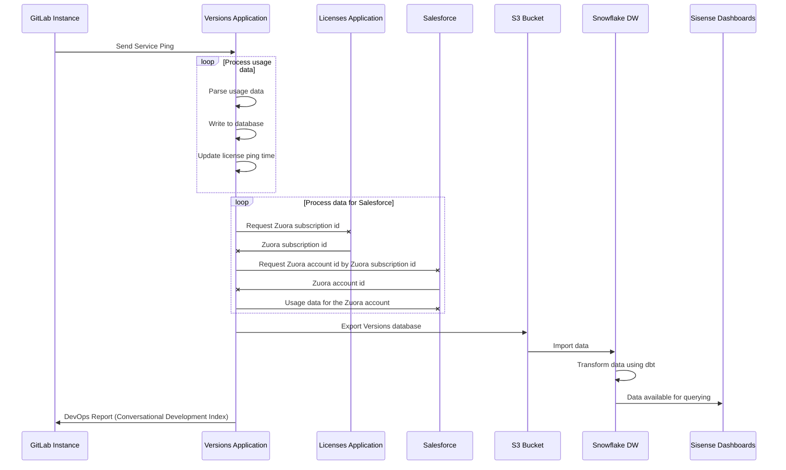

# Service Ping Guide **(FREE SELF)**

> Introduced in GitLab Ultimate 11.2, more statistics.

This guide describes Service Ping's purpose and how it's implemented.

For more information about Product Intelligence, see:

- [Product Intelligence Guide](https://about.gitlab.com/handbook/product/product-intelligence-guide/)
- [Snowplow Guide](../snowplow/index.md)

More links:

- [Product Intelligence Direction](https://about.gitlab.com/direction/product-intelligence/)
- [Data Analysis Process](https://about.gitlab.com/handbook/business-technology/data-team/#data-analysis-process/)
- [Data for Product Managers](https://about.gitlab.com/handbook/business-technology/data-team/programs/data-for-product-managers/)
- [Data Infrastructure](https://about.gitlab.com/handbook/business-technology/data-team/platform/infrastructure/)

## What is Service Ping?

Service Ping is a process in GitLab that collects and sends a weekly payload to GitLab Inc.
The payload provides important high-level data that helps our product, support,
and sales teams understand how GitLab is used. For example, the data helps to:

- Compare counts month over month (or week over week) to get a rough sense for how an instance uses
  different product features.
- Collect other facts that help us classify and understand GitLab installations.
- Calculate our Stage Monthly Active Users (SMAU), which helps to measure the success of our stages
  and features.

Service Ping information is not anonymous. It's linked to the instance's hostname. However, it does
not contain project names, usernames, or any other specific data.

Sending a Service Ping payload is optional and can be [disabled](#disable-service-ping) on any self-managed instance.
When Service Ping is enabled, GitLab gathers data from the other instances
and can show your instance's usage statistics to your users.

### Terminology

We use the following terminology to describe the Service Ping components:

- **Service Ping**: the process that collects and generates a JSON payload.
- **Service Data**: the contents of the Service Ping JSON payload. This includes metrics.
- **Metrics**: primarily made up of row counts for different tables in an instance's database. Each
  metric has a corresponding [metric definition](metrics_dictionary.md#metrics-definition-and-validation)
  in a YAML file.

### Why should we enable Service Ping?

- The main purpose of Service Ping is to build a better GitLab. Data about how GitLab is used is collected to better understand feature/stage adoption and usage, which helps us understand how GitLab is adding value and helps our team better understand the reasons why people use GitLab and with this knowledge we're able to make better product decisions.
- As a benefit of having Service Ping active, GitLab lets you analyze the users' activities over time of your GitLab installation.
- As a benefit of having Service Ping active, GitLab provides you with The DevOps Report,which gives you an overview of your entire instance's adoption of Concurrent DevOps from planning to monitoring.
- You get better, more proactive support. (assuming that our TAMs and support organization used the data to deliver more value)
- You get insight and advice into how to get the most value out of your investment in GitLab. Wouldn't you want to know that a number of features or values are not being adopted in your organization?
- You get a report that illustrates how you compare against other similar organizations (anonymized), with specific advice and recommendations on how to improve your DevOps processes.
- Service Ping is enabled by default. To disable it, see [Disable Service Ping](#disable-service-ping).
- When Service Ping is enabled, you have the option to participate in our [Registration Features Program](#registration-features-program) and receive free paid features.

#### Registration Features Program

> Introduced in GitLab 14.1.

Starting with GitLab version 14.1, free self-managed users running [GitLab EE](../ee_features.md) can receive paid features by registering with GitLab and sending us activity data via [Service Ping](#what-is-service-ping).

The paid feature available in this offering is [Email from GitLab](../../tools/email.md).
Administrators can use this [Premium](https://about.gitlab.com/pricing/premium/) feature to streamline
their workflow by emailing all or some instance users directly from the Admin Area.

NOTE:
Registration is not yet required for participation, but will be added in a future milestone.

### Limitations

- Service Ping does not track frontend events things like page views, link clicks, or user sessions, and only focuses on aggregated backend events.
- Because of these limitations we recommend instrumenting your products with Snowplow for more detailed analytics on GitLab.com and use Service Ping to track aggregated backend events on self-managed.

## View the Service Ping payload **(FREE SELF)**

You can view the exact JSON payload sent to GitLab Inc. in the Admin Area. To view the payload:

1. Sign in as a user with the [Administrator](../../user/permissions.md) role.
1. On the top bar, select **Menu >** **{admin}** **Admin**.
1. On the left sidebar, select **Settings > Metrics and profiling**.
1. Expand the **Usage statistics** section.
1. Select **Preview payload**.

For an example payload, see [Example Service Ping payload](#example-service-ping-payload).

## Disable Service Ping **(FREE SELF)**

NOTE:
The method to disable Service Ping in the GitLab configuration file does not work in
GitLab versions 9.3 to 13.12.3. See the [troubleshooting section](#cannot-disable-service-ping-using-the-configuration-file)
on how to disable it.

You can disable Service Ping either using the GitLab UI, or editing the GitLab
configuration file.

### Disable Service Ping using the UI

To disable Service Ping in the GitLab UI:

1. Sign in as a user with the [Administrator](../../user/permissions.md) role.
1. On the top bar, select **Menu >** **{admin}** **Admin**.
1. On the left sidebar, select **Settings > Metrics and profiling**.
1. Expand the **Usage statistics** section.
1. Clear the **Enable service ping** checkbox.
1. Select **Save changes**.

### Disable Service Ping using the configuration file

To disable Service Ping and prevent it from being configured in the future through
the Admin Area:

**For installations using the Linux package:**

1. Edit `/etc/gitlab/gitlab.rb`:

   ```ruby
   gitlab_rails['usage_ping_enabled'] = false
   ```

1. Reconfigure GitLab:

   ```shell
   sudo gitlab-ctl reconfigure
   ```

**For installations from source:**

1. Edit `/home/git/gitlab/config/gitlab.yml`:

   ```yaml
   production: &base
     # ...
     gitlab:
       # ...
       usage_ping_enabled: false
   ```

1. Restart GitLab:

   ```shell
   sudo service gitlab restart
   ```

## Service Ping request flow

The following example shows a basic request/response flow between a GitLab instance, the Versions Application, the License Application, Salesforce, the GitLab S3 Bucket, the GitLab Snowflake Data Warehouse, and Sisense:



## How Service Ping works

1. The Service Ping [cron job](https://gitlab.com/gitlab-org/gitlab/-/blob/master/app/workers/gitlab_service_ping_worker.rb#L24) is set in Sidekiq to run weekly.
1. When the cron job runs, it calls [`Gitlab::UsageData.to_json`](https://gitlab.com/gitlab-org/gitlab/-/blob/master/app/services/service_ping/submit_service.rb#L49).
1. `Gitlab::UsageData.to_json` [cascades down](https://gitlab.com/gitlab-org/gitlab/-/blob/master/lib/gitlab/usage_data.rb) to ~400+ other counter method calls.
1. The response of all methods calls are [merged together](https://gitlab.com/gitlab-org/gitlab/-/blob/master/lib/gitlab/usage_data.rb#L68) into a single JSON payload in `Gitlab::UsageData.to_json`.
1. The JSON payload is then [posted to the Versions application](https://gitlab.com/gitlab-org/gitlab/-/blob/master/app/services/service_ping/submit_service.rb#L20)
   If a firewall exception is needed, the required URL depends on several things. If
   the hostname is `version.gitlab.com`, the protocol is `TCP`, and the port number is `443`,
   the required URL is <https://version.gitlab.com/>.

### On a Geo secondary site

We also collect metrics specific to [Geo](../../administration/geo/index.md) secondary sites to send with Service Ping.

1. The [Geo secondary service ping cron job](https://gitlab.com/gitlab-org/gitlab/-/blob/master/ee/app/workers/geo/secondary_usage_data_cron_worker.rb) is set in Sidekiq to run weekly.
1. When the cron job runs, it calls [`SecondaryUsageData.update_metrics!`](https://gitlab.com/gitlab-org/gitlab/-/blob/master/ee/app/models/geo/secondary_usage_data.rb#L33). This collects the relevant metrics from Prometheus and stores the data in the Geo secondary tracking database for transmission to the primary site during a [Geo node status update](https://gitlab.com/gitlab-org/gitlab/-/blob/master/ee/app/models/geo_node_status.rb#L105).
1. Geo node status data is sent with the JSON payload in the process described above. The following is an example of the payload where each object in the array represents a Geo node:

   ```json
   [
     {
       "repository_verification_enabled"=>true,
       "repositories_replication_enabled"=>true,
       "repositories_synced_count"=>24,
       "repositories_failed_count"=>0,
       "attachments_replication_enabled"=>true,
       "attachments_count"=>1,
       "attachments_synced_count"=>1,
       "attachments_failed_count"=>0,
       "git_fetch_event_count_weekly"=>nil,
       "git_push_event_count_weekly"=>nil,
       ... other geo node status fields
     }
   ]
   ```

## Implementing Service Ping

Service Ping consists of two kinds of data, counters and observations. Counters track how often a certain event
happened over time, such as how many CI pipelines have run. They are monotonic and always trend up.
Observations are facts collected from one or more GitLab instances and can carry arbitrary data. There are no
general guidelines around how to collect those, due to the individual nature of that data.

### Types of counters

There are several types of counters in `usage_data.rb`:

- **Ordinary Batch Counters:** Simple count of a given ActiveRecord_Relation
- **Distinct Batch Counters:** Distinct count of a given ActiveRecord_Relation in a given column
- **Sum Batch Counters:** Sum the values of a given ActiveRecord_Relation in a given column
- **Alternative Counters:** Used for settings and configurations
- **Redis Counters:** Used for in-memory counts.

NOTE:
Only use the provided counter methods. Each counter method contains a built-in fail-safe mechanism that isolates each counter to avoid breaking the entire Service Ping process.

### Instrumentation classes

We recommend you use [instrumentation classes](metrics_instrumentation.md) in `usage_data.rb` where possible.

For example, we have the following instrumentation class:
`lib/gitlab/usage/metrics/instrumentations/count_boards_metric.rb`.

You should add it to `usage_data.rb` as follows:

```ruby
boards: add_metric('CountBoardsMetric', time_frame: 'all'),
```

### Batch counting

For large tables, PostgreSQL can take a long time to count rows due to MVCC [(Multi-version Concurrency Control)](https://en.wikipedia.org/wiki/Multiversion_concurrency_control). Batch counting is a counting method where a single large query is broken into multiple smaller queries. For example, instead of a single query querying 1,000,000 records, with batch counting, you can execute 100 queries of 10,000 records each. Batch counting is useful for avoiding database timeouts as each batch query is significantly shorter than one single long running query.

For GitLab.com, there are extremely large tables with 15 second query timeouts, so we use batch counting to avoid encountering timeouts. Here are the sizes of some GitLab.com tables:

| Table                        | Row counts in millions |
|------------------------------|------------------------|
| `merge_request_diff_commits` | 2280                   |
| `ci_build_trace_sections`    | 1764                   |
| `merge_request_diff_files`   | 1082                   |
| `events`                     | 514                    |

The following operation methods are available:

- [Ordinary batch counters](#ordinary-batch-counters)
- [Distinct batch counters](#distinct-batch-counters)
- [Sum batch operation](#sum-batch-operation)
- [Add operation](#add-operation)
- [Estimated batch counters](#estimated-batch-counters)

Batch counting requires indexes on columns to calculate max, min, and range queries. In some cases,
you may need to add a specialized index on the columns involved in a counter.

### Ordinary batch counters

Handles `ActiveRecord::StatementInvalid` error

Simple count of a given `ActiveRecord_Relation`, does a non-distinct batch count, smartly reduces `batch_size`, and handles errors.

Method: `count(relation, column = nil, batch: true, start: nil, finish: nil)`

Arguments:

- `relation` the ActiveRecord_Relation to perform the count
- `column` the column to perform the count on, by default is the primary key
- `batch`: default `true` to use batch counting
- `start`: custom start of the batch counting to avoid complex min calculations
- `end`: custom end of the batch counting to avoid complex min calculations

Examples:

```ruby
count(User.active)
count(::Clusters::Cluster.aws_installed.enabled, :cluster_id)
count(::Clusters::Cluster.aws_installed.enabled, :cluster_id, start: ::Clusters::Cluster.minimum(:id), finish: ::Clusters::Cluster.maximum(:id))
```

### Distinct batch counters

Handles `ActiveRecord::StatementInvalid` error

Distinct count of a given `ActiveRecord_Relation` on given column, a distinct batch count, smartly reduces `batch_size`, and handles errors.

Method: `distinct_count(relation, column = nil, batch: true, batch_size: nil, start: nil, finish: nil)`

Arguments:

- `relation` the ActiveRecord_Relation to perform the count
- `column` the column to perform the distinct count, by default is the primary key
- `batch`: default `true` to use batch counting
- `batch_size`: if none set it uses default value 10000 from `Gitlab::Database::BatchCounter`
- `start`: custom start of the batch counting to avoid complex min calculations
- `end`: custom end of the batch counting to avoid complex min calculations

WARNING:
Counting over non-unique columns can lead to performance issues. For more information, see the [iterating tables in batches](../iterating_tables_in_batches.md) guide.

Examples:

```ruby
distinct_count(::Project, :creator_id)
distinct_count(::Note.with_suggestions.where(time_period), :author_id, start: ::User.minimum(:id), finish: ::User.maximum(:id))
distinct_count(::Clusters::Applications::CertManager.where(time_period).available.joins(:cluster), 'clusters.user_id')
```

### Sum batch operation

Handles `ActiveRecord::StatementInvalid` error

Sum the values of a given ActiveRecord_Relation on given column and handles errors.

Method: `sum(relation, column, batch_size: nil, start: nil, finish: nil)`

Arguments:

- `relation` the ActiveRecord_Relation to perform the operation
- `column` the column to sum on
- `batch_size`: if none set it uses default value 1000 from `Gitlab::Database::BatchCounter`
- `start`: custom start of the batch counting to avoid complex min calculations
- `end`: custom end of the batch counting to avoid complex min calculations

Examples:

```ruby
sum(JiraImportState.finished, :imported_issues_count)
```

### Grouping and batch operations

The `count`, `distinct_count`, and `sum` batch counters can accept an `ActiveRecord::Relation`
object, which groups by a specified column. With a grouped relation, the methods do batch counting,
handle errors, and returns a hash table of key-value pairs.

Examples:

```ruby
count(Namespace.group(:type))
# returns => {nil=>179, "Group"=>54}

distinct_count(Project.group(:visibility_level), :creator_id)
# returns => {0=>1, 10=>1, 20=>11}

sum(Issue.group(:state_id), :weight))
# returns => {1=>3542, 2=>6820}
```

### Add operation

Handles `StandardError`.

Returns `-1` if any of the arguments are `-1`.

Sum the values given as parameters.

Method: `add(*args)`

Examples:

```ruby
project_imports = distinct_count(::Project.where.not(import_type: nil), :creator_id)
bulk_imports = distinct_count(::BulkImport, :user_id)

 add(project_imports, bulk_imports)
```

### Estimated batch counters

> - [Introduced](https://gitlab.com/gitlab-org/gitlab/-/merge_requests/48233) in GitLab 13.7.

Estimated batch counter functionality handles `ActiveRecord::StatementInvalid` errors
when used through the provided `estimate_batch_distinct_count` method.
Errors return a value of `-1`.

WARNING:
This functionality estimates a distinct count of a specific ActiveRecord_Relation in a given column,
which uses the [HyperLogLog](http://algo.inria.fr/flajolet/Publications/FlFuGaMe07.pdf) algorithm.
As the HyperLogLog algorithm is probabilistic, the **results always include error**.
The highest encountered error rate is 4.9%.

When correctly used, the `estimate_batch_distinct_count` method enables efficient counting over
columns that contain non-unique values, which can not be assured by other counters.

#### estimate_batch_distinct_count method

Method: `estimate_batch_distinct_count(relation, column = nil, batch_size: nil, start: nil, finish: nil)`

The [method](https://gitlab.com/gitlab-org/gitlab/-/blob/master/lib/gitlab/utils/usage_data.rb#L63)
includes the following arguments:

- `relation`: The ActiveRecord_Relation to perform the count.
- `column`: The column to perform the distinct count. The default is the primary key.
- `batch_size`: From `Gitlab::Database::PostgresHll::BatchDistinctCounter::DEFAULT_BATCH_SIZE`. Default value: 10,000.
- `start`: The custom start of the batch count, to avoid complex minimum calculations.
- `finish`: The custom end of the batch count to avoid complex maximum calculations.

The method includes the following prerequisites:

1. The supplied `relation` must include the primary key defined as the numeric column.
   For example: `id bigint NOT NULL`.
1. The `estimate_batch_distinct_count` can handle a joined relation. To use its ability to
   count non-unique columns, the joined relation **must not** have a one-to-many relationship,
   such as `has_many :boards`.
1. Both `start` and `finish` arguments should always represent primary key relationship values,
   even if the estimated count refers to another column, for example:

   ```ruby
     estimate_batch_distinct_count(::Note, :author_id, start: ::Note.minimum(:id), finish: ::Note.maximum(:id))
   ```

Examples:

1. Simple execution of estimated batch counter, with only relation provided,
   returned value represents estimated number of unique values in `id` column
   (which is the primary key) of `Project` relation:

   ```ruby
     estimate_batch_distinct_count(::Project)
   ```

1. Execution of estimated batch counter, where provided relation has applied
   additional filter (`.where(time_period)`), number of unique values estimated
   in custom column (`:author_id`), and parameters: `start` and `finish` together
   apply boundaries that defines range of provided relation to analyze:

   ```ruby
     estimate_batch_distinct_count(::Note.with_suggestions.where(time_period), :author_id, start: ::Note.minimum(:id), finish: ::Note.maximum(:id))
   ```

1. Execution of estimated batch counter with joined relation (`joins(:cluster)`),
   for a custom column (`'clusters.user_id'`):

   ```ruby
     estimate_batch_distinct_count(::Clusters::Applications::CertManager.where(time_period).available.joins(:cluster), 'clusters.user_id')
   ```

When instrumenting metric with usage of estimated batch counter please add
`_estimated` suffix to its name, for example:

```ruby
  "counts": {
    "ci_builds_estimated": estimate_batch_distinct_count(Ci::Build),
    ...
```

### Redis counters

Handles `::Redis::CommandError` and `Gitlab::UsageDataCounters::BaseCounter::UnknownEvent`
returns -1 when a block is sent or hash with all values -1 when a `counter(Gitlab::UsageDataCounters)` is sent
different behavior due to 2 different implementations of Redis counter

Method: `redis_usage_data(counter, &block)`

Arguments:

- `counter`: a counter from `Gitlab::UsageDataCounters`, that has `fallback_totals` method implemented
- or a `block`: which is evaluated

#### Ordinary Redis counters

Examples of implementation:

- Using Redis methods [`INCR`](https://redis.io/commands/incr), [`GET`](https://redis.io/commands/get), and [`Gitlab::UsageDataCounters::WikiPageCounter`](https://gitlab.com/gitlab-org/gitlab/-/blob/master/lib/gitlab/usage_data_counters/wiki_page_counter.rb)
- Using Redis methods [`HINCRBY`](https://redis.io/commands/hincrby), [`HGETALL`](https://redis.io/commands/hgetall), and [`Gitlab::UsageCounters::PodLogs`](https://gitlab.com/gitlab-org/gitlab/-/blob/master/lib/gitlab/usage_counters/pod_logs.rb)

##### UsageData API tracking

<!-- There's nearly identical content in `##### Adding new events`. If you fix errors here, you may need to fix the same errors in the other location. -->

1. Track event using `UsageData` API

   Increment event count using ordinary Redis counter, for given event name.

   Tracking events using the `UsageData` API requires the `usage_data_api` feature flag to be enabled, which is enabled by default.

   API requests are protected by checking for a valid CSRF token.

   To be able to increment the values, the related feature `usage_data_<event_name>` should be enabled.

   ```plaintext
   POST /usage_data/increment_counter
   ```

   | Attribute | Type | Required | Description |
   | :-------- | :--- | :------- | :---------- |
   | `event` | string | yes | The event name it should be tracked |

   Response:

   - `200` if event was tracked
   - `400 Bad request` if event parameter is missing
   - `401 Unauthorized` if user is not authenticated
   - `403 Forbidden` for invalid CSRF token provided

1. Track events using JavaScript/Vue API helper which calls the API above

   Note that `usage_data_api` and `usage_data_#{event_name}` should be enabled to be able to track events

   ```javascript
   import api from '~/api';

   api.trackRedisCounterEvent('my_already_defined_event_name'),
   ```

#### Redis HLL counters

WARNING:
HyperLogLog (HLL) is a probabilistic algorithm and its **results always includes some small error**. According to [Redis documentation](https://redis.io/commands/pfcount), data from
used HLL implementation is "approximated with a standard error of 0.81%".

With `Gitlab::UsageDataCounters::HLLRedisCounter` we have available data structures used to count unique values.

Implemented using Redis methods [PFADD](https://redis.io/commands/pfadd) and [PFCOUNT](https://redis.io/commands/pfcount).

##### Add new events

1. Define events in [`known_events`](https://gitlab.com/gitlab-org/gitlab/-/blob/master/lib/gitlab/usage_data_counters/known_events/).

   Example event:

   ```yaml
   - name: users_creating_epics
     category: epics_usage
     redis_slot: users
     aggregation: weekly
     feature_flag: track_epics_activity
   ```

   Keys:

   - `name`: unique event name.

     Name format for Redis HLL events `<name>_<redis_slot>`.

     [See Metric name](metrics_dictionary.md#metric-name) for a complete guide on metric naming suggestion.

     Consider including in the event's name the Redis slot to be able to count totals for a specific category.

     Example names: `users_creating_epics`, `users_triggering_security_scans`.

   - `category`: event category. Used for getting total counts for events in a category, for easier
     access to a group of events.
   - `redis_slot`: optional Redis slot. Default value: event name. Only event data that is stored in the same slot
     can be aggregated. Ensure keys are in the same slot. For example:
     `users_creating_epics` with `redis_slot: 'users'` builds Redis key
     `{users}_creating_epics-2020-34`. If `redis_slot` is not defined the Redis key will
     be `{users_creating_epics}-2020-34`.
     Recommended slots to use are: `users`, `projects`. This is the value we count.
   - `expiry`: expiry time in days. Default: 29 days for daily aggregation and 6 weeks for weekly
     aggregation.
   - `aggregation`: may be set to a `:daily` or `:weekly` key. Defines how counting data is stored in Redis.
     Aggregation on a `daily` basis does not pull more fine grained data.
   - `feature_flag`: optional `default_enabled: :yaml`. If no feature flag is set then the tracking is enabled. One feature flag can be used for multiple events. For details, see our [GitLab internal Feature flags](../feature_flags/index.md) documentation. The feature flags are owned by the group adding the event tracking.

1. Use one of the following methods to track the event:

   - In the controller using the `RedisTracking` module and the following format:

     ```ruby
     track_redis_hll_event(*controller_actions, name:, if: nil, &block)
     ```

     Arguments:

     - `controller_actions`: the controller actions to track.
     - `name`: the event name.
     - `if`: optional custom conditions. Uses the same format as Rails callbacks.
     - `&block`: optional block that computes and returns the `custom_id` that we want to track. This overrides the `visitor_id`.

     Example:

     ```ruby
     # controller
     class ProjectsController < Projects::ApplicationController
       include RedisTracking

       skip_before_action :authenticate_user!, only: :show
       track_redis_hll_event :index, :show, name: 'users_visiting_projects'

       def index
         render html: 'index'
       end

      def new
        render html: 'new'
      end

      def show
        render html: 'show'
      end
     end
     ```

   - In the API using the `increment_unique_values(event_name, values)` helper method.

     Arguments:

     - `event_name`: the event name.
     - `values`: the values counted. Can be one value or an array of values.

     Example:

     ```ruby
     get ':id/registry/repositories' do
       repositories = ContainerRepositoriesFinder.new(
         user: current_user, subject: user_group
       ).execute

       increment_unique_values('users_listing_repositories', current_user.id)

       present paginate(repositories), with: Entities::ContainerRegistry::Repository, tags: params[:tags], tags_count: params[:tags_count]
     end
     ```

   - Using `track_usage_event(event_name, values)` in services and GraphQL.

     Increment unique values count using Redis HLL, for a given event name.

     Examples:

     - [Track usage event for an incident in a service](https://gitlab.com/gitlab-org/gitlab/-/blob/v13.8.3-ee/app/services/issues/update_service.rb#L66)
     - [Track usage event for an incident in GraphQL](https://gitlab.com/gitlab-org/gitlab/-/blob/v13.8.3-ee/app/graphql/mutations/alert_management/update_alert_status.rb#L16)

     ```ruby
       track_usage_event(:incident_management_incident_created, current_user.id)
     ```

   - Using the `UsageData` API.
     <!-- There's nearly identical content in `##### UsageData API Tracking`. If you find / fix errors here, you may need to fix errors in that section too. -->

     Increment unique users count using Redis HLL, for a given event name.

     To track events using the `UsageData` API, ensure the `usage_data_api` feature flag
     is set to `default_enabled: true`. Enabled by default in GitLab 13.7 and later.

     API requests are protected by checking for a valid CSRF token.

     ```plaintext
     POST /usage_data/increment_unique_users
     ```

     | Attribute | Type | Required | Description |
     | :-------- | :--- | :------- | :---------- |
     | `event` | string | yes | The event name to track |

     Response:

     - `200` if the event was tracked, or if tracking failed for any reason.
     - `400 Bad request` if an event parameter is missing.
     - `401 Unauthorized` if the user is not authenticated.
     - `403 Forbidden` if an invalid CSRF token is provided.

   - Using the JavaScript/Vue API helper, which calls the `UsageData` API.

     To track events using the `UsageData` API, ensure the `usage_data_api` feature flag
     is set to `default_enabled: true`. Enabled by default in GitLab 13.7 and later.

     Example for an existing event already defined in [known events](https://gitlab.com/gitlab-org/gitlab/-/blob/master/lib/gitlab/usage_data_counters/known_events/):

     ```javascript
     import api from '~/api';

     api.trackRedisHllUserEvent('my_already_defined_event_name'),
     ```

1. Get event data using `Gitlab::UsageDataCounters::HLLRedisCounter.unique_events(event_names:, start_date:, end_date:, context: '')`.

   Arguments:

   - `event_names`: the list of event names.
   - `start_date`: start date of the period for which we want to get event data.
   - `end_date`: end date of the period for which we want to get event data.
   - `context`: context of the event. Allowed values are `default`, `free`, `bronze`, `silver`, `gold`, `starter`, `premium`, `ultimate`.

1. Testing tracking and getting unique events

Trigger events in rails console by using `track_event` method

   ```ruby
   Gitlab::UsageDataCounters::HLLRedisCounter.track_event('users_viewing_compliance_audit_events', values: 1)
   Gitlab::UsageDataCounters::HLLRedisCounter.track_event('users_viewing_compliance_audit_events', values: [2, 3])
   ```

Next, get the unique events for the current week.

   ```ruby
   # Get unique events for metric for current_week
   Gitlab::UsageDataCounters::HLLRedisCounter.unique_events(event_names: 'users_viewing_compliance_audit_events',
   start_date: Date.current.beginning_of_week, end_date: Date.current.next_week)
   ```

##### Recommendations

We have the following recommendations for [adding new events](#add-new-events):

- Event aggregation: weekly.
- Key expiry time:
  - Daily: 29 days.
  - Weekly: 42 days.
- When adding new metrics, use a [feature flag](../../operations/feature_flags.md) to control the impact.
- For feature flags triggered by another service, set `default_enabled: false`,
  - Events can be triggered using the `UsageData` API, which helps when there are > 10 events per change

##### Enable or disable Redis HLL tracking

Events are tracked behind optional [feature flags](../feature_flags/index.md) due to concerns for Redis performance and scalability.

For a full list of events and corresponding feature flags see, [known_events](https://gitlab.com/gitlab-org/gitlab/-/blob/master/lib/gitlab/usage_data_counters/known_events/) files.

To enable or disable tracking for specific event in <https://gitlab.com> or <https://about.staging.gitlab.com>, run commands such as the following to
[enable or disable the corresponding feature](../feature_flags/index.md).

```shell
/chatops run feature set <feature_name> true
/chatops run feature set <feature_name> false
```

We can also disable tracking completely by using the global flag:

```shell
/chatops run feature set redis_hll_tracking true
/chatops run feature set redis_hll_tracking false
```

##### Known events are added automatically in Service Data payload

All events added in [`known_events/common.yml`](https://gitlab.com/gitlab-org/gitlab/-/blob/master/lib/gitlab/usage_data_counters/known_events/common.yml) are automatically added to Service Data generation under the `redis_hll_counters` key. This column is stored in [version-app as a JSON](https://gitlab.com/gitlab-services/version-gitlab-com/-/blob/master/db/schema.rb#L209).
For each event we add metrics for the weekly and monthly time frames, and totals for each where applicable:

- `#{event_name}_weekly`: Data for 7 days for daily [aggregation](#add-new-events) events and data for the last complete week for weekly [aggregation](#add-new-events) events.
- `#{event_name}_monthly`: Data for 28 days for daily [aggregation](#add-new-events) events and data for the last 4 complete weeks for weekly [aggregation](#add-new-events) events.

Redis HLL implementation calculates automatic total metrics, if there are more than one metric for the same category, aggregation, and Redis slot.

- `#{category}_total_unique_counts_weekly`: Total unique counts for events in the same category for the last 7 days or the last complete week, if events are in the same Redis slot and we have more than one metric.
- `#{category}_total_unique_counts_monthly`: Total unique counts for events in same category for the last 28 days or the last 4 complete weeks, if events are in the same Redis slot and we have more than one metric.

Example of `redis_hll_counters` data:

```ruby
{:redis_hll_counters=>
  {"compliance"=>
    {"users_viewing_compliance_dashboard_weekly"=>0,
     "users_viewing_compliance_dashboard_monthly"=>0,
     "users_viewing_compliance_audit_events_weekly"=>0,
     "users_viewing_audit_events_monthly"=>0,
     "compliance_total_unique_counts_weekly"=>0,
     "compliance_total_unique_counts_monthly"=>0},
 "analytics"=>
    {"users_viewing_analytics_group_devops_adoption_weekly"=>0,
     "users_viewing_analytics_group_devops_adoption_monthly"=>0,
     "analytics_total_unique_counts_weekly"=>0,
     "analytics_total_unique_counts_monthly"=>0},
   "ide_edit"=>
    {"users_editing_by_web_ide_weekly"=>0,
     "users_editing_by_web_ide_monthly"=>0,
     "users_editing_by_sfe_weekly"=>0,
     "users_editing_by_sfe_monthly"=>0,
     "ide_edit_total_unique_counts_weekly"=>0,
     "ide_edit_total_unique_counts_monthly"=>0}
 }
```

Example:

```ruby
# Redis Counters
redis_usage_data(Gitlab::UsageDataCounters::WikiPageCounter)
redis_usage_data { ::Gitlab::UsageCounters::PodLogs.usage_totals[:total] }

# Define events in common.yml https://gitlab.com/gitlab-org/gitlab/-/blob/master/lib/gitlab/usage_data_counters/known_events/common.yml

# Tracking events
Gitlab::UsageDataCounters::HLLRedisCounter.track_event('users_expanding_vulnerabilities', values: visitor_id)

# Get unique events for metric
redis_usage_data { Gitlab::UsageDataCounters::HLLRedisCounter.unique_events(event_names: 'users_expanding_vulnerabilities', start_date: 28.days.ago, end_date: Date.current) }
```

### Alternative counters

Handles `StandardError` and fallbacks into -1 this way not all measures fail if we encounter one exception.
Mainly used for settings and configurations.

Method: `alt_usage_data(value = nil, fallback: -1, &block)`

Arguments:

- `value`: a simple static value in which case the value is simply returned.
- or a `block`: which is evaluated
- `fallback: -1`: the common value used for any metrics that are failing.

Example:

```ruby
alt_usage_data { Gitlab::VERSION }
alt_usage_data { Gitlab::CurrentSettings.uuid }
alt_usage_data(999)
```

### Add counters to build new metrics

When adding the results of two counters, use the `add` Service Data method that
handles fallback values and exceptions. It also generates a valid [SQL export](#export-service-ping-sql-queries-and-definitions).

Example:

```ruby
add(User.active, User.bot)
```

### Prometheus queries

In those cases where operational metrics should be part of Service Ping, a database or Redis query is unlikely
to provide useful data. Instead, Prometheus might be more appropriate, because most GitLab architectural
components publish metrics to it that can be queried back, aggregated, and included as Service Data.

NOTE:
Prometheus as a data source for Service Ping is only available for single-node Omnibus installations
that are running the [bundled Prometheus](../../administration/monitoring/prometheus/index.md) instance.

To query Prometheus for metrics, a helper method is available to `yield` a fully configured
`PrometheusClient`, given it is available as per the note above:

```ruby
with_prometheus_client do |client|
  response = client.query('<your query>')
  ...
end
```

Refer to [the `PrometheusClient` definition](https://gitlab.com/gitlab-org/gitlab/-/blob/master/lib/gitlab/prometheus_client.rb)
for how to use its API to query for data.

### Fallback values for Service Ping

We return fallback values in these cases:

| Case                        | Value |
|-----------------------------|-------|
| Deprecated Metric           | -1000 |
| Timeouts, general failures  | -1    |
| Standard errors in counters | -2    |

## Aggregated metrics

> - [Introduced](https://gitlab.com/gitlab-org/gitlab/-/merge_requests/45979) in GitLab 13.6.

WARNING:
This feature is intended solely for internal GitLab use.

To add data for aggregated metrics to the Service Ping payload, add a corresponding definition to:

- [`config/metrics/aggregates/*.yaml`](https://gitlab.com/gitlab-org/gitlab/-/blob/master/config/metrics/aggregates/) for metrics available in the Community Edition.
- [`ee/config/metrics/aggregates/*.yaml`](https://gitlab.com/gitlab-org/gitlab/-/blob/master/ee/config/metrics/aggregates/) for metrics available in the Enterprise Edition.

Each aggregate definition includes following parts:

- `name`: Unique name under which the aggregate metric is added to the Service Ping payload.
- `operator`: Operator that defines how the aggregated metric data is counted. Available operators are:
  - `OR`: Removes duplicates and counts all entries that triggered any of listed events.
  - `AND`: Removes duplicates and counts all elements that were observed triggering all of following events.
- `time_frame`: One or more valid time frames. Use these to limit the data included in aggregated metric to events within a specific date-range. Valid time frames are:
  - `7d`: Last seven days of data.
  - `28d`: Last twenty eight days of data.
  - `all`: All historical data, only available for `database` sourced aggregated metrics.
- `source`: Data source used to collect all events data included in aggregated metric. Valid data sources are:
  - [`database`](#database-sourced-aggregated-metrics)
  - [`redis`](#redis-sourced-aggregated-metrics)
- `events`: list of events names to aggregate into metric. All events in this list must
  relay on the same data source. Additional data source requirements are described in the
  [Database sourced aggregated metrics](#database-sourced-aggregated-metrics) and
  [Redis sourced aggregated metrics](#redis-sourced-aggregated-metrics) sections.
- `feature_flag`: Name of [development feature flag](../feature_flags/index.md#development-type)
  that is checked before metrics aggregation is performed. Corresponding feature flag
  should have `default_enabled` attribute set to `false`. The `feature_flag` attribute
  is optional and can be omitted. When `feature_flag` is missing, no feature flag is checked.

Example aggregated metric entries:

```yaml
- name: example_metrics_union
  operator: OR
  events:
    - 'users_expanding_secure_security_report'
    - 'users_expanding_testing_code_quality_report'
    - 'users_expanding_testing_accessibility_report'
  source: redis
  time_frame:
    - 7d
    - 28d
- name: example_metrics_intersection
  operator: AND
  source: database
  time_frame:
    - 28d
    - all
  events:
    - 'dependency_scanning_pipeline_all_time'
    - 'container_scanning_pipeline_all_time'
  feature_flag: example_aggregated_metric
```

Aggregated metrics collected in `7d` and `28d` time frames are added into Service Ping payload under the `aggregated_metrics` sub-key in the `counts_weekly` and `counts_monthly` top level keys.

```ruby
{
  :counts_monthly => {
    :deployments => 1003,
    :successful_deployments => 78,
    :failed_deployments => 275,
    :packages => 155,
    :personal_snippets => 2106,
    :project_snippets => 407,
    :promoted_issues => 719,
    :aggregated_metrics => {
      :example_metrics_union => 7,
      :example_metrics_intersection => 2
    },
    :snippets => 2513
  }
}
```

Aggregated metrics for `all` time frame are present in the `count` top level key, with the `aggregate_` prefix added to their name.

For example:

`example_metrics_intersection`

Becomes:

`counts.aggregate_example_metrics_intersection`

```ruby
{
  :counts => {
    :deployments => 11003,
    :successful_deployments => 178,
    :failed_deployments => 1275,
    :aggregate_example_metrics_intersection => 12
  }
}
```

### Redis sourced aggregated metrics

> - [Introduced](https://gitlab.com/gitlab-org/gitlab/-/merge_requests/45979) in GitLab 13.6.

To declare the aggregate of events collected with [Redis HLL Counters](#redis-hll-counters),
you must fulfill the following requirements:

1. All events listed at `events` attribute must come from
   [`known_events/*.yml`](#known-events-are-added-automatically-in-service-data-payload) files.
1. All events listed at `events` attribute must have the same `redis_slot` attribute.
1. All events listed at `events` attribute must have the same `aggregation` attribute.
1. `time_frame` does not include `all` value, which is unavailable for Redis sourced aggregated metrics.

### Database sourced aggregated metrics

> - [Introduced](https://gitlab.com/gitlab-org/gitlab/-/merge_requests/52784) in GitLab 13.9.
> - It's [deployed behind a feature flag](../../user/feature_flags.md), disabled by default.
> - It's enabled on GitLab.com.

To declare an aggregate of metrics based on events collected from database, follow
these steps:

1. [Persist the metrics for aggregation](#persist-metrics-for-aggregation).
1. [Add new aggregated metric definition](#add-new-aggregated-metric-definition).

#### Persist metrics for aggregation

Only metrics calculated with [Estimated Batch Counters](#estimated-batch-counters)
can be persisted for database sourced aggregated metrics. To persist a metric,
inject a Ruby block into the
[estimate_batch_distinct_count](#estimate_batch_distinct_count-method) method.
This block should invoke the
`Gitlab::Usage::Metrics::Aggregates::Sources::PostgresHll.save_aggregated_metrics`
[method](https://gitlab.com/gitlab-org/gitlab/-/blob/master/lib/gitlab/usage/metrics/aggregates/sources/postgres_hll.rb#L21),
which stores `estimate_batch_distinct_count` results for future use in aggregated metrics.

The `Gitlab::Usage::Metrics::Aggregates::Sources::PostgresHll.save_aggregated_metrics`
method accepts the following arguments:

- `metric_name`: The name of metric to use for aggregations. Should be the same
  as the key under which the metric is added into Service Ping.
- `recorded_at_timestamp`: The timestamp representing the moment when a given
  Service Ping payload was collected. You should use the convenience method `recorded_at`
  to fill `recorded_at_timestamp` argument, like this: `recorded_at_timestamp: recorded_at`
- `time_period`: The time period used to build the `relation` argument passed into
  `estimate_batch_distinct_count`. To collect the metric with all available historical
  data, set a `nil` value as time period: `time_period: nil`.
- `data`: HyperLogLog buckets structure representing unique entries in `relation`.
  The `estimate_batch_distinct_count` method always passes the correct argument
  into the block, so `data` argument must always have a value equal to block argument,
  like this: `data: result`

Example metrics persistence:

```ruby
class UsageData
  def count_secure_pipelines(time_period)
    ...
    relation = ::Security::Scan.latest_successful_by_build.by_scan_types(scan_type).where(security_scans: time_period)

    pipelines_with_secure_jobs['dependency_scanning_pipeline'] = estimate_batch_distinct_count(relation, :commit_id, batch_size: 1000, start: start_id, finish: finish_id) do |result|
      ::Gitlab::Usage::Metrics::Aggregates::Sources::PostgresHll
        .save_aggregated_metrics(metric_name: 'dependency_scanning_pipeline', recorded_at_timestamp: recorded_at, time_period: time_period, data: result)
    end
  end
end
```

#### Add new aggregated metric definition

After all metrics are persisted, you can add an aggregated metric definition at
[`aggregated_metrics/`](https://gitlab.com/gitlab-org/gitlab/-/blob/master/config/metrics/aggregates/).

To declare the aggregate of metrics collected with [Estimated Batch Counters](#estimated-batch-counters),
you must fulfill the following requirements:

- Metrics names listed in the `events:` attribute, have to use the same names you passed in the `metric_name` argument while persisting metrics in previous step.
- Every metric listed in the `events:` attribute, has to be persisted for **every** selected `time_frame:` value.

Example definition:

```yaml
- name: example_metrics_intersection_database_sourced
  operator: AND
  source: database
  events:
    - 'dependency_scanning_pipeline'
    - 'container_scanning_pipeline'
  time_frame:
    - 28d
    - all
```

## Example Service Ping payload

The following is example content of the Service Ping payload.

```json
{
  "uuid": "0000000-0000-0000-0000-000000000000",
  "hostname": "example.com",
  "version": "12.10.0-pre",
  "installation_type": "omnibus-gitlab",
  "active_user_count": 999,
  "recorded_at": "2020-04-17T07:43:54.162+00:00",
  "edition": "EEU",
  "license_md5": "00000000000000000000000000000000",
  "license_id": null,
  "historical_max_users": 999,
  "licensee": {
    "Name": "ABC, Inc.",
    "Email": "email@example.com",
    "Company": "ABC, Inc."
  },
  "license_user_count": 999,
  "license_starts_at": "2020-01-01",
  "license_expires_at": "2021-01-01",
  "license_plan": "ultimate",
  "license_add_ons": {
  },
  "license_trial": false,
  "counts": {
    "assignee_lists": 999,
    "boards": 999,
    "ci_builds": 999,
    ...
  },
  "container_registry_enabled": true,
  "dependency_proxy_enabled": false,
  "gitlab_shared_runners_enabled": true,
  "gravatar_enabled": true,
  "influxdb_metrics_enabled": true,
  "ldap_enabled": false,
  "mattermost_enabled": false,
  "omniauth_enabled": true,
  "prometheus_enabled": false,
  "prometheus_metrics_enabled": false,
  "reply_by_email_enabled": "incoming+%{key}@incoming.gitlab.com",
  "signup_enabled": true,
  "web_ide_clientside_preview_enabled": true,
  "projects_with_expiration_policy_disabled": 999,
  "projects_with_expiration_policy_enabled": 999,
  ...
  "elasticsearch_enabled": true,
  "license_trial_ends_on": null,
  "geo_enabled": false,
  "git": {
    "version": {
      "major": 2,
      "minor": 26,
      "patch": 1
    }
  },
  "gitaly": {
    "version": "12.10.0-rc1-93-g40980d40",
    "servers": 56,
    "clusters": 14,
    "filesystems": [
      "EXT_2_3_4"
    ]
  },
  "gitlab_pages": {
    "enabled": true,
    "version": "1.17.0"
  },
  "container_registry_server": {
    "vendor": "gitlab",
    "version": "2.9.1-gitlab"
  },
  "database": {
    "adapter": "postgresql",
    "version": "9.6.15",
    "pg_system_id": 6842684531675334351
  },
  "analytics_unique_visits": {
    "g_analytics_contribution": 999,
    ...
  },
  "usage_activity_by_stage": {
    "configure": {
      "project_clusters_enabled": 999,
      ...
    },
    "create": {
      "merge_requests": 999,
      ...
    },
    "manage": {
      "events": 999,
      ...
    },
    "monitor": {
      "clusters": 999,
      ...
    },
    "package": {
      "projects_with_packages": 999
    },
    "plan": {
      "issues": 999,
      ...
    },
    "release": {
      "deployments": 999,
      ...
    },
    "secure": {
      "user_container_scanning_jobs": 999,
      ...
    },
    "verify": {
      "ci_builds": 999,
      ...
    }
  },
  "usage_activity_by_stage_monthly": {
    "configure": {
      "project_clusters_enabled": 999,
      ...
    },
    "create": {
      "merge_requests": 999,
      ...
    },
    "manage": {
      "events": 999,
      ...
    },
    "monitor": {
      "clusters": 999,
      ...
    },
    "package": {
      "projects_with_packages": 999
    },
    "plan": {
      "issues": 999,
      ...
    },
    "release": {
      "deployments": 999,
      ...
    },
    "secure": {
      "user_container_scanning_jobs": 999,
      ...
    },
    "verify": {
      "ci_builds": 999,
      ...
    }
  },
  "topology": {
    "duration_s": 0.013836685999194742,
    "application_requests_per_hour": 4224,
    "query_apdex_weekly_average": 0.996,
    "failures": [],
    "nodes": [
      {
        "node_memory_total_bytes": 33269903360,
        "node_memory_utilization": 0.35,
        "node_cpus": 16,
        "node_cpu_utilization": 0.2,
        "node_uname_info": {
          "machine": "x86_64",
          "sysname": "Linux",
          "release": "4.19.76-linuxkit"
        },
        "node_services": [
          {
            "name": "web",
            "process_count": 16,
            "process_memory_pss": 233349888,
            "process_memory_rss": 788220927,
            "process_memory_uss": 195295487,
            "server": "puma"
          },
          {
            "name": "sidekiq",
            "process_count": 1,
            "process_memory_pss": 734080000,
            "process_memory_rss": 750051328,
            "process_memory_uss": 731533312
          },
          ...
        ],
        ...
      },
      ...
    ]
  }
}
```

## Notable changes

In GitLab 13.5, `pg_system_id` was added to send the [PostgreSQL system identifier](https://www.2ndquadrant.com/en/blog/support-for-postgresqls-system-identifier-in-barman/).

## Export Service Ping SQL queries and definitions

Two Rake tasks exist to export Service Ping definitions.

- The Rake tasks export the raw SQL queries for `count`, `distinct_count`, `sum`.
- The Rake tasks export the Redis counter class or the line of the Redis block for `redis_usage_data`.
- The Rake tasks calculate the `alt_usage_data` metrics.

In the home directory of your local GitLab installation run the following Rake tasks for the YAML and JSON versions respectively:

```shell
# for YAML export
bin/rake gitlab:usage_data:dump_sql_in_yaml

# for JSON export
bin/rake gitlab:usage_data:dump_sql_in_json

# You may pipe the output into a file
bin/rake gitlab:usage_data:dump_sql_in_yaml > ~/Desktop/usage-metrics-2020-09-02.yaml
```

## Generating and troubleshooting Service Ping

This activity is to be done via a detached screen session on a remote server.

Before you begin these steps, make sure the key is added to the SSH agent locally
with the `ssh-add` command.

### Triggering

1. Connect to bastion with agent forwarding: `$ ssh -A lb-bastion.gprd.gitlab.com`
1. Create named screen: `$ screen -S <username>_usage_ping_<date>`
1. Connect to console host: `$ ssh $USER-rails@console-01-sv-gprd.c.gitlab-production.internal`
1. Run `SubmitUsagePingService.new.execute`
1. Detach from screen: `ctrl + a, ctrl + d`
1. Exit from bastion: `$ exit`

### Verification (After approx 30 hours)

1. Reconnect to bastion: `$ ssh -A lb-bastion.gprd.gitlab.com`
1. Find your screen session: `$ screen -ls`
1. Attach to your screen session: `$ screen -x 14226.mwawrzyniak_usage_ping_2021_01_22`
1. Check the last payload in `raw_usage_data` table: `RawUsageData.last.payload`
1. Check the when the payload was sent: `RawUsageData.last.sent_at`

## Troubleshooting

### Cannot disable Service Ping using the configuration file

The method to disable Service Ping using the GitLab configuration file does not work in
GitLab versions 9.3.0 to 13.12.3. To disable it, you need to use the Admin Area in
the GitLab UI instead. For more information, see
[this issue](https://gitlab.com/gitlab-org/gitlab/-/issues/333269).

GitLab functionality and application settings cannot override or circumvent
restrictions at the network layer. If Service Ping is blocked by your firewall,
you are not impacted by this bug.

#### Check if you are affected

You can check if you were affected by this bug by using the Admin Area or by
checking the configuration file of your GitLab instance:

- Using the Admin Area:

  1. On the top bar, select **Menu >** **{admin}** **Admin**.
  1. On the left sidebar, select **Settings > Metrics and profiling**.
  1. Expand **Usage Statistics**.
  1. Are you able to check or uncheck the checkbox to disable Service Ping?

     - If _yes_, your GitLab instance is not affected by this bug.
     - If you can't check or uncheck the checkbox, you are affected by this bug.
       See the steps on [how to fix this](#how-to-fix-the-cannot-disable-service-ping-bug).

- Checking your GitLab instance configuration file:

  To check whether you're impacted by this bug, check your instance configuration
  settings. The configuration file in which Service Ping can be disabled depends
  on your installation and deployment method, but is typically one of the following:

  - `/etc/gitlab/gitlab.rb` for Omnibus GitLab Linux Package and Docker.
  - `charts.yaml` for GitLab Helm and cloud-native Kubernetes deployments.
  - `gitlab.yml` for GitLab installations from source.

  To check the relevant configuration file for strings that indicate whether
  Service Ping is disabled, you can use `grep`:

  ```shell
  # Linux package
  grep "usage_ping_enabled'\] = false" /etc/gitlab/gitlab.rb

  # Kubernetes charts
  grep "enableUsagePing: false" values.yaml

  # From source
  grep "usage_ping_enabled'\] = false" gitlab/config.yml
  ```

  If you see any output after running the relevant command, your GitLab instance
  may be affected by the bug. Otherwise, your instance is not affected.

#### How to fix the "Cannot disable Service Ping" bug

To work around this bug, you have two options:

- [Update](../../update/index.md) to GitLab 13.12.4 or newer to fix this bug.
- If you can't update to GitLab 13.12.4 or newer, enable Service Ping in the
  configuration file, then disable Service Ping in the UI. For example, if you're
  using the Linux package:

  1. Edit `/etc/gitlab/gitlab.rb`:

     ```ruby
     gitlab_rails['usage_ping_enabled'] = true
     ```

  1. Reconfigure GitLab:

     ```shell
     sudo gitlab-ctl reconfigure
     ```

  1. In GitLab, on the top bar, select **Menu >** **{admin}** **Admin**.
  1. On the left sidebar, select **Settings > Metrics and profiling**.
  1. Expand **Usage Statistics**.
  1. Clear the **Enable service ping** checkbox.
  1. Select **Save Changes**.
