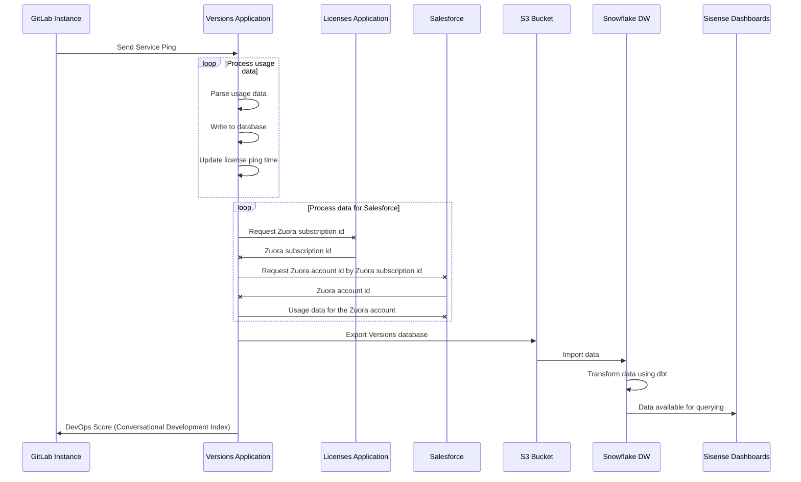

# Service Ping Guide **(FREE SELF)**

> Introduced in GitLab Ultimate 11.2, more statistics.

Service Ping is a GitLab process that collects and sends a weekly payload to GitLab.
The payload provides important high-level data that helps our product, support,
and sales teams understand how GitLab is used. The data helps to:

- Compare counts month over month (or week over week) to get a rough sense for how an instance uses
  different product features.
- Collect other facts that help us classify and understand GitLab installations.
- Calculate our stage monthly active users (SMAU), which helps to measure the success of our stages
  and features.

Service Ping information is not anonymous. It's linked to the instance's hostname, but does
not contain project names, usernames, or any other specific data.

Sending a Service Ping payload is optional and you can [disable](#disable-service-ping) it on any
self-managed instance. When Service Ping is enabled, GitLab gathers data from the other instances
and can show your instance's usage statistics to your users.

## Service Ping terminology

We use the following terminology to describe the Service Ping components:

- **Service Ping**: the process that collects and generates a JSON payload.
- **Service Data**: the contents of the Service Ping JSON payload. This includes metrics.
- **Metrics**: primarily made up of row counts for different tables in an instance's database. Each
  metric has a corresponding [metric definition](metrics_dictionary.md#metrics-definition-and-validation)
  in a YAML file.
- **MAU**: monthly active users.
- **WAU**: weekly active users.

### Why enable Service Ping?

The main purpose of Service Ping is to build a better GitLab. We collect data about how GitLab is used
to understand feature or stage adoption and usage. This data gives an insight into how GitLab adds
value and helps our team understand the reasons why people use GitLab, and with this knowledge we're able to
make better product decisions.

There are several other benefits to enabling Service Ping:

- As a benefit of having Service Ping active, GitLab lets you analyze the users' activities over time of your GitLab installation.
- As a benefit of having Service Ping active, GitLab provides you with [DevOps Score](../../user/admin_area/analytics/dev_ops_report.md#devops-score), which gives you an overview of your entire instance's adoption of Concurrent DevOps from planning to monitoring.
- You get better, more proactive support (assuming that our TAMs and support organization used the data to deliver more value).
- You get insight and advice into how to get the most value out of your investment in GitLab. Wouldn't you want to know that a number of features or values are not being adopted in your organization?
- You get a report that illustrates how you compare against other similar organizations (anonymized), with specific advice and recommendations on how to improve your DevOps processes.
- Service Ping is enabled by default. To disable it, see [Disable Service Ping](#disable-service-ping).
- When Service Ping is enabled, you have the option to participate in our [Registration Features Program](#registration-features-program) and receive free paid features.

### Limitations

- Service Ping does not track frontend events things like page views, link clicks, or user sessions.
- Service Ping focuses only on aggregated backend events.

Because of these limitations we recommend you:

- Instrument your products with Snowplow for more detailed analytics on GitLab.com.
- Use Service Ping to track aggregated backend events on self-managed instances.

### Registration Features Program

> Introduced in GitLab 14.1.

In GitLab versions 14.1 and later, GitLab Free customers with a self-managed instance running
[GitLab EE](../ee_features.md) can receive paid features by registering with GitLab and sending us
activity data through Service Ping. Features introduced here do not remove the feature from its paid
tier. Users can continue to access the features in a paid tier without sharing usage data.

#### Features available in 14.1 and later

1. [Email from GitLab](../../tools/email.md).

#### Features available in 14.4 and later

1. [Repository size limit](../../user/admin_area/settings/account_and_limit_settings.md#repository-size-limit).
1. [Restrict group access by IP address](../../user/group/index.md#restrict-group-access-by-ip-address).

NOTE:
Registration is not yet required for participation, but will be added in a future milestone.

#### Enable Registration Features

1. Sign in as a user with administrator access.
1. On the top bar, select **Menu > Admin**.
1. On the left sidebar, select **Settings > Metrics and profiling**.
1. Expand the **Usage statistics** section.
1. If not enabled, select the **Enable Service Ping** checkbox.
1. Select the **Enable Registration Features** checkbox.
1. Select **Save changes**.

## View the Service Ping payload **(FREE SELF)**

You can view the exact JSON payload sent to GitLab Inc. in the Admin Area. To view the payload:

1. Sign in as a user with administrator access.
1. On the top bar, select **Menu > Admin**.
1. On the left sidebar, select **Settings > Metrics and profiling**.
1. Expand the **Usage statistics** section.
1. Select **Preview payload**.

For an example payload, see [Example Service Ping payload](#example-service-ping-payload).

## Disable Service Ping **(FREE SELF)**

NOTE:
The method to disable Service Ping in the GitLab configuration file does not work in
GitLab versions 9.3 to 13.12.3. See the [troubleshooting section](#cannot-disable-service-ping-using-the-configuration-file)
on how to disable it.

You can disable Service Ping either using the GitLab UI, or editing the GitLab
configuration file.

### Disable Service Ping using the UI

To disable Service Ping in the GitLab UI:

1. Sign in as a user with administrator access.
1. On the top bar, select **Menu > Admin**.
1. On the left sidebar, select **Settings > Metrics and profiling**.
1. Expand the **Usage statistics** section.
1. Clear the **Enable Service Ping** checkbox.
1. Select **Save changes**.

### Disable Service Ping using the configuration file

To disable Service Ping and prevent it from being configured in the future through
the Admin Area:

**For installations using the Linux package:**

1. Edit `/etc/gitlab/gitlab.rb`:

   ```ruby
   gitlab_rails['usage_ping_enabled'] = false
   ```

1. Reconfigure GitLab:

   ```shell
   sudo gitlab-ctl reconfigure
   ```

**For installations from source:**

1. Edit `/home/git/gitlab/config/gitlab.yml`:

   ```yaml
   production: &base
     # ...
     gitlab:
       # ...
       usage_ping_enabled: false
   ```

1. Restart GitLab:

   ```shell
   sudo service gitlab restart
   ```

## Service Ping request flow

The following example shows a basic request/response flow between a GitLab instance, the Versions Application, the License Application, Salesforce, the GitLab S3 Bucket, the GitLab Snowflake Data Warehouse, and Sisense:



## How Service Ping works

1. The Service Ping [cron job](https://gitlab.com/gitlab-org/gitlab/-/blob/master/app/workers/gitlab_service_ping_worker.rb#L24) is set in Sidekiq to run weekly.
1. When the cron job runs, it calls [`Gitlab::Usage::ServicePingReport.for(output: :all_metrics_values)`](https://gitlab.com/gitlab-org/gitlab/-/blob/master/app/services/service_ping/submit_service.rb).
1. `Gitlab::Usage::ServicePingReport.for(output: :all_metrics_values)` [cascades down](https://gitlab.com/gitlab-org/gitlab/-/blob/master/lib/gitlab/usage_data.rb) to ~400+ other counter method calls.
1. The response of all methods calls are [merged together](https://gitlab.com/gitlab-org/gitlab/-/blob/master/lib/gitlab/usage_data.rb#L68) into a single JSON payload.
1. The JSON payload is then [posted to the Versions application](https://gitlab.com/gitlab-org/gitlab/-/blob/master/app/services/service_ping/submit_service.rb#L20)
   If a firewall exception is needed, the required URL depends on several things. If
   the hostname is `version.gitlab.com`, the protocol is `TCP`, and the port number is `443`,
   the required URL is <https://version.gitlab.com/>.
1. In case of an error, it will be reported to the Version application along with following pieces of information:

- `uuid` - GitLab instance unique identifier
- `hostname` - GitLab instance hostname
- `version` - GitLab instance current versions
- `elapsed` - Amount of time which passed since Service Ping report process started and moment of error occurrence
- `message` - Error message

<pre>
<code>
{
  "uuid"=>"02333324-1cd7-4c3b-a45b-a4993f05fb1d",
  "hostname"=>"127.0.0.1",
  "version"=>"14.7.0-pre",
  "elapsed"=>0.006946,
  "message"=>'PG::UndefinedColumn: ERROR:  column \"non_existent_attribute\" does not exist\nLINE 1: SELECT COUNT(non_existent_attribute) FROM \"issues\" /*applica...'
}
</code>
</pre>

### On a Geo secondary site

We also collect metrics specific to [Geo](../../administration/geo/index.md) secondary sites to send with Service Ping.

1. The [Geo secondary service ping cron job](https://gitlab.com/gitlab-org/gitlab/-/blob/master/ee/app/workers/geo/secondary_usage_data_cron_worker.rb) is set in Sidekiq to run weekly.
1. When the cron job runs, it calls [`SecondaryUsageData.update_metrics!`](https://gitlab.com/gitlab-org/gitlab/-/blob/master/ee/app/models/geo/secondary_usage_data.rb#L33). This collects the relevant metrics from Prometheus and stores the data in the Geo secondary tracking database for transmission to the primary site during a [Geo node status update](https://gitlab.com/gitlab-org/gitlab/-/blob/master/ee/app/models/geo_node_status.rb#L105).
1. Geo node status data is sent with the JSON payload in the process described above. The following is an example of the payload where each object in the array represents a Geo node:

   ```json
   [
     {
       "repository_verification_enabled"=>true,
       "repositories_replication_enabled"=>true,
       "repositories_synced_count"=>24,
       "repositories_failed_count"=>0,
       "git_fetch_event_count_weekly"=>nil,
       "git_push_event_count_weekly"=>nil,
       ... other geo node status fields
     }
   ]
   ```

## Implementing Service Ping

See the [implement Service Ping](implement.md) guide.

## Example Service Ping payload

The following is example content of the Service Ping payload.

```json
{
  "uuid": "0000000-0000-0000-0000-000000000000",
  "hostname": "example.com",
  "version": "12.10.0-pre",
  "installation_type": "omnibus-gitlab",
  "active_user_count": 999,
  "recorded_at": "2020-04-17T07:43:54.162+00:00",
  "edition": "EEU",
  "license_md5": "00000000000000000000000000000000",
  "license_id": null,
  "historical_max_users": 999,
  "licensee": {
    "Name": "ABC, Inc.",
    "Email": "email@example.com",
    "Company": "ABC, Inc."
  },
  "license_user_count": 999,
  "license_starts_at": "2020-01-01",
  "license_expires_at": "2021-01-01",
  "license_plan": "ultimate",
  "license_add_ons": {
  },
  "license_trial": false,
  "counts": {
    "assignee_lists": 999,
    "boards": 999,
    "ci_builds": 999,
    ...
  },
  "container_registry_enabled": true,
  "dependency_proxy_enabled": false,
  "gitlab_shared_runners_enabled": true,
  "gravatar_enabled": true,
  "influxdb_metrics_enabled": true,
  "ldap_enabled": false,
  "mattermost_enabled": false,
  "omniauth_enabled": true,
  "prometheus_enabled": false,
  "prometheus_metrics_enabled": false,
  "reply_by_email_enabled": "incoming+%{key}@incoming.gitlab.com",
  "signup_enabled": true,
  "web_ide_clientside_preview_enabled": true,
  "projects_with_expiration_policy_disabled": 999,
  "projects_with_expiration_policy_enabled": 999,
  ...
  "elasticsearch_enabled": true,
  "license_trial_ends_on": null,
  "geo_enabled": false,
  "git": {
    "version": {
      "major": 2,
      "minor": 26,
      "patch": 1
    }
  },
  "gitaly": {
    "version": "12.10.0-rc1-93-g40980d40",
    "servers": 56,
    "clusters": 14,
    "filesystems": [
      "EXT_2_3_4"
    ]
  },
  "gitlab_pages": {
    "enabled": true,
    "version": "1.17.0"
  },
  "container_registry_server": {
    "vendor": "gitlab",
    "version": "2.9.1-gitlab"
  },
  "database": {
    "adapter": "postgresql",
    "version": "9.6.15",
    "pg_system_id": 6842684531675334351,
    "flavor": "Cloud SQL for PostgreSQL"
  },
  "analytics_unique_visits": {
    "g_analytics_contribution": 999,
    ...
  },
  "usage_activity_by_stage": {
    "configure": {
      "project_clusters_enabled": 999,
      ...
    },
    "create": {
      "merge_requests": 999,
      ...
    },
    "manage": {
      "events": 999,
      ...
    },
    "monitor": {
      "clusters": 999,
      ...
    },
    "package": {
      "projects_with_packages": 999
    },
    "plan": {
      "issues": 999,
      ...
    },
    "release": {
      "deployments": 999,
      ...
    },
    "secure": {
      "user_container_scanning_jobs": 999,
      ...
    },
    "verify": {
      "ci_builds": 999,
      ...
    }
  },
  "usage_activity_by_stage_monthly": {
    "configure": {
      "project_clusters_enabled": 999,
      ...
    },
    "create": {
      "merge_requests": 999,
      ...
    },
    "manage": {
      "events": 999,
      ...
    },
    "monitor": {
      "clusters": 999,
      ...
    },
    "package": {
      "projects_with_packages": 999
    },
    "plan": {
      "issues": 999,
      ...
    },
    "release": {
      "deployments": 999,
      ...
    },
    "secure": {
      "user_container_scanning_jobs": 999,
      ...
    },
    "verify": {
      "ci_builds": 999,
      ...
    }
  },
  "topology": {
    "duration_s": 0.013836685999194742,
    "application_requests_per_hour": 4224,
    "query_apdex_weekly_average": 0.996,
    "failures": [],
    "nodes": [
      {
        "node_memory_total_bytes": 33269903360,
        "node_memory_utilization": 0.35,
        "node_cpus": 16,
        "node_cpu_utilization": 0.2,
        "node_uname_info": {
          "machine": "x86_64",
          "sysname": "Linux",
          "release": "4.19.76-linuxkit"
        },
        "node_services": [
          {
            "name": "web",
            "process_count": 16,
            "process_memory_pss": 233349888,
            "process_memory_rss": 788220927,
            "process_memory_uss": 195295487,
            "server": "puma"
          },
          {
            "name": "sidekiq",
            "process_count": 1,
            "process_memory_pss": 734080000,
            "process_memory_rss": 750051328,
            "process_memory_uss": 731533312
          },
          ...
        ],
        ...
      },
      ...
    ]
  }
}
```

## Notable changes

In GitLab 14.6, [`flavor`](https://gitlab.com/gitlab-org/gitlab/-/merge_requests/75587) was added to try to detect the underlying managed database variant.
Possible values are "Amazon Aurora PostgreSQL", "PostgreSQL on Amazon RDS", "Cloud SQL for PostgreSQL",
"Azure Database for PostgreSQL - Flexible Server", or "null".

In GitLab 13.5, `pg_system_id` was added to send the [PostgreSQL system identifier](https://www.2ndquadrant.com/en/blog/support-for-postgresqls-system-identifier-in-barman/).

## Export Service Ping SQL queries and definitions

Two Rake tasks exist to export Service Ping definitions.

- The Rake tasks export the raw SQL queries for `count`, `distinct_count`, `sum`.
- The Rake tasks export the Redis counter class or the line of the Redis block for `redis_usage_data`.
- The Rake tasks calculate the `alt_usage_data` metrics.

In the home directory of your local GitLab installation run the following Rake tasks for the YAML and JSON versions respectively:

```shell
# for YAML export
bin/rake gitlab:usage_data:dump_sql_in_yaml

# for JSON export
bin/rake gitlab:usage_data:dump_sql_in_json

# You may pipe the output into a file
bin/rake gitlab:usage_data:dump_sql_in_yaml > ~/Desktop/usage-metrics-2020-09-02.yaml
```

## Generate Service Ping

To generate Service Ping, use [Teleport](https://goteleport.com/docs/) or a detached screen session on a remote server.

### Triggering

#### Trigger Service Ping with Teleport

1. Request temporary [access](https://gitlab.com/gitlab-com/runbooks/-/blob/master/docs/Teleport/Connect_to_Rails_Console_via_Teleport.md#how-to-use-teleport-to-connect-to-rails-console) to the required environment.
1. After your approval is issued, [access the Rails console](https://gitlab.com/gitlab-com/runbooks/-/blob/master/docs/Teleport/Connect_to_Rails_Console_via_Teleport.md#access-approval).
1. Run `ServicePing::SubmitService.new.execute`.

#### Trigger Service Ping with a detached screen session

1. Connect to bastion with agent forwarding:

   ```shell
   ssh -A lb-bastion.gprd.gitlab.com
   ```

1. Create named screen:

   ```shell
   screen -S <username>_usage_ping_<date>
   ```

1. Connect to console host:
  
   ```shell
   ssh $USER-rails@console-01-sv-gprd.c.gitlab-production.internal
   ```

1. Run:

   ```shell
   ServicePing::SubmitService.new.execute
   ```

1. To detach from screen, press `ctrl + A`, `ctrl + D`.
1. Exit from bastion:
  
   ```shell
   exit
   ```

### Verification (After approx 30 hours)

#### Verify with Teleport

1. Follow [the steps](https://gitlab.com/gitlab-com/runbooks/-/blob/master/docs/Teleport/Connect_to_Rails_Console_via_Teleport.md#how-to-use-teleport-to-connect-to-rails-console) to request a new access to the required environment and connect to the Rails console
1. Check the last payload in `raw_usage_data` table: `RawUsageData.last.payload`
1. Check the when the payload was sent: `RawUsageData.last.sent_at`

#### Verify using detached screen session

1. Reconnect to bastion:

   ```shell
   ssh -A lb-bastion.gprd.gitlab.com
   ```

1. Find your screen session:

   ```shell
   screen -ls
   ```

1. Attach to your screen session:

   ```shell
   screen -x 14226.mwawrzyniak_usage_ping_2021_01_22
   ```

1. Check the last payload in `raw_usage_data` table:
  
   ```shell
   RawUsageData.last.payload
   ```

1. Check the when the payload was sent:

   ```shell
   RawUsageData.last.sent_at
   ```

### Skip database write operations

To skip database write operations, DevOps report creation, and storage of usage data payload, pass an optional argument:

```shell
skip_db_write:
ServicePing::SubmitService.new(skip_db_write: true).execute
```

## Manually upload Service Ping payload

> [Introduced](https://gitlab.com/groups/gitlab-org/-/epics/7388) in GitLab 14.8 with a flag named `admin_application_settings_service_usage_data_center`. Disabled by default.

Service Ping payload can be uploaded to GitLab even if your application instance doesn't have access to the internet,
or you don't have Service Ping [cron job](#how-service-ping-works) enabled.

To upload payload manually:

1. Sign in as a user with administrator access.
1. On the top bar, select **Menu > Admin**.
1. On the left sidebar, select **Settings > Service** usage data.
1. Select **Download payload**.
1. Save the JSON file.
1. Visit [Service usage data center](https://version.gitlab.com/usage_data/new).
1. Select **Choose file** and choose the file from p5.
1. Select **Upload**.

## Monitoring

Service Ping reporting process state is monitored with [internal SiSense dashboard](https://app.periscopedata.com/app/gitlab/968489/Product-Intelligence---Service-Ping-Health).

## Troubleshooting

### Cannot disable Service Ping using the configuration file

The method to disable Service Ping using the GitLab configuration file does not work in
GitLab versions 9.3.0 to 13.12.3. To disable it, you must use the Admin Area in
the GitLab UI instead. For more information, see
[this issue](https://gitlab.com/gitlab-org/gitlab/-/issues/333269).

GitLab functionality and application settings cannot override or circumvent
restrictions at the network layer. If Service Ping is blocked by your firewall,
you are not impacted by this bug.

#### Check if you are affected

You can check if you were affected by this bug by using the Admin Area or by
checking the configuration file of your GitLab instance:

- Using the Admin Area:

  1. On the top bar, select **Menu > Admin**.
  1. On the left sidebar, select **Settings > Metrics and profiling**.
  1. Expand **Usage Statistics**.
  1. Are you able to check or uncheck the checkbox to disable Service Ping?

     - If _yes_, your GitLab instance is not affected by this bug.
     - If you can't check or uncheck the checkbox, you are affected by this bug.
       See the steps on [how to fix this](#how-to-fix-the-cannot-disable-service-ping-bug).

- Checking your GitLab instance configuration file:

  To check whether you're impacted by this bug, check your instance configuration
  settings. The configuration file in which Service Ping can be disabled depends
  on your installation and deployment method, but is typically one of the following:

  - `/etc/gitlab/gitlab.rb` for Omnibus GitLab Linux Package and Docker.
  - `charts.yaml` for GitLab Helm and cloud-native Kubernetes deployments.
  - `gitlab.yml` for GitLab installations from source.

  To check the relevant configuration file for strings that indicate whether
  Service Ping is disabled, you can use `grep`:

  ```shell
  # Linux package
  grep "usage_ping_enabled'\] = false" /etc/gitlab/gitlab.rb

  # Kubernetes charts
  grep "enableUsagePing: false" values.yaml

  # From source
  grep "usage_ping_enabled'\] = false" gitlab/config.yml
  ```

  If you see any output after running the relevant command, your GitLab instance
  may be affected by the bug. Otherwise, your instance is not affected.

#### How to fix the "Cannot disable Service Ping" bug

To work around this bug, you have two options:

- [Update](../../update/index.md) to GitLab 13.12.4 or newer to fix this bug.
- If you can't update to GitLab 13.12.4 or newer, enable Service Ping in the
  configuration file, then disable Service Ping in the UI. For example, if you're
  using the Linux package:

  1. Edit `/etc/gitlab/gitlab.rb`:

     ```ruby
     gitlab_rails['usage_ping_enabled'] = true
     ```

  1. Reconfigure GitLab:

     ```shell
     sudo gitlab-ctl reconfigure
     ```

  1. In GitLab, on the top bar, select **Menu > Admin**.
  1. On the left sidebar, select **Settings > Metrics and profiling**.
  1. Expand **Usage Statistics**.
  1. Clear the **Enable Service Ping** checkbox.
  1. Select **Save Changes**.

## Related topics

- [Product Intelligence Guide](https://about.gitlab.com/handbook/product/product-intelligence-guide/)
- [Snowplow Guide](../snowplow/index.md)
- [Product Intelligence Direction](https://about.gitlab.com/direction/product-intelligence/)
- [Data Analysis Process](https://about.gitlab.com/handbook/business-technology/data-team/#data-analysis-process/)
- [Data for Product Managers](https://about.gitlab.com/handbook/business-technology/data-team/programs/data-for-product-managers/)
- [Data Infrastructure](https://about.gitlab.com/handbook/business-technology/data-team/platform/infrastructure/)
