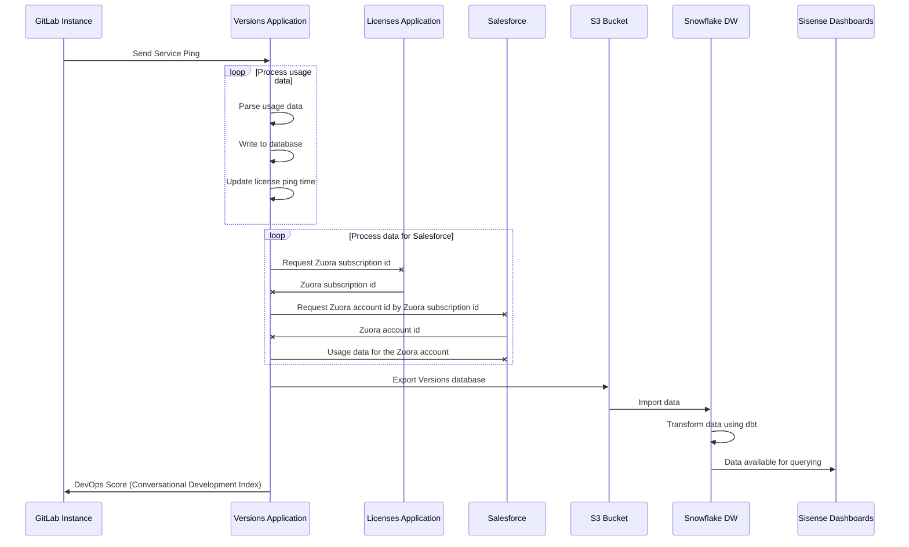

# Service Ping development guidelines

> - Introduced in GitLab Ultimate 11.2, more statistics.
> - In GitLab 14.1, [renamed from Usage Ping to Service Ping](https://gitlab.com/groups/gitlab-org/-/epics/5990). In 14.0 and earlier, use the Usage Ping documentation for the Rails commands appropriate to your version.

Service Ping is a GitLab process that collects and sends a weekly payload to GitLab.
The payload provides important high-level data that helps our product, support,
and sales teams understand how GitLab is used. The data helps to:

- Compare counts month over month (or week over week) to get a rough sense for how an instance uses
  different product features.
- Collect other facts that help us classify and understand GitLab installations.
- Calculate our stage monthly active users (SMAU), which helps to measure the success of our stages
  and features.

Service Ping information is not anonymous. It's linked to the instance's hostname, but does
not contain project names, usernames, or any other specific data.

Service Ping is enabled by default. However, you can [disable](../../user/admin_area/settings/usage_statistics.md#enable-or-disable-usage-statistics) it on any self-managed instance. When Service Ping is enabled, GitLab gathers data from the other instances and can show your instance's usage statistics to your users.

## Service Ping terminology

We use the following terminology to describe the Service Ping components:

- **Service Ping**: the process that collects and generates a JSON payload.
- **Service Data**: the contents of the Service Ping JSON payload. This includes metrics.
- **Metrics**: primarily made up of row counts for different tables in an instance's database. Each
  metric has a corresponding [metric definition](metrics_dictionary.md#metrics-definition-and-validation)
  in a YAML file.
- **MAU**: monthly active users.
- **WAU**: weekly active users.

### Limitations

- Service Ping does not track frontend events things like page views, link clicks, or user sessions.
- Service Ping focuses only on aggregated backend events.

Because of these limitations we recommend you:

- Instrument your products with Snowplow for more detailed analytics on GitLab.com.
- Use Service Ping to track aggregated backend events on self-managed instances.

## Service Ping request flow

The following example shows a basic request/response flow between a GitLab instance, the Versions Application, the License Application, Salesforce, the GitLab S3 Bucket, the GitLab Snowflake Data Warehouse, and Sisense:



## How Service Ping works

1. The Service Ping [cron job](https://gitlab.com/gitlab-org/gitlab/-/blob/master/app/workers/gitlab_service_ping_worker.rb#L24) is set in Sidekiq to run weekly.
1. When the cron job runs, it calls [`Gitlab::Usage::ServicePingReport.for(output: :all_metrics_values)`](https://gitlab.com/gitlab-org/gitlab/-/blob/master/app/services/service_ping/submit_service.rb).
1. `Gitlab::Usage::ServicePingReport.for(output: :all_metrics_values)` [cascades down](https://gitlab.com/gitlab-org/gitlab/-/blob/master/lib/gitlab/usage_data.rb) to ~400+ other counter method calls.
1. The response of all methods calls are [merged together](https://gitlab.com/gitlab-org/gitlab/-/blob/master/lib/gitlab/usage_data.rb#L68) into a single JSON payload.
1. The JSON payload is then [posted to the Versions application](https://gitlab.com/gitlab-org/gitlab/-/blob/master/app/services/service_ping/submit_service.rb#L20)
   If a firewall exception is needed, the required URL depends on several things. If
   the hostname is `version.gitlab.com`, the protocol is `TCP`, and the port number is `443`,
   the required URL is <https://version.gitlab.com/>.
1. In case of an error, it will be reported to the Version application along with following pieces of information:

   - `uuid` - GitLab instance unique identifier
   - `hostname` - GitLab instance hostname
   - `version` - GitLab instance current versions
   - `elapsed` - Amount of time which passed since Service Ping report process started and moment of error occurrence
   - `message` - Error message

   <pre>
   <code>
   {
     "uuid"=>"02333324-1cd7-4c3b-a45b-a4993f05fb1d",
     "hostname"=>"127.0.0.1",
     "version"=>"14.7.0-pre",
     "elapsed"=>0.006946,
     "message"=>'PG::UndefinedColumn: ERROR:  column \"non_existent_attribute\" does not exist\nLINE 1: SELECT COUNT(non_existent_attribute) FROM \"issues\" /*applica...'
   }
   </code>
   </pre>

1. Finally, the timing metadata information that is used for diagnostic purposes is submitted to the Versions application. It consists of a list of metric identifiers and the time it took to calculate the metrics:

   > - [Introduced](https://gitlab.com/gitlab-org/gitlab/-/merge_requests/37911) in GitLab 15.0 [with a flag](../../user/feature_flags.md), enabled by default.
   > - [Generally available](https://gitlab.com/gitlab-org/gitlab/-/issues/295289) in GitLab 15.2. [Feature flag `measure_service_ping_metric_collection`](https://gitlab.com/gitlab-org/gitlab/-/issues/358128) removed.

```ruby
    {
      "metadata"=>
      {
        "uuid"=>"0000000-0000-0000-0000-000000000000",
        "metrics"=>
        [{"name"=>"version", "time_elapsed"=>1.1811964213848114e-05},
         {"name"=>"installation_type", "time_elapsed"=>0.00017242692410945892},
         {"name"=>"license_billable_users", "time_elapsed"=>0.009520471096038818},
         ....
         {"name"=>"counts.clusters_platforms_eks",
          "time_elapsed"=>0.05638605775311589},
         {"name"=>"counts.clusters_platforms_gke",
          "time_elapsed"=>0.40995341585949063},
         {"name"=>"counts.clusters_platforms_user",
          "time_elapsed"=>0.06410990096628666},
         {"name"=>"counts.clusters_management_project",
          "time_elapsed"=>0.24020783510059118}
        ]
      }
    }
```

### On a Geo secondary site

We also collect metrics specific to [Geo](../../administration/geo/index.md) secondary sites to send with Service Ping.

1. The [Geo secondary service ping cron job](https://gitlab.com/gitlab-org/gitlab/-/blob/master/ee/app/workers/geo/secondary_usage_data_cron_worker.rb) is set in Sidekiq to run weekly.
1. When the cron job runs, it calls [`SecondaryUsageData.update_metrics!`](https://gitlab.com/gitlab-org/gitlab/-/blob/master/ee/app/models/geo/secondary_usage_data.rb#L33). This collects the relevant metrics from Prometheus and stores the data in the Geo secondary tracking database for transmission to the primary site during a [Geo node status update](https://gitlab.com/gitlab-org/gitlab/-/blob/master/ee/app/models/geo_node_status.rb#L105).
1. Geo node status data is sent with the JSON payload in the process described above. The following is an example of the payload where each object in the array represents a Geo node:

   ```json
   [
     {
       "repository_verification_enabled"=>true,
       "repositories_replication_enabled"=>true,
       "repositories_synced_count"=>24,
       "repositories_failed_count"=>0,
       "git_fetch_event_count_weekly"=>nil,
       "git_push_event_count_weekly"=>nil,
       ... other geo node status fields
     }
   ]
   ```

## Implementing Service Ping

See the [implement Service Ping](implement.md) guide.

## Example Service Ping payload

The following is example content of the Service Ping payload.

```json
{
  "uuid": "0000000-0000-0000-0000-000000000000",
  "hostname": "example.com",
  "version": "12.10.0-pre",
  "installation_type": "omnibus-gitlab",
  "active_user_count": 999,
  "recorded_at": "2020-04-17T07:43:54.162+00:00",
  "edition": "EEU",
  "license_md5": "00000000000000000000000000000000",
  "license_sha256": "0000000000000000000000000000000000000000000000000000000000000000",
  "license_id": null,
  "historical_max_users": 999,
  "licensee": {
    "Name": "ABC, Inc.",
    "Email": "email@example.com",
    "Company": "ABC, Inc."
  },
  "license_user_count": 999,
  "license_starts_at": "2020-01-01",
  "license_expires_at": "2021-01-01",
  "license_plan": "ultimate",
  "license_add_ons": {
  },
  "license_trial": false,
  "counts": {
    "assignee_lists": 999,
    "boards": 999,
    "ci_builds": 999,
    ...
  },
  "container_registry_enabled": true,
  "dependency_proxy_enabled": false,
  "gitlab_shared_runners_enabled": true,
  "gravatar_enabled": true,
  "influxdb_metrics_enabled": true,
  "ldap_enabled": false,
  "mattermost_enabled": false,
  "omniauth_enabled": true,
  "prometheus_enabled": false,
  "prometheus_metrics_enabled": false,
  "reply_by_email_enabled": "incoming+%{key}@incoming.gitlab.com",
  "signup_enabled": true,
  "projects_with_expiration_policy_disabled": 999,
  "projects_with_expiration_policy_enabled": 999,
  ...
  "elasticsearch_enabled": true,
  "license_trial_ends_on": null,
  "geo_enabled": false,
  "git": {
    "version": {
      "major": 2,
      "minor": 26,
      "patch": 1
    }
  },
  "gitaly": {
    "version": "12.10.0-rc1-93-g40980d40",
    "servers": 56,
    "clusters": 14,
    "filesystems": [
      "EXT_2_3_4"
    ]
  },
  "gitlab_pages": {
    "enabled": true,
    "version": "1.17.0"
  },
  "container_registry_server": {
    "vendor": "gitlab",
    "version": "2.9.1-gitlab"
  },
  "database": {
    "adapter": "postgresql",
    "version": "9.6.15",
    "pg_system_id": 6842684531675334351,
    "flavor": "Cloud SQL for PostgreSQL"
  },
  "analytics_unique_visits": {
    "g_analytics_contribution": 999,
    ...
  },
  "usage_activity_by_stage": {
    "configure": {
      "project_clusters_enabled": 999,
      ...
    },
    "create": {
      "merge_requests": 999,
      ...
    },
    "manage": {
      "events": 999,
      ...
    },
    "monitor": {
      "clusters": 999,
      ...
    },
    "package": {
      "projects_with_packages": 999
    },
    "plan": {
      "issues": 999,
      ...
    },
    "release": {
      "deployments": 999,
      ...
    },
    "secure": {
      "user_container_scanning_jobs": 999,
      ...
    },
    "verify": {
      "ci_builds": 999,
      ...
    }
  },
  "usage_activity_by_stage_monthly": {
    "configure": {
      "project_clusters_enabled": 999,
      ...
    },
    "create": {
      "merge_requests": 999,
      ...
    },
    "manage": {
      "events": 999,
      ...
    },
    "monitor": {
      "clusters": 999,
      ...
    },
    "package": {
      "projects_with_packages": 999
    },
    "plan": {
      "issues": 999,
      ...
    },
    "release": {
      "deployments": 999,
      ...
    },
    "secure": {
      "user_container_scanning_jobs": 999,
      ...
    },
    "verify": {
      "ci_builds": 999,
      ...
    }
  },
  "topology": {
    "duration_s": 0.013836685999194742,
    "application_requests_per_hour": 4224,
    "query_apdex_weekly_average": 0.996,
    "failures": [],
    "nodes": [
      {
        "node_memory_total_bytes": 33269903360,
        "node_memory_utilization": 0.35,
        "node_cpus": 16,
        "node_cpu_utilization": 0.2,
        "node_uname_info": {
          "machine": "x86_64",
          "sysname": "Linux",
          "release": "4.19.76-linuxkit"
        },
        "node_services": [
          {
            "name": "web",
            "process_count": 16,
            "process_memory_pss": 233349888,
            "process_memory_rss": 788220927,
            "process_memory_uss": 195295487,
            "server": "puma"
          },
          {
            "name": "sidekiq",
            "process_count": 1,
            "process_memory_pss": 734080000,
            "process_memory_rss": 750051328,
            "process_memory_uss": 731533312
          },
          ...
        ],
        ...
      },
      ...
    ]
  }
}
```

## Notable changes

In GitLab 14.6, [`flavor`](https://gitlab.com/gitlab-org/gitlab/-/merge_requests/75587) was added to try to detect the underlying managed database variant.
Possible values are "Amazon Aurora PostgreSQL", "PostgreSQL on Amazon RDS", "Cloud SQL for PostgreSQL",
"Azure Database for PostgreSQL - Flexible Server", or "null".

In GitLab 13.5, `pg_system_id` was added to send the [PostgreSQL system identifier](https://www.2ndquadrant.com/en/blog/support-for-postgresqls-system-identifier-in-barman/).

## Export Service Ping data

Rake tasks exist to export Service Ping data in different formats.

- The Rake tasks export the raw SQL queries for `count`, `distinct_count`, `sum`.
- The Rake tasks export the Redis counter class or the line of the Redis block for `redis_usage_data`.
- The Rake tasks calculate the `alt_usage_data` metrics.

In the home directory of your local GitLab installation run the following Rake tasks for the YAML and JSON versions respectively:

```shell
# for YAML export of SQL queries
bin/rake gitlab:usage_data:dump_sql_in_yaml

# for JSON export of SQL queries
bin/rake gitlab:usage_data:dump_sql_in_json

# for JSON export of Non SQL data
bin/rake gitlab:usage_data:dump_non_sql_in_json

# You may pipe the output into a file
bin/rake gitlab:usage_data:dump_sql_in_yaml > ~/Desktop/usage-metrics-2020-09-02.yaml
```

## Generate Service Ping

To generate Service Ping, use [Teleport](https://goteleport.com/docs/) or a detached screen session on a remote server.

### Triggering

#### Trigger Service Ping with Teleport

1. Request temporary [access](https://gitlab.com/gitlab-com/runbooks/-/blob/master/docs/teleport/Connect_to_Rails_Console_via_Teleport.md#how-to-use-teleport-to-connect-to-rails-console) to the required environment.
1. After your approval is issued, [access the Rails console](https://gitlab.com/gitlab-com/runbooks/-/blob/master/docs/teleport/Connect_to_Rails_Console_via_Teleport.md#access-approval).
1. Run `GitlabServicePingWorker.new.perform('triggered_from_cron' => false)`.

#### Trigger Service Ping with a detached screen session

1. Connect to bastion with agent forwarding:

   ```shell
   ssh -A lb-bastion.gprd.gitlab.com
   ```

1. Create named screen:

   ```shell
   screen -S <username>_usage_ping_<date>
   ```

1. Connect to console host:

   ```shell
   ssh $USER-rails@console-01-sv-gprd.c.gitlab-production.internal
   ```

1. Run:

   ```shell
   GitlabServicePingWorker.new.perform('triggered_from_cron' => false)
   ```

1. To detach from screen, press `ctrl + A`, `ctrl + D`.
1. Exit from bastion:

   ```shell
   exit
   ```

1. Get the metrics duration from logs:

Search in Google Console logs for `time_elapsed`. [Query example](https://cloudlogging.app.goo.gl/nWheZvD8D3nWazNe6).

### Verification (After approx 30 hours)

#### Verify with Teleport

1. Follow [the steps](https://gitlab.com/gitlab-com/runbooks/-/blob/master/docs/teleport/Connect_to_Rails_Console_via_Teleport.md#how-to-use-teleport-to-connect-to-rails-console) to request a new access to the required environment and connect to the Rails console
1. Check the last payload in `raw_usage_data` table: `RawUsageData.last.payload`
1. Check the when the payload was sent: `RawUsageData.last.sent_at`

#### Verify using detached screen session

1. Reconnect to bastion:

   ```shell
   ssh -A lb-bastion.gprd.gitlab.com
   ```

1. Find your screen session:

   ```shell
   screen -ls
   ```

1. Attach to your screen session:

   ```shell
   screen -x 14226.mwawrzyniak_usage_ping_2021_01_22
   ```

1. Check the last payload in `raw_usage_data` table:

   ```shell
   RawUsageData.last.payload
   ```

1. Check the when the payload was sent:

   ```shell
   RawUsageData.last.sent_at
   ```

### Skip database write operations

To skip database write operations, DevOps report creation, and storage of usage data payload, pass an optional argument:

```shell
skip_db_write:
GitlabServicePingWorker.new.perform('triggered_from_cron' => false, 'skip_db_write' => true)
```

## Monitoring

Service Ping reporting process state is monitored with [internal SiSense dashboard](https://app.periscopedata.com/app/gitlab/968489/Product-Intelligence---Service-Ping-Health).

## Related topics

- [Product Intelligence Guide](https://about.gitlab.com/handbook/product/product-intelligence-guide/)
- [Snowplow Guide](../snowplow/index.md)
- [Product Intelligence Direction](https://about.gitlab.com/direction/analytics/product-intelligence/)
- [Data Analysis Process](https://about.gitlab.com/handbook/business-technology/data-team/#data-analysis-process/)
- [Data for Product Managers](https://about.gitlab.com/handbook/business-technology/data-team/programs/data-for-product-managers/)
- [Data Infrastructure](https://about.gitlab.com/handbook/business-technology/data-team/platform/infrastructure/)
