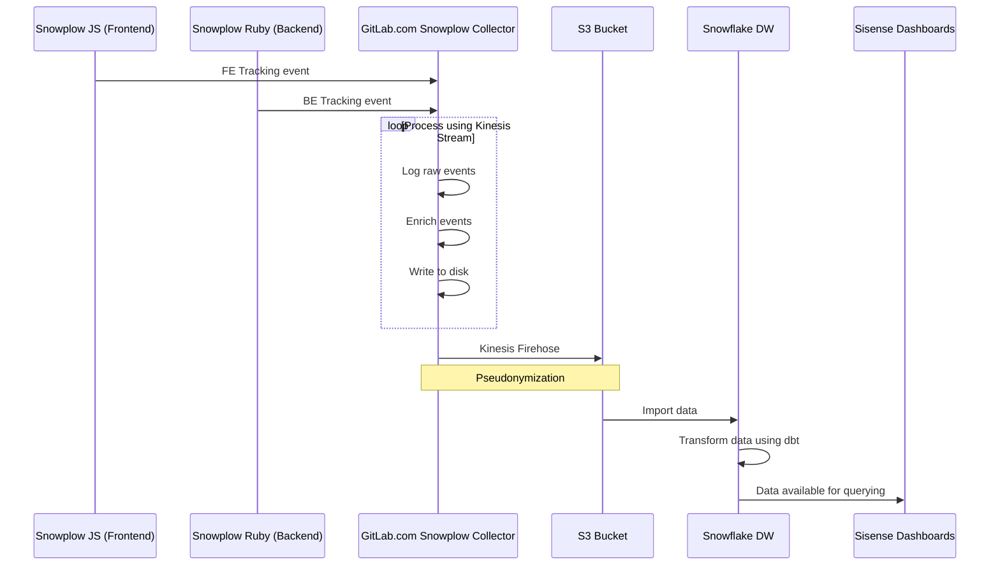

# Snowplow development guidelines

Snowplow is an enterprise-grade marketing and Product Intelligence platform that tracks how users engage with our website and application.

[Snowplow](https://snowplow.io/) consists of several loosely-coupled sub-systems:

- **Trackers** fire Snowplow events. Snowplow has twelve trackers that cover web, mobile, desktop, server, and IoT.
- **Collectors** receive Snowplow events from trackers. We use different event collectors that synchronize events to Amazon S3, Apache Kafka, or Amazon Kinesis.
- **Enrich** cleans raw Snowplow events, enriches them, and puts them into storage. There is a Hadoop-based enrichment process, and a Kinesis-based or Kafka-based process.
- **Storage** stores Snowplow events. We store the Snowplow events in a flat file structure on S3, and in the Redshift and PostgreSQL databases.
- **Data modeling** joins event-level data with other data sets, aggregates them into smaller data sets, and applies business logic. This produces a clean set of tables for data analysis. We use data models for Redshift and Looker.
- **Analytics** are performed on Snowplow events or on aggregate tables.


## Enable Snowplow tracking

Tracking can be enabled at:

- The instance level, which enables tracking on both the frontend and backend layers.
- The user level. User tracking can be disabled on a per user basis.
  GitLab respects the [Do Not Track](https://www.eff.org/issues/do-not-track) standard, so any user who has enabled the Do Not Track option in their browser is not tracked at a user level.

Snowplow tracking is configured to send data for GitLab.com to a collector configured by GitLab. By default, self-managed
instances do not have a collector configured and do not collect data via Snowplow.

You can configure your self-managed GitLab instance to use a custom Snowplow collector.

1. On the top bar, select **Main menu > Admin**, then select **Settings > General**.
   Alternatively, go to `admin/application_settings/general` in your browser.

1. Expand **Snowplow**.

1. Select **Enable Snowplow tracking** and enter your Snowplow configuration information. For example:

   | Name               | Value                         |
   |--------------------|-------------------------------|
   | Collector hostname | `your-snowplow-collector.net` |
   | App ID             | `gitlab`                      |
   | Cookie domain      | `.your-gitlab-instance.com`   |

1. Select **Save changes**.

## Snowplow request flow

The following example shows a basic request/response flow between the following components:

- Snowplow JS / Ruby Trackers on GitLab.com
- [GitLab.com Snowplow Collector](https://gitlab.com/gitlab-com/gl-infra/readiness/-/blob/master/library/snowplow/index.md)
- The GitLab S3 Bucket
- The GitLab Snowflake Data Warehouse
- Sisense:



For more details about the architecture, see [Snowplow infrastructure](infrastructure.md).

## Event schema

All the events must be consistent. If each feature captures events differently, it can be difficult
to perform analysis.

Each event provides attributes that describe the event.

| Attribute | Type    | Required | Description |
| --------- | ------- | -------- | ----------- |
| category  | text    | true     | The page or backend section of the application. Unless infeasible, use the Rails page attribute by default in the frontend, and namespace + class name on the backend, for example, `Notes::CreateService`. |
| action    | text    | true     | The action the user takes, or aspect that's being instrumented. The first word must describe the action or aspect. For example, clicks must be `click`, activations must be `activate`, creations must be `create`. Use underscores to describe what was acted on. For example, activating a form field is `activate_form_input`, an interface action like clicking on a dropdown list is `click_dropdown`, a behavior like creating a project record from the backend is `create_project`. |
| label     | text    | false    | The specific element or object to act on. This can be one of the following: the label of the element, for example, a tab labeled 'Create from template' for `create_from_template`; a unique identifier if no text is available, for example, `groups_dropdown_close` for closing the Groups dropdown list in the top bar; or the name or title attribute of a record being created. For Service Ping metrics adapted to Snowplow events, this should be the full metric [key path](../service_ping/metrics_dictionary.md#metric-key_path) taken from its definition file. |
| property  | text    | false    | Any additional property of the element, or object being acted on. For Service Ping metrics adapted to Snowplow events, this should be additional information or context that can help analyze the event. For example, in the case of `usage_activity_by_stage_monthly.create.merge_requests_users`, there are four different possible merge request actions: "create", "merge", "comment", and "close". Each of these would be a possible property value. |
| value     | decimal | false    | Describes a numeric value (decimal) directly related to the event. This could be the value of an input. For example, `10` when clicking `internal` visibility. |
| context   | vector  | false    | Additional data in the form of a [self-describing JSON](https://docs.snowplow.io/docs/pipeline-components-and-applications/iglu/common-architecture/self-describing-json-schemas/) to describe the event if the attributes are not sufficient. Each context must have its schema defined to assure data integrity. Refer to the list of GitLab-defined contexts for more details. |

### Examples

| Category* | Label            | Action                | Property** | Value |
|-------------|------------------|-----------------------|----------|:-----:|
| `[root:index]` | `main_navigation`            | `click_navigation_link` | `[link_label]`   | - |
| `[groups:boards:show]` | `toggle_swimlanes` | `click_toggle_button` | - | `[is_active]` |
| `[projects:registry:index]` | `registry_delete` | `click_button` | - | - |
| `[projects:registry:index]` | `registry_delete` | `confirm_deletion` | - | - |
| `[projects:blob:show]` | `congratulate_first_pipeline` | `click_button` | `[human_access]` | - |
| `[projects:clusters:new]` | `chart_options` | `generate_link` | `[chart_link]` | - |
| `[projects:clusters:new]` | `chart_options` | `click_add_label_button` | `[label_id]` | - |
| `API::NpmPackages` | `counts.package_events_i_package_push_package_by_deploy_token` | `push_package` | `npm` | - |

_* If you choose to omit the category you can use the default._<br>
_** Use property for variable strings._

### Reference SQL

#### Last 20 `reply_comment_button` events

```sql
SELECT
  session_id,
  event_id,
  event_label,
  event_action,
  event_property,
  event_value,
  event_category,
  contexts
FROM legacy.snowplow_structured_events_all
WHERE
  event_label = 'reply_comment_button'
  AND event_action = 'click_button'
  -- AND event_category = 'projects:issues:show'
  -- AND event_value = 1
ORDER BY collector_tstamp DESC
LIMIT 20
```

#### Last 100 page view events

```sql
SELECT
  -- page_url,
  -- page_title,
  -- referer_url,
  -- marketing_medium,
  -- marketing_source,
  -- marketing_campaign,
  -- browser_window_width,
  -- device_is_mobile
  *
FROM legacy.snowplow_page_views_30
ORDER BY page_view_start DESC
LIMIT 100
```

#### Top 20 users who fired `reply_comment_button` in the last 30 days

```sql
SELECT
  count(*) as hits,
  se_action,
  se_category,
  gsc_pseudonymized_user_id
FROM legacy.snowplow_gitlab_events_30
WHERE
  se_label = 'reply_comment_button'
  AND gsc_pseudonymized_user_id IS NOT NULL
GROUP BY gsc_pseudonymized_user_id, se_category, se_action
ORDER BY count(*) DESC
LIMIT 20
```

#### Query JSON formatted data

```sql
SELECT
  derived_tstamp,
  contexts:data[0]:data:extra:old_format as CURRENT_FORMAT,
  contexts:data[0]:data:extra:value as UPDATED_FORMAT
FROM legacy.snowplow_structured_events_all
WHERE event_action in ('wiki_format_updated')
ORDER BY derived_tstamp DESC
LIMIT 100
```

### Web-specific parameters

Snowplow JavaScript adds [web-specific parameters](https://docs.snowplow.io/docs/collecting-data/collecting-from-own-applications/snowplow-tracker-protocol/#Web-specific_parameters) to all web events by default.

## Related topics

- [Snowplow data structure](https://docs.snowplow.io/docs/understanding-your-pipeline/canonical-event/)
- [Our Iglu schema registry](https://gitlab.com/gitlab-org/iglu)
- [List of events used in our codebase (Event Dictionary)](https://metrics.gitlab.com/snowplow/)
- [Product Intelligence Guide](https://about.gitlab.com/handbook/product/product-intelligence-guide/)
- [Service Ping Guide](../service_ping/index.md)
- [Product Intelligence Direction](https://about.gitlab.com/direction/analytics/product-intelligence/)
- [Data Analysis Process](https://about.gitlab.com/handbook/business-technology/data-team/#data-analysis-process/)
- [Data for Product Managers](https://about.gitlab.com/handbook/business-technology/data-team/programs/data-for-product-managers/)
- [Data Infrastructure](https://about.gitlab.com/handbook/business-technology/data-team/platform/infrastructure/)
