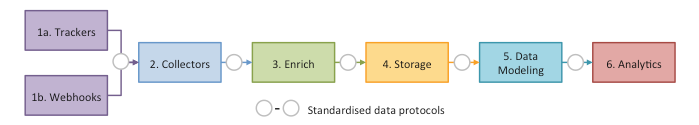
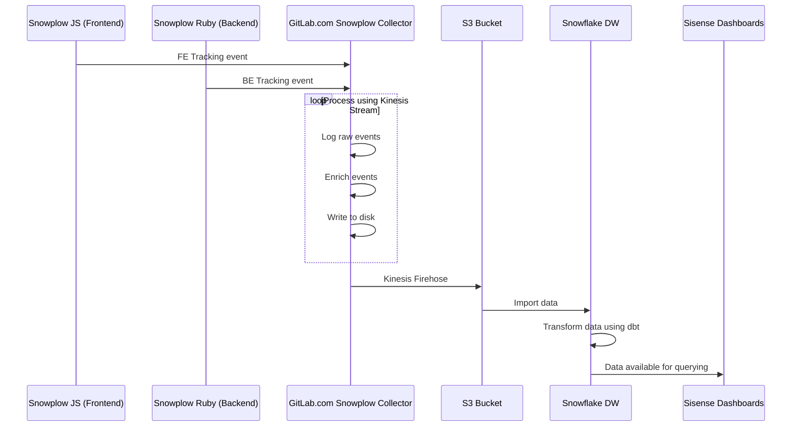

# Snowplow Guide

This guide provides an overview of how Snowplow works, and implementation details.

For more information about Product Intelligence, see:

- [Product Intelligence Guide](https://about.gitlab.com/handbook/product/product-intelligence-guide/)
- [Usage Ping Guide](../usage_ping/index.md)

More useful links:

- [Product Intelligence Direction](https://about.gitlab.com/direction/product-intelligence/)
- [Data Analysis Process](https://about.gitlab.com/handbook/business-technology/data-team/#data-analysis-process/)
- [Data for Product Managers](https://about.gitlab.com/handbook/business-technology/data-team/programs/data-for-product-managers/)
- [Data Infrastructure](https://about.gitlab.com/handbook/business-technology/data-team/platform/infrastructure/)

## What is Snowplow

Snowplow is an enterprise-grade marketing and Product Intelligence platform which helps track the way users engage with our website and application.

[Snowplow](https://snowplowanalytics.com) consists of the following loosely-coupled sub-systems:

- **Trackers** fire Snowplow events. Snowplow has 12 trackers, covering web, mobile, desktop, server, and IoT.
- **Collectors** receive Snowplow events from trackers. We have three different event collectors, synchronizing events either to Amazon S3, Apache Kafka, or Amazon Kinesis.
- **Enrich** cleans up the raw Snowplow events, enriches them and puts them into storage. We have an Hadoop-based enrichment process, and a Kinesis-based or Kafka-based process.
- **Storage** is where the Snowplow events live. We store the Snowplow events in a flat file structure on S3, and in the Redshift and PostgreSQL databases.
- **Data modeling** is where event-level data is joined with other data sets and aggregated into smaller data sets, and business logic is applied. This produces a clean set of tables which make it easier to perform analysis on the data. We have data models for Redshift and Looker.
- **Analytics** are performed on the Snowplow events or on the aggregate tables.



### Useful links

- [Understanding the structure of Snowplow data](https://docs.snowplowanalytics.com/docs/understanding-your-pipeline/canonical-event/)
- [Our Iglu schema registry](https://gitlab.com/gitlab-org/iglu)
- [List of events used in our codebase (Event Dictionary)](dictionary.md)

## Enable Snowplow tracking

Tracking can be enabled at:

- The instance level, which enables tracking on both the frontend and backend layers.
- The user level, though user tracking can be disabled on a per-user basis.
  GitLab respects the [Do Not Track](https://www.eff.org/issues/do-not-track) standard, so any user who has enabled the Do Not Track option in their browser is not tracked at a user level.

Snowplow tracking is enabled on GitLab.com, and we use it for most of our tracking strategy.

To enable Snowplow tracking on a self-managed instance:

1. On the top bar, select **Menu >** **{admin}** **Admin**, then select **Settings > General**.
   Alternatively, go to `admin/application_settings/general` in your browser.

1. Expand **Snowplow**.

1. Select **Enable Snowplow tracking** and enter your Snowplow configuration information. For example:

   | Name               | Value                         |
   |--------------------|-------------------------------|
   | Collector hostname | `your-snowplow-collector.net` |
   | App ID             | `gitlab`                      |
   | Cookie domain      | `.your-gitlab-instance.com`   |

1. Select **Save changes**.

## Snowplow request flow

The following example shows a basic request/response flow between the following components:

- Snowplow JS / Ruby Trackers on GitLab.com
- [GitLab.com Snowplow Collector](https://gitlab.com/gitlab-com/gl-infra/readiness/-/blob/master/library/snowplow/index.md)
- The GitLab S3 Bucket
- The GitLab Snowflake Data Warehouse
- Sisense:



## Structured event taxonomy

When adding new click events, we should add them in a way that's internally consistent. If we don't, it is very painful to perform analysis across features since each feature captures events differently.

The current method provides several attributes that are sent on each click event. Please try to follow these guidelines when specifying events to capture:

| attribute | type    | required | description |
| --------- | ------- | -------- | ----------- |
| category  | text    | true     | The page or backend area of the application. Unless infeasible, please use the Rails page attribute by default in the frontend, and namespace + class name on the backend. |
| action    | text    | true     | The action the user is taking, or aspect that's being instrumented. The first word should always describe the action or aspect: clicks should be `click`, activations should be `activate`, creations should be `create`, etc. Use underscores to describe what was acted on; for example, activating a form field would be `activate_form_input`. An interface action like clicking on a dropdown would be `click_dropdown`, while a behavior like creating a project record from the backend would be `create_project` |
| label     | text    | false    | The specific element, or object that's being acted on. This is either the label of the element (e.g. a tab labeled 'Create from template' may be `create_from_template`) or a unique identifier if no text is available (e.g. closing the Groups dropdown in the top navigation bar might be `groups_dropdown_close`), or it could be the name or title attribute of a record being created. |
| property  | text    | false    | Any additional property of the element, or object being acted on. |
| value     | decimal | false    | Describes a numeric value or something directly related to the event. This could be the value of an input (e.g. `10` when clicking `internal` visibility). |

### Examples

| category* | label            | action                | property** | value |
|-------------|------------------|-----------------------|----------|:-----:|
| `[root:index]` | `main_navigation`            | `click_navigation_link` | `[link_label]`   | - |
| `[groups:boards:show]` | `toggle_swimlanes` | `click_toggle_button` | - | `[is_active]` |
| `[projects:registry:index]` | `registry_delete` | `click_button` | - | - |
| `[projects:registry:index]` | `registry_delete` | `confirm_deletion` | - | - |
| `[projects:blob:show]` | `congratulate_first_pipeline` | `click_button` | `[human_access]` | - |
| `[projects:clusters:new]` | `chart_options` | `generate_link` | `[chart_link]` | - |
| `[projects:clusters:new]` | `chart_options` | `click_add_label_button` | `[label_id]` | - |

_* It's ok to omit the category, and use the default._<br>
_** Property is usually the best place for variable strings._

### Reference SQL

#### Last 20 `reply_comment_button` events

```sql
SELECT
  session_id,
  event_id,
  event_label,
  event_action,
  event_property,
  event_value,
  event_category,
  contexts
FROM legacy.snowplow_structured_events_all
WHERE
  event_label = 'reply_comment_button'
  AND event_action = 'click_button'
  -- AND event_category = 'projects:issues:show'
  -- AND event_value = 1
ORDER BY collector_tstamp DESC
LIMIT 20
```

### Web-specific parameters

Snowplow JS adds many [web-specific parameters](https://docs.snowplowanalytics.com/docs/collecting-data/collecting-from-own-applications/snowplow-tracker-protocol/#Web-specific_parameters) to all web events by default.

## Implementing Snowplow JS (Frontend) tracking

GitLab provides `Tracking`, an interface that wraps the [Snowplow JavaScript Tracker](https://docs.snowplowanalytics.com/docs/collecting-data/collecting-from-own-applications/javascript-trackers/) for tracking custom events. The simplest way to use it is to add `data-` attributes to clickable elements and dropdowns. There is also a Vue mixin (exposing a `track` method), and the static method `Tracking.event`. Each of these requires at minimum a `category` and an `action`. You can provide additional [Structured event taxonomy](#structured-event-taxonomy) properties along with an `extra` object that accepts key-value pairs.

| field      | type   | default value              | description                                                                                                                                                                                                    |
|:-----------|:-------|:---------------------------|:---------------------------------------------------------------------------------------------------------------------------------------------------------------------------------------------------------------|
| `category` | string | `document.body.dataset.page` | Page or subsection of a page that events are being captured within.                                                                                                                                            |
| `action`   | string | generic                  | Action the user is taking. Clicks should be `click` and activations should be `activate`, so for example, focusing a form field would be `activate_form_input`, and clicking a button would be `click_button`. |
| `data`     | object | `{}`                         | Additional data such as `label`, `property`, `value`, `context` (as described in our [Structured event taxonomy](#structured-event-taxonomy)), and `extra` (key-value pairs object). |

### Usage recommendations

- Use [data attributes](#tracking-with-data-attributes) on HTML elements that emits either the `click`, `show.bs.dropdown`, or `hide.bs.dropdown` events.
- Use the [Vue mixin](#tracking-within-vue-components) when tracking custom events, or if the supported events for data attributes are not propagating.
- Use the [Tracking class directly](#tracking-in-raw-javascript) when tracking on raw JS files.

### Tracking with data attributes

When working within HAML (or Vue templates) we can add `data-track-*` attributes to elements of interest. All elements that have a `data-track-action` attribute automatically have event tracking bound on clicks. You can provide extra data as a valid JSON string using `data-track-extra`.

Below is an example of `data-track-*` attributes assigned to a button:

```haml
%button.btn{ data: { track: { action: "click_button", label: "template_preview", property: "my-template" } } }
```

```html
<button class="btn"
  data-track-action="click_button"
  data-track-label="template_preview"
  data-track-property="my-template"
  data-track-extra='{ "template_variant": "primary" }'
/>
```

Event listeners are bound at the document level to handle click events on or within elements with these data attributes. This allows them to be properly handled on re-rendering and changes to the DOM. Note that because of the way these events are bound, click events should not be stopped from propagating up the DOM tree. If for any reason click events are being stopped from propagating, you need to implement your own listeners and follow the instructions in [Tracking within Vue components](#tracking-within-vue-components) or [Tracking in raw JavaScript](#tracking-in-raw-javascript).

Below is a list of supported `data-track-*` attributes:

| attribute             | required | description |
|:----------------------|:---------|:------------|
| `data-track-action`    | true     | Action the user is taking. Clicks must be prepended with `click` and activations must be prepended with `activate`. For example, focusing a form field would be `activate_form_input` and clicking a button would be `click_button`. Replaces `data-track-event`, which was [deprecated](https://gitlab.com/gitlab-org/gitlab/-/issues/290962) in GitLab 13.11. |
| `data-track-label`    | false    | The `label` as described in our [Structured event taxonomy](#structured-event-taxonomy). |
| `data-track-property` | false    | The `property` as described in our [Structured event taxonomy](#structured-event-taxonomy). |
| `data-track-value`    | false    | The `value` as described in our [Structured event taxonomy](#structured-event-taxonomy). If omitted, this is the element's `value` property or `undefined`. For checkboxes, the default value is the element's checked attribute or `0` when unchecked. |
| `data-track-extra` | false    | A key-value pairs object passed as a valid JSON string. This is added to the `extra` property in our [`gitlab_standard`](#gitlab_standard) schema. |
| `data-track-context`  | false    | The `context` as described in our [Structured event taxonomy](#structured-event-taxonomy). |

#### Available helpers

```ruby
tracking_attrs(label, action, property) # { data: { track_label... } }

%button{ **tracking_attrs('main_navigation', 'click_button', 'navigation') }
```

#### Caveats

When using the GitLab helper method [`nav_link`](https://gitlab.com/gitlab-org/gitlab/-/blob/master/app/helpers/tab_helper.rb#L76) be sure to wrap `html_options` under the `html_options` keyword argument.
Be careful, as this behavior can be confused with the `ActionView` helper method [`link_to`](https://api.rubyonrails.org/v5.2.3/classes/ActionView/Helpers/UrlHelper.html#method-i-link_to) that does not require additional wrapping of `html_options`

```ruby
# Bad
= nav_link(controller: ['dashboard/groups', 'explore/groups'], data: { track_label: "explore_groups", track_action: "click_button" })

# Good
= nav_link(controller: ['dashboard/groups', 'explore/groups'], html_options: { data: { track_label: "explore_groups", track_action: "click_button" } })

# Good (other helpers)
= link_to explore_groups_path, title: _("Explore"), data: { track_label: "explore_groups", track_action: "click_button" }
```

### Tracking within Vue components

There's a tracking Vue mixin that can be used in components if more complex tracking is required. To use it, first import the `Tracking` library and request a mixin.

```javascript
import Tracking from '~/tracking';
const trackingMixin = Tracking.mixin({ label: 'right_sidebar' });
```

You can provide default options that are passed along whenever an event is tracked from within your component. For instance, if all events within a component should be tracked with a given `label`, you can provide one at this time. Available defaults are `category`, `label`, `property`, and `value`. If no category is specified, `document.body.dataset.page` is used as the default.

You can then use the mixin normally in your component with the `mixin` Vue declaration. The mixin also provides the ability to specify tracking options in `data` or `computed`. These override any defaults and allow the values to be dynamic from props, or based on state.

```javascript
export default {
  mixins: [trackingMixin],
  // ...[component implementation]...
  data() {
    return {
      expanded: false,
      tracking: {
        label: 'left_sidebar',
      },
    };
  },
};
```

The mixin provides a `track` method that can be called within the template,
or from component methods. An example of the whole implementation might look like this:

```javascript
export default {
  name: 'RightSidebar',
  mixins: [Tracking.mixin({ label: 'right_sidebar' })],
  data() {
    return {
      expanded: false,
    };
  },
  methods: {
    toggle() {
      this.expanded = !this.expanded;
      // Additional data will be merged, like `value` below
      this.track('click_toggle', { value: Number(this.expanded) });
    }
  }
};
```

The event data can be provided with a `tracking` object, declared in the `data` function,
or as a `computed property`.

```javascript
export default {
  name: 'RightSidebar',
  mixins: [Tracking.mixin()],
  data() {
    return {
      tracking: {
        label: 'right_sidebar',
        // category: '',
        // property: '',
        // value: '',
        // extra: {},
      },
    };
  },
};
```

The event data can be provided directly in the `track` function as well.
This object will merge with any previously provided options.

```javascript
this.track('click_button', {
  label: 'right_sidebar',
});
```

Lastly, if needed within the template, you can use the `track` method directly as well.

```html
<template>
  <div>
    <button data-testid="toggle" @click="toggle">Toggle</button>

    <div v-if="expanded">
      <p>Hello world!</p>
      <button @click="track('click_action')">Track another event</button>
    </div>
  </div>
</template>
```

#### Testing example

```javascript
import { mockTracking } from 'helpers/tracking_helper';
// mockTracking(category, documentOverride, spyMethod)

describe('RightSidebar.vue', () => {
  let trackingSpy;
  let wrapper;

  beforeEach(() => {
    trackingSpy = mockTracking(undefined, wrapper.element, jest.spyOn);
  });

  const findToggle = () => wrapper.find('[data-testid="toggle"]');

  it('tracks turning off toggle', () => {
    findToggle().trigger('click');

    expect(trackingSpy).toHaveBeenCalledWith(undefined, 'click_toggle', {
      label: 'right_sidebar',
      value: 0,
    });
  });
});
```

### Tracking in raw JavaScript

Custom event tracking and instrumentation can be added by directly calling the `Tracking.event` static function. The following example demonstrates tracking a click on a button by calling `Tracking.event` manually.

```javascript
import Tracking from '~/tracking';

const button = document.getElementById('create_from_template_button');

button.addEventListener('click', () => {
  Tracking.event('dashboard:projects:index', 'click_button', {
    label: 'create_from_template',
    property: 'template_preview',
    extra: {
      templateVariant: 'primary',
      valid: 1,
    },
  });
});
```

#### Testing example

```javascript
import Tracking from '~/tracking';

describe('MyTracking', () => {
  let wrapper;

  beforeEach(() => {
    jest.spyOn(Tracking, 'event');
  });

  const findButton = () => wrapper.find('[data-testid="create_from_template"]');

  it('tracks event', () => {
    findButton().trigger('click');

    expect(Tracking.event).toHaveBeenCalledWith(undefined, 'click_button', {
      label: 'create_from_template',
      property: 'template_preview',
      extra: {
        templateVariant: 'primary',
        valid: true,
      },
    });
  });
});
```

### Form tracking

You can enable Snowplow automatic [form tracking](https://docs.snowplowanalytics.com/docs/collecting-data/collecting-from-own-applications/javascript-trackers/javascript-tracker/javascript-tracker-v2/tracking-specific-events/#form-tracking) by calling `Tracking.enableFormTracking` (after the DOM is ready) and providing a `config` object that includes at least one of the following elements:

- `forms`: determines which forms are tracked, and are identified by the CSS class name.
- `fields`: determines which fields inside the tracked forms are tracked, and are identified by the field `name`.

An optional list of contexts can be provided as the second argument.
Note that our [`gitlab_standard`](#gitlab_standard) schema is excluded from these events.

```javascript
Tracking.enableFormTracking({
  forms: { allow: ['sign-in-form', 'password-recovery-form'] },
  fields: { allow: ['terms_and_conditions', 'newsletter_agreement'] },
});
```

#### Testing example

```javascript
import Tracking from '~/tracking';

describe('MyFormTracking', () => {
  let formTrackingSpy;

  beforeEach(() => {
    formTrackingSpy = jest
      .spyOn(Tracking, 'enableFormTracking')
      .mockImplementation(() => null);
  });

  it('initialized with the correct configuration', () => {
    expect(formTrackingSpy).toHaveBeenCalledWith({
      forms: { allow: ['sign-in-form', 'password-recovery-form'] },
      fields: { allow: ['terms_and_conditions', 'newsletter_agreement'] },
    });
  });
});
```

## Implementing Snowplow Ruby (Backend) tracking

GitLab provides `Gitlab::Tracking`, an interface that wraps the [Snowplow Ruby Tracker](https://docs.snowplowanalytics.com/docs/collecting-data/collecting-from-own-applications/ruby-tracker/) for tracking custom events.

Custom event tracking and instrumentation can be added by directly calling the `GitLab::Tracking.event` class method, which accepts the following arguments:

| argument   | type                      | default value | description                                                                                                                       |
|------------|---------------------------|---------------|-----------------------------------------------------------------------------------------------------------------------------------|
| `category` | String                    |               | Area or aspect of the application. This could be `HealthCheckController` or `Lfs::FileTransformer` for instance.                  |
| `action`   | String                    |               | The action being taken, which can be anything from a controller action like `create` to something like an Active Record callback. |
| `label`    | String                    | nil           | As described in [Structured event taxonomy](#structured-event-taxonomy).                                                          |
| `property` | String                    | nil           | As described in [Structured event taxonomy](#structured-event-taxonomy).                                                          |
| `value`    | Numeric                   | nil           | As described in [Structured event taxonomy](#structured-event-taxonomy).                                                          |
| `context`  | Array\[SelfDescribingJSON\] | nil           | An array of custom contexts to send with this event. Most events should not have any custom contexts.                             |
| `project`  | Project                   | nil           | The project associated with the event. |
| `user`     | User                      | nil           | The user associated with the event. |
| `namespace` | Namespace                | nil           | The namespace associated with the event. |
| `extra`   | Hash                | `{}`         | Additional keyword arguments are collected into a hash and sent with the event. |

Tracking can be viewed as either tracking user behavior, or can be used for instrumentation to monitor and visualize performance over time in an area or aspect of code.

For example:

```ruby
class Projects::CreateService < BaseService
  def execute
    project = Project.create(params)

    Gitlab::Tracking.event('Projects::CreateService', 'create_project', label: project.errors.full_messages.to_sentence,
                           property: project.valid?.to_s, project: project, user: current_user, namespace: namespace)
  end
end
```

### Unit testing

Use the `expect_snowplow_event` helper when testing backend Snowplow events. See [testing best practices](
https://docs.gitlab.com/ee/development/testing_guide/best_practices.html#test-snowplow-events) for details.

### Performance

We use the [AsyncEmitter](https://docs.snowplowanalytics.com/docs/collecting-data/collecting-from-own-applications/ruby-tracker//emitters/#the-asyncemitter-class) when tracking events, which allows for instrumentation calls to be run in a background thread. This is still an active area of development.

## Developing and testing Snowplow

There are several tools for developing and testing Snowplow Event

| Testing Tool                                 | Frontend Tracking  | Backend Tracking    | Local Development Environment | Production Environment | Production Environment |
|----------------------------------------------|--------------------|---------------------|-------------------------------|------------------------|------------------------|
| Snowplow Analytics Debugger Chrome Extension | **{check-circle}** | **{dotted-circle}** | **{check-circle}**            | **{check-circle}**     | **{check-circle}**     |
| Snowplow Inspector Chrome Extension          | **{check-circle}** | **{dotted-circle}** | **{check-circle}**            | **{check-circle}**     | **{check-circle}**     |
| Snowplow Micro                               | **{check-circle}** | **{check-circle}**  | **{check-circle}**            | **{dotted-circle}**    | **{dotted-circle}**    |
| Snowplow Mini                                | **{check-circle}** | **{check-circle}**  | **{dotted-circle}**           | **{status_preparing}** | **{status_preparing}** |

**Legend**

**{check-circle}** Available, **{status_preparing}** In progress, **{dotted-circle}** Not Planned

### Test frontend events

To test frontend events in development:

- [Enable Snowplow tracking in the Admin Area](#enable-snowplow-tracking).
- Turn off any ad blockers that would prevent Snowplow JS from loading in your environment.
- Turn off "Do Not Track" (DNT) in your browser.

#### Snowplow Analytics Debugger Chrome Extension

Snowplow Analytics Debugger is a browser extension for testing frontend events. This works on production, staging and local development environments.

1. Install the [Snowplow Analytics Debugger](https://chrome.google.com/webstore/detail/snowplow-analytics-debugg/jbnlcgeengmijcghameodeaenefieedm) Chrome browser extension.
1. Open Chrome DevTools to the Snowplow Analytics Debugger tab.
1. Learn more at [Igloo Analytics](https://www.iglooanalytics.com/blog/snowplow-analytics-debugger-chrome-extension.html).

#### Snowplow Inspector Chrome Extension

Snowplow Inspector Chrome Extension is a browser extension for testing frontend events. This works on production, staging and local development environments.

1. Install [Snowplow Inspector](https://chrome.google.com/webstore/detail/snowplow-inspector/maplkdomeamdlngconidoefjpogkmljm?hl=en).
1. Open the Chrome extension by pressing the Snowplow Inspector icon beside the address bar.
1. Click around on a webpage with Snowplow and you should see JavaScript events firing in the inspector window.

### Snowplow Micro

Snowplow Micro is a very small version of a full Snowplow data collection pipeline: small enough that it can be launched by a test suite. Events can be recorded into Snowplow Micro just as they can a full Snowplow pipeline. Micro then exposes an API that can be queried.

Snowplow Micro is a Docker-based solution for testing frontend and backend events in a local development environment. You need to modify GDK using the instructions below to set this up.

- Read [Introducing Snowplow Micro](https://snowplowanalytics.com/blog/2019/07/17/introducing-snowplow-micro/)
- Look at the [Snowplow Micro repository](https://github.com/snowplow-incubator/snowplow-micro)
- Watch our <i class="fa fa-youtube-play youtube" aria-hidden="true"></i> [installation guide recording](https://www.youtube.com/watch?v=OX46fo_A0Ag)

1. Ensure Docker is installed and running.

1. Install [Snowplow Micro](https://github.com/snowplow-incubator/snowplow-micro) by cloning the settings in [this project](https://gitlab.com/gitlab-org/snowplow-micro-configuration):
1. Navigate to the directory with the cloned project, and start the appropriate Docker
   container with the following script:

   ```shell
   ./snowplow-micro.sh
   ```

1. Update your instance's settings to enable Snowplow events and point to the Snowplow Micro collector:

   ```shell
   gdk psql -d gitlabhq_development
   update application_settings set snowplow_collector_hostname='localhost:9090', snowplow_enabled=true, snowplow_cookie_domain='.gitlab.com';
   ```

1. Update `DEFAULT_SNOWPLOW_OPTIONS` in `app/assets/javascripts/tracking/index.js` to remove `forceSecureTracker: true`:

   ```diff
   diff --git a/app/assets/javascripts/tracking/index.js b/app/assets/javascripts/tracking/index.js
   index 0a1211d0a76..3b98c8f28f2 100644
   --- a/app/assets/javascripts/tracking/index.js
   +++ b/app/assets/javascripts/tracking/index.js
   @@ -7,7 +7,6 @@ const DEFAULT_SNOWPLOW_OPTIONS = {
      appId: '',
      userFingerprint: false,
      respectDoNotTrack: true,
   -  forceSecureTracker: true,
      eventMethod: 'post',
      contexts: { webPage: true, performanceTiming: true },
      formTracking: false,

   ```

1. Update `snowplow_options` in `lib/gitlab/tracking.rb` to add `protocol` and `port`:

   ```diff
   diff --git a/lib/gitlab/tracking.rb b/lib/gitlab/tracking.rb
   index 618e359211b..e9084623c43 100644
   --- a/lib/gitlab/tracking.rb
   +++ b/lib/gitlab/tracking.rb
   @@ -41,7 +41,9 @@ def snowplow_options(group)
              cookie_domain: Gitlab::CurrentSettings.snowplow_cookie_domain,
              app_id: Gitlab::CurrentSettings.snowplow_app_id,
              form_tracking: additional_features,
   -          link_click_tracking: additional_features
   +          link_click_tracking: additional_features,
   +          protocol: 'http',
   +          port: 9090
            }.transform_keys! { |key| key.to_s.camelize(:lower).to_sym }
          end
   ```

1. Update `emitter` in `lib/gitlab/tracking/destinations/snowplow.rb` to change `protocol`:

   ```diff
   diff --git a/lib/gitlab/tracking/destinations/snowplow.rb b/lib/gitlab/tracking/destinations/snowplow.rb
   index 4fa844de325..5dd9d0eacfb 100644
   --- a/lib/gitlab/tracking/destinations/snowplow.rb
   +++ b/lib/gitlab/tracking/destinations/snowplow.rb
   @@ -40,7 +40,7 @@ def tracker
            def emitter
              SnowplowTracker::AsyncEmitter.new(
                Gitlab::CurrentSettings.snowplow_collector_hostname,
   -            protocol: 'https'
   +            protocol: 'http'
              )
            end
          end

   ```

1. Restart GDK:

   ```shell
   `gdk restart`
   ```

1. Send a test Snowplow event from the Rails console:

   ```ruby
   Gitlab::Tracking.event('category', 'action')
   ```

1. Navigate to `localhost:9090/micro/good` to see the event.

### Snowplow Mini

[Snowplow Mini](https://github.com/snowplow/snowplow-mini) is an easily-deployable, single-instance version of Snowplow.

Snowplow Mini can be used for testing frontend and backend events on a production, staging and local development environment.

For GitLab.com, we're setting up a [QA and Testing environment](https://gitlab.com/gitlab-org/telemetry/-/issues/266) using Snowplow Mini.

### Troubleshooting

To control content security policy warnings when using an external host, you can allow or disallow them by modifying `config/gitlab.yml`. To allow them, add the relevant host for `connect_src`. For example, for `https://snowplow.trx.gitlab.net`:

```yaml
development:
  <<: *base
  gitlab:
    content_security_policy:
      enabled: true
      directives:
        connect_src: "'self' http://localhost:* http://127.0.0.1:* ws://localhost:* wss://localhost:* ws://127.0.0.1:* https://snowplow.trx.gitlab.net/"
```

## Snowplow Schemas

### `gitlab_standard`

We are including the [`gitlab_standard` schema](https://gitlab.com/gitlab-org/iglu/-/blob/master/public/schemas/com.gitlab/gitlab_standard/jsonschema/) with every event. See [Standardize Snowplow Schema](https://gitlab.com/groups/gitlab-org/-/epics/5218) for details.

The [`StandardContext`](https://gitlab.com/gitlab-org/gitlab/-/blob/master/lib/gitlab/tracking/standard_context.rb) class represents this schema in the application.

| Field Name     | Required            | Type                  | Description                                                                                 |
|----------------|---------------------|-----------------------|---------------------------------------------------------------------------------------------|
| `project_id`   | **{dotted-circle}** | integer               |                                                                 |
| `namespace_id` | **{dotted-circle}** | integer               |                                                               |
| `environment`  | **{check-circle}**  | string (max 32 chars) | Name of the source environment, such as `production` or `staging`             |
| `source`       | **{check-circle}**  | string (max 32 chars) | Name of the source application, such as  `gitlab-rails` or `gitlab-javascript` |
| `plan`         | **{dotted-circle}**  | string (max 32 chars) | Name of the plan for the namespace, such as `free`, `premium`, or `ultimate`. Automatically picked from the `namespace`. |
| `extra`        | **{dotted-circle}**  | JSON                  | Any additional data associated with the event, in the form of key-value pairs |

### Default Schema

| Field Name               | Required            | Type      | Description                                                                                                                      |
|--------------------------|---------------------|-----------|----------------------------------------------------------------------------------------------------------------------------------|
| `app_id`                   | **{check-circle}**  | string    | Unique identifier for website / application                                                                                      |
| `base_currency`            | **{dotted-circle}** | string    | Reporting currency                                                                                                               |
| `br_colordepth`            | **{dotted-circle}** | integer   | Browser color depth                                                                                                              |
| `br_cookies`               | **{dotted-circle}** | boolean   | Does the browser permit cookies?                                                                                                 |
| `br_family`                | **{dotted-circle}** | string    | Browser family                                                                                                                   |
| `br_features_director`     | **{dotted-circle}** | boolean   | Director plugin installed?                                                                                                       |
| `br_features_flash`        | **{dotted-circle}** | boolean   | Flash plugin installed?                                                                                                          |
| `br_features_gears`        | **{dotted-circle}** | boolean   | Google gears installed?                                                                                                          |
| `br_features_java`         | **{dotted-circle}** | boolean   | Java plugin installed?                                                                                                           |
| `br_features_pdf`          | **{dotted-circle}** | boolean   | Adobe PDF plugin installed?                                                                                                      |
| `br_features_quicktime`    | **{dotted-circle}** | boolean   | Quicktime plugin installed?                                                                                                      |
| `br_features_realplayer`   | **{dotted-circle}** | boolean   | RealPlayer plugin installed?                                                                                                     |
| `br_features_silverlight`  | **{dotted-circle}** | boolean   | Silverlight plugin installed?                                                                                                    |
| `br_features_windowsmedia` | **{dotted-circle}** | boolean   | Windows media plugin installed?                                                                                                  |
| `br_lang`                  | **{dotted-circle}** | string    | Language the browser is set to                                                                                                   |
| `br_name`                  | **{dotted-circle}** | string    | Browser name                                                                                                                     |
| `br_renderengine`          | **{dotted-circle}** | string    | Browser rendering engine                                                                                                         |
| `br_type`                  | **{dotted-circle}** | string    | Browser type                                                                                                                     |
| `br_version`               | **{dotted-circle}** | string    | Browser version                                                                                                                  |
| `br_viewheight`            | **{dotted-circle}** | string    | Browser viewport height                                                                                                          |
| `br_viewwidth`             | **{dotted-circle}** | string    | Browser viewport width                                                                                                           |
| `collector_tstamp`         | **{dotted-circle}** | timestamp | Time stamp for the event recorded by the collector                                                                               |
| `contexts`                 | **{dotted-circle}** |           |                                                                                                                                  |
| `derived_contexts`         | **{dotted-circle}** |           | Contexts derived in the Enrich process                                                                                           |
| `derived_tstamp`           | **{dotted-circle}** | timestamp | Timestamp making allowance for inaccurate device clock                                                                          |
| `doc_charset`              | **{dotted-circle}** | string    | Web page's character encoding                                                                                                    |
| `doc_height`               | **{dotted-circle}** | string    | Web page height                                                                                                                  |
| `doc_width`                | **{dotted-circle}** | string    | Web page width                                                                                                                   |
| `domain_sessionid`         | **{dotted-circle}** | string    | Unique identifier (UUID) for this visit of this user_id to this domain                                                           |
| `domain_sessionidx`        | **{dotted-circle}** | integer   | Index of number of visits that this user_id has made to this domain (The first visit is `1`)                                        |
| `domain_userid`            | **{dotted-circle}** | string    | Unique identifier for a user, based on a first party cookie (so domain specific)                                                 |
| `dvce_created_tstamp`      | **{dotted-circle}** | timestamp | Timestamp when event occurred, as recorded by client device                                                                      |
| `dvce_ismobile`            | **{dotted-circle}** | boolean   | Indicates whether device is mobile                                                                                               |
| `dvce_screenheight`        | **{dotted-circle}** | string    | Screen / monitor resolution                                                                                                      |
| `dvce_screenwidth`         | **{dotted-circle}** | string    | Screen / monitor resolution                                                                                                      |
| `dvce_sent_tstamp`         | **{dotted-circle}** | timestamp | Timestamp when event was sent by client device to collector                                                                      |
| `dvce_type`                | **{dotted-circle}** | string    | Type of device                                                                                                                   |
| `etl_tags`                 | **{dotted-circle}** | string    | JSON of tags for this ETL run                                                                                                    |
| `etl_tstamp`               | **{dotted-circle}** | timestamp | Timestamp event began ETL                                                                                                        |
| `event`                    | **{dotted-circle}** | string    | Event type                                                                                                                       |
| `event_fingerprint`        | **{dotted-circle}** | string    | Hash client-set event fields                                                                                                     |
| `event_format`             | **{dotted-circle}** | string    | Format for event                                                                                                                 |
| `event_id`                 | **{dotted-circle}** | string    | Event UUID                                                                                                                       |
| `event_name`               | **{dotted-circle}** | string    | Event name                                                                                                                       |
| `event_vendor`             | **{dotted-circle}** | string    | The company who developed the event model                                                                                        |
| `event_version`            | **{dotted-circle}** | string    | Version of event schema                                                                                                          |
| `geo_city`                 | **{dotted-circle}** | string    | City of IP origin                                                                                                                |
| `geo_country`              | **{dotted-circle}** | string    | Country of IP origin                                                                                                             |
| `geo_latitude`             | **{dotted-circle}** | string    | An approximate latitude                                                                                                          |
| `geo_longitude`            | **{dotted-circle}** | string    | An approximate longitude                                                                                                         |
| `geo_region`               | **{dotted-circle}** | string    | Region of IP origin                                                                                                              |
| `geo_region_name`          | **{dotted-circle}** | string    | Region of IP origin                                                                                                              |
| `geo_timezone`             | **{dotted-circle}** | string    | Timezone of IP origin                                                                                                            |
| `geo_zipcode`              | **{dotted-circle}** | string    | Zip (postal) code of IP origin                                                                                                   |
| `ip_domain`                | **{dotted-circle}** | string    | Second level domain name associated with the visitor's IP address                                                                |
| `ip_isp`                   | **{dotted-circle}** | string    | Visitor's ISP                                                                                                                    |
| `ip_netspeed`              | **{dotted-circle}** | string    | Visitor's connection type                                                                                                        |
| `ip_organization`          | **{dotted-circle}** | string    | Organization associated with the visitor's IP address – defaults to ISP name if none is found                                    |
| `mkt_campaign`             | **{dotted-circle}** | string    | The campaign ID                                                                                                                  |
| `mkt_clickid`              | **{dotted-circle}** | string    | The click ID                                                                                                                     |
| `mkt_content`              | **{dotted-circle}** | string    | The content or ID of the ad.                                                                   |
| `mkt_medium`               | **{dotted-circle}** | string    | Type of traffic source                                                                                                           |
| `mkt_network`              | **{dotted-circle}** | string    | The ad network to which the click ID belongs                                                                                     |
| `mkt_source`               | **{dotted-circle}** | string    | The company / website where the traffic came from                                                                                |
| `mkt_term`                 | **{dotted-circle}** | string    | Keywords associated with the referrer                                                                                        |
| `name_tracker`             | **{dotted-circle}** | string    | The tracker namespace                                                                                                            |
| `network_userid`           | **{dotted-circle}** | string    | Unique identifier for a user, based on a cookie from the collector (so set at a network level and shouldn't be set by a tracker) |
| `os_family`                | **{dotted-circle}** | string    | Operating system family                                                                                                          |
| `os_manufacturer`          | **{dotted-circle}** | string    | Manufacturers of operating system                                                                                                |
| `os_name`                  | **{dotted-circle}** | string    | Name of operating system                                                                                                         |
| `os_timezone`              | **{dotted-circle}** | string    | Client operating system timezone                                                                                                 |
| `page_referrer`            | **{dotted-circle}** | string    | Referrer URL                                                                                                                     |
| `page_title`               | **{dotted-circle}** | string    | Page title                                                                                                                       |
| `page_url`                 | **{dotted-circle}** | string    | Page URL                                                                                                                         |
| `page_urlfragment`         | **{dotted-circle}** | string    | Fragment aka anchor                                                                                                              |
| `page_urlhost`             | **{dotted-circle}** | string    | Host aka domain                                                                                                                  |
| `page_urlpath`             | **{dotted-circle}** | string    | Path to page                                                                                                                     |
| `page_urlport`             | **{dotted-circle}** | integer   | Port if specified, 80 if not                                                                                                     |
| `page_urlquery`            | **{dotted-circle}** | string    | Query string                                                                                                                      |
| `page_urlscheme`           | **{dotted-circle}** | string    | Scheme (protocol name)                                                                                                              |
| `platform`                 | **{dotted-circle}** | string    | The platform the app runs on                                                                                                     |
| `pp_xoffset_max`           | **{dotted-circle}** | integer   | Maximum page x offset seen in the last ping period                                                                               |
| `pp_xoffset_min`           | **{dotted-circle}** | integer   | Minimum page x offset seen in the last ping period                                                                               |
| `pp_yoffset_max`           | **{dotted-circle}** | integer   | Maximum page y offset seen in the last ping period                                                                               |
| `pp_yoffset_min`           | **{dotted-circle}** | integer   | Minimum page y offset seen in the last ping period                                                                               |
| `refr_domain_userid`       | **{dotted-circle}** | string    | The Snowplow `domain_userid` of the referring website                                                                              |
| `refr_dvce_tstamp`         | **{dotted-circle}** | timestamp | The time of attaching the `domain_userid` to the inbound link                                                                      |
| `refr_medium`              | **{dotted-circle}** | string    | Type of referer                                                                                                                  |
| `refr_source`              | **{dotted-circle}** | string    | Name of referer if recognised                                                                                                    |
| `refr_term`                | **{dotted-circle}** | string    | Keywords if source is a search engine                                                                                            |
| `refr_urlfragment`         | **{dotted-circle}** | string    | Referer URL fragment                                                                                                             |
| `refr_urlhost`             | **{dotted-circle}** | string    | Referer host                                                                                                                     |
| `refr_urlpath`             | **{dotted-circle}** | string    | Referer page path                                                                                                                |
| `refr_urlport`             | **{dotted-circle}** | integer   | Referer port                                                                                                                     |
| `refr_urlquery`            | **{dotted-circle}** | string    | Referer URL query string                                                                                                          |
| `refr_urlscheme`           | **{dotted-circle}** | string    | Referer scheme                                                                                                                   |
| `se_action`                | **{dotted-circle}** | string    | The action / event itself                                                                                                        |
| `se_category`              | **{dotted-circle}** | string    | The category of event                                                                                                            |
| `se_label`                 | **{dotted-circle}** | string    | A label often used to refer to the 'object' the action is performed on                                                           |
| `se_property`              | **{dotted-circle}** | string    | A property associated with either the action or the object                                                                       |
| `se_value`                 | **{dotted-circle}** | decimal   | A value associated with the user action                                                                                          |
| `ti_category`              | **{dotted-circle}** | string    | Item category                                                                                                                    |
| `ti_currency`              | **{dotted-circle}** | string    | Currency                                                                                                                         |
| `ti_name`                  | **{dotted-circle}** | string    | Item name                                                                                                                        |
| `ti_orderid`               | **{dotted-circle}** | string    | Order ID                                                                                                                         |
| `ti_price`                 | **{dotted-circle}** | decimal   | Item price                                                                                                                       |
| `ti_price_base`            | **{dotted-circle}** | decimal   | Item price in base currency                                                                                                      |
| `ti_quantity`              | **{dotted-circle}** | integer   | Item quantity                                                                                                                    |
| `ti_sku`                   | **{dotted-circle}** | string    | Item SKU                                                                                                                         |
| `tr_affiliation`           | **{dotted-circle}** | string    | Transaction affiliation (such as channel)                                                                                           |
| `tr_city`                  | **{dotted-circle}** | string    | Delivery address: city                                                                                                           |
| `tr_country`               | **{dotted-circle}** | string    | Delivery address: country                                                                                                        |
| `tr_currency`              | **{dotted-circle}** | string    | Transaction Currency                                                                                                             |
| `tr_orderid`               | **{dotted-circle}** | string    | Order ID                                                                                                                         |
| `tr_shipping`              | **{dotted-circle}** | decimal   | Delivery cost charged                                                                                                            |
| `tr_shipping_base`         | **{dotted-circle}** | decimal   | Shipping cost in base currency                                                                                                   |
| `tr_state`                 | **{dotted-circle}** | string    | Delivery address: state                                                                                                          |
| `tr_tax`                   | **{dotted-circle}** | decimal   | Transaction tax value (such as amount of VAT included)                                                                              |
| `tr_tax_base`              | **{dotted-circle}** | decimal   | Tax applied in base currency                                                                                                     |
| `tr_total`                 | **{dotted-circle}** | decimal   | Transaction total value                                                                                                          |
| `tr_total_base`            | **{dotted-circle}** | decimal   | Total amount of transaction in base currency                                                                                     |
| `true_tstamp`              | **{dotted-circle}** | timestamp | User-set exact timestamp                                                                                                         |
| `txn_id`                   | **{dotted-circle}** | string    | Transaction ID                                                                                                                   |
| `unstruct_event`           | **{dotted-circle}** | JSON      | The properties of the event                                                                                                      |
| `uploaded_at`              | **{dotted-circle}** |           |                                                                                                                                  |
| `user_fingerprint`         | **{dotted-circle}** | integer   | User identifier based on (hopefully unique) browser features                                                                     |
| `user_id`                  | **{dotted-circle}** | string    | Unique identifier for user, set by the business using setUserId                                                                  |
| `user_ipaddress`           | **{dotted-circle}** | string    | IP address                                                                                                                       |
| `useragent`                | **{dotted-circle}** | string    | User agent (expressed as a browser string)                                                                                                |
| `v_collector`              | **{dotted-circle}** | string    | Collector version                                                                                                                |
| `v_etl`                    | **{dotted-circle}** | string    | ETL version                                                                                                                      |
| `v_tracker`                | **{dotted-circle}** | string    | Identifier for Snowplow tracker                                                                                                  |
