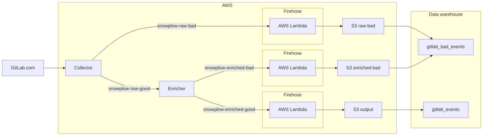

# Snowplow infrastructure

Snowplow events on GitLab SaaS fired by a [tracker](implementation.md) go through an AWS pipeline, managed by GitLab.

## Event flow in the AWS pipeline

Every event goes through a collector, enricher, and pseudonymization lambda. The event is then dumped to S3 storage where it can be picked up by the Snowflake data warehouse.

Deploying and managing the infrastructure is automated using Terraform in the current [Terraform repository](https://gitlab.com/gitlab-com/gl-infra/config-mgmt/-/tree/master/environments/aws-snowplow).

See [Snowplow technology 101](https://github.com/snowplow/snowplow/#snowplow-technology-101) for Snowplow's own documentation and an overview how collectors and enrichers work.

### Pseudonymization

In contrast to a typical Snowplow pipeline, after enrichment, GitLab Snowplow events go through a [pseudonymization service](https://gitlab.com/gitlab-org/analytics-section/product-intelligence/snowplow-pseudonymization) in the form of an AWS Lambda service before they are stored in S3 storage.

#### Why events need to be pseudonymized

GitLab is bound by its [obligations to community](https://about.gitlab.com/handbook/product/product-intelligence-guide/service-usage-data-commitment/)
and by [legal regulations](https://about.gitlab.com/handbook/legal/privacy/services-usage-data/) to protect the privacy of its users.

GitLab must provide valuable insights for business decisions, and there is a need
for a better understanding of different users' behavior patterns. The
pseudonymization process helps you find a compromise between these two requirements.

Pseudonymization processes personally identifiable information inside a Snowplow event in an irreversible fashion
maintaining deterministic output for given input, while masking any relation to that input.

#### How events are pseudonymized

Pseudonymization uses an allowlist that provides privacy by default. Therefore, each
attribute received as part of a Snowplow event is pseudonymized unless the attribute
is an allowed exception.

Pseudonymization is done using the HMAC-SHA256 keyed hash algorithm.
Attributes are combined with a secret salt to replace each identifiable information with a pseudonym.

### S3 bucket data lake to Snowflake

See [Data team's Snowplow Overview](https://about.gitlab.com/handbook/business-technology/data-team/platform/snowplow/) for further details how data is ingested into our Snowflake data warehouse.

## Monitoring

There are several tools that monitor Snowplow events tracking in different stages of the processing pipeline:

- [Product Intelligence Grafana dashboard](https://dashboards.gitlab.net/d/product-intelligence-main/product-intelligence-product-intelligence?orgId=1) monitors backend events sent from a GitLab.com instance to a collectors fleet. This dashboard provides information about:
  - The number of events that successfully reach Snowplow collectors.
  - The number of events that failed to reach Snowplow collectors.
  - The number of backend events that were sent.
- [AWS CloudWatch dashboard](https://console.aws.amazon.com/cloudwatch/home?region=us-east-1#dashboards:name=SnowPlow;start=P3D) monitors the state of the events in a processing pipeline. The pipeline starts from Snowplow collectors, goes through to enrichers and pseudonymization, and then up to persistence in an S3 bucket. From S3, the events are imported into the Snowflake Data Warehouse. You must have AWS access rights to view this dashboard. For more information, see [monitoring](https://gitlab.com/gitlab-org/analytics-section/product-intelligence/snowplow-pseudonymization#monitoring) in the Snowplow Events pseudonymization service documentation.
- [Sisense dashboard](https://app.periscopedata.com/app/gitlab/417669/Snowplow-Summary-Dashboard) provides information about the number of good and bad events imported into the Data Warehouse, in addition to the total number of imported Snowplow events.

For more information, see this [video walk-through](https://www.youtube.com/watch?v=NxPS0aKa_oU).

## Related topics

- [Snowplow technology 101](https://github.com/snowplow/snowplow/#snowplow-technology-101)
- [Snowplow pseudonymization AWS Lambda project](https://gitlab.com/gitlab-org/analytics-section/product-intelligence/snowplow-pseudonymization)
- [Product Intelligence Guide](https://about.gitlab.com/handbook/product/product-intelligence-guide/)
- [Data Infrastructure](https://about.gitlab.com/handbook/business-technology/data-team/platform/infrastructure/)
- [Snowplow architecture overview (internal)](https://www.youtube.com/watch?v=eVYJjzspsLU)
- [Snowplow architecture overview slide deck (internal)](https://docs.google.com/presentation/d/16gQEO5CAg8Tx4NBtfnZj-GF4juFI6HfEPWcZgH4Rn14/edit?usp=sharing)
- [AWS Lambda implementation (internal)](https://youtu.be/cQd0mdMhkQA)
