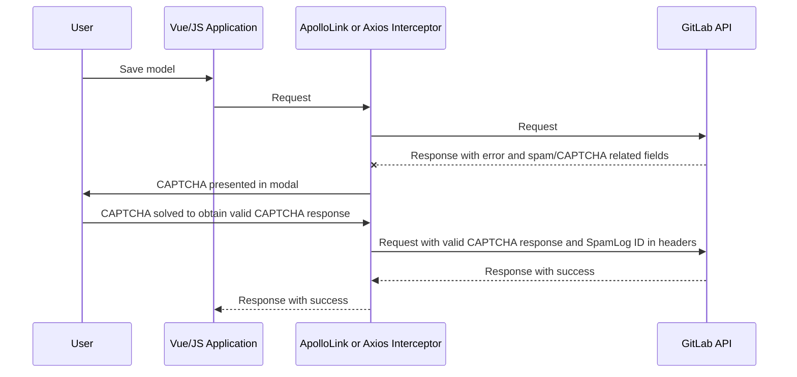

The approach for adding spam protection and CAPTCHA support to a new UI area of the GitLab application
depends upon how the existing code is implemented.

## Supported scenarios of request submissions

Three different scenarios are supported. Two are used with JavaScript XHR/Fetch requests
for either Apollo or Axios, and one is used only with standard HTML form requests:

1. A JavaScript-based submission (possibly via Vue)
   1. Using Apollo (GraphQL API via Fetch/XHR request)
   1. Using Axios (REST API via Fetch/XHR request)
1. A standard HTML form submission (HTML request)

Some parts of the implementation depend upon which of these scenarios you must support.

## Implementation tasks specific to JavaScript XHR/Fetch requests

Two approaches are fully supported:

1. Apollo, using the GraphQL API.
1. Axios, using either the GraphQL API.

The spam and CAPTCHA-related data communication between the frontend and backend requires no
additional fields being added to the models. Instead, communication is handled:

- Through custom header values in the request.
- Through top-level JSON fields in the response.

The spam and CAPTCHA-related logic is also cleanly abstracted into reusable modules and helper methods
which can wrap existing logic, and only alter the existing flow if potential spam
is detected or a CAPTCHA display is needed. This approach allows the spam and CAPTCHA
support to be added to new areas of the application with minimal changes to
existing logic. In the case of the frontend, potentially **zero** changes are needed!

On the frontend, this is handled abstractly and transparently using `ApolloLink` for Apollo, and an
Axios interceptor for Axios. The CAPTCHA display is handled by a standard GitLab UI / Pajamas modal
component. You can find all the relevant frontend code under `app/assets/javascripts/captcha`.

However, even though the actual handling of the request interception and
modal is transparent, without any mandatory changes to the involved JavaScript or Vue components
for the form or page, changes in request or error handling may be required. Changes are needed
because the existing behavior may not work correctly: for example, if a failed or canceled
CAPTCHA display interrupts the standard request flow or UI updates.
Careful exploratory testing of all scenarios is important to uncover any potential
problems.

This sequence diagram illustrates the standard CAPTCHA flow for JavaScript XHR/Fetch requests
on the frontend:



The backend is also cleanly abstracted via mixin modules and helper methods. The three main
changes required to the relevant backend controller actions (typically just `create`/`update`) are:

1. Pass `perform_spam_check: true` to the Update Service class constructor.
   It is set to `true` by default in the Create Service.
1. If the spam check indicates the changes to the model are possibly spam, then:
   - An error is added to the model.
   - The `needs_recaptcha` property on the model is set to true.
1. Wrap the existing controller action return value (rendering or redirecting) in a block passed to
   a `#with_captcha_check_json_format` helper method, which transparently handles:
   1. Check if CAPTCHA is enabled, and if so, proceeding with the next step.
   1. Checking if there the model contains an error, and the `needs_recaptcha` flag is true.
      - If yes: Add the appropriate spam or CAPTCHA fields to the JSON response, and return
        a `409 - Conflict` HTTP status code.
      - If no (if CAPTCHA is disabled or if no spam was detected): The standard request return
        logic passed in the block is run.

Thanks to the abstractions, it's more straightforward to implement than it is to explain it.
You don't have to worry much about the hidden details!

Make these changes:

## Add support to the controller actions

If the feature's frontend submits directly to controller actions, and does not only use the GraphQL
API, then you must add support to the appropriate controllers.

The action methods may be directly in the controller class, or they may be abstracted
to a module included in the controller class. Our example uses a module. The
only difference when directly modifying the controller:
`extend ActiveSupport::Concern` is not required.

```ruby
module WidgetsActions
  # NOTE: This `extend` probably already exists, but it MUST be moved to occur BEFORE all
  # `include` statements. Otherwise, confusing bugs may occur in which the methods
  # in the included modules cannot be found.
  extend ActiveSupport::Concern

  include SpammableActions::CaptchaCheck::JsonFormatActionsSupport

  def create
    widget = ::Widgets::CreateService.new(
      project: project,
      current_user: current_user,
      params: params
    ).execute

    respond_to do |format|
      format.json do
        with_captcha_check_json_format do
          # The action's existing `render json: ...` (or wrapper method) and related logic. Possibly
          # including different rendering cases if the model is valid or not. It's all wrapped here
          # within the `with_captcha_check_json_format` block. For example:
          if widget.valid?
            render json: serializer.represent(widget)
          else
            render json: { errors: widget.errors.full_messages }, status: :unprocessable_entity
          end
        end
      end
    end
  end
end
```

## Implementation tasks specific to HTML form requests

Some areas of the application have not been converted to use the GraphQL API via
a JavaScript client, but instead rely on standard Rails HAML form submissions via an
`HTML` MIME type request. In these areas, the action returns a pre-rendered HTML (HAML) page
as the response body. Unfortunately, in this case
[it is not possible](https://gitlab.com/gitlab-org/gitlab/-/merge_requests/66427#note_636989204)
to use any of the JavaScript-based frontend support as described above. Instead we must use an
alternate approach which handles the rendering of the CAPTCHA form via a HAML template.

Everything is still cleanly abstracted, and the implementation in the backend
controllers is virtually identical to the JavaScript/JSON based approach. Replace the
word `JSON` with `HTML` (using the appropriate case) in the module names and helper methods.

The action methods might be directly in the controller, or they
might be in a module. In this example, they are directly in the
controller, and we also do an `update` method instead of `create`:

```ruby
class WidgetsController < ApplicationController
  include SpammableActions::CaptchaCheck::HtmlFormatActionsSupport

  def update
    # Existing logic to find the `widget` model instance...
    ::Widgets::UpdateService.new(
      project: project,
      current_user: current_user,
      params: params,
      perform_spam_check: true
    ).execute(widget)

    respond_to do |format|
      format.html do
        if widget.valid?
          # NOTE: `spammable_path` is required by the `SpammableActions::AkismetMarkAsSpamAction`
          # module, and it should have already been implemented on this controller according to
          # the instructions above. It is reused here to avoid duplicating the route helper call.
          redirect_to spammable_path
        else
          # If we got here, there were errors on the model instance - from a failed spam check
          # and/or other validation errors on the model. Either way, we'll re-render the form,
          # and if a CAPTCHA render is necessary, it will be automatically handled by
          # `with_captcha_check_html_format`
          with_captcha_check_html_format { render :edit }
        end
      end
    end
  end
end
```
