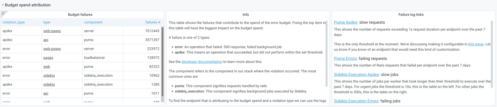
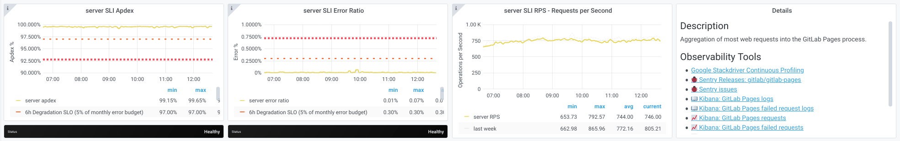
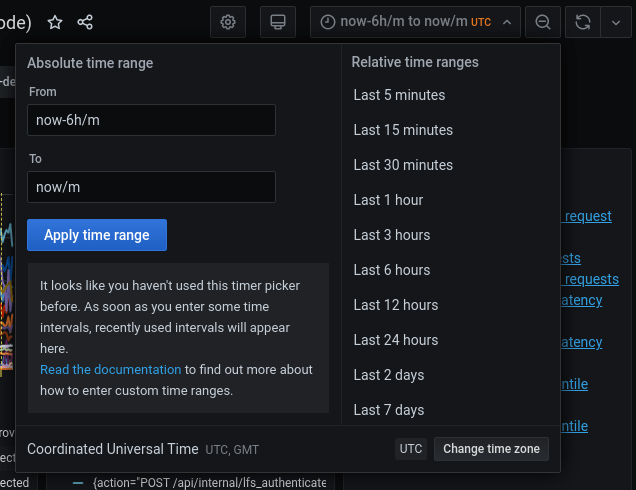
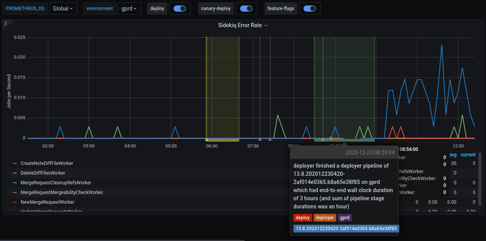
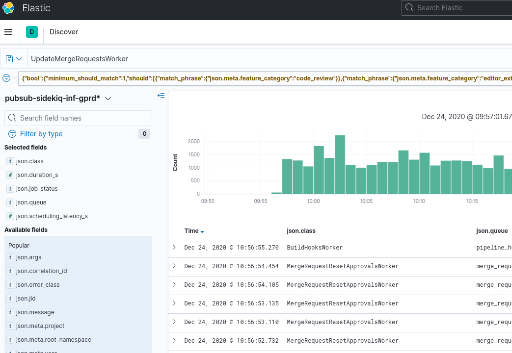
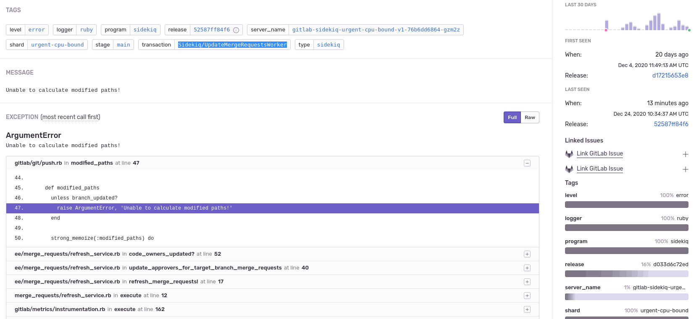

# Dashboards for stage groups

## Introduction

Observability is about bringing visibility into a system to see and understand the state of each component, with context, to support performance tuning and debugging. To run a SaaS platform at scale, a rich and detailed observability platform is a necessity. We have a set of monitoring dashboards designed for [each stage group](https://about.gitlab.com/handbook/product/categories/#devops-stages).

These dashboards are designed to give an insight, to everyone working in a feature category, into how their code operates at GitLab.com scale. They are grouped per stage group to show the impact of feature/code changes, deployments, and feature-flag toggles.

Each stage group has a dashboard consisting of metrics at the application level, such as Rails Web Requests, Rails API Requests, Sidekiq Jobs, and so on. The metrics in each dashboard are filtered and accumulated based on the [GitLab product categories](https://about.gitlab.com/handbook/product/categories/) and [feature categories](feature_categorization/index.md).

The list of dashboards for each stage group is accessible at <https://dashboards.gitlab.net/dashboards/f/stage-groups/stage-groups> (GitLab team members only), or at [the public mirror](https://dashboards.gitlab.com/dashboards?tag=feature_category&tag=stage-groups) (accessible to everyone with a GitLab.com account, with some limitations).

The dashboards for stage groups are at a very early stage. All contributions are welcome. If you have any questions or suggestions, please submit an issue in the [Scalability Team issues tracker](https://gitlab.com/gitlab-com/gl-infra/scalability/-/issues/new).

## Dashboard content

### Error budget

Read more about how we are using error budgets overall in our
[handbook](https://about.gitlab.com/handbook/engineering/error-budgets/).

By default, the first row of panels on the dashboard will show the [error
budget for the stage
group](https://about.gitlab.com/handbook/engineering/error-budgets/#budget-spend-by-stage-group). This
row shows how the features owned by
the group are contributing to our [overall
availability](https://about.gitlab.com/handbook/engineering/infrastructure/performance-indicators/#gitlabcom-availability).

The budget is always aggregated over the 28 days before the [time
selected on the dashboard](#time-range-controls).

We're currently displaying the information in 2 formats:

1. Availability: This number can be compared to GitLab.com's overall
   availability target of 99.95% uptime.
1. Budget Spent: This shows the time over the past 28 days that
   features owned by the group have not been performing adequately.

The budget is calculated based on indicators per component. Each
component can have 2 indicators:

1. [Apdex](https://en.wikipedia.org/wiki/Apdex): The rate of
   operations that performed adequately.

   The threshold for 'performed adequately' is stored in our [metrics
   catalog](https://gitlab.com/gitlab-com/runbooks/-/tree/master/metrics-catalog)
   and depends on the service in question. For the Puma (Rails)
   component of the
   [API](https://gitlab.com/gitlab-com/runbooks/-/blob/f22f40b2c2eab37d85e23ccac45e658b2c914445/metrics-catalog/services/api.jsonnet#L127),
   [Git](https://gitlab.com/gitlab-com/runbooks/-/blob/f22f40b2c2eab37d85e23ccac45e658b2c914445/metrics-catalog/services/git.jsonnet#L216),
   and
   [Web](https://gitlab.com/gitlab-com/runbooks/-/blob/f22f40b2c2eab37d85e23ccac45e658b2c914445/metrics-catalog/services/web.jsonnet#L154)
   services, that threshold is **1 second**.

   For Sidekiq job execution, the threshold depends on the [job
   urgency](sidekiq_style_guide.md#job-urgency). It is
   [currently](https://gitlab.com/gitlab-com/runbooks/-/blob/f22f40b2c2eab37d85e23ccac45e658b2c914445/metrics-catalog/services/lib/sidekiq-helpers.libsonnet#L25-38)
   **10 seconds** for high-urgency jobs and **5 minutes** for other
   jobs.

   Some stage groups may have more services than these, and the
   thresholds for those will be in the metrics catalog as well.

1. Error rate: The rate of operations that had errors.

The calculation to a ratio then happens as follows:

```math
\frac {operations\_meeting\_apdex + (total\_operations - operations\_with\_errors)} {total\_apdex\_measurements + total\_operations}
```

### Check where budget is being spent

The row below the error budget row is collapsed by default. Expanding
it shows which component and violation type had the most offending
operations in the past 28 days.



The first panel on the left shows a table with the number of errors per
component. Digging into the first row in that table is going to have
the biggest impact on the budget spent.

Commonly, the components spending most of the budget are Sidekiq or Puma. The panel in
the center explains what these violation types mean, and how to dig
deeper in the logs.

The panel on the right provides links to Kibana that should reveal
which endpoints or Sidekiq jobs are causing the errors.

To learn how to use these panels and logs for
determining which Rails endpoints are slow,
see the [Error Budget Attribution for Purchase group](https://youtu.be/M9u6unON7bU) video.

Other components visible in the table come from
[service level indicators](https://sre.google/sre-book/service-level-objectives/) (SLIs) defined
in the [metrics
catalog](https://gitlab.com/gitlab-com/runbooks/-/blob/master/metrics-catalog/README.md).

For those types of failures, you can follow the link to the service
dashboard linked from the `type` column. The service dashboard
contains a row specifically for the SLI that is causing the budget
spent, with useful links to the logs and a description of what the
component means. For example, see the `server` component of the
`web-pages` service:



## Usage of the dasbhoard

Inside a stage group dashboard, there are some notable components. Let's take the [Source Code group's dashboard](https://dashboards.gitlab.net/d/stage-groups-source_code/stage-groups-group-dashboard-create-source-code?orgId=1) as an example.

### Time range controls



- By default, all the times are in UTC timezone. [We use UTC when communicating in Engineering](https://about.gitlab.com/handbook/communication/#writing-style-guidelines).
- All metrics recorded in the GitLab production system have [1-year retention](https://gitlab.com/gitlab-cookbooks/gitlab-prometheus/-/blob/31526b03fef823e2f9b3cda7c75dcd28a12418a3/attributes/prometheus.rb#L40).
- Alternatively, you can zoom in or filter the time range directly on a graph. See the [Grafana Time Range Controls](https://grafana.com/docs/grafana/latest/dashboards/time-range-controls/) documentation for more information.

### Filters and annotations

In each dashboard, there are two filters and some annotations switches on the top of the page. [Grafana annotations](https://grafana.com/docs/grafana/latest/dashboards/annotations/) mark some special events, which are meaningful to development and operational activities, directly on the graphs.


| Name | Type | Description |
| ---- | ---- | ----------- |
| `PROMETHEUS_DS` | filter | Filter the selective [Prometheus data sources](https://about.gitlab.com/handbook/engineering/monitoring/#prometheus). The default value is `Global`, which aggregates the data from all available data sources. Most of the time, you don't need to care about this filter. |
| `environment` | filter | Filter the environment the metrics are fetched from. The default setting is production (`gprd`). Check [Production Environment mapping](https://about.gitlab.com/handbook/engineering/infrastructure/production/architecture/#environments) for other possibilities. |
| `deploy` | annotation | Mark a deployment event on the GitLab.com SaaS platform. |
| `canary-deploy` | annotation | Mark a [canary deployment](https://about.gitlab.com/handbook/engineering/#canary-testing) event on the GitLab.com SaaS platform. |
| `feature-flags` | annotation | Mark the time point where a feature flag is updated.|

This is an example of a feature flag annotation displayed on a dashboard panel.


### Metrics panels


Although most of the metrics displayed in the panels are self-explanatory in their title and nearby description, note the following:

- The events are counted, measured, accumulated, then collected, and stored as [time series](https://prometheus.io/docs/concepts/data_model/). The data are calculated using statistical methods to produce metrics. It means that metrics are approximately correct and meaningful over a time period. They help you have an overview of the stage of a system over time. They are not meant to give you precise numbers of a discrete event. If you need a higher level of accuracy, please look at another monitoring tool like [logs](https://about.gitlab.com/handbook/engineering/monitoring/#logs). Please read the following examples for more explanations.
- All the rate metrics' units are `requests per second`. The default aggregate time frame is 1 minute. For example, a panel shows the requests per second number at `2020-12-25 00:42:00` is `34.13`. It means at the minute 42 (from `2020-12-25 00:42:00` to `2020-12-25 00:42:59` ), there are approximately `34.13 * 60 = ~ 2047` requests processed by the web servers.
- You may encounter some gotchas related to decimal fraction and rounding up frequently, especially in low-traffic cases. For example, the error rate of `RepositoryUpdateMirrorWorker` at `2020-12-25 02:04:00` is `0.07`, equivalent to `4.2` jobs per minute. The raw result is `0.06666666667`, equivalent to 4 jobs per minute.
- All the rate metrics are more accurate when the data is big enough. The default floating-point precision is 2. In some extremely low panels, you would see `0.00` although there is still some real traffic.

To inspect the raw data of the panel for further calculation, click on the Inspect button from the dropdown menu of a panel. Queries, raw data, and panel JSON structure are available. Read more at [Grafana panel inspection](https://grafana.com/docs/grafana/latest/panels/inspect-panel/).

All the dashboards are powered by [Grafana](https://grafana.com/), a frontend for displaying metrics. Grafana consumes the data returned from queries to backend Prometheus data source, then presents them under different visualizations. The stage group dashboards are built to serve the most common use cases with a limited set of filters, and pre-built queries. Grafana provides a way to explore and visualize the metrics data with [Grafana Explore](https://grafana.com/docs/grafana/latest/explore/). This would require some knowledge about [Prometheus PromQL query language](https://prometheus.io/docs/prometheus/latest/querying/basics/).

## How to debug with the dashboards

- A team member in the Code Review group has merged an MR which got deployed to production.
- To verify the deployment, we can check the [Code Review group's dashboard](https://dashboards.gitlab.net/d/stage-groups-code_review/stage-groups-group-dashboard-create-code-review?orgId=1).
- Sidekiq Error Rate panel shows an elevated error rate, specifically `UpdateMergeRequestsWorker`.

  

- If we click on `Kibana: Kibana Sidekiq failed request logs` link in the Extra links session, we can filter for `UpdateMergeRequestsWorker`, and read through the logs.

  

- [Sentry](https://sentry.gitlab.net/gitlab/gitlabcom/) gives us a way to find the exception where we can filter by transaction type and correlation_id from a Kibana's result item.

  

- A precise exception, including a stack trace, job arguments, and other information, should now appear. Happy debugging!

## How to customize the dashboard

All Grafana dashboards at GitLab are generated from the [Jsonnet files](https://github.com/grafana/grafonnet-lib) stored in [the runbook project](https://gitlab.com/gitlab-com/runbooks/-/tree/master/dashboards). Particularly, the stage group dashboards definitions are stored in [/dashboards/stage-groups](https://gitlab.com/gitlab-com/runbooks/-/tree/master/dashboards/stage-groups) subfolder in the Runbook. By convention, each group has a corresponding Jsonnet file. The dashboards are synced with GitLab [stage group data](https://gitlab.com/gitlab-com/www-gitlab-com/-/raw/master/data/stages.yml) every month. Expansion and customization are one of the key principles used when we designed this system. To customize your group's dashboard, you need to edit the corresponding file and follow the [Runbook workflow](https://gitlab.com/gitlab-com/runbooks/-/tree/master/dashboards#dashboard-source). The dashboard is updated after the MR is merged. Looking at an autogenerated file, for example, [`product_planning.dashboard.jsonnet`](https://gitlab.com/gitlab-com/runbooks/-/blob/master/dashboards/stage-groups/product_planning.dashboard.jsonnet):

```jsonnet
// This file is autogenerated using scripts/update_stage_groups_dashboards.rb
// Please feel free to customize this file.
local stageGroupDashboards = import './stage-group-dashboards.libsonnet';

stageGroupDashboards.dashboard('product_planning')
.stageGroupDashboardTrailer()
```

We provide basic customization to filter out the components essential to your group's activities. By default, only the `web`, `api`, and `sidekiq` components are available in the dashboard, while `git` is hidden. See [how to enable available components and optional graphs](#optional-graphs).

You can also append further information or custom metrics to a dashboard. This is an example that adds some links and a total request rate on the top of the page:

```jsonnet
local stageGroupDashboards = import './stage-group-dashboards.libsonnet';
local grafana = import 'github.com/grafana/grafonnet-lib/grafonnet/grafana.libsonnet';
local basic = import 'grafana/basic.libsonnet';

stageGroupDashboards.dashboard('source_code')
.addPanel(
  grafana.text.new(
    title='Group information',
    mode='markdown',
    content=|||
      Useful link for the Source Code Management group dashboard:
      - [Issue list](https://gitlab.com/groups/gitlab-org/-/issues?scope=all&state=opened&label_name%5B%5D=repository)
      - [Epic list](https://gitlab.com/groups/gitlab-org/-/epics?label_name[]=repository)
    |||,
  ),
  gridPos={ x: 0, y: 0, w: 24, h: 4 }
)
.addPanel(
  basic.timeseries(
    title='Total Request Rate',
    yAxisLabel='Requests per Second',
    decimals=2,
    query=|||
      sum (
        rate(gitlab_transaction_duration_seconds_count{
          env='$environment',
          environment='$environment',
          feature_category=~'source_code_management',
        }[$__interval])
      )
    |||
  ),
  gridPos={ x: 0, y: 0, w: 24, h: 7 }
)
.stageGroupDashboardTrailer()
```


<i class="fa fa-youtube-play youtube" aria-hidden="true"></i>
If you want to see the workflow in action, we've recorded a pairing session on customizing a dashboard,
available on [GitLab Unfiltered](https://youtu.be/shEd_eiUjdI).

For deeper customization and more complicated metrics, visit the [Grafonnet lib](https://github.com/grafana/grafonnet-lib) project and the [GitLab Prometheus Metrics](../administration/monitoring/prometheus/gitlab_metrics.md#gitlab-prometheus-metrics) documentation.

### Optional Graphs

Some Graphs aren't relevant for all groups, so they aren't added to
the dashboard by default. They can be added by customizing the
dashboard.

By default, only the `web`, `api`, and `sidekiq` metrics are
shown. If you wish to see the metrics from the `git` fleet (or any
other component that might be added in the future), this could be
configured as follows:

```jsonnet
stageGroupDashboards
.dashboard('source_code', components=stageGroupDashboards.supportedComponents)
.stageGroupDashboardTrailer()
```

If your group is interested in Sidekiq job durations and their
thresholds, these graphs can be added by calling the
`.addSidekiqJobDurationByUrgency` function:

```jsonnet
stageGroupDashboards
.dashboard('access')
.addSidekiqJobDurationByUrgency()
.stageGroupDashboardTrailer()
```
