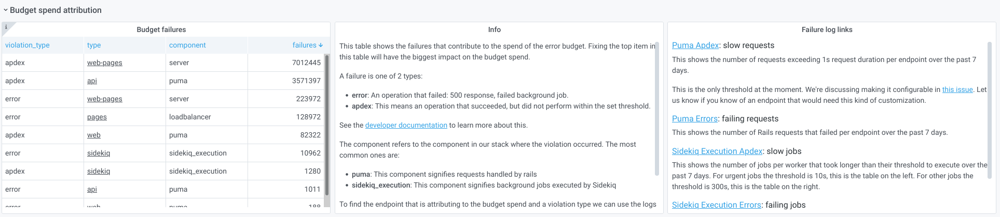

Observability is about bringing visibility into a system to see and
understand the state of each component, with context, to support
performance tuning and debugging. To run a SaaS platform at scale, a
rich and detailed observability platform is needed.

To make information available to [stage groups](https://handbook.gitlab.com/handbook/product/categories/#hierarchy),
we are aggregating metrics by feature category and then show
this information on [dashboards](dashboards/_index.md) tailored to the groups. Only metrics
for the features built by the group are visible on their
dashboards.

With a filtered view, groups can discover bugs and performance regressions that could otherwise
be missed when viewing aggregated data.

For more specific information on dashboards, see:

- [Dashboards](dashboards/_index.md): a general overview of where to find dashboards
  and how to use them.
- [Stage group dashboard](dashboards/stage_group_dashboard.md): how to use and customize the stage group dashboard.
- [Error budget detail](dashboards/error_budget_detail.md): how to explore error budget over time.

## Error budget

The error budget is calculated from the same [Service Level Indicators](https://en.wikipedia.org/wiki/Service_level_indicator) (SLIs)
that we use to monitor GitLab.com. The 28-day availability number for a
stage group is comparable to the
[monthly availability](https://handbook.gitlab.com/handbook/engineering/infrastructure/performance-indicators/#gitlabcom-availability)
we calculate for GitLab.com, except it's scoped to the features of a group.

For more information about how we use error budgets, see the
[Engineering Error Budgets](https://handbook.gitlab.com/handbook/engineering/error-budgets/) handbook page.

By default, the first row of panels on both dashboards shows the
[error budget for the stage group](https://handbook.gitlab.com/handbook/engineering/error-budgets/#budget-spend-by-stage-group).
This row shows how features owned by the group contribute to our
[overall availability](https://handbook.gitlab.com/handbook/engineering/infrastructure/performance-indicators/#gitlabcom-availability).

The official budget is aggregated over the 28 days. You can see it on the
[stage group dashboard](dashboards/stage_group_dashboard.md).
The [error budget detail dashboard](dashboards/error_budget_detail.md)
allows customizing the range.

We show the information in two formats:

- Availability: this number can be compared to GitLab.com overall
  availability target of 99.95% uptime.
- Budget Spent: time over the past 28 days that features owned by the group have not been performing
  adequately.

The budget is calculated based on indicators per component. Each
component can have two indicators:

- [Apdex](https://en.wikipedia.org/wiki/Apdex): the rate of operations that performed adequately.

  The threshold for "performing adequately" is stored in our
  [metrics catalog](https://gitlab.com/gitlab-com/runbooks/-/tree/master/metrics-catalog)
  and depends on the service in question. For the Puma (Rails) component of the
  [API](https://gitlab.com/gitlab-com/runbooks/-/blob/f22f40b2c2eab37d85e23ccac45e658b2c914445/metrics-catalog/services/api.jsonnet#L127),
  [Git](https://gitlab.com/gitlab-com/runbooks/-/blob/f22f40b2c2eab37d85e23ccac45e658b2c914445/metrics-catalog/services/git.jsonnet#L216),
  and
  [Web](https://gitlab.com/gitlab-com/runbooks/-/blob/f22f40b2c2eab37d85e23ccac45e658b2c914445/metrics-catalog/services/web.jsonnet#L154)
  services, that threshold is **5 seconds** when not opted in to the
  [`rails_request` SLI](../application_slis/rails_request.md).

  We've made this target configurable in [this project](https://gitlab.com/groups/gitlab-com/gl-infra/-/epics/525).
  To customize the request Apdex, see
  [Rails request SLIs](../application_slis/rails_request.md).
  This new Apdex measurement is not part of the error budget until you
  [opt in](https://gitlab.com/gitlab-com/gl-infra/scalability/-/issues/1451).

  For Sidekiq job execution, the threshold depends on the
  [job urgency](../sidekiq/worker_attributes.md#job-urgency). It is
  [currently](https://gitlab.com/gitlab-com/runbooks/-/blob/f22f40b2c2eab37d85e23ccac45e658b2c914445/metrics-catalog/services/lib/sidekiq-helpers.libsonnet#L25-38)
  **10 seconds** for high-urgency jobs and **5 minutes** for other jobs.

  Some stage groups might have more services. The thresholds for them are also in the metrics catalog.

- Error rate: The rate of operations that had errors.

The calculation of the ratio happens as follows:


<!--
To update this calculation, paste the following math block in a GitLab comment, update it,
and take a screenshot:

```math
\frac {operations\_meeting\_apdex + (total\_operations - operations\_with\_errors)} {total\_apdex\_measurements + total\_operations}
```
-->

## Check where budget is being spent

Both the [stage group dashboard](dashboards/stage_group_dashboard.md)
and the [error budget detail dashboard](dashboards/error_budget_detail.md)
show panels to see where the error budget was spent. The stage group
dashboard always shows a fixed 28 days. The error budget detail
dashboard allows drilling down to the SLIs over time.

The row below the error budget row is collapsed by default. Expanding
it shows which component and violation type had the most offending
operations in the past 28 days.



The first panel on the left shows a table with the number of errors per
component. Digging into the first row in that table has
the biggest impact on the budget spent.

Commonly, the components that spend most of the budget are Sidekiq or Puma. The panel in
the center explains what different violation types mean and how to dig
deeper in the logs.

The panel on the right provides links to Kibana that should reveal
which endpoints or Sidekiq jobs are causing the errors.

<i class="fa fa-youtube-play youtube" aria-hidden="true"></i>
To learn how to use these panels and logs for
determining which Rails endpoints are slow,
see the [Error Budget Attribution for Purchase group](https://youtu.be/M9u6unON7bU) video.

Other components visible in the table come from
[service-level indicators](https://sre.google/sre-book/service-level-objectives/) (SLIs) defined
in the [metrics catalog](https://gitlab.com/gitlab-com/runbooks/-/blob/master/metrics-catalog/README.md).

For those types of failures, you can follow the link to the service
dashboard linked from the `type` column. The service dashboard
contains a row specifically for the SLI that is causing the budget
spent, with links to logs and a description of what the
component means.

For example, see the `server` component of the `web-pages` service:


To add more SLIs tailored to specific features, you can use an [Application SLI](../application_slis/_index.md).

## Kibana dashboard for error budgets

For a detailed analysis you can use [a specialized Kibana dashboard](https://log.gprd.gitlab.net/goto/771b5c10-c0ec-11ed-85ed-e7557b0a598c), like this:


Description:

- **Apdex requests over limit (graph)** - Displays only requests that exceeded their
  target duration.
- **Apdex operations over-limit duration (graph)** - Displays the distribution of duration
  components (database, Redis, Gitaly, and Rails app).
- **Apdex requests** (pie chart) - Displays the percentage of `2xx`, `3xx`, `4xx` and
  `5xx` requests.
- **Slow request component distribution** - Highlights the component responsible
  for Apdex violation.
- **Apdex operations over limit** (table) - Displays a number of operations over
  limit for each endpoint.
- **Apdex requests over limit** - Displays a list of individual requests responsible
  for Apdex violation.

### Use the dashboard

1. Select the feature category you want to investigate.
   1. Scroll to the **Feature Category** section. Enter the feature name.
   1. Select **Apply changes**. Selected results contain only requests related to this feature category.
1. Select the time frame for the investigation.
1. Review dashboard and pay attention to the type of failures.

Questions to answer:

1. Does the failure pattern look like a spike? Or does it persist?
1. Does the failure look related to a particular component? (database, Redis, ...)
1. Does the failure affect a specific endpoint? Or is it system-wide?
1. Does the failure appear caused by infrastructure incidents?

## GitLab instrumentation for OpenTelemetry

There is an ongoing effort to instrument the GitLab codebase for OpenTelemetry.

For more specific information on this effort, see [GitLab instrumentation for OpenTelemetry](gitlab_instrumentation_for_opentelemetry.md).
