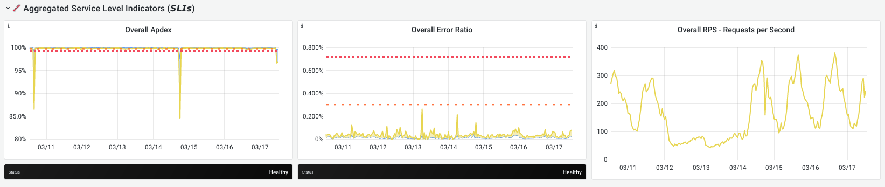

With error budget detailed dashboards you can explore the error budget
spent at specific moments in time. By default, the dashboard shows
the past 28 days. You can adjust it with the [time range controls](_index.md#time-range-controls)
or by selecting a range on one of the graphs.

This dashboard is the same kind of dashboard we use for service level
monitoring. For example, see the
[overview dashboard for the web service](https://dashboards.gitlab.net/d/web-main) (GitLab internal).

## Error budget panels

On top of each dashboard, there's the same panel with the [error budget](../_index.md#error-budget).
Here, the time based targets adjust depending on the range.
For example, while the budget was 20 minutes per 28 days, it is only 1/4 of that for 7 days:

Also, keep in mind that Grafana rounds the numbers. In this example the
total time spent is 5 minutes and 24 seconds, so 24 seconds over
budget.

The attribution panels also show only failures that occurred
within the selected range.

These two panels represent a view of the "official" error budget: they
take into account if an SLI was ignored.
The [attribution panels](../_index.md#check-where-budget-is-being-spent) show which components
contributed the most over the selected period.

The panels below take into account all SLIs that contribute to GitLab.com availability.
This includes SLIs that are ignored for the official error budget.

## Time series for aggregations

The time series panels for aggregations all contain three panels:

- Apdex: the [Apdex score](https://en.wikipedia.org/wiki/Apdex) for one or more SLIs. Higher score is better.
- Error Ratio: the error ratio for one or more SLIs. Lower is better.
- Requests Per Second: the number of operations per second. Higher means a bigger impact on the error budget.

The Apdex and error-ratio panels also contain two alerting thresholds:

- The one-hour threshold: the fast burn rate.

  When this line is crossed, we've spent 2% of our monthly budget in the last hour.

- The six-hour threshold: the slow burn rate.

  When this line is crossed, we've spent 2% of our budget in the last six hours.

If there is no error-ratio or Apdex for a certain SLI, the panel is hidden.

Read more about these alerting windows in
[Google SRE workbook](https://sre.google/workbook/alerting-on-slos/#recommended_time_windows_and_burn_rates_f).

We don't have alerting on these metrics for stage groups.
This work is being discussed in [epic 615](https://gitlab.com/groups/gitlab-com/gl-infra/-/epics/615).
If this is something you would like for your group, let us know there.

### Stage group aggregation

The stage group aggregation shows a graph with the Apdex and errors
portion of the error budget over time. The lower a dip in the Apdex
graph or the higher a peak on the error ratio graph, the more budget
was spent at that moment.

The third graph shows the sum of all the request rates for all
SLIs. Higher means there was more traffic.

To zoom in on a particular moment where a lot of budget was spent, select the appropriate time in
the graph.

### Service-level indicators

This time series shows a breakdown of each SLI that could be contributing to the
error budget for a stage group. Similar to the stage group
aggregation, it contains an Apdex score, error ratio, and request
rate.

Here we also display an explanation panel, describing the SLI and
linking to other monitoring tools. The links to logs (📖) or
visualizations (📈) in Kibana are scoped to the feature categories
for your stage group, and limited to the range selected. Keep in mind
that we only keep logs in Kibana for seven days.

In the graphs, there is a single line per service. In the previous example image,
`rails_requests` is an SLI for the `web`, `api` and `git` services.

Sidekiq is not included in this dashboard. We're tracking this in
[epic 700](https://gitlab.com/groups/gitlab-com/gl-infra/-/epics/700).
